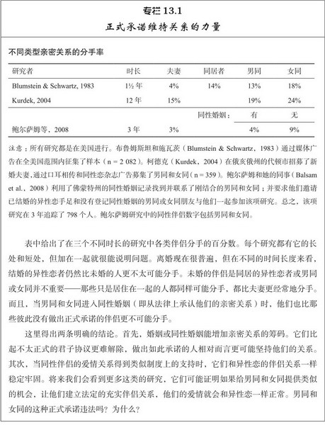

# 第13章 亲密关系的解体与消亡

有时伴侣双方体验到的压力和紧张产生了不幸的后果。这或许是因为**冲突持续的时间太长、太激烈**。或许是因为**伴侣关系的不平等，一方利用和剥削另一方**。或许是因为他们的**激情消退**，被其他更有吸引力的人所扰乱。或者只是因为感到**厌倦**而不再有两情相悦的感觉，因而爱情的“魔力”消失，伴侣们感到失望。

关系失败的理由成千上万，任何伴侣关系的恶化都可能牵涉到独特的事件和过程。另一方面，个人和文化的因素对许多亲密关系的稳定有着一般和广泛的影响，人际关系学家若干年来都在研究和识别它们。本章我要考察婚姻满意度和亲密感减少及失败的相关因素和不利结果。我要详细介绍离婚，因为结束婚姻的决定通常要比恋人分手更谨慎和重要，造成的影响也更复杂。所以对离婚的研究也比非婚分手要多得多。尽管如此，任何亲密关系的解体——如同居伴侣、恋爱关系或者友谊——都很重大，所以我也将考察人们怎样适应这些伴侣关系的结束。先要提醒你，我们今天面对的文化背景与祖辈所熟识的已经非常不同了。

## 离婚率的变化

### 离婚的普遍性

你可能还记得，当前的离婚率比起你祖辈结婚时要高得多。当今美国，**每年离婚的数量是结婚的一半**（Tejada-Vera & Sutton，2010），所以新婚最终以分居或离婚告终的可能性仍在50%左右。这一点值得注意，因为它意味着人们结婚时尽管带着各种善良的意图和温暖的感情，但他们白头偕老的机会就如同投掷硬币得到“正面”的概率。

的确，美国典型的婚姻并不如人们想象的那般长久。只有约三分之二（64%）的已婚夫妻婚龄达到10年，婚龄达到25周年的还不到一半，所以美国婚姻的平均时长仅仅超过18年（Goodwin et al.，2010）。这一数字包括了所有的婚姻，如配偶一方死亡的婚姻，但婚姻在头20年结束的主要原因当然还是离婚。许多人离婚时还不到30岁；**男性（首次）离婚的年龄中位数是31.8岁，而女性为29.4岁**（Cohn，2010）。

值得注意的是，高离婚率在某种程度上造成两个结果。第一，只有约一半（52%）的美国成人当前处在婚姻状态（Mather & Lavery，2010）。这是前所未有的低谷。第二，**25%的美国儿童（18岁以下）现在生活在单亲家庭，大部分由妈妈抚养**（Wilcox & Marquardt，2010），这一比率比1960年高出3倍。

不管怎样看，现在美国离婚的现象非常普遍。近50年来，离婚率在其他国家也在增加，但美国在这方面可能独占鳌头。美国的离婚率比所有欧洲国家、加拿大和日本都要高（U.S. Census Bureau，2011）。与其他伴侣关系相比，婚姻更不太可能结束（见专栏13.1），但也不太可能如过去那般长久。

### 离婚率增加的原因

美国20世纪下半叶离婚率的剧增并没有明确的原因。但存在多种可能性，它们都可能是（或不是）起作用的因素。

可能性之一是与过去相比我们对婚姻持有不同、更高要求的期望。我们的曾祖辈一般认为，如果你想和爱侣一起生活，生养小孩，付得起日常账单，活得更好，你就必须结婚。然而，如今同居非常普遍，有着更多的单身父母，大多数女性进入职场。因此，婚姻不再像过去一样是实际生活的必需品了（Coleman et al.，2007）。相反，在某些观察家看来，人们比以前任何时候都更可能把婚姻看成是追求个人自我实现的途径。婚姻理应是玩乐，而不是任务；理应让人兴奋，而不是常规；理应充满激情，而不是温情（Amato，2009）。因而，我们对婚姻的期望可能太高了。如果用不现实的期望来衡量婚姻，幸福、温暖、有价值的伴侣关系看起来也不会令人满意。

> 如果离婚的要求很高（冷静期，财产划分），那么情侣更倾向于挽回亲密关系而不是一分了事。

比如，还在40多年前，斯莱特（Slater，1968，p.99）就提出警告：

社会文化强求婚姻成为个体生命中最亲密、最深厚、最重要和最长久的关系，自然就要求夫妻们做情人、朋友和相互之间的心理治疗师。然而矛盾的是，婚姻却可能日益缺乏必需的情感需求，以致解体。

我们因为爱恋和激情而结婚，并认为它们不会改变，我们还期望自己的配偶能成为精神伴侣，永远不会让我们失望。**但这些要求太高，可能是无法达到的高标准**，的确，最近的文化和历史表明“**只要爱情匹配和一生亲密的理想占据人们的头脑，人们就会开始要求离婚的权利**”（Coontz，2005，p.8）。

> 离婚给予人们自主选择的权力，但是也可能因为权力太大，反而导致不幸。
>
> 期望太高确实是亲密关系解体的重要原因！精神伴侣？两个人，如果只是因为迷恋对方的外在而在一起，怎么可能成为灵魂伴侣？如果不了解对方的经历，故事，不了解对方的秉性，没有一起学习一起成长，怎么可能成为灵魂伴侣？简直是白日梦！

人们只是期望从婚姻中得到更多。现在美国夫妻认为他们的婚姻“非常幸福”的人数比例要低于25年前（Wilcox & Marquardt，2010），他们报告的冲突和问题的数量也更多（Amato et al.，2007）。整体来看，人们普遍认为美国人婚姻的平均质量自1970年以来都在下降。

但文化的变化也很广泛，各种社会因素可能不仅影响我们婚姻开始时的期望，而且还会影响到我们结婚后面对的情境。比如，现在美国大部分女性在家庭之外都有固定的工作，她们进入劳动力的行列对婚姻有很多影响。首先，配偶们都报告工作和家庭的冲突比过去更多，妻子每周工作的时间越长，她的婚姻质量就往往越低（Amato et al.，2007）。当配偶双方都有工作时，修车、照看小孩、计划和烹制膳食（只是举一些例子）都显得困难重重，配偶在一起相处的时间往往也减少。配偶双方无疑也会受职场问题的影响，所以工作满意度的降低与婚姻不和的增加有关（Amato et al.，2007）。加入劳动力大军也使配偶有更多机会接触有兴趣的、合意的替代伴侣，当女性的职业环境有许多男性时，离婚也更多（McKinnish，2007）。

而且，女性比过去赚取的金钱更多。在全世界，当女性能在经济上独立于男性时，离婚率就更高（Barber，2003）。能自立的人在婚姻恶化时能更自由地选择离婚，美国女性的收入和她离婚的可能性有着直接的正相关：女性赚的金钱越多，在将来就越有可能离婚（Rogers，2004）。但不要认为没有钱，婚姻就会更稳定；贫穷甚至对婚姻质量有更坏的影响。一般而言，拮据的夫妻有经济压力，不如宽裕的夫妻对婚姻满意；具体而言，收入非常低的夫妻（每年25 000美元以下）与较高收入（每年超过50 000美元）的夫妻相比，前者离婚的可能性是后者的两倍（Wilcox & Marquardt，2010）。拥有金钱容易使人离婚，但贫穷也会引起紧张，损害婚姻。

总的来说，女性越来越多地加入劳动力大军，貌似增加了家庭冲突，使女性更可能得到吸引人的新爱侣，并且减少了妻子对丈夫的经济依赖。可能因为所有这些原因，婚姻发展的趋势很明显：随着20世纪美国女性在家庭之外受雇佣比例的增加，离婚率也上升了（Fitch & Ruggles，2000）。[^ 1]

性别角色（人们所期望的男性和女性该有的行为）也在发生变化。女性逐渐地变得更加具有工具性，更加果断和自立（Twenge，2009），许多夫妻正在更公平地分担家庭责任（Amato et al.，2007）。在过去25年里，不太传统的性别角色和家庭决策公平性的增加都与夫妻双方更高的婚姻质量有关。然而，家务劳动的重新分配对男女双方有不同的影响；丈夫不太快乐，因为他们要做更多的家庭杂务，但他们的妻子却更为满足（见图13.1）。

图13.1　婚姻幸福感和家务

图形显示的是随着丈夫做更多的家庭杂务，妻子和丈夫平均体验到的婚姻幸福水平。随着丈夫做更多的家务，丈夫变得更不满意但他们的妻子却变得更满足。还有两个有趣的事实：当丈夫做了大部分家务或者根本就不做，总有人真的不幸福。**伴侣双方唯一一次都有高于平均水平的幸福感是在家务平均分配的时候**。这对你有什么启发？

资料来源：Amato et al.，2007.

由于某些原因，西方文化变得越来越具有个人主义色彩，人们与身边之人的联系较过去更少（Amato，2009）。的确，大多数人与社区的联系和祖辈相比更少了（Putnam，2000）。我们不太可能继续住在四世同堂的大家庭，不太可能认识我们的邻居；我们参加的俱乐部和社会组织也更少，在家里也不经常宴请聚会，但搬迁却更加频繁。因此，与祖辈相比，我们从朋友和熟人那里得到的社会支持和友谊可能更少（Oishi，2010），却更加依赖我们的配偶（Magdol & Bessel，2003），这对离婚率可能有两种不同的影响。首先，我已经注意到，**人们对配偶的索求比过去任何时候都要多**。**我们期望伴侣能满足我们更加广泛多样的人际需要，这样配偶就更加容易让我们失望**。此外，与社区联系较少的人更少受到社区规范的影响，**而社区规范是阻遏离婚的重要因素**。事实已经证明，**经常移居的人比那些待在一个地方并扎根的人更容易离婚**（Magdol & Bessel，2003）。

> 没有结婚，本身就是没有社会规范的约束。

我们对离婚的知觉也不如过去那样带有负面色彩。在许多社会圈子里，离婚过去常常被视为可耻的失败，离婚本身就往往意味着麻烦、可怕和尴尬，必须找出有罪的一方。而在20世纪70年代美国出现的无过错离婚法使得离婚更容易实现：这在司法实践上尚属首次，一旦夫妻在财产分配和子女监护权上达成一致意见，只需书面证明他们面临着“不能相容的分歧（irreconcilable differences）”，他们的婚姻就可解除。无过错离婚法使得离婚程序更为社会接受（Rodgers et al.，1999）。平均而言，比起父辈来，我们认为离婚是应对糟糕婚姻更合理、更理想的办法，久而久之，对离婚更为支持的态度似乎会降低我们婚姻的质量（Amato & Rogers，1999）。当离婚好像是消灭婚姻危机更方便的选择，我们就不太可能努力抢救举步维艰的亲密关系。

如今大多数伴侣在他们结婚前还同居，我们在第1章已经看到，同居的人后来离婚的风险增加了。尽管流行的观念认为同居是有价值的尝试，可以让人们避免今后可能出现的问题，但同居是与离婚率正相关的（Rhoades et al.，2009b）。令人欣慰的是，如果恋人在订婚之后才开始住在一起，并且同居的时间较短暂，他们并不比那些婚前没有同居的夫妻更多地离婚（Jose et al.，2010）。已订婚的未婚夫妻短暂同居，看来并不会给之后的婚姻带来很大的危害。另一方面，在订婚前同居的人（或者曾与多个伴侣同居过的人）结婚后更可能离婚（Jose et al.，2010），这可能是因为同居改变了他们对婚姻的信念和期望。随意的同居看来会导致：（1）对婚姻制度的不尊重；（2）对婚姻结果的不利期望；（3）更强烈的离婚意愿（Rhoades et al.，2009b），所有这些都使人们更可能离婚。

最后，因为更多的父母离婚，也就有更多的儿童见证了家庭冲突，成长于破碎的家庭。大众的观点可能认为遭受家庭破裂的年轻人或许特别有决心去避免犯同样的错误，但现实却是，**离婚在一代代相传：经历父母离婚的儿童在他们长大后更可能离婚**（Bartell，2006）。很多原因可以解释这一现象。举例来说，离异家庭的儿童对婚姻持有不太积极的看法，当他们开始恋爱时，对伴侣更缺乏信任；因此，与家庭完好的同龄人相比，他们不太确信婚姻的长久性（Cui & Fincham，2010）。进一步来说，在某种程度上，儿童从父母的教训中学会了处理亲密关系的方法，那些童年记忆中家庭充满矛盾和冲突的人，其婚姻一般也困难重重，痛苦不堪（Riggio & Weiser，2008）。因此，随着离婚变得更为普遍，今后可能会有更多的儿童受到离婚的伤害。

那么，为什么离婚率会上升？与我们祖辈的年代相比，可能的原因有：

- 我们渴望从婚姻中得到更多，对婚姻持有更高的期望标准；

- 上班的女性在经济上更为自由，有更多的机会接近有吸引力的替代伴侣，在工作和家庭之间面临的冲突日益严峻；

- 兴起的个人主义和社会流动性使我们与阻遏离婚的社区规范联系更少，也更少受到它的影响；

- 新制定的法律使得离婚更为大众接受，离婚的程序也更简单；

- 随意的同居削弱了婚姻的承诺；

- 离婚家庭的孩子在他们长大后更可能离婚。

所有这些可能的影响因素只是与美国日益增长的离婚率相关，所以它们全部都可能是症状，而非造成离婚的社会动因。不过，可能的影响因素如此之多，这也很好地从另一方面说明了文化因素对亲密关系的重大影响。可以认为，文化氛围对持久婚姻的支持不如40或50年前有效。但即使发生如此巨变，当今结婚的美国夫妻至少有一半不会以离婚告终。（并非所有的未离婚的夫妻就幸福，但至少他们没有以离婚结束。）哪些个人和关系特征能预测个体最终的分手呢？我们接下来探讨。

## 离婚的征兆

不论文化背景如何，总有些婚姻很成功，有些婚姻则以失败告终。正如你所预期的，这些婚姻成功者和失败者之间的差别长久以来都是人际关系科学研究的兴趣所在。有人提出各种模型来详细解释离婚的某些根源，而值得注意的纵向研究现在跟踪某些婚姻已经超过25年了。在本节我们就来考察能识别某些离婚征兆的理论和研究结果。

### 障碍模型

乔治·莱文杰（George Levinger）是相互依赖理论的倡导者，他在其离婚的障碍模型中利用我在第6章描述过的一些概念来识别影响关系破裂的三种因素（Levinger，1976）。第一种因素是吸引力。莱文杰认为，亲密关系提供的奖赏（比如令人愉快的相伴、性满足、安全感和社会地位）能提升吸引力，而亲密关系付出的代价（如惹人生气的矛盾与投入亲密关系的时间和精力）则会减弱吸引力。第二种影响关系破裂的重要因素是个体拥有的替代选择。最明显的就是可获得的其他伴侣，但任何能替代现有关系的事物，比如独处或事业上的成功，都可能吸引个体离开现有的伴侣关系。最后，在亲密关系的周围存在着许多障碍，使得个体很难逃脱亲密关系；包括维持婚姻的法律和社会压力、宗教和道德约束、打赢离婚案子和抚养两家子女的经济负担。

莱文杰模型的重大贡献在于强调了这一事实：**本想分手的不幸伴侣却因为离开的代价太大而往往仍然在一起**。**他还雄辩地提出离婚的许多障碍都是心理上的而非物质上的**；苦恼的夫妻因为没有足够的金钱离婚，或许肯定还得维持婚姻，但他们还会因为离婚使他们（或者使其他人，尤其是子女）感到内疚和尴尬，所以可能仍旧在一起，即使他们有充分的经济资源离婚（Poortman & Seltzer，2007）。

的确，根据夫妻们的报告，存在很多阻遏他们离婚的重大代价（Previti & Amato，2003）。一项对结婚12年的夫妻调查表明，担心孩子受苦、失去孩子的威胁、宗教规范、对配偶的依赖、对经济困境的恐惧都是认知到的离婚重要障碍（Knoester & Booth，2000）。然而，在整个12年研究期间，一旦考虑其他危险因素诸如教育程度低和父母亲离异等，那些认知到的障碍只有两种（即对伴侣的依赖和宗教信念）实际上能区分夫妻是否会离婚。并且如果人们对婚姻真的不满足，甚至这两种障碍看起来也无关紧要：一旦他们想要走出婚姻，没有什么障碍能阻止他们（Knoester & Booth，2000）。

因此，人们通常能意识到想要离婚就必须克服的各种障碍，但一旦婚姻处在危机之中，这些障碍看来并不重要。莱文杰的模型有助于提醒我们离婚的障碍物会萦绕在我们的心头，但该模型可能没有完全认识到，一旦婚姻变得痛苦，这些障碍物是多么无效。

### 脆弱—应激—适应模型

本杰明·卡尼（Benjamin Karney）和托马斯·布拉德伯里（Thomas Bradbury）提出了不稳定婚姻的一般模型，强调了另三个导致离婚的因素（Karney & Bradbury，1995）。他们认为，某些人步入婚姻时就带有持续的脆弱（enduring vulnerability），这种脆弱增加了离婚的风险。这类脆弱（易受伤害性）可能包括个体成长家庭里的不幸经历、受教育程度低、适应不良的人格特质、拙劣的社交技能或者对婚姻起反作用的态度。这些特征并不会使离婚必然发生，但它们会严重影响伴侣所遭遇的环境，还会影响到人们应对紧张的适应过程。如果伴侣足够幸运，遭逢的困难较少且较轻，即使那些应对和沟通技能拙劣的人也可能幸福地白头偕老。

然而，几乎每一桩婚姻都必然会面临偶尔的压力事件，这需要伴侣彼此提供支持并适应新的环境。有些应激源（比如一段时期的失业或重病在身）只会发生在某些特定的婚姻上，但另一些应激源（比如怀孕、分娩和养育）则普遍存在。**不断重复出现的小打击结合起来也会出人意料地令人紧张**（Randall & Bodenmann，2009）。当出现压力事件时，伴侣必须应对和适应，但根据伴侣们的脆弱性，有些人比另一些人处理得更好。不能成功地应对压力事件会使得压力更严重，如果应对不力引起婚姻质量的下降，伴侣的应对能力或许会进一步受损（Neff & Karney, 2004）。最终，**长年累月的不满就可能会引起婚姻不稳定和离婚**。

请看图13.2，从顶端开始跟踪箭头路径。我们过去的经验和先天的特质使我们具备了亲密伴侣的优点和缺点，某些缺点也就是能破坏我们有效应对压力和变化的“脆弱性”（Stroud et al.，2010）。某些脆弱还使得我们的生活更加紧张——但不管我们是谁，压力总会发生。除了家里发生的间歇性冲突外，我们单独在职场和学校遭遇的任何挫折与困难都会导致压力溢出（stress spillover），把郁闷的情绪带回家，怒气冲冲地与无辜的伴侣互动（Repetti et al.，2009）。我们的应对技能和其他“适应过程”决定了压力增加还是被控减少。最终，每位伴侣成功适应的能力影响了他们婚姻的质量，同时婚姻质量反过来又影响伴侣的适应能力。

在脆弱—应激—适应模型中存在着反馈回路和交叉因素，而压力只要没有打垮我们，就会让我们变得更坚强。女性如果具有良好的沟通技能，在生命中遇到过适当的压力，就会更有韧性，成为妈妈（这种变化总是充满压力）也能更好地调适，而具有同样技能的女性如果没有应对过压力则可能适应不良（Broady & Neff，2010）。成功地应对困难能提高我们适应新挑战的能力。但归根结底，我们婚姻的质量取决于我们是谁（脆弱）、我们遭逢的环境（应激）和我们应对环境的方式（适应）三者的相互作用，并且在某种程度上这三个重要的因素还会彼此影响。离婚的根源可能要追溯到始于童年的不安全型依恋或者在充满冲突的家庭中习得的经验教训，但如果上天让我们的婚姻一帆风顺，或者我们与伴侣一起努力克服婚姻中的危机（或者可能只是选修了大学亲密关系的精品课程），离婚未必会发生。

图13.2　婚姻的脆弱—应激—适应模型

该模型假设伴侣步入婚姻时就带着自身的脆弱，这些脆弱与他们遭遇的压力和应对技能相互作用，从而决定了他们婚姻的幸福。

资料来源： Karney & Bradbury，1995.

### 亲密关系适应过程（PAIR）项目结果

数十年来，泰德·胡斯顿（Ted Huston）和他的同事追踪了168对在1981年结婚的夫妻（Caughlin & Huston，2006；Huston，2009）。该研究项目集中关注配偶们一起适应婚姻生活（或者适应不良）的方式，因此被称为亲密关系适应过程（Processes of Adaptation in Intimate Relationships，PAIR）的研究项目。这类纵向研究有着巨大的价值，但他们的结果有点沉重。的确，在PAIR项目中，仅仅13年之后，35%的夫妻就离了婚，另外20%的夫妻不幸福；只有45%的夫妻的婚姻可以说是幸福的，但即便是他们也并不如刚结婚时那般满足和恩爱。我应该提醒你，这些都是典型的研究结果。请翻到第6章198页图6.7：婚姻满意度通常随着时间推移而下降。

为什么会这样？胡斯顿及其同事考察了婚姻失败的三种不同解释。其中一种解释——使人想起卡尼和布拉德伯里（Karney & Bradbury，1995）提到的持续的脆弱——认为那些注定不满足的夫妻比起那些婚姻最终成功的夫妻，在婚姻一开始就爱意不足，彼此矛盾重重。这一解释即持续的动力（enduring dynamics）模型，认为伴侣把求爱期间就浮现出的问题、矛盾及持续的脆弱带入了他们的婚姻之中；的确，伴侣一般在结婚之前甚至就意识到这些挫折和缺点（Jayson，2009）。根据这个模型，走向离婚的婚姻在一开始就比其他婚姻更脆弱。

相形之下，第二种解释被称为突现的危难（emergent distress）模型，它提出最终毁灭伴侣的问题行为始于结婚之后。随着时间推移，有些夫妻陷入婚后日益增加的冲突和否定的覆辙之中，而这些在婚姻开始时并不存在。因此，与持续的动力模型不同，突现的危难模型提出，在婚姻开始时，在成功和失败的婚姻之间并不存在可辨别的差异；摧毁某些婚姻的危机一般都是在婚后才出现的。

最后，第三种解释是幻灭（disillusionment）模型。这种观点认为伴侣们在婚姻开始时，常常对他们的亲密关系有着美好、浪漫的看法，这是不切实际的乐观。之后，随着时间的推移，当伴侣们不再彼此努力维持可爱、迷人的形象时，现实就逐渐侵蚀了这些怡人的幻想。当人们认识到他们的伴侣关系并不像起初看来的那般美好，任何婚姻中存在的浪漫都会消退，从而会感到失落，但对于某些夫妻而言，“婚姻证书上的戳印几乎还没干，对婚姻和伴侣的怀疑和幻灭就开始出现了”（ Kayser & Rao，2006，p.206）。

这三个模型的观点都很有意义，因为它们都说明了改善婚姻、减少离婚风险的不同方法。根据持续的动力模型，困难重重的求爱引起了糟糕的婚姻，婚前干预能防止彼此有着矛盾情感的夫妻结婚，从而能避免随后出现的离婚事件。相比之下，突现的危难模型主张夫妻应当防范婚姻缓慢滑坡，出现痛苦不悦和消极否定，鼓励夫妻保持愉快、大度、关注和友善的干预措施能把离婚拒之门外。最后，幻灭模型提出对自己的爱人和关系的冷静而精确的知觉，能预防随后的失望，不抱幻想一样能防止离婚。

所有这些都是合理的解释，但胡斯顿及其同事发现三种解释中只有两种很好地符合了他们跟踪研究的婚姻结果。（我们且稍停片刻，你认为哪两种模型是胜出者？）首先，与持续的动力模型相一致，研究者断定与那些几年之后仍幸福的夫妻相比，不幸的夫妻在他们的婚姻一开始时就缺少爱意和温情，彼此对对方有着更多的矛盾情感和负面态度。那些注定苦恼的夫妻在一开始就缺乏慷慨和温柔，更加不确定和多变。因此，人们在订婚时就有的任何怀疑或困难，即使在他们结婚之后仍不会消失。相反，任何犹豫或矛盾都会完全带入他们的婚姻关系之中，因此他们在婚后的岁月仍会感到不太满意。

所以，持续的动力模型能预测婚姻将来的幸福程度。然而，**对夫妻实际上是否会离婚最好的预测因素是幻灭模型**。某些夫妻在婚姻的头一年，婚姻满意度的下降要比其他夫妻更急剧和显著，他们是最容易离婚的夫妻。这些夫妻并不像突现的危难模型所预期的那样必定变得暴躁或仇恨；相反，他们只是经历了彼此浪漫情感最强烈的变化。他们的爱意比其他夫妻的浪漫情感消退得更快。

此外，胡斯顿及其同事发现幻灭的突出特征是，**那些注定要离婚的夫妻在婚姻刚开始时比大多数人更加充满深情**。那些婚姻短暂的夫妻——在6年（或更短时间）里离婚的人——与婚姻成功的夫妻相比，在婚姻开始时通常具有较少的爱意和更多的矛盾情感。（于是，你能明白当幻灭降临时他们为什么相当快地离婚。）然而，那些经历较长时期——在7年或更多年的婚姻之后——却最终离婚的夫妻在他们的婚姻刚开始时显得特别深情款款和浪漫温馨。平均来看，他们比其他夫妻更加恩爱，因此当蜜月期开始之后关爱行为通常下降，将来还会进一步减少（这可能让他们比大部分夫妻更吃惊）。他们结束婚姻时彼此的感情并不比其他夫妻少，但他们体验了浪漫行为最大的变化（也就是说最急剧的下降），这些变化能预测较长时期之后的离婚。

总的来说，就当前阶段的PAIR项目看来，有两个结论看来是正确的。首先，**浪漫爱情变化的大小和速度能最好地预测夫妻是否会离婚**，其次，**夫妻们带入婚姻的问题决定了离婚的快慢**。其他研究也得出了类似的结果（如Arriaga, 2001；Kurdek，2002），所以我们有把握断言夫妻体验到的满意水平和满意的时间变化是影响关系结果的重要因素。更重要的是，**注定要离婚的夫妻并不总是变得暴躁和仇恨，但他们通常的确会失去他们曾经体验到的快乐**（Gottman & Levenson，2000）。[^ 2]

### 婚姻早期岁月（EYM）项目结果

另一项著名的纵向研究是由泰瑞·奥布琪（Terri Orbuch）和约瑟夫·威若夫（Joseph Veroff）主持的婚姻早期岁月（Early Years of Marriage，EYM）项目，该项目从美国密歇根州底特律市附近抽取了自1986年结婚的174对白人夫妻和199对黑人夫妻（Birditt et al.，2006）。EYM的研究者特别关注夫妻面临的社会条件对婚姻结果的影响。某些社会学上的变量非常重要。在2002年，该项目进行16年之后，46%的夫妻已经离异，但夫妻们的种族因素也造成巨大的差异：只有三分之一略多（36%）的白人夫妻离异，但超过一半（55%）的黑人夫妻解除了他们的婚姻关系。

为什么黑人夫妻更容易离异？原因很多。平均来看，黑人夫妻在婚前就已同居了很长的时间，更可能已经生育了小孩。他们的收入也更低，更可能来自破碎的家庭，所有这些因素都与个体离婚的风险有正相关（Wilcox & Marquardt，2010）。总的看来，EYM项目表明，正如其他研究一样（Wickrama et al.，2010），夫妻们确立亲密关系的社会背景对他们的婚姻结果有重大的影响。不管伴侣们是多么尊重和珍视婚姻，贫穷可能把任何夫妻都置于离婚的风险之中（Bryant et al.，2010）。

### 婚姻问题的个体知觉

目前为止我们考察的各种模型和研究证据都表明，有三大类因素影响婚姻的结果（Levinger & Levinger，2003）。文化规范和其他变量确定了婚姻发生的基础，是最广泛的影响因素。无过错离婚法和影响经济机会的歧视都是文化背景支持或损害婚姻的示例。

更特异化的因素是我们的个人背景，即家人和朋友的社交圈以及我们居住的邻里环境。比如，我前面提到过，与许多有趣的男同事一起工作的女性比那些居家不上班的女性更容易离婚（McKinnish，2007）。最后，关系背景是第三个影响因素，指伴侣们通过对彼此的知觉和互动缔造的亲密环境。这些个别特征使得我们总是以好心情或者悲观的戒备心理对伴侣做出反应，它们是弥漫于伴侣关系的特定气氛的基础。

表13.1　“你离婚的原因是什么？”

资料来源：Amato & Previti，2003.

我之所以要介绍这三种不同层面的分析，是因为当人们对他们的婚姻问题进行解释时，往往只关注其中一种。另一项由艾伦·布思（Alan Booth）等人进行的著名纵向研究，即生命进程中的婚姻不稳定（Marital Instability Over the Life Course）项目，自1980年至2000年，每隔几年就对1 087名美国人组成的随机样本进行电话访谈。当问及离婚者离异的原因时，提及次数最多的原因全都涉及婚姻关系的某些特征，如表13.1所示。女性比男性更多抱怨不贞、物质滥用 [[3\]](text00020.html#note_3) 或者虐待行为，而男性比女性则更可能抱怨沟通不良或者宣称他们根本不知道哪里出错了。平均而言，前妻的怨言要多于前夫，但男女两性的解释都极少认可他们亲密关系发生的文化或个人背景可能带来的影响。

尽管如此，那些更广泛的背景可能也很重要。配偶的收入越高，就越少认为虐待是他们离异的原因，而更多地提及个性的冲突。受访者受教育程度越高，就越经常抱怨与前配偶感情不和。因而，伴侣的社会经济地位（包括教育和收入）有助于预测他们遭遇的婚姻问题。伴侣结婚的年龄也有影响：结婚时越年轻的人越有可能报告心生隔阂，存在酗酒和吸毒的问题。

伴侣们对婚姻不满时，常常会抱怨伴侣关系中的个别特点（Randall & Bodenmann，2009）。但更广泛的影响因素也很重要，我们下节会谈到。影响伴侣离异的各种因素不仅包括使他们或喜或忧的日常交往；而且周围的环境和文化也会损害或改善他们的婚姻（Bryant et al.，2010）。

### 特定的离婚信号

我已提及很多变量会使人们面临离婚的风险，稍后我会用一张大表格总结。然而在此之前，我要提醒读者诸君：一般趋势的结论有时会掩盖某些重要的限制性条件。没有一个概况性的结论适用于任何婚姻，某些预测信号可能适用于某些团体或婚姻的某些阶段，但却不适合其他情况。具体研究中的某个特定变量的突出影响，可能反映了与之形成对比的其他因素的作用。比如，离婚的某些典型相关因素（如低收入）可能在年轻人的婚龄较短的婚姻中很有影响力，但在已经经历了岁月考验的婚龄较长的婚姻中却未必有太大的影响（Booth et al.，1986）。在某种程度上来说，在最初经历了某些应激源的考验还能维持下去的婚姻，今后就不太容易受到这些因素的影响。当几种危险信号一起出现时，可能比各自单独出现有更强的作用；比如，贫穷而且缺乏教育就比单独面对其一糟糕得多（Rauer et al.，2008）。在检视表13.2的时候请牢记这些细微差别，表中总结了现代研究发现的影响婚姻稳定性的重要预测信号。令人欣慰的是，大部分因素的影响效应数十年来并未有太大的改变（Amato，2010）。大部分因素对男同和女同在亲密关系中体验到的满意度和稳定性也有类似的影响（Gottman et al.，2003）。

表13.2　预测离婚的信号：有关文献的综合

## 分手

我用了不少篇幅来描述哪些人可能离婚，现在是该考察分手是如何发生的了。当伴侣们想要解散他们的亲密关系，又会怎样进行呢？首先要注意的就是，人们不会轻率地结束他们曾经承诺的亲密关系。比如，大多数离婚都有长期不满导致的诸多积怨，但伴侣也有彼此喜欢对方的地方；所以通常会发生矛盾的情感。还请回忆我在第6章讨论过的相互依赖理论，人们一般不会仅仅因为不满意就放弃他们的伴侣关系。虽然大多数人在离婚之前，都会有很漫长的痛苦和烦恼阶段，但人们只有到了最后，认为没有伴侣他们会过得更好时才会提起离婚（也就是说，只有当他们的CLalt 预示着离婚比他们现在经历的婚姻有着更好的结果时）。离婚的决定源于对得失的复杂计算，涉及（有时不确定的）替代选择的考虑。

那么，分手的决定做出之时，有多种选择。我们来考察当人们想要结束失败的伴侣关系时会做些什么。

### 与婚前伴侣的分手

如果你要结束和伴侣的恋爱关系，你将如何行动呢？你会直截了当地向伴侣透露这一消息，或者只是无视伴侣的即时信息，改变你在脸谱网上的关系状态，并开始避开他/她？当莱斯利·巴克斯特（Leslie Baxter）分析大学生对自己分手的解释时，她发现关系解体的不同轨迹之间有一个重大区别，都涉及这样一个问题，即想要分手的人是否曾经把分手的意图向被甩的伴侣言明（Baxter，1984）！有些情况下，分手的努力是直接的，或者明确地说出来；然而，大多数情况下，人们使用间接的策略，企图不说出分手就结束关系。

巴克斯特（Baxter，1984）认为第二个重要区别是个体分手的努力是指向他人（设法保护伴侣的情感）还是指向自己（更自私地损害伴侣的情感）。比如，有时人们在宣布结束关系的意图时，会给予伴侣反应的机会以保存颜面；指向他人的直接分手策略虽会宣泄个体的不满，但彼此之间会进行详尽的讨论和协商，而不是强求结束关系。相反，伴侣直接但更自私时，他们有时只是宣布关系已结束，躲避与前伴侣的任何进一步的接触。

更间接但却非常自私的策略是故意做出不端行为，严重增加伴侣的负担，致使伴侣决定结束亲密关系。当人们宣称他们只是想“做朋友”时，他们还是很为对方着想的，但如果他们真的想彻底结束亲密关系时，这样做也是一种间接方法，只不过歪曲了他们分手的愿望。

显然，人们想结束亲密关系时会采取各种行动，直接和间接、指向他人和指向自己策略的差别也仅仅是巴克斯特观察到的两种区别（Baxter，1984）。其他区别包括：

- 个体的不满逐渐或突然发作。只有约四分之一的时候某些关键事件突然改变了个体对自己关系的感受；而人们对亲密关系的不满更多是逐渐积累起来的。

- 结束亲密关系的个人或共同愿望。三分之二的时候只有伴侣一方想要结束关系。

- 个体退出亲密关系时的迅速或拖延特征。多数情况下，人们在成功退出关系前都要伪装好几次。

- 是否有修复关系的企图。大多数时间，不会有正式的努力来修复关系。

所有这些加在一起，结束婚前关系仅有一种最普遍的方式，它涉及逐渐积累的不满，使得伴侣一方一而再地努力解散关系，并且根本不会言明分手的意图，也不会进行任何改善或修复伴侣关系的尝试。但即使是这一最常见的模式，巴克斯特（Baxter，1984）称之为不懈的间接性（persevering indirectness），其出现的次数也只有三分之一，所以很多其他特殊发展的轨迹也很普遍。

尽管如此，人们一般还是同意伴侣结束亲密关系过程的典型方式，而不是那些特殊的策略（Battaglia et al.，1998）。对年轻人的调查发现，亲密关系的结束通常包括表13.3所列的几个常见步骤。当伴侣一方对亲密关系感到厌倦并开始注意其他人时，结束关系的过程通常就已经开始了。该伴侣变得冷漠，感情投入更少，这往往在最初会引起修复关系并恢复关系原貌的努力。然而，当伴侣双方共处的时间更少，并且缺乏兴趣时，分手的念头又开始蠢蠢欲动了。接着又继续讨论关系，双方同意再次努力解决问题，但他们又注意到其他替代选择，伴侣变得更加退避。他们开始注意其他人，但是接着产生了重归旧好的短暂愿望，随后被内心呼唤放弃的深思熟虑所取代。他们在心理上已做好准备，然后分手。

### 离婚的步骤

离婚一般比与婚前伴侣分手更加复杂，但表13.3所列的典型事件序列中所表现出的矛盾情感和关系波动，同样也是离婚的特征。婚姻不可能一夜之间就结束。尽管个体结束婚前亲密关系的努力会持续数周，而结束婚姻的过程却可能耗上数年。一项研究发现在持续时间长达12年婚姻之中，不满意的夫妻通常要消耗婚姻的最后5年来考虑分手（Stewart et al.，1997）！

表13.3　亲密关系结束的典型脚本

资料来源：Battaglia et al.，1998.

在这样一段时间里，可能会发生许多特殊事件，但史蒂夫·达克（Steve Duck）认为在大部分的关系解体期间会出现五个基本阶段（Rollie & Duck，2006）。在最初的个人阶段里，伴侣一方变得不满意，经常感到沮丧和不悦。然后，接着是双人阶段，不幸福的伴侣表露出他/她的不满。接着或许会出现旷日弥久的协商、对峙或者尝试适应，这阶段常见的情感包括震惊、愤怒、伤害，有时还会出现解脱感。但是在亲密关系接近结束之际，社交阶段开始了。伴侣们公开宣扬他们的苦恼，向家人和朋友解释他们自己的遭遇，并寻求支持和理解。随着关系结束，善后阶段开始。哀痛减少，伴侣开始通过认知加工克服他们的失败，并丢弃过去的伴侣关系。重新修正、整理记忆，创造出可接受的关系历程故事（即“叙述”）。此阶段有可能发生合理化和对关系的重新评价。最后，在复兴阶段里，已离婚的“伴侣”作为单身重新进入社交生活，常常告诉别人他们的经验已经改变了他们，现在自己变得更加聪明睿智。

分手其实并不容易。

在这个基本框架内，人们解除他们伴侣关系的方式有可能影响他们今后对待彼此的感情。一般而言，伴侣如果没有机会识别和讨论不满的原因，则会对彼此持有不太积极的情感，在分手后也不太可能保持联系，而讨论了这些困难的伴侣则要好得多。此外，对于某些伴侣分手只是持续关系的另一种过渡（Dailey et al.，2009）。亲密关系结束时可能发生多种多样的结果。下面我们接着考察这些结果。

## 分手的后果

当人们回答在他们的生命中不同事件所带来的压力和变化时，配偶的死亡和离婚始终高居榜首（Miller & Rahe，1997）。浪漫伴侣关系的结束通常都是重大的事件——虽然离婚往往更为复杂，但非婚姻的浪漫爱情的结束也有深远的影响（Simon& Barrett，2010）。但是当伴侣分手时，是否真的意味着他们关系的结束？未必。

### 解体后的关系

大多数情况下，未婚的伴侣在决定分手后，随着时间的推移彼此联系会越来越少。尽管他们坚信彼此曾经拥有的感情不可能一下子消失殆尽，认为他们将继续成为朋友，但他们彼此的忠诚最终会逐渐全部消退。爱情关系结束之后这种情形出现的几率是60%（Kellas et al.，2008）。然而，约有五分之一的伴侣（21%）在分手后的数月发现他们彼此变得更加忠诚了（与他们决定放弃爱情时相比）。只有极少数的伴侣在放弃亲密关系之后，重新点燃了他们的爱情，但有些伴侣的确调和了他们的某些差异，重新获得了信任，最终变成朋友（Dailey et al.，2009）。

另外，曾经的恋人在分手数月后，要么体验不到彼此关系的变化（通常是因为他们分得很彻底并且不再联系），要么他们会经历激烈的起伏变化，因为他们要努力弄明白伴侣在哪些方面适合自己的生活。后面这种混乱的模式发生的几率为12%（Kellas et al.，2008）。

这里有几点值得注意。首先，这些不同的轨迹表明曾经的爱人一般会继续成为我们生命中的重要部分，至少一段时间里是如此。当爱情终成泡影，伴侣在数月后通常会发现彼此在某种程度上仍然保持着关系，不论他们是否有意为之。然而，不管伴侣们的希望是什么，他们分手后遭遇的重要事件大多数都会阻碍他们之间的关系，损害他们对分手之后朋友关系的投入（Kellas et al.，2008）。他们结束亲密关系之后的交往或许会显得笨拙、不安，因为一方会嫉妒另一方新的爱情或者他们的性要求被断然拒绝。或者他们最后可能发现很容易避开彼此，屏蔽掉对方的电话或者搬走。当然，曾经的爱人有时的确能相处融洽，彼此提供必要的支持，在分手发生后寻求对方宽恕等，正如我注意到的，有些人分手后还维持着宝贵的友谊。在爱情关系结束后，男同和女同比异性恋者尤其有可能保持与前爱人的联系（Harkless & Fowers，2005）。但大多数情况下，分手发生时我们面临的任务就是在没有前伴侣的情况下，最终继续我们的生活。这种适应过程又是怎样的呢？

### 克服消极情绪

当然，有些亲密关系非常有价值，具有很高的相互一致性和自我延伸的特征。 [[4\]](text00020.html#note_4) 如果失去这样的伴侣关系就会格外令人痛苦。当我们失去了有奖赏价值、居于自我定义（self-definition）核心部分的亲密关系时，我们的自我概念（self-concept）也就不得不发生改变（Slotter et al.，2010），这是一种痛苦煎熬的过程。常常会发生强烈的消极情绪，但通常并不如我们想象得那般强烈，也不会永远持续。人们能痊愈。

通过一项有趣的体验式取样研究（Sbarra & Emery，2005），研究者能获得弗吉尼亚大学年轻人在结束有意义的爱情关系后（至少有4个月以上的感情），一个月内的日常情感体验报告。参与者随身携有蜂鸣器，每天提醒他们做情感记录。结果监测到四种情绪反应（见图13.3），它们表明，如你所预期的，分手是痛苦的。与另一组恋爱关系持续的学生相比，这些曾经的情人显得愤怒、痛苦，他们的勇气和力量（也就是“解脱”）正在削弱。两周后，随着他们对以前伴侣的浪漫爱情继续逐渐减弱，他们的愤怒减少、痛苦衰退，但他们的宽慰还较低。然而他们的适应在继续，再过两周之后，他们就并不比身边的同学更痛苦，他们的宽慰也在上升。这个过程持续一个月之后，他们显著地表现出更少的爱意，他们的勇气和力量正在恢复。

图13.3　对分手的适应

年轻人与恋人分手时，他们会感到痛苦和愤怒，但这些负面情绪随着时间的推移变得越来越不强烈。分手一个月之后，他们更加疏离了过去的亲密关系并且重新振作。

资料来源：Sbarra & Emery，2005.

重要的是，所有这些并不如分手的恋人想象得那般可怕。另一项研究每两周就询问年轻人，如果他们当前的恋爱关系结束他们预期的感觉会怎样——并随后开始跟踪那些亲密关系的确结束了的年轻人的实际反应（Eastwick et al.，2008）。在分手前，参与者正确地预测到失恋的苦恼随着时间消退的速度——他们知道时间会治愈他们的创伤——但他们却高估了分手起初的痛苦。这种错误很普遍。我们对自己情绪反应的预测常常是错误的（Wilson & Gilbert，2005）。不过，此例中的错误预测也给人带来了一些希望：虽然分手常常看来很可怕，但分手对我们的伤害通常没有我们想象得那般严重。

当然，有些分手相对而言更为糟糕。被人拒绝一般比拒绝别人更难忍受（Perilloux & Buss，2008），在当事人具有低自尊时尤其如此（Waller & MacDonald，2010）。此外，在分手的过程中对自己丢失的东西闷闷不乐、念念不忘，并且感觉非常糟糕的人都可能要经历艰难的时光；沉溺只会延续苦恼，而反省（找寻经历中的意义并得到学习）是与正面适应和恢复联系在一起的（Saffrey & Ehrenberg，2007）。但具有不安全依恋类型的人（担心被伴侣抛弃）尤其可能难以释怀。他们仍对以前的伴侣痴迷（在想到他/她与别人相恋时特别紧张不安），所以比其他人更悲伤，持续的时间也更长（Sbarra，2006）。（要忘掉前伴侣，他们应该开始浏览各种婚恋网站，看看那里都有什么人；如果焦虑的人着眼于新的婚恋对象，就能更容易地摆脱失败的亲密关系[Spielmann et al.，2009]。）具有安全依恋类型的人则能更好地应对分手。他们更少忧虑，所以不太可能保持愤怒的心境。他们也更可能接受关系结束的定局，所以他们的感情创伤开始愈合，能更快地从悲痛中恢复过来（Sbarra，2006）。

### 离婚不同于恋人分手

婚姻的结束一般更为复杂。要分割财产、抚养小孩、遵从法律程序，离婚会改变人的生活，有时变好但更多的情况是变差。

**适应**

我们从好的一面开始。当人们离开一段悲惨的婚姻，尤其是离开敌对、虐待的伴侣时，境况会变得更好（Amato & Hohmann-Marriott，2007）。婚姻忧悒并跌到谷底的配偶离婚后，对婚姻结束的感觉一般会更好，而不是更糟（Cohen et al.，2007）。如果婚姻孤独凄凉、无可救药，做出改变还是有好处的。

然而，整体来看，离婚是困难的跋涉过程，人们在离婚后的岁月里并不太顺利。图13.4描绘了一项著名研究的结果，即德国社会经济定组研究（German SocioEconomic Panel Study）。该研究对超过30 000名参与者经历的亲密关系结果进行了逾18年的监测（Lucas，2005）。在该项研究中，数百名参与者曾离婚或寡居，这两个事件都很可怕，使人们对生活的满意度大幅下降。这一点在图像中一目了然，但还有三个现象值得注意。首先，注定要离婚的人在离婚数年前就已经不太快乐；甚至迈入婚姻时就不太满足（Lucas，2005）。其次，离婚通常打断了婚姻满意度日益下降的模式，一旦他们离开苦恼的婚姻，生活开始变得更好。第三，数年之后，他们仍然不如他们当初恩爱时那般幸福，即在他们的婚姻开始走向衰退和崩溃之前的阶段。离婚通常是人们生命中的重大事件，虽然时间能疗伤，但并不能彻底治愈你的伤口。

图13.4　婚姻、离婚、寡居和生活满意度

这里描绘了德国成千上万人的婚姻、离婚或寡居结果。结婚的确让人们幸福了一段时间，但几年后他们就不如结婚前那般幸福了。寡居是可怕的，尽管进行了大量的心理康复，仍然有持续的负面结果。大多数离婚事件都给长期下降的幸福画上了句号——但几年之后，离婚的人仍然不如那些婚姻完整的人幸福。

资料来源：Lucas，2007.

（虽然图13.4所示的结果很清晰生动，我们还得承认丧偶之人所蒙受的毁灭性的丧亲之痛。这种损害的程度是局外人很难理解的。二十年后，寡妇或鳏夫仍旧会和他们失去的爱人在臆想中进行谈话，大约每月一次（Carnelley et al.，2006），正如你从图中所看到的，他们生活的满意度很长一段时间都在降低。在十年之后还会出现偶尔爆发的悲伤。所以丧偶就像失去自己的孩子，这种伤害是永远忘不掉的，宽厚、支持式的朋友会尊重这点。这种丧亲之痛是人们任何时候都不能完全忘记的。）

回到离婚的问题。在25岁之后离婚的人士只有三分之二（68%）的人曾经再次结婚，但平均而言那些再婚者在4年之内就会冒险尝试二婚（Goodwin et al.，2010）。再婚常常是离异单身人士生活的转折点，与他们幸福的增加有关联（Blekesaune，2008）；的确，如果他们一直未再婚，离异未再婚的人在接下来的40年期间比再婚的同龄人死亡的可能性高出55%（Sbarra & Nietert，2009）。但无论他们是否再婚，离婚6年之后就有超过四分之三的人报告他们的离婚是件好事（Hetherington，2003）。

所以，离婚的结果会发生变化。人们要耗费数年的时间来适应婚姻的结束，但大多数人都能逐渐重新振作。然而，有些人因离婚而深受打击，此后的岁月很容易感到人们充满苦恼和困难，以及他们关系阴影的折磨（Hetherington，2003）。几乎每个人都会发现离婚结束时压力却未了结；离婚改变了个体的社交圈子、经济状况以及个体的亲密生活。

**社交圈子**

在离婚的过程中，人们会向他们的朋友和家人寻求支持，他们与朋友相处的时间会增加，特别是在离婚的头一年（Hanson et al.，1998）。然而，当人们的婚姻结束时，通常会失去大约一半的社交圈子（比如某些朋友和大部分的姻亲），在许多情形下，前配偶从来没有结交足够的新朋友来替换他们失去的朋友（Terhell et al.，2004）。所以，人们在离婚后的数年里社交圈子一般变得更小。

此外，个体社交圈子里剩下的人员并非全部都是支持式的。约有50%的离婚者与他们疏远但却敌对或紧张的前配偶有着交往，还有一半的人报告有些亲戚不赞成他们分手（Stewart et al.，1997）。并非所有和离婚者亲近的人都会提供期待的支持。

**经济资源**

当女性离婚后，财务状况通常会恶化。全美调查发现离婚女性的家庭收入显著下降，降幅达到27%，并且这一现象会持续几十年（Sayer，2006）。部分原因是离婚后只有50%的前夫会支付他们本应支付的儿童抚养费，而且几乎有四分之一的人连监护费用也一起忽略。某些情况下，父亲可能太贫穷履行不了他们的义务，如果离婚的父亲收入高的话，他们就更可能提供监护费用。尽管如此，即使前夫经济条件宽裕，某些前妻仍然得不到分文，除非抚养费是自动地从父亲的工资单里扣除（Meyer，1999）。

离婚后男性的经济状况不太可能像女性一样下降。他们的家庭收入通常也会下降，但他们在婚后比女性更可能独自生活；离婚后女性通常可能要抚养子女。所以如果你计算离婚后配偶要养活的人头数，男性的个人平均所得在婚后的一年里上升了34%，而女性的收入下降了36%（Sayer，2006）。男性实际上拥有更多的金钱满足自己的需要和兴趣，而女性通常拥有的金钱则较少。平均而言，离婚后女性的生活标准降低了，而男性则提高了。

**前配偶之间的关系**

当夫妻有小孩时，离婚并不意味着他们彼此的联系就会结束（Braver et al.，2006）。孩子的父母通常会继续保持接触，虽然敌意、矛盾情感、恋旧或者悔恨可能都会严重影响他们离婚后的交往。从这些冲突的情感貌似可以得出四种类型的婚后关系（Ahrons，1994）：暴躁的仇敌、愤怒的同伴、合作的同事和完美的朋友。对于暴躁的仇敌和愤怒的同伴，伴侣彼此之间的敌意仍是他们离婚后关系的主要特征。尽管愤怒的同伴彼此存在公开的不尊重，但他们在共同养育离异的子女方面还是有合作的空间，但暴躁的仇敌则非常缺乏这种合作精神；他们的痛苦使得他们总是发生争执。合作的同事并不是好友关系，但他们彼此能礼貌而愉快地对待对方，在养育子女的任务上也能成功合作。最后，完美的朋友维持着“建立在彼此尊重基础之上的深情厚谊，并不会因为他们决定过各自的生活而受到侵蚀”（Ahrons，1994，p.116）。在美国中西部离异夫妻的样本中，在离婚一年之后，前配偶有一半有着友好的关系（38%的合作的同事，12%的完美的朋友），还有一半有着痛苦的关系（25%的愤怒的同伴，25%的暴躁的敌人）。

### 父母离异的孩子

你怎么看离异后的前配偶？他们是暴躁的仇敌、愤怒的同伴还是合作的同事？（他们看来不是完美的朋友！）

终于宣判了离婚裁定。涉及成千上万人的数十年的研究集中得到一个结论：与那些父母仍维持婚姻的人相比，父母离异的儿童在青少年期和成人早期幸福的水平都较低。他们的心理适应能力低下；体验到更多的消沉和焦虑，对生活满意度较低。他们的问题行为很多；吸食毒品、违犯法律、少年怀孕、学业不良等等。如前所述，他们成人后的亲密关系也更为脆弱；离婚家庭的子女比其他人更可能离异。这些影响一般不是很严重，但却是确凿无疑的。也就是说，父母离异的整体影响始终是负面的，但程度相对适中（Amato，2010）。

为什么父母离异的孩子景况不太好？我们刚才注意到的不良结果只是与父母离异存在相关，这些现象发生的原因可能很多。经历了离婚的配偶和家庭可能在几个重要方面与婚姻完整的配偶和家庭存在差异，许多因素都有影响作用。举例来说，父母离异的孩子可能继承了不稳定婚姻的某些高风险因素，所以并不能完全归罪于他们父母离异所带来的压力（D’Onofrio et al.，2007）。使得他们父母不合格的同一特质——可能是神经质或冲动性——或许在孩子一出生就传递给了他们，使得离婚在基因上代代相传，而不只是经验上的传递。不过，考虑到可能的复杂性，父母离异带来的各种压力通常也非常有影响力：失去父母，双亲应激、经济困境和家庭冲突（Lansford，2009）。

根据双亲丧失（parental loss）的观点，假定拥有父爱和母爱能让儿童获益（Barber，2000），不论何种理由（包括离婚），儿童在失去父亲或母亲后景况就可能不太好（Teachman，2002a）。的确，如果确实发生了离婚，当儿童仍能与双亲共处时，他们生活得更为顺利（Fabricius，2003），而双亲如果有一方远离他们时则表现得很糟糕（Braver et al.，2003）。

相形之下，双亲应激（parental stress）模型则认为最关键的问题是儿童接受到的养育质量而非数量，任何能干扰或削弱养育儿童的应激源（包括离婚）都会产生有害的影响。根据这种观点，儿童受影响的程度取决于有监护权的父母一方适应离婚的程度。与这个观点一致的是，父母离异的儿童常常在父母的婚姻挫折开始时，在学校就表现得更为糟糕，这要早于父母实际上分手的时间（Sun，2001）。当然，重大的应激源是经济困境（economic hardship），有时或许是离婚之后出现的贫困环境，而非仅仅离婚本身增加了儿童的负担。如果有监护权的父母有充分的资源很好地支持儿童，他们面临的任何困难都会减少（Sun & Li，2002）。（的确，你或许对父母离异的孩子往往要面临的这一不利结果深有体会：与父母维系婚姻的家庭相比，离异家庭为子女大学教育付出的金钱更少[Turley & Desmond，2011]。）

所有这些因素都有影响力，但其中最有影响力的因素是双亲冲突（parental conflict）。父母之间尖酸刻薄的交往看来让他们的孩子难以承受，无论是否离婚，家庭冲突都是与儿童更高的焦虑（Riggio，2004）、更差的健康（Miller & Chen，2010）以及更多的问题行为（Musick & Meier，2010）联系在一起的。请看图13.5：如你所见，当儿童生活在很少发生矛盾和冲突的完整家庭时，他们最幸福，而当离婚发生在低冲突的家庭时他们的幸福低得多。但如果儿童生活在持续发生冲突的家庭之中，父母不离婚时他们的情况更糟糕；当离婚能结束愤怒、困难重重的家庭时，儿童的幸福几乎就没有一点下降（Amato，2003）。因此，痛苦的夫妻是否应该“为了孩子而在一起”这个问题看来取决于他们能否彼此以礼相待；当和平的婚姻破裂时儿童就会受到伤害，但如果家庭充满冲突，则离婚会让儿童的境况变得更好（Musick & Meier，2010）。

图13.5　父母不和、离婚和儿童的主观幸福感

图形比较了父母离婚的儿童和家庭完好的儿童的结果，并注意到家庭矛盾和冲突。当离婚发生在低冲突家庭时，儿童过得不顺，但当家庭存在很多矛盾而父母又不离婚时他们甚至更加糟糕。顾忌“为了孩子而在一起”的父母应该思考他们是否能为孩子提供平静安宁的家。

资料来源：Amato，2003.

还有两点需要说明。首先，如果儿童能够在离婚后维持与父母高质量的亲子关系，那么毫无疑问他们不太会受到离婚的影响。不管是由于什么原因，只要儿童能继续与父母及祖父母保持有意义、充满爱心的接触，那么离婚家庭的儿童通常要蒙受的更糟糕的后果在他们身上就会极大地消失（Henderson et al.，2009）。当父母一起合作变成体贴、尽心的有监护权的父母时，儿童的成长就能与他们及其他亲人保持更好的关系（Ahrons，2007）。其次，离婚家庭的儿童体验到的许多糟糕后果随着时间会逐渐减少（Sun & Li，2002）。人是有复原力的，如果能充分地爱护和支持儿童，他们就能康复（Harvey & Fine，2004）。离婚或再婚的父母记住下面这点可能有帮助：如果子女能享受到免于贫困的自由，得到关爱、可靠和持续的养育，免受父母冲突的戕害，他们就能幸福地成长。

## 请你思考

康妮和博比在高三的时候就结婚了，当时康妮已怀上了他们的第一个小孩。他们没有太多的钱，而婴儿又需要人照看，所以两人都没有上大学。几年之后第二个孩子出生了，看起来两个孩子都不该出生。博比现在是长途汽车司机，一离家跑车就是好几天。康妮在百货商店担任收银员，现在她对婚姻感到越来越不满意。她总是觉得自己不应过这种捉襟见肘的生活，心中开始暗暗看不起博比。博比则较乐观、友好，非常关心自己的孩子，但他却没有什么雄心壮志，康妮开始认为他再也不能“有所作为”了。这样，她非常受用连锁百货商店地区经理轻浮的奉承讨好。当博比在外跑车时，经理邀请她出来饮酒聚餐。她幻想如果自己和经理结婚，生活该是多么幸福美好。她决定和经理上床看看情况会怎样。

依你看，康妮应该怎样做？康妮和博比的未来会怎样？为什么？

[[1\]](text00020.html#noteBack_1) 虽然我描述了这些不同的模式，但请记住所有这些社会变化和离婚率的联系都是相关，可能存在各种各样的可能性。女性就业和离婚之间的联系，不一定就表示就业损害了女性对婚姻的忠诚。相反，如果在女性的婚姻中一开始就存在矛盾和冲突，她们就更可能寻找就业机会，所以婚姻不满导致女性寻找工作和女性工作致使婚姻不满都同样有可能发生（Rogers，1999）。请对社会变迁的影响保持开放的心态。

[[2\]](text00020.html#noteBack_2) 我们希望你花费片刻时间来思考这一模式是怎样对应人们的接近动机和回避动机的，见第6章191页。显然，某些婚姻失败不是因为夫妻反目或厌恶对方，而是因为他们不如结婚之初那样轻松愉快。

[[3\]](text00020.html#noteBack_3) substance use，指包括酒精、影响精神的药物和其他化学品如挥发性溶剂的滥用。——译者注

[[4\]](text00020.html#noteBack_4) 这两个概念我们分别在第1章3页和第6章195页介绍过。