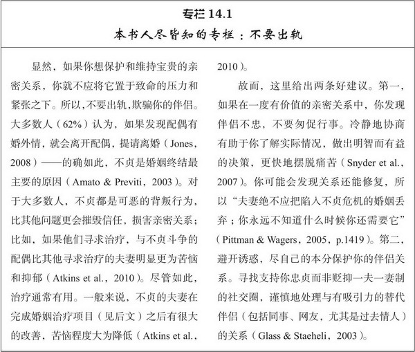

# 第14章 亲密关系的维持和修复

这是最后一章，我们也快要完成本书的学习了。那么，也该盘点一下我们学过的内容。现在你知道多少在学习本书之前并不知道的内容？只有你自己确切知道，但这里列出一些可能的内容：

- 通常期望男性具有的行为风格——鼓励他们果断自信、自强自立而非温情脉脉、亲切体贴——并不能把他们训练成长期亲密关系中最理想的伴侣。

- 低自尊的人常常会小题大做或者知觉到根本不存在的排斥，从而破坏他们自己的亲密关系。

- 临近、熟识和方便能决定有奖赏价值的亲密关系到底能否开始。我们与许多人都可以建立美满的亲密关系，只不过我们遇不见他们而已。

- 长相很重要，如果你的外貌没有吸引力，很多人会忽视你，不想与你结识。

- 我们并不如我们认为的那般了解或理解自己的浪漫伴侣；甚至在成功的亲密关系之中也会持续存在很多错误认知。

- 当我们开始结识别人时，他们会努力给我们留下好印象，但一旦我们喜欢或爱上他们，他们就很少努力保持礼貌、端庄和愉悦。

- 在非言语沟通方面男性一般不如女性做得好，非言语沟通的缺陷与亲密关系的不满存在相关。

- 我们常常认识不到：当我们与伴侣谈话时，伴侣并没有接受到我们想要传递的信息。

- 坏的比好的更有力量，我们与伴侣偶尔刻薄或挑剔的交往比我们为他们做的千桩好事更有影响力。

- 长期来看，亲密关系需要付出的代价往往比我们预计得要大得多。

- 浪漫、激情之爱是我们选择结婚的主要的理由之一，但久而久之它一般会减少。

- 约有三分之一的人不能轻松舒适地对待相互依赖的亲密感；他们要么担心伴侣不够爱自己，要么在走得太亲近时感觉不自在。

- 男性一般比女性期望更多的性行为，挫折感常常由此而起。

- 或迟或早，我们的伴侣都可能以某种方式背叛我们，给我们造成伤害和痛苦。

- 冲突是不可避免的。

- 平均来看，婚姻并不如过去那样幸福，离婚现在更为普遍。

呀！这么长的清单。这些不幸的事实只是我们学习过的许多内容的一部分而已；其他影响因素，比如神经质和自恋等人格特质，或者嫉妒或孤独的心理状态，也都会使亲密关系受挫。

总而言之，这些事实可能描绘出一幅阴暗的画面，的确，现代婚姻格外低的成功率表明许多伴侣关系并不像人们期望的那般美好。另一方面，我们学过的内容里也有很多积极的事实，以下就是：

- 许多男性（约三分之一）也像女性惯常的那样温情脉脉、亲切体贴和敏感细腻。而不具备这些特点的男性也可能通过学习，变得比现在更加热情、更加具有表达性。

- 幸福的爱人会宽容地理解伴侣并解释他们的行为，假定伴侣无辜，甚至把伴侣偶尔的不端行为视为善意和关爱。

- 大多数人会寻求与浪漫伴侣的相互依赖和亲密关系，并对此感到安心。

- 在幸福的亲密关系之中，如果激情减少，就会出现深厚、关爱的友谊，此类友谊丰富而热情，足以满足双方。

- 真正的宽恕对接受方和给予方都有益，在那些亲密、满意、最值得挽救的亲密关系中最容易得到。

- 或许最为重要的是，如果我们尽力去做，几乎所有人都能成为更体贴、更有魅力、更有奖赏价值的伴侣。在非言语沟通方面，如果给予男女两性同样的激励，男性就可以做得和女性一样好。如果我们花时间来检查我们的言语信息，就能减少或消除言语误解。只要我们处处留意就比麻痹大意能更加礼貌、较少自私、更加体贴、较少挑剔地对待我们的伴侣。

有许多理由使我们坚信，只要具备智慧和一起努力，我们就能和爱侣幸福到老。的确，我就坚决主张“知识就是力量”：更好地理解了亲密关系之后，人们就能充分地做好准备，防止某些问题并轻松地克服其他难题。最令人高兴的是，对伴侣关系有承诺的人会采取各种行动以保护和维持他们得到的满足感。而且，即使出现问题，很多难题也都能解决，很多伤口也都能愈合。在亲密关系遭遇挫折时，伴侣们常常能完全克服他们的困难，只要他们愿意。

作为总结的最后一章，我们要考察两个机制：**伴侣如何持续他们的满意度，如何干预以恢复止步不前的亲密关系**。尽管存在必须逾越的障碍，许多亲密关系不仅能坚持下来，还能美满幸福。

## 亲密关系的维持和提升

我曾在第6章（214~215页）介绍过，人们常常会采取各种行动保护和维持理想的亲密关系。来自两大学术阵营的研究者考察了关系维持机制（relationship maintenance mechanisms），即人们为维系他们的伴侣关系而采取的有策略的行动。支持卡里尔·鲁斯布特（Caryl Rusbult）投入模型[^ 1]的社会心理学家已经识别出几种可以维持关系承诺的行为，而沟通学者则注意到其他能区分伴侣是否幸福的行为。我们来考察这两组发现。

### 保持忠诚

忠诚于伴侣关系的人与不太忠诚的伴侣相比，更加盼望亲密关系能持续，他们对亲密关系的思考和行为方式也不同。他们认识自己、伴侣以及亲密关系的方式都有助于维系伴侣关系，其行为方式能避免或消除冲突，充实亲密关系。

#### 认知维持机制

当人们忠诚于他们的亲密关系时，他们的看法在几个重要方面都发生了变化。首先，他们不再把自己视为单独的个体，而是视为包括自己及伴侣在内的更大整体的一部分。他们认识到伴侣的生活和自己的生活有着很大的重叠，他们更多使用复数称谓的代词，用我们、我们的取代我、我的（Agnew et al.，1998）。这一自我定义的变化称为认知上的相互依赖（cognitive interdependence），它可能使得下述维持机制更可能发生（Fitzsimons & Kay，2004）。

其次，忠诚的伴侣会以**积极错觉**（positive illusion）来看待彼此，彼此理想化并尽可能以最好的眼光来看待他们的亲密关系（Conley et al., 2009；Luo et al.，2010）。认为伴侣的过失相对地无关紧要，关系的缺陷相对地无足轻重，伴侣的不端行为也视为无心之失或一时冲动而不放在心上（Neff & Karney，2003）。这些积极错觉有一特点很有趣，人们通常很清楚伴侣偶尔的讨厌或鲁莽之举，但会记错和为之辩解，从而能维持对伴侣积极的总体评价（Karney et al.，2001）。只要积极错觉不太离谱，这些玫瑰色的知觉就能让伴侣们偶尔的过失容易让人接受，从而有助于保护他们的幸福。

积极错觉的一种特殊形式可以说是第三种认知维持机制。忠诚的伴侣往往会认为他们的亲密关系比大部分人都要更好，他们越幸福，就会认为关系越出众（Reis et al.，2011）。这种感知到的优越感（perceived superiority）使得个体的伴侣关系看起来更加特殊（Buunk & Ybema，2003），它真的使亲密关系更可能持续下去（Rusbult et al.，dd）。

满足的伴侣也不太可能追求情人。只要我们的伴侣知道有吸引力的情敌存在，情敌就可能扰乱伴侣，吸引伴侣弃我们而去，但满足的伴侣会表现出对替代选择的无视（inattention to alternatives），这使他们意识不到自己在替代关系中可能得到的好处，也相当不关心替代伴侣（Miller，2008）。对当前伴侣关系不特别忠诚的人，与那些对自己所得更为满足的人相比，会带着更多的好奇和热心密切注视他们可能的其他选择；比如在实验室程序下给他们机会，他们徘徊得时间更长，更仔细地查阅有吸引力的异性对象的照片（Miller，1997a）。未承诺的恋人会仔细寻找更好的伴侣，这就给他们当前的亲密关系带来危险：那些学期开始时就对其他选择留意的大学生，在学期结束时不太可能仍然与同一位浪漫伴侣保持恋爱关系（Miller & Simeon，2011）。相形之下，忠诚的情侣相对并不留心他们在其他的关系中会怎样——他们不太注意此类可能性——这有利于保护和维持他们当前的伴侣关系。

最后，如果忠诚的伴侣的确注意到对他们亲密关系构成威胁的情敌，他们对情敌的评价也不如其他人认为的那样称心如意。忠诚致使伴侣们蔑视那些能把他们从现存亲密关系吸引走的人（Lydon et al.，2003），这一贬低诱人的替代选择（derogation of tempting alternatives）的机制能让人们感到其他可能的伴侣并不如他们现在拥有的伴侣有吸引力。这一知觉偏差有趣的一面是，如果替代选择非常有诱惑力，因而对个体的亲密关系威胁最大，这种偏差就最强烈。比如，如果说俊美的异性是另一个遥远城市的职业模特，忠诚的伴侣就不会贬低这些人的照片，但如果说他们是本校的同学，忠诚的伴侣就会认为他们更没有吸引力（Simpson et al.，1990）。而且，有承诺的男性会认为替代伴侣在排卵期比非排卵期更没有吸引力，而单身男性则认为没有服用避孕药的女性在排卵期比非排卵期更有吸引力（Miller & Maner，2010）。幸福的情侣为保护他们的亲密关系，倾向于低估其他潜在对象的有利条件。

> 这一点很重要，尤其是对于那些想挑战他人亲密关系的人来说。因为，长得越漂亮，越有吸引力，牢固忠诚的情侣就会越是贬低。

#### 行为维持机制

如前所述，为维持亲密关系人们通常会在认知上微妙地改变对别人、亲密关系和他们自己的认识或判断。其他维持机制则涉及人们行为的改变。

举例来说，承诺的人常常愿意为亲密关系做出各种个人牺牲，比如为了促进伴侣或亲密关系的幸福，做他们不愿意做的事情，或者克制自己的欲望（Impett & Gordon，2008）。这种牺牲的意愿（willingness to sacrifice）通常包括轻微的付出，比如看一场你不感兴趣的电影，因为伴侣想看。但它也涉及巨大的代价，即人们为了保持或改善他们的伴侣关系而付出巨大的代价。比如，如果你已经结婚，配偶为帮助你求学而不得不面对许多困难；但如果他/她忠诚于你们共同的未来，你的配偶是愿意付出这一代价的。

**当伴侣的行为表明他们鼓励我们成为我们想要成为的人时，亲密关系也可能变得更加亲密**。当伴侣鼓励我们成为自己所期望的人时——支持我们去学习技能，赞同我们接纳有前途的新角色和责任，提升我们的自我成长——我们的亲密关系和个人幸福都会得到提升（Overall et al.，2010a）。这种追求爱情伴侣的理想形象而产生的潜移默化的影响就是米开朗基罗现象（Michelangelo phenomenon），如此命名是为了纪念那位能从普通的石块创造出不朽艺术作品的著名雕塑家（Rusbult et al.，2009）。**当伴侣关系刚建立时，人们很少能完成成长和改变，如果伴侣关注和回应他们的需要和愿望，帮助他们成为他们想要成为的人，他们就会对亲密关系更为忠诚**（Finkel et al.，2010）。

忠诚的爱人还倾向于忍受伴侣的一些不严重的苛刻对待而不还击。这就是顺应（accommodation）现象，顺应指的是伴侣一方控制冲动，避免以类似方式对另一方的挑衅反应，相反，做出一种建设性的反应（Rusbult et al.，1998）。当人们平静而自信地宽容伴侣的不良情绪、无意义的批评、鲁莽轻率和其他烦人的行为时，顺应就出现了。它与自我折磨无关；相反，只要伴侣的冒犯只是偶尔或暂时的，顺应就提供了避免无谓冲突的有效方法，否则只会持续令人不悦的交往。当伴侣双方都倾向“保持冷静”而非“以眼还眼，以牙还牙”时，他们一般会拥有幸福的亲密关系（Rusbult et al.，2001）。

然而，我要指出做到顺应需要努力。顺应要求我们忍住不说和控制脾气，因而涉及主动的自我控制——实际上，自我控制（self-control，即个体处理自己的冲动、控制自己的思绪、执着地追求既定目标并抑制不当行为的能力）一般有益于亲密关系。自我控制能让我们应对挑衅时避免大发脾气，所以高自控的人（如果有也）很少发生亲密伴侣暴力（Finkel et al.，2009）。宽恕要求我们不要心怀怨恨，故而自控也让人更可能宽恕（Jenkins et al.，2011）。自控也有助于我们抵制诱惑，故而能帮助我们抵抗有吸引力的替代伴侣的诱惑；如果人们已置身于亲密关系之中，他们认为自控力越强就越容易保持忠贞，实际上他们在新相识面前的确更少显得轻浮（Pronk et al.，2011）。

实际上，人们在自我控制的气质水平（即他们控制冲动的一般能力）上存在差异，如果你还算明智，就会找一位在必要时有足够坚忍和克制能力的伴侣。这是因为伴侣双方越能自控（也就是说，他们一起明智决策和正确行事的能力越大），其亲密关系通常更顺利、更满意（Vohs et al.，2011）。**然而任何人在紧张、分心或疲劳时自控力都会减弱**（Buck & Neff，2011），故而人们暂时筋疲力尽时，更少顺应，更少宽恕，更多受到替代伴侣的诱惑（Luchies et al.，2011a）。我们疲劳和重负时，状况往往最糟糕。而令人欣慰的是，感受到与家人和朋友的联系能增强自控；心爱伴侣的接纳能增强我们的自控力，促使我们行动以保护自己的亲密关系（Blackhart et al.，2011）。[^ 2]

自我控制并不容易做到，但是另一种行为维持机制可能比较容易实行：玩乐（play）。**当伴侣能一起参与新异的、具有挑战性的、令人兴奋和快乐的活动时，他们通常会感到满足**（Strong & Aron，2006）。简而言之，伴侣能一起玩乐就能更长久地在一起。有研究者对这一简单事实进行了正式实验研究，伴侣们身体一侧的手腕和脚踝部位被捆在一起，然后要求他们在有障碍物的通道上爬行，同时他们要用头部推动一个薄膜塑料滚筒（Aron et al.，2000）。如果他们能快速地完成比赛就能获得奖品，这个游戏任务很是令人兴奋和痴迷。与那些进行更普通活动的人相比，这类活动的参与者在活动结束后感到他们的亲密关系得到了提升。的确，在现实的世界里，那些热衷于徒步旅行、骑车、跳舞或者参加音乐会、演讲和演出的人，比那些只是待在家里看电视的人，认为他们的婚姻质量更高（Strong & Aron，2006）。**抽出时间进行富有创造性的玩乐有益于亲密关系**。

最后，**那些忠于伴侣关系的人在伴侣背叛之后更有可能宽恕对方**（Guerrero & Bachman，2010）。宽恕能促进亲密关系和犯错伴侣的改过（宽恕亲密伴侣远比心怀怨恨更少压力），所以宽恕能促进亲密关系和宽恕者本人的健康发展（Bono et al.，2008）。

### 保持满足

人际沟通专家丹·卡纳里（Dan Canary）和劳拉·斯塔福德（Laura Stafford）识别出第二大类的关系维持活动，他们从数百篇研究报告（包括500篇大学生的学期论文）总结出人们维持亲密关系的一些容易控制的行为（Canary & Stafford，2001），见表14.1。正如你看到的，满足的伴侣力图培养积极性、保持礼貌和欢欣，坚持积极乐观；他们鼓励开放和自我表露，分享他们自己的想法和情感并邀请他们的伴侣也这样做；他们彼此做出保证向对方宣告他们的爱恋、承诺和尊重；他们有共同的社交圈，有着共同的朋友并花时间与伴侣的家人相处；他们公平地分担任务，公平承担属于自己的家庭责任（Weigel，2008）。满足的伴侣还会避开某些话题，但他们又寻求为彼此提供支持，保持善意的幽默，花足够的时间一起相处，犯错时也会向对方道歉。

表14.1　卡纳里和斯塔福德的关系维持策略

资料来源：Stafford，2003.

**类似的活动也可以用来维持亲密的友谊**（Oswald et al.，2004），这一点我们应该不以为奇。如果你回头看看亲密关系的构成成分（请翻到第1章2页），你会明白卡纳里和斯塔福德识别出的大多数维持机制都能促进和鼓励朋友和爱人之间的亲密。维持策略涉及开放、个体爱恋的保证和承诺、可靠的支持以及许多共同的朋友和活动等等，这些策略都可能增强亲密关系的六个成分，即了解程度、关心程度、相互依赖性、相互一致性、信任度以及忠诚度。在亲密关系中，人们保持幸福的行动看来涉及创造和保持与伴侣的有奖赏价值的亲密关系。

而且，这些不同的行动似乎有作用。在日常生活中做出如表14.1所列活动的伴侣与那些不太努力维持伴侣关系的人相比，前者更加喜欢对方、更忠于他们的亲密关系（Stafford，2003）——当伴侣双方都这样行动时尤其如此（Oswald & Clark，2006）。不要因为表14.1所列的活动太多，看起来有点吓人而感到厌烦；其中的三项较之其他活动更重要，也容易记住。这一堆活动中，能最好地预测幸福婚姻的是积极性、保证和分担任务（Canary et al.，2002）。伴侣如果能做自己公平分担的家务，经常保持愉快的情绪，定期向伴侣表达爱意和尊重，就非常有可能保持幸福的婚姻。

然而，我们要提出一条警告：在情人节给伴侣做出的友善之举不可能在七夕节还能让他/她保持满意。卡纳里及其同事（Canary et al.，2002）发现这些维持机制的时间效果是短暂的：**如果这些理想的活动停下来，满意度马上就会开始下降**。这给我们明显的启示是，**要维持幸福的亲密关系，我们不得不坚持到底。这里自我控制再次显得重要**（Kammrath & Peetz，2011）；长期来看，我们要持续保持快乐、爱恋和公平。而那些不时对伴侣小气、苛刻和漠视的人请自负后果。

## 修复关系

保护和维系亲密关系的机制和保养汽车有着某些共同的特点。如果你精心地选购，做了一笔好买卖，尽职地进行持续细心的保养计划，定期地更换机油，添加润滑剂，并尽自己所能照看车辆，你就是个幸福的司机。不过，尽管你很努力，汽车迟早会出问题，这时就应当修理了而非仅仅保养调整车辆。如果修理很简单，你可能自己单独就能完成，但有些情况下你却需要专业人员的帮助。欣慰的是，亲密关系出现破裂时，就像修理汽车一样，是可以得到专业帮助的。

### 自我实践

有时我们能自己解决在亲密关系中遇到的问题。我们对自己行为的知觉往往会受到自我服务偏差的影响，我们往往很难意识到自己对当下关系困境所起的推动作用。第三方的旁观者对我们关系的知觉往往比我们更冷静和公正。不过，如果你想自己修复亲密关系，可以获得大量的建议。电视节目、杂志、自助类图书和播客上充满了各种建议，它们可能有助于改善你的亲密关系。这类用户常常觉得这些建议有帮助作用；比如阅读自助类图书的人们通常觉得这类图书对他们有益（Ellis，1993）。

然而，大众媒体给出的通俗意见也常常存在问题。举例来说，那些随意给出各种意见的所谓专业人士，他们的背景就像他们的意见本身一样虚假；曾有个著名的作家自夸拥有“博士”学位，结果发现该作家既没有从官方认可的大学毕业，也没有在研究院所研究过相关的助人和行为科学。根据维基百科[^ 3]，畅销书《男人来自火星，女人来自金星》（Gray，1992）的作者约翰·格雷（John Gray）是从哥伦比亚太平洋大学（Columbia Pacific University）获得的博士学位，大多数美国人都没听说过这所学校，因为后来该大学被加州政府关闭。畅销书《婚姻的呵护和保鲜》（The Proper Care and Feeding of Marriage，2007）的作者劳拉·施莱辛格（Laura Schlessinger）的博士学位是生理学而非心理学。此外，有些婚姻专家给出的咨询意见并不是建立在正确研究的基础之上；相反，他们根据自己的个人观点就发表高论，有时与客观事实并不一致。人们也经常在这些“奇谈怪论”上投入大笔的金钱，这些观点与关系科学是矛盾的（Donahue，2007）。

还有些情形，咨询专家暗示改善亲密关系非常简单、容易实现，因而使得人们对于自己独自解决关系问题的能力过于乐观。因为这类建议是面向普通大众的，并不是为个体所面对的特定情境而度身定做的。它们常常缺少相关的明确方向，即使给出的指导原则相当清楚，却没有客观的观察者能监控伴侣们遵循的情况或者对执行情况提供正确的反馈。

然而最大的问题是，非专业的意见可能是完全错误的，它的流行性和它的准确性并无必然联系。回到第1章，我曾断言，人际关系学家非常不同意“男人来自火星，女人来自金星”这一头脑简单的观点；既然你已阅读本书，你又是怎么想的？

还有一个例子。有本名为《关系法则：俘获白马王子屡试不爽的秘密》（The Rules: Time-Tested Secrets for Capturing the Heart of Mr.Right）的书曾一度居于“非小说”类畅销书的榜首。据这本书的作者（Fein & Schneider，1995）所说，《关系法则》描述了“如何在帅哥面前表现得体的简单方法，能帮助任何女性赢得梦中白马王子的心”（p.5）。如果读者遵循书中提供的建议，“他不仅会和你结婚，而且永远会为你疯狂！我们给你的承诺是‘从此以后一直幸福’”（p.6）。听起来很棒，不是吗？不幸的是，书中给出的关系法则是错误的。为了提升对异性的吸引力，该书建议读者保持冷漠和神秘，避免显得太急于确立新的亲密关系。作者承认，“简而言之，我们探讨的是欲擒故纵（故意装出难以接近的样子，以鼓励对方进一步追求）”（p.6）。但是玩弄欲擒故纵的策略并没有多大作用，人际关系科学对这一方法的了解已经有40多年了。女性人为地延缓亲密关系的发展进程，对男性并没有特别的吸引力；对男人有吸引力的理想女人是除了他之外对所有人都故作清高的女性（Walster et al.，1973）。特别地，《关系法则》教导女性避免一周看望男性的次数超过两次，在交往早期避免进行过多的自我表露，在分离后不要告诉男方自己在做什么，诸如此类的关系法则都与男性对新伴侣的忠诚负相关（Agnew & Gephart，2000）。总的来说，遵循《关系法则》的女性可能比其他的女性更难吸引和留住男性。这些都不是非常正确有用的建议。（的确，《关系法则》的作者之一在该书出版几年之后就被起诉离婚。）

当然，并非所有的流行建议都是错误的，有些还是非常可靠的。比如，有些自助类图书是由声誉卓著、受人景仰的科学家所著（比如Gottman，2011；Orbuch，2009）。从积极方面来看，这类书籍花费不多。自助类图书的读者能多次参照这些建议，按自己的速度学习这些材料。可靠的图书也适合那些对正式治疗感到非常尴尬的人。它们还能给读者一种积极的态度，鼓励合作，促使他们努力处理自己的问题。

诸如此类，我承认我很高兴看到你阅读本书。我并不打算把本书设计成自助类图书，但我希望本书收集的信息能对你有所帮助。我相信亲密关系的科学研究蕴含着巨大的价值，希望我提供给你的材料能帮助你更专业地理解你自己的关系。我还敢打赌，你能把本书的诸多知识点应用到自己亲密关系之中，从而享受到更丰富、更有奖赏价值的伴侣关系。

### 预防性维持

保养你的汽车时，有时候在出现任何故障之前，把钱花在重要的维护上是很明智的。比如，几年之后你就应该更换汽车的正时皮带（timing belt）。它是汽油引擎里的部件，一旦断裂轻则让你进退两难，重则损毁你的引擎。更换正时皮带有点昂贵，当你的汽车引擎运行顺利时，很容易延迟更换。但预防性维持无疑是明智的选择。

> timing belt通常翻译成同步带，也称齿形带、正时带、无滑差带等。

类似地，已经订婚准备结婚的伴侣通常认为他们将会一帆风顺，没有必要为婚姻将给亲密关系带来的新阶段做准备。然而，一些预防性维持却可能很有价值。在问题发生之前，精细地调整伴侣的期望和沟通技能或许能带来丰厚的回报。

婚前咨询的形式多种多样，范围广泛，从对神职人员如牧师、神父等的非正式探访到心理学家或婚姻与家庭治疗专家指导下的结构性训练（Halfor[2011]总结了这些咨询项目）。人们在家里也能得到基于计算机的指导（Braithwaite & Fincham，2009）。为了叙述简明，我只探讨PREP项目，它也是最有名的关系技能课程之一。

预防和关系提升项目（The Prevention and Relationship Enhancement Program，PREP）通常包括分为5次总共约12小时的训练（Markman et al.，1994）。会谈关注的话题现在对于本书的读者可能非常熟悉：

- 能改变伴侣观点和行为的承诺所具有的力量。鼓励伴侣以长期的眼光来看待他们一起努力创造的未来。

- 一起快乐生活的重要性。说服伴侣在日常生活的基础上一起重视玩乐。

- 关于性的坦诚沟通所带来的价值。建议伴侣清楚而坦诚地表达他们的性欲望，并不时地尝试新事物。

- 不恰当期望的后果。鼓励伴侣认识他们的期望，对自己的期望保持理性，并清楚地沟通他们的期望。

该研究的参与者还要学习说话者—听话者技术，我在本书第370~371页介绍过。

PREP项目有作用吗？一般而言，答案是肯定的。参加诸如PREP的婚前预防项目的普通人比79%的没有参加此项训练的人后来状况要更好，至少一段时间如此（Hawkins et al.，2008）。接受婚姻与关系培训的新婚夫妇比那些没有接受此类培训的夫妇，在结婚后的头3~4年感到更满足（Blanchard et al.，2009）。不过，这类培训大部分的参与者都是中产阶级白人，他们要求美好婚姻的动机非常强烈，不过训练的长期效果还不确定（Hawkins et al.，2008）。尽管如此，一些婚前预防性维持项目在头几年的确能让婚姻一帆风顺。

### 婚姻治疗

一旦婚姻出现了真正的问题，可能就需要更深入的干预。职业咨询师采用的治疗方法多种多样，有三种不同的治疗方法在大多数时间对于大部分人来说都是有治疗作用的。我们将看到它们在以下几方面存在差异：（1）它们侧重问题行为、思维还是情感；（2）它们侧重婚姻问题源于个体的易受伤害性还是夫妻之间的交往；（3）它们强调婚姻苦恼的根源是已往的事件还是当前的困境（Baucom et al.，2006）。涉及伴侣双方的治疗最为普遍，但处于艰难关系中的人也能从个人治疗中获益，即使他们的伴侣拒绝与他们一起寻求帮助。

#### 行为的方法

大部分时间，不幸福的夫妻不能和颜悦色地彼此相对，而经典的干预——夫妻行为治疗（behavioral couple therapy，BCT）鼓励他们成为更愉快和有价值的伴侣。BCT关注夫妻们当前的交往，并设法用更亲切和慷慨的行动取代任何负面和惩罚性的行为。BCT治疗师给夫妻们传授沟通技能以帮助他们表达关爱，冷静地处理冲突，并特别鼓励他们做对伴侣有益或取悦伴侣的事情。

BCT有各种方法引导夫妻们的理想行为。治疗师可能安排“爱情日”（Weiss et al.，1973），让伴侣一方故意去按另一方的要求来行动以表示关切和善意。或者夫妻达成一致意见，以他们各自理想的行为来回报伴侣的积极行为。在此类协议即等价交换的合约中，伴侣一方的行为改变直接与另一方的行为变化联系在一起（Jacobson & Margolin，1979）。比如，如果他在星期六清扫了浴室，她就同意每个周日洗衣服，而如果她在上周日洗了衣服，他就会打扫浴室。如果伴侣任何一方动摇，这种形式的合约就无法增加夫妻间积极的交流，所以还会采用诚信合约即平行协议，针对行为的变化给予特权奖励（Weiss et al.，1974）。在诚信合约中，他或许同意每周六清洗浴室，当他这样做了时就可以选择当晚的活动；她或许同意每周日都洗衣服，当她这样做了时，他就承担当晚为孩子洗澡并哄他们睡觉的全部责任。

说服伴侣们慷慨地行事对于BCT非常重要，但苦恼的夫妻在寻求治疗时彼此常会感到勉强与冷漠，这种态度BCT并不总能改变。因此，由BCT派生出的治疗注重伴侣们对他们关系及行为的认知和判断（Epstein & Baucom，2002）。除了鼓励理想的行为之外，夫妻认知—行为治疗（cognitive-behavioral couple therapy，CBCT）试图改变伴侣们思考和评价他们伴侣关系的各个方面。这种治疗强调夫妻们的选择性注意，即他们注意某些事情而忽略另一些事情的倾向性，设法给每位伴侣逐步灌输更合理的期望，更宽容的归因和更具有适应意义的关系信念。CBCT的参与者要学会跟踪和检测他们的想法，积极地思考任何负面行为的各种归因，识别并挑战不现实的信念，列出他们对亲密关系结果所持的各种支持和反对的理由。CBCT承认，人们常常会把他们在过去关系中习得的有问题的思维习惯带到他们现在的婚姻之中，但它仍然主要关注夫妻交往的当前模式；CBCT的核心观点是：不管适应不良的认知来自何方，如果夫妻能够公平、善意和理性地认识和评价彼此，他们就会感到更加满足。

最近从BCT派生出的疗法是夫妻行为整合治疗（integrative behavioral couple therapy，IBCT），这种方法既试图鼓励更理想的行为，又教导伴侣们宽容地接纳他们改变不了的不合（Christensen et al.，2010）。IBCT会传授沟通技能，也应用BCT的行为矫正技术，但它仍然假定即使伴侣双方的行为表现良好、令人满意，某些令人沮丧的矛盾仍会一直存在；因此，治疗的一个重要目标是教会伴侣们对不可避免的烦心之事采取适应性的情绪反应。有3种技术可以促进个体对自己或伴侣缺点的接纳（Wheeler & Christensen，2002）。使用具有同理心的参与技术，夫妻们要学会不带任何责备或怨恨地表达他们的痛苦和弱点，否则会使得伴侣采取防卫姿势；这种技术的要点是通过帮助每位夫妻理解对方的感受而产生同理心。夫妻们还要学会用统一的超然态度来看待他们的问题，这种理智地看待问题的视角可以平息情绪，帮助夫妻们冷静而客观地理解交往中出现的问题。夫妻们要描述引起挫折感的事件，辨别该事件的触发源，同时要避免这类事件通常引起的负面情绪。最后，在宽容性建构中，当问题行为发生时，夫妻们要学会不再敏感，反应不再激烈；在治疗期间要排演和分析负面的交往模式，鼓励伴侣们真正放弃改变对方任何令自己讨厌的事情。IBCT的焦点是伴侣们当前的交往模式，不管其起源是什么，都力求改变伴侣们的交往行为以及个体对交往行为的情绪反应。

因此，这三种行为治疗方法都关注伴侣对待彼此的行动，但在附加成分上存在差别。BCT试图改变夫妻的行为，而CBCT试图改变他们的行为和认知，IBCT试图改变他们的行为和情绪（见表14.2）。每种方法都可能适用不同的夫妻，但重要的是，它们都有治疗作用（Baucom et al.，2006）。认真进行上述三种治疗的夫妻有60%~70%的人有效果，他们的不满和困扰在随后的几年里都显著地减少了（Christensen et al.，2010）。

#### 情绪中心的治疗

表14.2　各种婚姻治疗的核心特征

资料来源：Baucom et al.，2006.

另一个最近才出现的新疗法，情绪中心的夫妻治疗（emotionally focused couple therapy，EFCT）起源于依恋理论（Johnson，2009）。在整本书中我们都看到，能与自己的伴侣形成安全依恋的人在亲密关系中更为满足和舒心，EFCT通过增进伴侣的依恋安全努力改善亲密关系。正如行为学的方法，EFCT试图重新建立夫妻交往的理想模式，但它关注的重点是伴侣们在试图满足依恋需要时体验到的情绪。EFCT认为人们需要情绪安全，并会向他们的配偶寻求情绪安全，但如果伴侣一方不能有效地得到保证和接纳，并且伴侣另一方以负面方式反应，沮丧和苦恼就应运而生。最普通的现象是，想要得到更多注意和关爱的伴侣却以一种看似挑剔和责备别人的方式来索求，伴侣另一方的反应当然是躲避得越远越好。伴侣双方都得不到安慰，也没有人幸福，并且这种可憎的索求和退避循环可能会不断加剧。

EFCT试图识别出这类情感沟通适应不良的循环，并代之以重新建构的交往，从而使伴侣们能感到安心、爱恋，彼此能安全地交往。EFCT包括三个阶段（Johnson，2004）。在第一个阶段，要识别出沟通中存在问题的冲突模式，鼓励夫妻们把自己视为团结在一起与共同敌人战斗的合作者；治疗师还帮助夫妻们探察没有得到满足的接纳和安全需要，正是它们激起了夫妻冲突。在第二个阶段，伴侣们开始建立有建设性的交往新模式，承认对方的需要并提供更多的保证和安慰。最后，在第三个阶段，伴侣们排演和加强他们对彼此的应答性，依靠新建立的安全感无畏地寻找解决老问题的新方法。整个过程包括9个步骤，见表14.3，一共包括10~12个治疗期。

EFCT治疗的重点是夫妻们当前的交往，但仍鼓励伴侣们思考各自的需要对共同关系结果的影响，所以EFCT要同时考察造成婚姻功能不良的个体和互动根源。对于较为苦恼的夫妻，EFCT非常有效，在治疗完成时70%的夫妻克服了他们的不满（Johnson，2004）。

表14.3　情绪中心的夫妻治疗的特定步骤

资料来源：Johnson，2004.

#### 顿悟导向的治疗

最后一种治疗方法来自于弗洛伊德的精神分析传统，弗洛伊德认为人们常常在不自知的情况下背负着过去关系中留下的无意识伤害和创伤，这会加重和玷污他们当前的伴侣关系（见专栏14.3）。有许多干预方法寻求提高伴侣们对这些问题“包袱”的洞察能力（如，Scharff & de Varela，2005），但这种方法的典型例子是斯奈德（Snyder，2002）的顿悟导向的夫妻治疗（insight-oriented couple therapy，IOCT）。IOCT比上述治疗方法更强调个体的易受伤害性（见表14.2）；它努力帮助人们理解他们在过去的关系中建立的个人习惯和臆断，怎样制造出他们与当前伴侣的麻烦。因此，它比其他治疗方法也要更全面地考察已往的事件；IOCT假定婚姻不满的起源通常在于夫妻们在以前的关系中遭逢的困难。

IOCT的主要工具是情感重构，通过这一过程夫妇能重新想象或重新经历过去的亲密关系，从而努力辨别已往伴侣冲突中的主要情感和应对风格（Snyder & Schneider，2002）。治疗师指导个体通过严密地检视他/她自己的关系历史，非常细心地注意任何人际伤害的模式。治疗师帮助个体理解过去的关系和他/她现在问题之间可能存在的联系。

来自情感性重构的顿悟有助于伴侣们对另一方的行为采取更仁慈的判断。夫妻任何一方都更加可能意识到他/她的易受伤害性，共同表达出的恐惧以及建立伴侣之间同理心的需要。治疗师也有可能把夫妻双方都描述成竭尽全力修复关系的典范，考虑到个人的历史，所以责备和刻薄之词也减少了。那么，因为（正如我们前面提到过的）知识就是力量，夫妻们逐渐建构起新的、更有奖赏价值的交往模式，从而可以避免过去的陷阱。

所有这些通常需要15~20次治疗期。正如情绪中心的治疗和行为治疗方法，ICOT对大部分夫妻都有帮助，至少有一项研究（Snyder et al.，1991）表现出显著的维持效果，在四年之后夫妻们的适应比BCT更好。

#### 婚姻治疗的共同特征

此外还有各种其他婚姻治疗方法（见Harway，2005），但我们重点关注的只有行为的方法（BCT），EFCT和IOCT，因为谨慎的研究表明他们适用于大多数夫妻（Baucom et al.，2006）。大部分严肃地参加上述三种治疗的人在此后的境况都变得更好，并且（据粗略的估算）约有三分之二的人不再对他们的婚姻不满（Snyder et al.，2006）。但谁也不能担保治疗的效果，治疗的成功可能取决于个体参与治疗的诚意、努力程度以及具体过程。但婚姻治疗有助于大部分的夫妻。如果你希望修复举步维艰的亲密关系，治疗是可行的。

那么，这些治疗方法哪一个适合你呢？多年以来，这个问题在职业治疗师之间引起了许多竞争和不时的争吵，但我们可以给你一个非常简单的答案：**选择最吸引你的治疗和治疗师**。这并非是无聊的建议。在你读到这最后几页时，你感到最有趣的治疗就很可能是适用于你的最好的治疗，这样说有三方面的原因。

首先，尽管婚姻治疗的名称和强调的重点不同，但它们都有某些共同点，这可能就是它们都能发挥作用的重要原因（Wampold，2007）。**每种治疗都对伴侣关系遭遇困难的原因提供了合理的解释，都为怎样克服这类困难提供了充满希望的新观点**。为了实现这一目标，每种治疗都提供了改变这些苦恼交往模式的新方法，都促使夫妻们表现出更有效、更理想的行为。虽然每种治疗对这些目标的追求有着不同的理论基础，**但它们都注重培养夫妻们彼此间更有建设性的联系和更令人满足的交往模式**。所以，这些不同的婚姻治疗方法都有着相同的核心成分，使得它们本质上更为相似。

其次，有鉴于此，你选择的治疗师可能和你选择的治疗方法一样重要。如果夫妻双方都尊重和信任他们的治疗师，治疗就更有可能成功（Summers & Barber，2003），所以你应该寻找一位看起来既可靠又令人信服的杰出治疗师。如果你认为某种治疗方法有道理，而治疗师又支持这种方法，那么这位治疗师与那些使用你不太信服的方法的治疗师相比显得更专业、更权威。

最后，吸引你的治疗方法更可能给你带来真正的改变，这种乐观的态度非常有影响力（Snyder et al.，2006）。积极的期望使得治疗效果更加明显。与那些对治疗结果悲观的人相比，相信自己的努力肯定能带来疗效的夫妻会更认真地配合治疗，保持更高亢的精神状态，这都会增加治疗成功的几率。

同样，如果你和某些人一样认为“好姻缘天注定”和“伴侣无法改变”，不要怪我没有提醒你这些观点的危险性。在第4章我们曾讨论过诸如此类的起着反作用的关系信念，我希望你现在对这类信念缺点的认识应该更清楚。当婚姻出现问题时，持有这类信念的人不太可能寻求治疗，即使他们真的进行治疗，实行起来也往往心不在焉。结果是，他们的境况不太可能得到改善。所谓“牵马到河易，强马饮水难。”

的确，这句古老的俗语道出了所有婚姻治疗的最后一个共同点：人们都没有充分地利用婚姻治疗。大多数离婚的人根本就没有咨询过婚姻治疗师，极少数寻求治疗的人通常要等到他们的问题非常严重时才来寻求帮助（Doss et al.，2004）。男性尤其如此，不太可能像女性那样积极寻求婚姻治疗；他们对发生的婚姻问题反应迟钝，不太可能相信治疗的效果，在有必要治疗时更是迟疑不决（Doss et al.，2003）。考虑到婚姻治疗的有效性，这一点很遗憾。我希望，既然你已经知道在婚姻治疗上付出金钱会物有所值，如果需要你会毫不迟疑地联系治疗师。

通常治疗的时机也值得考虑。越早处理婚姻问题，就越容易解决。夫妻们的痛苦越深，就越难逆转（Snyder et al.，1993）。为什么还要坐失良机？考虑这样一种可能的结果：治疗并不总是能起作用，一旦治疗师理解了夫妻们的问题，治疗师也有可能劝告双方解除婚姻关系。但如果婚姻真到了这一步，许多令人迷茫的不确定性和痛苦都可以避免。另一方面，如果亲密关系有挽救的可能，治疗有帮助作用，那么越早得到治疗，伴侣遭逢的苦恼就越少，就越能重新恢复健康的伴侣关系。不管何种情况，亲密伴侣坐视他们所面临的、不可避免的困难而不处理都会后患无穷。

## 结语

那么，整体来看，正如汽车一样，预防性维持能维系亲密关系以免破裂，出现问题时也能修复。这个类比很恰当（这也是用汽车来比喻亲密关系的原因），但必须指出这个类比有可能产生严重的误导：不管你如何细心地呵护你的汽车，迟早会用坏而必须更换，但亲密关系却根本未必会如此。当然，有些人会经常更换他们的爱人，就如同更换汽车一样追求更新潮、更浮华的款式（Campbell & Foster，2002），但本书的大部分读者都希望他们最终能与某个特定的伴侣建立稳定的亲密关系，能让他们一辈子都心满意足。

我们能做到这一点。我希望，在你学习完亲密关系的现代科学之后，你更能训练有素地创造、理解和管理**成功、幸福、持久和有奖赏价值**的亲密关系。我还希望，你能明智地选择伴侣，并且能细心周到地呵护和保养你的伴侣关系，从而建立并维持永远让你满足的亲密关系。毕竟，有些亲密关系非常成功。当研究者要求100对婚龄持续了45年的满意夫妻解释他们成功的原因时（Lauer et al.，1990），他们的回答是：

- 他们珍视婚姻，并认为婚姻是长期的承诺和忠诚；

- 幽默感非常有益于婚姻；

- 他们非常相似，在大部分事情上都能达成一致意见；

- 他们真正地喜欢自己的配偶，喜欢与配偶共度美好时光；

我们希望你的婚姻也能这样。

## 请你思考

当露西读到本书结尾部分时，她决定要与丈夫谈谈自己对他以及婚姻生活每况愈下的不满。他们订婚时丈夫可是体贴周到、魅力四射，但她最近觉得丈夫不再设法取悦自己，所以感到孤独和受伤。她认为自己不断地调整以顺应丈夫，但丈夫却很少做什么来取悦自己。丈夫从来不关心她每天过得怎样。这虽是小事，却令她烦忧，这种行为表明了丈夫的自我迷恋和缺乏关爱。然而，当露西建议一起去寻求婚姻治疗时，丈夫坚决地拒绝了。所以，她决定自己独自前往；她找到了美国婚姻和家庭治疗学会的网址：www.aamft.org，发现了一位治疗师，并约好了单独见面。

你认为露西和她丈夫的未来怎样？为什么？

[^ 1]: 需要时请参考第6章213页。
[^ 2]: 这里说明自控在亲密关系中的另一个好处：自控表明我们在乎。通过改变伴侣其实很少能改善我们的亲密关系（这样做只能惹恼他们），当我们改变我们自己时，我们的努力才能取得成功。当伴侣意识到我们在努力表现得更好时（比如，试图更清晰地沟通，更理性地管理冲突等）往往会感到高兴，而如果我们成功地进行了一定程度的自我控制，他们会更为满意（Hira & Overall，2011）。如果伴侣双方都这样做，请想想带来的好处。
[^ 3]: Wikipedia，一部基于互联网、内容开放的全球多语言百科全书，也是目前世界上最大的百科全书。其网址为http://www.wikipedia.org——译者注