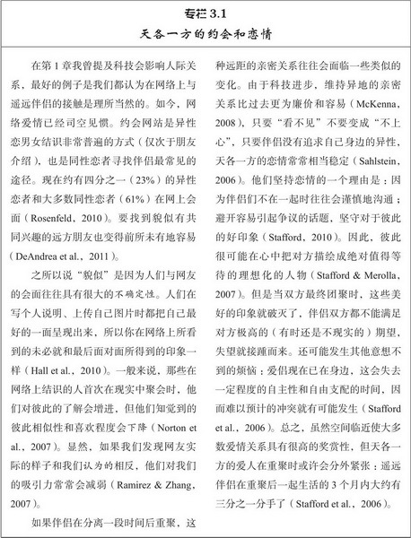
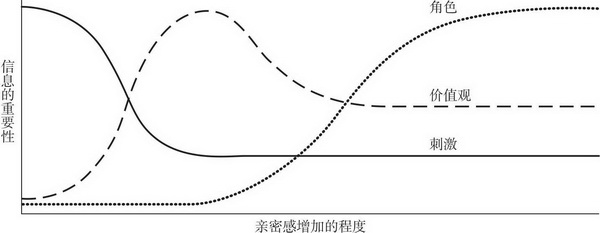

# 第3章 吸引力

假设你独自在教室里阅读本书，突然门被推开了，进来一位陌生人。这人对你有吸引力吗？这人可能成为你的朋友或恋人吗？很显然，在你还未读完这句话的电光火石之际，你心中已尝试回答了（Willis & Todorov，2006）。这究竟是怎么回事？你的判断有什么根据吗？本章我们就要探讨这些问题，重点关注友谊和爱情的建立过程。从心理学来看，**迈向成功人际关系的第一步永远一样：人际吸引**，即接近他人的愿望。感觉到他人的吸引力不一定就能保证建立人际联系，但却使人际交往成为可能。本章我们要考察影响吸引力的几个重要因素，就从吸引过程的基本原理开始吧。

## 吸引力的基础：一种奖赏

人与人之间产生吸引力最基本的假设是：他人的出现对于我们有奖赏意义（Clore & Byrne，1974）。影响吸引力的奖赏（rewards）有两种类型：与他人交往产生的直接奖赏，和仅与他人有关的间接利益。直接奖赏指的是他人提供给我们的所有显而易见的愉悦。如果他人给予我们许多兴趣和赞许，我们就会对这种关注和接纳感到非常高兴。如果他人聪明又美丽，我们就会享受这些赏心悦目的个人特征。而如果他人能给我们带来物质利益如金钱或地位，我们更会乐于接受这些好处。多数情况下，人们提供的**直接奖赏**越多，对我们的吸引力就越强。

但吸引力还受到很多不易觉察的因素影响，这些因素只与人们外在的友善、俊美的长相或怡人的个性有间接的关联。例如，我们大多数人都喜欢自己，而新结识的人如果与我们有着某些共同点，哪怕多么不着边际，他们都可能看上去更讨人喜欢。比如有个家伙叫丹尼斯（Dennis），他很喜欢自己的名字；因为他名字的第一个字母是D，“丹尼斯可能很容易被城市如丹佛市（Denver），职业如牙医（dentistry），恋人如丹妮斯（Denise）所吸引”（Pelham et al.，2005，p.106）。实际上，的确是这样：人们更有可能爱上名字和自己名字类似的人（Jones et al.，2004）。这类奖赏是间接、微弱的，我们有时甚至意识不到它的存在——但它的确表明他人吸引我们的奖赏是多么复杂多变。

即使人们不刻意去做，还是会去追求那些更可能使自己繁殖后代、遗传基因的伴侣，从这些特殊的伴侣身上同样能获得间接利益（Buss，2012）。正如我们所看到的，**人们常常被那些能为将来的后代提供生存优势的人所吸引，即使他们根本还没想过养育孩子的问题**。

的确，大多数人只是认为如果某个人充满魅力我们就容易被他吸引，但实际情况远比这复杂得多。吸引力的确与我们认知到的他人具有吸引力的个人特征有关，但它还取决于我们自己的需要、偏好、愿望以及所处的情境（Graziano & Bruce，2008）。吸引力的基础是与他人发生的有奖赏意义的经历，但这些愉快经历表现的渠道多种多样，我们未必总能意识到这些影响我们选择的所有因素。那么，我们就从一个常常容易被人忽略的因素开始考察吧。

## 临近：喜欢身边的人

我们或许在网络上结识过朋友，但当我们能听到朋友的声音、看到朋友的微笑、能真实地握手时，这样的交流不是更有奖赏意义吗？大部分时候，当人们面对面地交往时（在身体上，而且在心理上都更接近），这样的人际关系奖赏价值更高。确实，现实空间上的临近（proximity）通常首先决定了人们能否相遇。多数情况下，友谊和爱情都源自与身边人的交往。

事实上，空间上的临近和人际吸引之间有着显而易见的联系，一米左右的距离就会造成很大的差别。想一下你上学的教室：新学期开始时你认得的是谁？谁又是你的新朋友？你认识的人和最喜欢的人在上课时很可能就坐在你的身边。如果在教室里给大学生分派座位，大学生更可能与坐在身边的人成为好友，而不是那些坐在教室另一边的人，即便教室非常小（Back et al.，2008）。

对大学校园里学生公寓区的社交研究也得到类似的结果。费斯廷格等人（Festinger，Schachter，& Back，1950）的一项经典研究考察了麻省理工学院住校生的友谊选择。他们把住宿生随机分配到如图3.1所示的17间公寓里。住处较近的人比房间相隔较远的人更有可能成为朋友。的确，住宿生成为好友的可能性与他们房间的距离有紧密的关系。值得一提的是，对建筑楼群的研究也得到类似的结果：人们更可能喜欢和结识与他们更靠近的公寓楼里的人。显然，即使很小的距离对我们的人际关系也有着重大的影响，对此我们常常认识不足。**一旦我们确定了居住、工作或上学的准确地点，我们大体上也就决定了哪些人将会成为我们生命中最重要的人**。

### 方便：远亲不如近邻

为什么空间上的临近有着如此大的影响力？答案之一是如果他人在我们身边，我们很容易得到他们提供的各种奖赏。如果其他条件相同，身边的伙伴比遥远的伙伴更有优势：与远距离的伙伴交往消耗的金钱和付出的努力——诸如手机话费、汽油费和路上的耗时等——使这样的人际交往比住家附近的交往成本更高（Baldinger，2008）。远距的人际关系奖赏价值也低；**在文字或声音中表达出的爱意远不如脸颊上真实的一吻那样打动人**。因而，**分居两地的亲密关系一般不如朝夕相伴的亲密关系令人满意**（Sahlstein，2006）。

这一研究结果的惟一亮点是出乎人的意料。然而，住在一起的恋人，假若要分离一段时间，他们还可能快乐地认为这并不会影响他们的感情，因为他们的爱情已经具有足够的奖赏价值。如果这样，他们或许会奇怪于距离对亲密关系的影响。原本临近又便利的亲密关系如果因为距离而变得疏远，这种伤害是任何人都难以预料的。即便已婚的夫妻如果分居两地也更可能离婚（Poortman，2005）。**分离似乎并没有加深感情**。

### 熟识：重复接触

空间上的临近也使两个人更可能相遇，彼此变得更加熟悉。俗语云“亲不敬，熟生蔑”，但研究证据并不支持。重复地接触他人（甚至只要看到他人照片）通常能增加我们对他们的喜欢程度，而不会导致厌烦，此即曝光效应（mere exposure effect）（Zajonc，2001）。即使我们从来没有与陌生人说过话，**我们仍倾向于喜欢见过很多次的面孔，而非不熟悉的面孔**。

研究者（Moreland & Beach，1992）做了一项有趣的研究来说明曝光效应。在大学学期开始时，研究者让女大学生在某些课堂上分别出现15次，10次或5次。这些女生从来不和教室里的其他学生交谈，只是坐在那里，她们出现的次数有多有少。然后，在学期末让该课堂真正的学生看这些女生的照片，并询问他们的反应。结果非常清楚：越熟悉的女生（即出现次数越多的女生）对学生越有吸引力，她们比那些从未看到过的女生更让他们喜欢（见图3.2）。

因为临近常常能导致熟识，而熟识又引起喜欢，所以与他人频繁的接触不仅能使交往更方便，而且会使对方看起来更有吸引力（Reis et al.，2001）。再举一例，**真正认识同性恋的人与那些与同性恋没有（或不想有）任何接触的人相比，前者对同性恋者的态度更积极**（Vonofakou et al，2007）。

### 临近的作用

当然，空间上的临近所增加的吸引力是有限的**。如果不断接触，则任何事物（喜爱的食物、歌曲，也许甚至是恋人）都会令人厌烦**（Bornstein，1989）。熟识能增加吸引力，但过度接触则未必。而与可憎、难于相处的人临近并不一定让我们更喜欢他们（Ebbesen et al.，1976）。要给临近的作用下一个定论的话，就是它能**增强我们对他人的情感**。我们往往更喜欢身边的人，然而如果他们令我们厌烦，那么临近只会雪上加霜。

的确，对美国加州的一个居民小区的研究发现，尽管住户的大多数朋友就住在附近，但很多他们极为讨厌的人也住在附近（Ebbesen et al.，1976）！很少有人会说他们讨厌住在几栋楼之外的人。相反，他们鄙视那些常惹他们厌烦的近邻，这些近邻要么大声地放音乐，要么让宠物随意乱走等等。如果伴侣分开了，临近甚至能摧毁看起来处得很好的亲密关系（见下页专栏3.1）。我们易被身边的人吸引，但如果我们与他们的接触令人失望或者不快，那还不如保持距离的君子之交呢。

## 长相吸引力：喜欢那些可爱的人

空间的临近把人们连接在一起之后，我们见到他人时可能最先注意到什么？当然是他们的长相了。尽管我们都知道人不可貌相，但长相的确影响着我们。长相吸引力对人们第一印象的形成有着重要的影响。一般来说，且先不管对错，我们倾向于认为外貌俊美的人更讨人喜欢，更好相处（Brewer & Archer，2007）。

### 对美丽的偏见：“美的就是好的”

假若给你看一张陌生面孔的照片，要求你只依据照片来猜测此人的性格特点和人生前景。这类研究一般发现：人们认为外貌具有吸引力的人更有趣、更善于社会交往，在生活和爱情方面也更可能取得成功（见表3.2）。总之，人们似乎受到“美的就是好的”这一简单刻板印象的影响；人们认为有吸引力的人也有着令人满意的特质，以与其俊美的长相匹配（Lemay et al.，2010）。而且我们似乎自动地做出这些判断，没有丝毫有意识的思考；我们看到俊美面孔的那一刻就已开始了对它的正面评价（Cheng et al.，2003）。

然而我们并不会认为长相好看的陌生人十全十美，**外貌越有吸引力的人我们越容易认为他们较放荡**（Brewer & Archer，2007）。[这只是一厢情愿的想法吗？有可能。理由是我们倾向于认为俊美之人大方得体、和蔼可亲，因为被他们吸引，期望他们反过来也喜欢我们（Lemay et al.，2010）。希望恒存。]当然，俊美之人给陌生人的总体印象毫无疑问好过长相一般的人，这一点在世界各国应该都是一样的。例如在韩国，美丽的人给人的印象是友善、聪明和善于社交，这点与美国一样。然而，与韩国的集体主义文化一致（强调团体和谐），韩国人认为貌美之人也非常关心其他人是否幸福，这一结果在西方社会并不存在（Wheeler & Kim，1997）。爱美之心人皆有之，但俊美之人有哪些优势，一定程度上取决于具体文化所强调的价值观。

> 在不深入了解一个人之前，很容易因为TA与自己的相似性而对对方产生好感。当深入了解之后，往往会发现并没有那么相似，好感也容易减退。

对美丽的偏见还可能使人混淆容貌和才能。在职场中，貌美之人比一般长相的人工资更高、晋升更快。平均而言，与中等相貌之人相比，貌美的雇员多赚5%，而丑陋的家伙少挣9%（Salter，2005）。智力比相貌对收入的影响可能更大，但不论你多聪明，相貌仍可能对你的收入有一定的影响（Judge et al.，2009）。的确，在大学校园，学生对有魅力的教授的教学评价更高（Hamermesh & Parker，2005）。美国政治人物越有吸引力，人们对其才能的评价更高（Olivola & Todorov，2010）。甚至在法庭上相貌好的人都会留下更好的印象；在德克萨斯州因犯轻罪而罚款的人中，相貌俊美的人比相貌一般的人罚的钱更少（Downs & Lyons，1991）。

但貌美之人的交往及人际关系真的与不太漂亮的人有什么差别吗？我们稍后再来谈这个问题。首先需要考察一下我们评价美丑的标准是否一致。

### 吸引力的秘密

请思考以下一幕：在第一天的大学课程上，研究者邀请你加入一个小组，算上你一共有4名男生和4名女生。小组成员彼此都不认识。你的任务是仔细观察每个人并（秘密地）评价他们的外貌吸引力，其他人也会对你进行评价。你认为结果怎样？异性的4名组员对你外貌的评价是否一致？你和其他3名同性组员对其他4名异性组员是否会给出完全一样的评价？这正是我和戴维·马库斯所做的研究，以确定“情人眼里出西施”的正确性（Marcus & Miller，2003）。我们的确发现不同的观察者之间存在一些轻微的分歧，这可能缘于个体的品味不一样。对美貌的判断一定程度上具有个人特色（但个体差异不会太大）。我们的后续研究发现，**人们对陌生人外貌是否美丽的判断具有惊人的一致性**。我们研究的参与者对谁漂亮和谁不漂亮显然具有相同的看法。

而且这种共识具有跨种族的一致性；亚洲人、中南美洲人和美国黑人、白人对他们各自种族美丽女子的认识是一致的（Cunningham et al.，1995）。更惊人的发现是，新生儿也偏好成人认为漂亮的面孔（Slater et al.，2000）；婴儿还很小，不会受到社会规范影响，但他们盯住漂亮面孔的时间远长于不漂亮的面孔。

这些能吸引婴儿的面孔具有哪些特点呢？毫无疑问，女人如果有“娃娃脸”的特征，比如大眼睛、小鼻子、尖下巴和丰满的双唇，就更有吸引力（Jones，1995）。然而问题的关键并不是要看上去有孩子气，而是要有女人味，青春可人；美丽的女人结合了这些娃娃脸的特征和健康成熟的标志，诸如突出的颧骨、瘦削的脸颊和满面的笑容等（Cunningham et al.，2002）。拥有这些特征的女子在全世界都是公认的美女（Jones，1995）。

男性的吸引力则比较复杂。拥有结实下颚和宽阔前额的男性——看上去坚强而有主宰力——通常被人认为是帅哥（Rhodes，2006）。（想象一下乔治·克鲁尼[George Clooney]）。另一方面，如果通过电脑图像技术把普通男性的面孔变得略微有点女性化和娃娃脸，这种“女性化了的”男面孔——看上去热情又友好——也有吸引力。（想象一下托贝·马奎尔[Tobey Maguire]）。更值得一提的是，女性喜欢哪种男人脸型取决于她们的月经周期：当处在排卵前的受孕期，她们会觉得不修边幅、具有男子气特征的面孔更吸引人，但其他时间则更喜欢青春型、具有孩子气特征的男性面孔（Little et al.，2002）。

> 所以，其实女生喜欢“娘炮”，或者说喜欢秀气的男生，并不是完全因为社会风气的影响，而与生理基础也是相关的。

任何情况下，两性漂亮的面孔轮廓既不能太大也不能太小。的确，漂亮面孔的轮廓大小是处在平均水平的。如果使用电脑图像技术制作一张由不同人的面孔局部特征组合而成的新面孔图像，得到的这种平均化的面孔几乎比组成它的所有单个面孔更有吸引力（Rubenstein et al.，2002）。这种情况不仅在美国，在中国、尼日利亚、印度以及日本都是一样的（Rhodes et al.，2002）。（有趣的例子请访问德国的网站：www.beautycheck.de。）

然而，这并不表明漂亮的人有着平庸和普通的长相。通过平均化合成的面孔在实际生活中是非常罕见的。合成面孔的局部特征相互之间比例般配：鼻子不会过大，眼睛不会过小，面孔的任何一部分都不会有过分的夸大、发育不良或者怪异。平均化的面孔也是对称的，面孔的两半是互为镜像的；两只眼睛一般大小，脸颊也是一般宽等等。对称的面孔本身就有吸引力，不论面孔是否是“平均化”了的（Fink et al.，2006）。实际上，如果你仔细看一对双胞胎，尽管他们的脸很相像，你可能还是会认为脸部更对称的那位更吸引人（Mealey et al.，1999）。显然，对称和“平均”都会影响到面孔的美丽；即使在许多对称的面孔图片中，面孔越平均化就越有吸引力（Rhodes et al.，1999）。所以，**漂亮的面孔似乎结合了所有单个面孔最好的局部特征，构成了左右平衡、比例适宜的整体**。

当然，不同体型的吸引力也存在差异。男性认为体重正常、不肥不瘦、腰身明显细于臀部的女性身材最有诱惑力（Furnham et al.，2005）。最吸引人的腰臀比例（waist-to-hip ratio，WHR）的曲线比率0.7，即腰部比臀部细30%（见图3.3）；这种“沙漏”形状的身材对世界各地的男性都有吸引力（Singh，2004）。多数情况下，人们都认为肥胖的女性不如身材苗条或正常的女性有魅力，但干瘦的女性并不比正常的女性更吸引男性（Swami et al.，2007）。男性还喜欢丰满的乳房，但乳房的大小并不如它与女性身体的比例重要；曲线比率为0.75的腰胸比例最吸引男性（Voracek & Fisher，2006），巨乳配上水桶般的粗腰并不能提升女性的吸引力（Furnham et al.，2006）。并且女性的腰臀比例比乳房大小更能影响男性对女性吸引力的判断（Dixson et al.，2011）。

如前所述，男性的吸引力稍显复杂。当腰部仅比臀部略窄，腰臀比例为0.9时，男性的身体最有吸引力。宽广的肩膀也有吸引力；肩臀比例大（约为1.2）（Hughes & Gallup，2003）、肌肉强壮（Lassek & Gaulin，2009）的男性发生性关系的年龄更早，性伴侣也更多，这一点在全世界都一样（Frederick et al.，2011）。然而，男性光有好身材并不能吸引女性，除非他还有其他资源；只有当他能挣一份体面的薪水时，他的腰臀比例才会影响女性对他的评价（Singh，1995）。**男性即使英俊但若贫穷，对女性并不那么有吸引力**。

对外貌吸引力的判断显然是多层面的，还存在影响外貌吸引力的其他因素。男女两性都倾向于男方高于女方（Salska et al.，2008），所以在网络上高个男性的照片比矮个男性的照片能得到更多女性的回应。矮个（如162厘米）男子要在婚恋网站得到与高个（如186厘米）男子一样多的回应，只有赚更多的钱才能做到——多得多的钱。上例中的矮个男子每年必须多赚221 000美元才能与高个男子一样吸引女子的注意（Hitsch et al., 2010）。说到金钱，职场中高个子也能得到更多的尊重和更高的收入；如果不考虑年龄和性别，在美国和英国身高每增加1英寸（约2.54厘米），平均每年多挣789美元（Judge & Cable，2004）。比如在各种职业中，身高185厘米的人每年比身高175厘米的人多挣3 156美元。

**未来伴侣身体散发出的气味对女性的影响比男性更大**（Herz & Inzlicht，2002）。尽管如此，男性更喜欢漂亮女人散发出的体香（Thornhill et al.，2003）。在一项对体香的经典研究中，人们连续几天穿着同一件T恤衫睡觉，也没有使用任何香水。然后陌生的参与者嗅一下这些T恤衫，并挑出最吸引人的气味。面孔对称、有吸引力的人的气味明显地比面孔不对称的、没有吸引力的人的气味好闻，因为陌生人偏好俊美之人的体香，而不是相貌平常人的气味（Thornhill et al.，2003）。值得一提的是，异性恋的男性认为女性在排卵期的体味比月经周期的其他时间好闻（Gildersleeve et al.，2011），但他们不是很喜欢同性恋男性的气味，同性恋男性的体味对其他同性恋的男性比对异性恋男性更有吸引力（Martins et al.，2005）。这些研究结果并不是我编造出来的，所以显然还有一些微妙的因素在起作用。

**长发的女性比短发的女性对男性更有吸引力**（Knapp-Kline et al.，2005）。这类研究中，男性参与者要评价图片中某个女性的吸引力，她的头发通过计算机图像技术在图片中表现得长短不一。男性参与者对长头发的约会女伴更感兴趣，一定程度上是因为他们认为长头发的女人不太可能订婚或者结婚，更愿意在第一次约会时就与他们发生性关系（Boynton，2008）。但男性的胸毛再长也没有此种效果；**女性更喜欢胸部光滑、少毛的男性，而非胸部毛茸茸的男性**（Dixson et al., 2010）。

女性还喜欢聪明的男性（这对于读到这本书的大多数男性都应该是好消息）。在一项有趣的研究中，研究者对男性进行了智力测试，然后拍摄他们投掷飞盘、朗读新闻标题和思考火星生命的场景。当女性观看这些视频时，**男性越聪明就越有吸引力**（Prokosch et al.，2009）。原因可能是当男性企图打动女性时，会使用比日常谈话更华丽（即夸大）的词藻（Rosenberg & Tunney，2008）。

最后，**男女两性都认为穿红色衣服的约会对象更有吸引力**。参与研究的两性都认为陌生的异性（而非同性）穿着红色（而非绿色或蓝色）的衬衫更性感、更有吸引力，而当女性穿着红衣服时，男性更愿意采取示爱行动，如请求约会、花费金钱（Elliot et al.，2010； Elliott & Niesta，2008）。无怪乎情人节是红色的。

### 长相吸引力的演化观

我刚刚谈到许多细节，你或许没有注意到，人们对美貌的偏爱通常符合演化心理学的观点。请思考以下行为模式：

- 文化差异表现在方方面面，但世界各地的人对于美丑的评判仍趋向一致（Cunningham et al.，1995；Jones，1995）。这就是为什么世界选美大赛的获胜者不论来自哪里，看起来都那么迷人的原因之一。

- 婴儿天生就偏爱那些同样能吸引成人的面孔（Slater et al.，2000）。对美丽长相的偏爱或许是遗传而来的。

- **面容英俊的男性比面容丑陋的男性的精子更健康，更有活性**（Soler et al.，2003）。[他们在全美橄榄球联赛里也是更成功、更有效率的四分卫，评级也更高（Williams et al.，2010）。]

- 有着对称面孔的人与面孔不对称的人相比，往往也拥有对称的体型，他们的身体和心理也更为健康，因而能找到更优秀的配偶（Perilloux et al.，2010）。有着对称体型的妇女体内雌二醇（estradiol）含量更高（这可能使她们更有生殖能力； Jasienska et al.，2006）。拥有对称体征的男女两性更加聪明（Luxen & Buunk，2006）、更少生病（Thornhill & Gangestad，2006）。

- 荷尔蒙通过调节脂肪在人体的分布而影响腰臀比例。腰臀比例接近0.7（最吸引人的标准）的妇女，其体内带有特定比例的雌二醇和黄体酮（progesterone） 混合激素，比缺少曲线美的妇女更容易受孕、身体也更健康（Jasienska et al.，2006）。腰臀比例接近0.9标准的男性可能比大腹便便的男性更健康（Payne，2006）。所以，两性都会认为异性最佳健康状态的身材最有吸引力。而且，**腰臀比例低的妇女的子女在认知测验上的得分常高于矮胖妇女的子女**（Lassek & Gaulin，2008）。

不同文化对于美丑的评价具有惊人的一致性。其他国家被评为可爱的美人对我们也往往有吸引力。

- 年轻的妇女比年老的妇女更可能留长发，并且头发质量和身体健康有关。所以男人偏爱的长发与女性配偶的健康有关（Hinsz et al.，2001）。

- 最终，综合一切因素，有吸引力的人比缺乏吸引力的人生育更为成功（有更多的孩子）（Jokela，2009）。

- 尽管人人都喜欢美丽的容貌，但长相吸引力对于居住在赤道地区的人尤为重要，因为那里充斥着有损人体健康的寄生虫和病菌（Gangestad & Buss，1993）。在赤道地区，无瑕疵的美貌就是身体健康的最好标志，与面貌不完美的人相比俊美的人是更好的配偶（Fink et al.，2001）。

- 伴随着月经周期，妇女的偏好存在一些微妙而又有点好色的变化（Gangestad et al.，2010b）。妇女只在每个月排卵前的几天才有可能受孕（见图3.4），这段时间妇女会发现男人的某些特征特别具有吸引力。当处在受孕期时，妇女比其他时间更偏爱男子气的面孔、低沉的嗓音、有着对称体型男子的体味以及更大胆、更傲慢、更有领袖魅力的行为（Thornhill & Gangestad，2008）。所以，妇女在最有可能怀上孩子时易被自信果断、狂妄自大的男子吸引，即那些“举止更像浪荡子而非好父亲”的男子（Perrett，2010，p.104）。但在这个月的其他时间则偏爱温情脉脉、和善友好、谦虚保守的男子。如果女性没有排卵（如服用避孕药），这种周期性的变化则不会发生（Smith et al.，2009）。

- 最后——正如你所看到的，足可以列出长长的表单了——妇女在每个月的受孕期都变得对男人更有吸引力。她们会穿上红色的衣服（Gonzales & Luévano，2011），装扮妖娆性感，显露更多的肌肤（Schwarz & Hassebrauck，2008），变得风情万种（Haselton & Gangestad，2006）。她们更愿意接受陌生人的邀请跳舞（Guéguen，2009），对随意性关系也更为感兴趣（Gangestad et al.，2010a）。事实上，在夜总会跳艳舞的女子每个月受孕期的那几天比其他时间赚的钱更多（Miller et al.，2007）。这一切对男子也有影响：给他们嗅受孕期女子穿过的T恤时，睾丸激素含量会上升（Miller & Maner，2010），脑子里也会浮现与性有关的想法（Miller & Maner，2011）。

这些行为模式使一些理论家确信，身体美貌的标准存在一个演化的过程（如Buss，2012）。推测看来，那些能成功地找到可受孕、强壮健康的配偶的早期人类比起随便找个配偶的早期人类更可能繁殖成功。因而，现代男性普遍偏爱体型对称、娃娃脸面孔、腰臀比例低的女性，现代（受孕期内的）女性普遍偏爱体型对称、男子气、精力充沛的男性。这种偏爱是演化而来的倾向，它根源于人类的本性而不是特定文化传承的结果。

### 文化也起作用

另一方面，随着社会经济和文化条件的变化，吸引力的标准无疑也会受到影响。你是否注意到，依据现代的标准，文艺复兴时期绘画中的女人看起来显得过于肥胖？在经济困难时期，食物供应都成问题，人们都饿着肚子，苗条的妇女的确不如丰满的女子更吸引人（Nelson & Morrison，2005）。全世界只有在富足的年代，人们才认为苗条的女子更迷人（Swami et al.，2010）。的确，美国在20世纪时经济繁荣，社会对女性的期望越来越瘦，因而《花花公子》上的玩伴女郎和美国小姐的参赛者，总的说来比你小时候的那些参赛者更为纤瘦骨感（Pettijohn & Jungeberg，2004）。实际上，今天《花花公子》玩伴女郎的纤瘦身材所要求达到的平均体重标准已经足以引起饮食障碍了（Owen & Laurel-Seller，2000）。

不同种族人群的文化审美标准也会有所差异（也许部分地受到不同的经济发展水平的影响）。在美国，黑人妇女和拉丁裔妇女可接纳的体重比白人妇女要重些，并且黑人和拉丁裔男性的确比白人男性更喜欢稍胖点的妇女（Glasser et al.，2009）。[不过请注意：他们都喜欢同样的曲线美即0.7的腰臀比例，这一身材对所有男性都有吸引力（Singh & Luis，1995）。事实上甚至文艺复兴时期绘画中的女性的腰臀比例都是0.7。]

这些研究结果表明，人类本性和环境条件一起塑造了我们对美丑的共同判断标准。我们常常被那些看起来是个好配偶的人所吸引，但具备什么样的条件才算是好配偶，一定程度上取决于我们所居住的环境。不过，并不见得总是情人眼里出西施，世界各地的人对于美丑的判断标准还是有相当的一致性。

### 长相的重要性

陌生人走进房间时，你瞥一眼就明了此人的吸引力如何（Willis & Todorov，2006）。这重要吗？的确重要。想想人们在相亲大会上的一幕。研究者考察了美国一家网络交友公司HurryDate的1万多名会员的行为，在该公司策划的快速约会中，参与者可以和多达25位不同的交友对象进行短暂的交谈。（每次谈话后，参与者要回答是否有兴趣与刚刚见过的对象做进一步接触；如果两人彼此的回答都是“是”，HurryDate就给他们送出好消息，允许他们访问彼此网上的个人说明。这样速配就成功了。）在这样一个平台，人们能快速地交换他们需要的信息。那么，什么因素决定了他们的选择呢？男女两性都依据外在的长相做决定。“HurryDate的会员有3分钟的时间来做出决定，但大部分人在3秒钟内就决定好了”（ Kurzban & Weeden，2005，p.240）。苗条、年轻、长相美丽的女性最吸引男性，高挑、年轻、长相英俊的男性最吸引女性。人们在几分钟会面及交谈所了解的信息中，最重要的就是长相吸引力。这是快速约会研究中一致的结果。

另一项研究评估了参与者的大五人格特质、依恋类型、政治态度、爱好和价值观，也发现在第一次短暂会面后，影响青年男女交往的最主要的因素是当事人的长相吸引力。如你所料，外向、友善的人往往更受人喜爱，但在一次短暂的会面之后这一切都不如当事人的外貌重要（Luo & Zhang，2009）。

当然，快速约会可能有点忙乱，你曾经在仓促的一个半小时内向25位相亲对象介绍自己吗？如果人们有时间完全有可能深思熟虑地挑选恋爱对象（Lenton & Francesconi，2010）。具体而言，**全世界的男性都比女性更为关注恋人的长相吸引力**（见图3.5）。如果要在单身网站上描述自己对伴侣的要求，男性会比女性更加露骨地表明自己要找一位漂亮的对象（Iyengar，2007），男性在决定接触对象时比女性更容易受长相的影响（Hitsch et al.，2010）。女性都知道男性会以貌取人，这可能是2010年美国91%的整形手术对象都是女性的原因（American Society of Plastic Surgeons，2011）。

尽管如此，女性在网上的行为与男性几乎一样，更喜欢与长相英俊的男子接触（Hitsch et al.，2010）。另外虽然男女两性（认为他们）在俊美的长相上有着不同的侧重点，但长相吸引力影响我们对所遇之人的喜爱程度上并不存在性别差异（Eastwick & Finkel，2008）。人们聚在一起时，长相真得很重要。外貌吸引力或许是影响男女之间最初喜欢彼此的**最重要因素**。

> 所以，人不仅“看脸”，而且一开始“最看脸”。

### 美丽：交织着的代价与收益

人们的长相究竟对人际交往有怎样的影响？众所周知，美丽的女人比姿色平庸的女人的约会次数更多（Reis et al.，1980）。而且，与美女交往令男人如沐春风；他们交谈时滔滔不绝，忘我投入，觉得能与美女交往真是三生有幸。他们还会给可爱的女招待更多的小费（Lynn，2009）。英俊的男人也一样走运，他们能得到女人更多的微笑、交谈和积极情感（Ickes，2009）。

然而，在获得与异性交往的机会方面，**男人长相的吸引力比女人的长相更重要**（Reis et al.，1982）。实际上女人的美貌和她与男人交往的时间整体上看并无相关。美丽女人的确有很多约会，但姿色平庸的女人在群体活动中也会把大量时间都用在与男人交往上。相形之下，男人的长相和他们与女人交往的次数及时间存在相关。长相平庸的男人与英俊潇洒的男人相比，与女性任何形式的交往都更少。准此而论，长相吸引力对男人社交活动的影响要甚于女人。

有吸引力的人由于更受欢迎，他们往往不怎么孤独，拥有更好的社交技能，比其他人更快乐些（Feingold，1992），并且如果他们愿意，他们能和更多的人发生性关系（Weeden & Sabini，2007）。长相的吸引力甚至还能解释影响人们一生适应能力和幸福生活变量的10%（Burns & Farina，1992）。但是有吸引力也有不利之处。举例来说，人们对俊美之人更可能撒谎。为了和美女约会，男人不惜虚报和歪曲自己的兴趣、性格和收入，而对于姿色平庸的女人，男人不屑于虚构自己的形象（Rowatt et al.，1999）。因此，**俊美之人常常认为别人在“拍马屁”、奉承讨好自己，开始谨慎地怀疑别人，对别人的溢美之词都会打上几折**。

请思考下面这项精巧的研究：相貌俊美和相貌普通的人都会看到一份评价他们工作的书面报告，评价者为异性，有的了解他们的长相，有的并不了解（Major et al.，1984）。两组参与者得到的都是表扬和肯定的评价（的确，每个人得到的都是相同的评价）。参与者对这样的好消息反应如何？如果评价来自不了解他们俊美长相的人，俊美之人都认为表扬更真实、更可信。显然那些被他们外貌打动的人，过去常常给予他们太多不实的恭维。相反，相貌普通的人认为那些的确了解他们长相的人的表扬更令人信服；但悲哀的是，他们并不习惯来自了解他们平庸长相之人的表扬。

所以，俊美之人常常能与他人愉快交往，但不如长相平庸之人那样信任别人（Reis et al.，1982）。具体而言，他人的表扬或许具有不确定性。**如果你非常有吸引力，你或许永远无法确定别人赞美你是因为欣赏你的能力还是喜欢你的长相**。

最后，长相对你社会生活的影响可能部分地取决于你居住的环境（城市或农村）。在美国人口稠密的都市，腰臀比例低的女性与他人的联系更紧密，对生活也更为满意，但在人烟稀少的农村，则没有这种模式（Plaut et al., 2009）。在可以选择的恋爱对象很多时，长相吸引力可能更为重要。由于有选择余地，人们理所当然会更偏爱有吸引力的对象。然而，**在挑选机会不多的地方，长相则不太重要**（Anderson et al.，2008）。

### 长相吸引力的匹配

我们已经详尽地探讨了长相吸引力（这也说明其重要性），但还有最后一点要说明，就是长相吸引力在人际关系刚建立时的作用。人们或许都想找到俊美的伴侣，但最终结果通常是与自己容貌相当的人配成对（Hitsch et al.，2010）。已确定爱情关系的伴侣，他们的长相吸引力往往是类似的；即他们的容貌是相匹配的。这种现象称为匹配（matching）。

**亲密关系越严肃、投入程度越多时，匹配就越明显。**有时运气好的话人们偶尔能与长相胜于自己的人约会，但这种恋爱关系并不稳定，也很难发展到订婚，因为双方并不是“同一类人”（White，1980b）。这表明，即使每个人都希望自己的伴侣长相俊美，但只有那些容貌也俊美的人才能得偿所愿。长相确实俊美的人并不愿意和容貌平庸的家伙成为伴侣，同样我们普通人也不会愿意和长相“差于我们”的伴侣长相厮守（Lee et al，2008）。

因而，虽然不很浪漫，但相似的长相吸引力或许是筛选伴侣的一个指标。如果人们普遍珍视俊美的容颜，都满足于寻找长得最好看的伴侣（反过来这些伴侣也一样），伴侣的匹配就出现了（Montoya，2008）。因此，夫妻双方在长相吸引力上是非常接近的（Little et al.，2006）。再往后，长相吸引力在婚姻中所起的作用远不如当初把情侣们吸引在一起时那么重要（McNulty et al.，2008），**但如果两个人看起来差异很大，亲密关系可能根本无法建立**（Straaten et al.，2009）。

> 归根结底，自由恋爱情况下，颜值也讲究门当户对。

## 礼尚往来：喜欢那些喜欢我们的人

吸引力匹配现象表明，要想享有成功的亲密关系，我们应该追求最有可能回报我们的伴侣。实际上，大多数人就是这样做的。当我们寻找未来的伴侣时，大多数人会用下面的公式来衡量自己对他人的实际兴趣，以及接近伴侣和建立亲密关系的可能性（Shanteau & Nagy，1979）：

对未来伴侣的期望值=伴侣的外表吸引力×伴侣接纳自己的可能性

如果其他条件相同，长相越好，人们对他（她）的期望值就越高。不过从这个公式可以看出，伴侣综合的吸引力如何，取决于伴侣的长相吸引力和我们判断伴侣喜欢我们可能性的乘积。算术谁都会做，如果有人喜欢我们，但却十分丑陋，这样的人可能并不是约会的首选对象。同样，如果有人长相非常俊美但并不怎么喜欢我们，我们也不会浪费自己的时间。最吸引人的伴侣是长相还过得去，也很有可能接纳我们的人（之所以愿意接纳我们或许是因为他们也不太俊美）。

我们期望伴侣接纳自己的可能性大小，很大程度上和自己的适配价值（mate value）即作为生殖伙伴的综合吸引力有关。高适配价值的人，有很多热烈的追求者，因此他们能够坚持自己对伴侣的高要求。他们的确能实现（Edlund & Sagarin，2010）。例如，绝代佳人对男人有非常高的标准要求；她们不单想要一个能成为好父亲的友善绅士，也不只需要经济实力雄厚的性感猛男，她们希望伴侣拥有所有这些理想的条件（Buss & Shackelford，2008）。如果她们的适配价值足够高，或许真能吸引到这么完美的伴侣。但如果她们高估了自己的期望值、盲目自信，就会不断地被人拒绝。于是她们可能重新调整自己的适配价值，并对他人接纳自己的可能性重新做出估计（Greitemeyer，2010）。

的确，被人接纳和拒绝的经历教会我们在接近新的恋爱对象时所应有的期望（Kavanagh et al.，2010）。害羞之人（Wenzel & Emerson，2009）或低自尊的人（Cameron et al.，2010）往往紧张不安地估计他人会拒绝自己，因而会追求不太出众的对象。**当我们不太确定他人是否会接纳我们时，大多数人都不愿意去冒被拒绝的风险**。下面一项精巧的研究很好地说明了这一点，实验中大学男生必须选择观看电影的座位（Bernstein et al.，1983）。他们有两种选择：挤到临近美女的惟一座位上，或者独自一人坐到周围有很多空位的座位上。关键是有些男生认为两边屏幕放映的是同样的影片，而另一些男生则认为两边放映的是不同的影片。我们来看看小伙子们的抉择结果。推测起来，大多数男生都希望能结识美女。然而，如果两边屏幕放映的是同一部影片，挤到美女身边就会招致被拒绝的风险；他们泡妞的意图太过明显，美女可能会叫他们“退回去”。不过，如果两边放映的两部不同的影片，男生们这样做就比较安心。挤到美女身边惟一的座位就座，可能表示自己只是想看这部不同的影片，而并非受到美女的诱惑，如果美女此时还严词拒绝就会显得粗鲁无礼。实际上，当两边播放的是同一部影片时，只有25%的男生敢坐在美女旁边，但当两边的影片不同时有75%的男生敢这样做，因为此时他们的意图比较模糊，美女不太可能拒绝。而且，我们可以确信这些男生利用了这种不确定的情境来接近美女，而不是真想看另一部不同的影片，因为研究者不断交换两个屏幕上的影片。不管美女那边的屏幕放映的是什么影片，都有四分之三的男生挤坐在美女身旁！

> 大部分人还是比较要脸的……

一般而言，人们似乎注意到别人接纳和喜欢自己的可能性，他们更可能与那些愿意接纳而不是拒绝他们的人接近。不过最好的接纳来自那些挑剔讲究的恋爱对象，他们并非来者不拒。比如在快速约会中，急于要与遇见到的每个人都约会的人较之那些更有分辨力、更挑剔的人，配对成功的次数也更少；对每个人都说“yes”的人，人们回馈的“yes”却没几个。而只对有选择的少数人表现出兴趣的人，他们则对这些挑出的对象充满吸引力（Eastwick et al.，2007）。顺便提一下，人们“故作清高”的行为会造成什么样的结果，这方面最近的研究结果和传统研究相差很大。因为人们乐意被人喜欢，装作冷若冰霜却只对某个人略微有点兴趣，这是一种默默地吸引人的方法。**一味故作清高没有什么作用。真正有用的是选择性地故作清高**——也就是说，除了你想吸引的人之外，任何人想要得到你都是可望而不可即的（Walster et al.，1973）。那些能付出代价拒绝大多数人却又能高兴地接纳我们的人，才是最有吸引力的未来伴侣。

不过，当其他条件相同时，不喜欢那些欣赏我们的人也难（Curtis & Miller，1986）。设想你听到一位转校生的头一件事情就是他（她）已经注意到你并且真的喜欢你；作为回报，你不应该对他（她）产生好感吗？

显然，喜欢那些喜欢我们的人这一倾向是与吸引力的奖赏模型一致的。这一倾向还符合平衡理论（balance theory）的观点，该理论认为人们期望他们的思想、感情和社交关系能够保持一致（Heider，1958）。如果两个人彼此都喜欢对方，他们的感情契合可以说取得了“平衡”。如果两个人都讨厌对方也是一种平衡状态，但如果某人喜欢一个人但得到的回报是厌恶时，就是一种不平衡状态。如果涉及三个人结果会怎样？在一项研究中，大学生会遇见一位实验者，要么友好地对待他们，要么粗暴地对待他们（Aronson & Cope，1968）。随后，实验者的导师会走进来，对实验者的态度也是要么友好要么粗暴！然后大学生有机会帮导师做些事情。他们会怎样反应？如果这位导师友好地对待让大学生愉快的实验者，或者粗鲁地对待让大学生不快的实验者，这两种情况下大学生们都对这位导师更有好感——也就是说，这两种人际交往取得了平衡。这项研究基本上支持了人们偏爱在人际关系中保持平衡的观点。正是这个原因，如果我们获悉某人和我们一样厌恶其他人，我们就倾向于喜欢与我们态度一致的人（Bosson et al.，2006）；我们还常常指望敌人的敌人就是我们的朋友，即使我们还没见过他们。

## 相似性：喜欢与我们相像的人

遇上喜欢我们的人具有奖赏意义。如果能遇上和我们恰好相像的人，与我们有同样的背景、兴趣和品位，也令人感到愉悦快乐。的确，人际吸引最基本的原则之一就是相像律：同性相吸（相类似的人彼此吸引对方）。谚语“物以类聚，人以群分”绝对是正确的（Fehr，2008）。请看以下例子：

- 在密歇根大学，男转校生如果参加一项与陌生人交朋友的研究，就能获得免费住宿（Newcomb，1961）。在学期结束时，男转校生们的密友都是和自己有很多共同点的室友。

- 在普度大学，研究者刻意安排一些社会政治观点相似或不相似的男生和女生进行盲约（Byrne et al.，1970）。每对学生边喝饮料边聊天，相互了解。45分钟的盲约之后发现，观点相似的学生比不相似的更加喜欢对方。

- 在堪萨斯州立大学，13位男子挤在防空洞里并相处10天，期间不断地考评他们彼此之间的感情变化（Griffit & Veitch，1974）。结果发现能融洽相处的人都是有许多共同点的人，如果有可能，他们恨不得把那些与自己格格不入的人扔出去。

以上例子表明，相像是有吸引力的。

### 有吸引力的相像种类

但我们谈到的相像具体指哪些呢？答案几乎包括任何方面。不管是朋友还是恋人，幸福的伴侣在各方面都比随机选出的陌生人更为相像。首先就是在年龄、性别、种族、教育程度、宗教信仰和社会地位等人口统计学上的相像（Hitsch et al.，2010）。还记得你高中时最好的朋友吗？他们可能与你的年龄、性别、种族完全一样。美国人甚至更可能出人意料地与姓氏首字母和自己相同的人结成伉俪（Jones et al.，2004）！

其次是态度和价值观的相像。如图3.6所示，伴侣间态度相同的程度和彼此的吸引力有着简单直接的关联：共同点越多，彼此越喜欢（Byrne & Nelson，1965）。注意曲线的走势，即使相像达到一定程度之后，吸引力并不会下降，所以“共同点太多”并没有什么危险。比如，就态度来说，两个人越相像，就越喜欢彼此。最近的选举你投了谁的票？你和自己最好的朋友很可能投一样的票。甚至你在Facebook上的网友也往往和你有相同的品味，喜欢同样的书籍、电影和音乐（Lewis et al.，2008）。

吸引力受到人们相像程度的强烈影响。那些在家庭背景、性格、长相吸引力以及态度上相像的人比不相像的人更有可能互相吸引。

最后，伴侣们还可能有着相似的性格。处事风格和人格特质相像的人往往在彼此邂逅时就能和睦相处；比如，两位爱好交际的人或两位害羞内向的人首次相遇往往比内向和外向的人彼此相遇更愉快（Cuperman & Ickes，2009）。因而长期来看，具有类似性格的人比性格迥异的人更加喜欢彼此。在一项研究中，800多名美国空军新兵在军营训练期间彼此结识了很多新伙伴（Tenney et al.，2009）。最终，性格相似的人的比性格不同的人婚姻更幸福（Gaunt，2006）。

### 相异并不相吸

两个人越相似，就越喜欢对方。那么，为什么很多人相信“异性相吸”呢？是否存在共同点越少就越喜欢对方的例子？总的说来，答案是否定的。但有一些微妙之处需好好体会理解，尽管人们一般不会满足于不相似的（而非相似的）伴侣。不过，**相像起作用的方式有时很巧妙，这点很重要，因为它可能误导人们认为相异也能相吸**。

#### 匹配是广泛的过程

我们已经认识到人们倾向于和那些长相相像的人配成一对。但另一方面，长相明显不般配的情况有时也会发生。1994年，26岁的《花花公子》年度女郎安娜嫁给了89岁的亿万富翁马歇尔。在这种情况下，伴侣们在很多方面并不相像，好像相异反能相吸。如果这样认为就太幼稚了，因为这样的伴侣实际上在更广泛的意义上进行了匹配，用长相换金钱，反之亦然。他们或许有着不同的优势，但在人际市场上都在寻找与自己身价整体相当的伴侣。**人们往往和有着类似适配价值的人结合（Brase & Guy，2004），虽然他们彼此能给予对方的特定奖赏或许存在很大的差异**。

这种事情层出不穷。对一家网络交友机构的6,485名用户的调查发现，长相丑陋的男子（外貌吸引力最低的那10%的男士）每年需要多出186,000美元的收入，才能和英俊的男子（即外貌吸引力最高的那10%的男士）一样吸引到女性充分的注意力；如果这些丑陋的家伙真能挣那么多钱，女性对他们的关注就和长相英俊的男子一样多（Hitsch et al.，2010）。

也许看上去不太浪漫，但名望、财富、健康、才能和长相等等都像商品一样，能用来吸引心仪的伴侣。如果我们把匹配视为广泛的过程，不仅涉及长相吸引力，而且包括各种其他长处和特质，那么很显然，人们总是会与旗鼓相当的人配成一对，同性相吸（相类似的人彼此吸引对方）就发生了。

实际上，**这种公平交易是演化心理学的核心观点**。因为和健康、能生育的女人婚配更可能成功地繁衍下一代，自然选择大概促进了男性对年轻且漂亮的伴侣的兴趣（Buss，2012）。年轻之所以重要是因为女性到了中年绝经后就不能再生育了，漂亮之所以重要在于它与健康的身体有大致的关联（Thornhill & Gangestad，2006）。所以，男性特别看重女性的姣好容颜（见图3.5），并且随着男性年龄的增长，与他们结婚的女性却比他们越来越年轻（Dunn et al.，2010）：20多岁时结婚的男子，其伴侣平均要比他小2岁；但如果到50多岁才结婚，其妻子可能比他小15岁。

女性不必关心伴侣是否年轻，因为男性只要活着就有生殖能力。相反，鉴于女性在其后代所耗费的巨大养育投入，她们应该找一位能够在漫长的孕期及哺乳期为她们遮风避雨、保护安全的伴侣；她们应该偏爱能保障母子幸福、拥有丰富资源、社会地位高的强势男人。的确如图3.7所示，女性比男性更关心伴侣的经济状况（Gustavsson et al.，2008），挥金如土的男人比吝啬的男人能吸引更性感的伴侣（Kruger，2008）。而且，女性对伴侣年龄的偏爱不会随着年龄增加而发生变化；女人终其一生都喜欢嫁给比自己略大几岁的男人（Dunn et al.，2010）。

所以，女性以年轻、美貌交换男性的社会地位、经济资源，这样的夫妻匹配非常普遍（Mathes & Kozak，2008）。的确，全世界都这样（Koziel & Pawlowski，2003）。然而，这是演化压力造成的结果吗？文化论的倡导者认为女性之所以要通过伴侣来获取期待的资源，是因为她们被剥夺了独立获得政治和经济权力的机会（Wood & Eagly，2007）。的确，**在美国（这种文化中聪明的女性有能力掌握自己的工作机会）女性越聪明，其寻找有财富和社会地位的爱侣的欲望越低**（Stanik & Ellsworth，2010）。

所以，女子以美貌交换男子金钱的这种婚姻匹配的原因并不确定。但不管是演化还是文化造成的结果，说到底匹配是一种广泛的过程，涉及各种资源和特质。**如果“相异”看起来相互吸引，也许人们是在用一种优势交换伴侣的另一种优势**，以便得到伴侣类似的社会地位，所以正是他们类似的适配价值，而非任何外在的“相异”，使得他们彼此相吸。

> 这很好地解答了一个问题：“找相似的人还是找互补的人？”。如果双方互补的点是双方都想要的，那互补当然也很好。

#### 发现差异需要时间

人们认为相异会相吸的另一个原因在于这样一个事实：两个人相识后，需要一段时间来充分了解彼此的共同点和差异。在快速约会3分钟的互动之后，两人实际的共同点并不会影响他们彼此喜欢对方的程度（Luo & Zhang，2009）；正如我们所见到的，即时的吸引力更多地取决于长相而非其他因素。然而，**他人长相越俊美，我们越可能期望他们有着与我们相似的态度和价值观**（Morry，2007），或者这只是一种希望？我们往往认为自己与俊美之人有着许多共同点——但我们通常错了，要纠正这类错误的知觉需要时间。**如果开始谈恋爱，伴侣共同的兴趣、态度和价值观就会产生影响力（Luo，2009），但这个过程通常需要一段时间之后伴侣才能觉察**。

> 如果要开启一段恋情，一定要想好如何处理双方不同点所带来的冲突。冲突积累多了，一旦爆发，感情便危在旦夕。

这一过程在纽科姆（Newcomb，1961）的研究中一目了然，他考察了住在寄宿公寓的转校生们的友谊发展过程。学生们见面后不久，他们最喜欢的室友是他们认为最像自己的人；刚见面时，他们的友谊主要受知觉到的相像（perceived similarity）的影响。然而随着时间的推移，学生之间实际的相像在友谊发展的过程中起着越来越大的作用。当他们有了充分了解后，参与者显然喜欢那些真正与他们相像的人，尽管在一开始并不是这样。

即使我们觉得很了解自己的伴侣，仍会出现意想不到的情况。根据伯纳德·默斯坦（Bernard Murstein）的**刺激—价值观—角色（stimulus-value-role）理论**（Murstein，1987），我们会从伴侣那里获得三种不同的信息，它们会影响亲密关系的发展。当伴侣第一次相遇，彼此的吸引力主要建立在“刺激”信息基础上，包括年龄、性别、长相等明显的外部特征。随后就进入“价值观”阶段，吸引力取决于彼此态度和信念的相像程度，人们开始了解彼此是否喜欢同样的比萨、电影和度假方式（见图3.8）。再往后，“角色”的相容性才变得更重要，此时伴侣们最终发现他们在养育方式、事业、居家等基本的生活要务上是否一致。问题是伴侣们对彼此的政治观点、娱乐格调可以十分满意，但可能根本意识不到对于定居在什么地方、是否生养子女、生养几个存在根本的分歧。有时候重大的差异只有在婚后才凸现出来；尽管存在这些差异，夫妻仍可能生活在一起，但这并不是因为相异而相吸。

图3.8　亲密关系发展的三个不同阶段

默斯坦的刺激—价值观—角色理论（Murstein，1987）认为，亲密关系的发展随着时间的推移，受到三种不同的信息影响，伴侣彼此间的了解也随之加深。

资料来源：Murstein，1987.

时间和经验的影响还表现在致命的吸引（fatal attractions）上（Felmlee，2001）。如果伴侣最初吸引人的品质逐渐变成最惹人厌烦、恼怒的特点，致命的吸引就产生了。例如，伴侣开始交往时看上去主动而风趣的行为，可能到后来却变成了不负责任的愚蠢之举；坚强执著变成了专横跋扈。一开始很享受伴侣高度注意和奉献的人，到后来或许觉得伴侣占有欲太强而反感这些行为。这些例子中，**令人厌烦的特征并非隐而不显的秘密，只不过人们领悟不到自己的判断会随着时间发生改变**。重要的是，这类致命的品质往往是伴侣一方所没有的；最初看起来令人羡慕、渴望得到（故而花钱大手大脚的月光族最初可能会欣赏锱铢必较的吝啬鬼），但随着时间的推移人们认识到这些相异没有吸引力了（Rick et al.，2011）。

> 熟起来之前跟熟起来之后，对不同特点的感知会发生变化。这是性格不同的伴侣为了长期的亲密关系所需要克服的困难。

#### 知觉到的相像与真实的相像：挥之不去的错误知觉

第三个微妙之处在于，我们很少真正地如自己认为的那般了解伴侣。即便是多年的老友或结婚很多年的夫妻，他们认为彼此有着许多共同点，但实际上并非如此（Goel et al.，2010）。**他们过高地估计了彼此的相像**。耐人寻味的是，知觉到的相像程度和关系满意度之间的相关高于真实的相像和关系满意度之间的相关（Selfhout et al.，2009）。在某种程度上，人们似乎是和幻想中的伴侣（把伴侣刻画成类似于自己的精神配偶）结婚——他们爱上的是另一种人，却认为自己的伴侣就是这种人（Montoya & Horton，2004）——当他们真正了解彼此在很多方面存在严重分歧时，或许会很失望。

这种把伴侣构造成美满形象的倾向有利于维持亲密关系，在第4章我们会详细探讨。另一方面，就知觉到的相像所涉及的错误知觉来说，这种错觉也能解释有时相异看上去也能相吸。如果努力营造这种错误知觉，人们可能觉知到根本不存在的相像，并被实际上和自己很不同的人所吸引。知觉到的相像的确能把人们聚在一起，至少能维持一段时间，即使他们之间的差异在旁观者眼里非常明显。

#### 你就是我要成为的那种人

人们还仰慕那些有能力和才华的人，这些特质是自己所没有并渴望拥有的。相像起作用的另一微妙之处在于，那些我们渴望成为的人对我们有吸引力。我们往往喜欢那些与我们的理想自我相像的人，即那些拥有我们期望得到却并不具备的品质的人。这种倾向性比较复杂，**因为如果那些人超过了我们的理想自我，让我们相形见绌，就具有威胁意义和令人不快了**（Herbst et al.，2003）。不过，**只要其他人只比我们好那么一点点——那么他们带给我们的就是默默的鼓励而不是羞辱——我们就能被那些与我们当前状况的确有点差异的人所吸引**（Klohnen & Luo，2003）。不要夸大这种微妙作用。最有吸引力的伴侣仍然是那些在很多方面和我们相像，但又拥有我们通过努力就能实现的理想特征的人（Figueredo et al.，2006）。这样的人根本不是与我们相左的“异性”。但是**只要差距不是过大，或许我们更喜欢自己想要成为的那种理想式的人物，而不是与我们目前非常相像的人**。

#### 差异可能随着时间而减少

而且，亲密关系还能使人发生改变（Ruvolo & Ruvolo，2000）。随着时间的推移，夫妻双方在面临各种事件时体验到的态度和情绪反应会越来越相似（Gonzaga et al.，2010）。有些差异是在夫妻共同体验到令人信服的经验时自动减少的，但也有一些是在伴侣有意识地寻求和谐和满足的过程中人为减少的（Becker & Lois，2010）。所以，相异并不相吸，但夫妻如果因其他原因待在一起，某些差异会逐渐消退。并且久而久之，新发现的相像有助于伴侣们聚在一起，即使他们最初共同点并不多。

#### 某些相像更重要

要进一步探讨的微妙之处是，某些相像或许十分重要，而另一些相像（或者相异）可能无关痛痒。具体而言，如果伴侣在一些重要的议题上能和我们保持一致，将特别具有奖赏价值。宗教就是这样一个议题：如果伴侣双方在宗教上都非常虔诚，共同的宗教信仰就非常有满足意义；而如果双方都不是积极的信徒，宗教上的相像就没什么影响，甚至有分歧也不重要（Lutz-Zois et al.，2006）。因而，相异并不相吸，而且如果伴侣双方都不太看重这种差异的话，相异或许一点影响都没有。

家务和性别角色通常是属于有影响力的那类相像。同居的情侣如果对家务劳动的分派有分歧，他们比观点相似的情侣更可能分手（Hohmann-Marriott，2006），共同分担家务劳动的夫妻比家务分配不公平的夫妻对婚姻更加满足（Amato et al.，2007）。性别角色更相像的夫妻——而非相异，就如传统的观点所认为的那样——比那些在处事风格和才干能力上相差很大的夫妻婚姻更幸福（Gaunt，2006）。具体而言，和性别角色更为相像的配偶比起来，大男子主义的丈夫和小女人味十足的妻子（他们显然有着不同的性别角色）彼此感受到的理解更少、情义更少，久而久之在婚姻中体验到的爱恋和满足也越来越少（Helms et al.，2006）。

> 那对于不结婚，或者说同性恋情，“角色”又意味着什么？
>
> 这里夫妻的“角色”，是否就是一种互补？根据**刺激—价值观—角色（stimulus-value-role）理论**，亲密关系发展深入之后，角色的重要性会超过另外两个。这是否可以说明“互补”对于婚姻更加重要？

另一方面，满足的伴侣在性格上也会有一定的差异。 **态度和价值观的相像或许比性格更为重要**（Watson et al.，2004），这就引出了我们要讨论的相像及其影响的最后一条微妙之处。

#### “相异”还能相吸：互补性

最后，不同类型的行为有时却能和谐共存。有助于我们实现目标的行为都是受欢迎的。如果伴侣双方有不同的技能，一方往往乐于让另一方在其优势项目上发挥特长（Beach et al.，2001）。这样的行为就是取长补短，即互补性（complementarity），它能弥补我们的不足，因此具有吸引力。大多数互补行为其实是相似的：比如热情随和的人在得到热情幽默的回报时最为快乐。不过，互补性更确切的形式涉及伴侣双方的不同行为：支配与顺从（Markey et al.，2010）。如果一方非常自信，会希望伴侣听从自己的忠告；其他场合下，如果一方需要帮助和建议，会希望伴侣能够给予（Markey et al.，2003）。如此，“相异”或许偶尔会相吸。

要建立有效率的、称心如意的互补性需要时间。例如，大学新生住在一起数周后，他们的人际交往并没有出现任何互补性的迹象；他们仍按自己的习惯来行事，没有发展出能适应室友风格的行为模式。然而，15周之后互补性就很明显了：室友如果冷漠、疏远，其他室友也与他保持距离；室友如果热情、随和，其他室友则回报以友好、和蔼；室友如果言听计从，其他室友就发号施令、掌控一切（Markey & Kurtz，2006）。相似的情形也出现在满足的爱情中：**感到最多爱意和最少冲突的伴侣是那些在热情上相似而支配欲上不同的伴侣**（Markey & Markey，2007）。**如果伴侣一方要在亲密关系起带头作用，当另一方愿意顺从时才最快乐**。

> 我的性格应该算是比较独立的，不愿意去顺从的那种。

我们不应过分强调这种互补性。人们会更加喜欢性格相似的人，而非性格不同的人，**即使支配欲很强的人也更喜欢有主见的家伙，而非长期服从的懦夫**（Markey& Markey，2007）。另一方面，如果你真正想达成某事，伴侣若能助你如愿那是最好了。（如果你们两人都慷慨大方、善解人意、信心十足，你们可以轮流以这种方式回馈对方。）归根结底，我们喜欢能使我们快乐、支持我们的伴侣，但我们讨厌使我们感到沮丧、阻碍我们的伴侣，这种相像和差异的混杂就形成了在夫妻间的各种最优组合（Baxter & West，2003）。而且，个人的成长和新奇的活动都具有奖赏意义，所以我们喜欢那些和我们兴趣不同（虽然并非不相容）的人，只要我们自信能与他们融洽相处（Aron et al.，2006）。需牢记的重点是，相像的伴侣可能比不相像的人都更能满足我们的需求。

#### 相像具有吸引力的原因

遇见和我们相像的人通常令人心安、具有奖赏价值。发现他人与自己相像令人快慰，提醒我们这样子是没有问题的。我们也往往赞成那些与我们相像的人；毕竟他人与我们一致，所以经常留给我们一种聪明睿智、真诚善良的印象（Montoya & Horton，2004）。但更重要的是，如果我们与他人有很多共同点，会期望彼此相处融洽；我们期望他们喜欢我们，这又使他们更讨人喜欢（Singh et al.，2008）。我们已经看到，相异看似相吸的原因或许有不少，但事实上我们的确是物以类聚、人以群分的。相像具有奖赏意义，而相异则没有。

## 障碍：得不到的就喜欢

最后一个影响吸引力的因素是人们努力克服障碍以实现期望的基本倾向。**心理抗拒（reactance）理论**认为，如果人们失去行动或者选择的自由，会奋力争取重获自由（Brehm & Brehm，1981）。因而，**如果我们面临失去某种事物的危险时，我们可能反而想得到更多**。

这一原理显然会影响我们对亲密伴侣的感情。在未婚的青年男女身上，研究者有时会观察到一种有趣的行为模式，叫做罗密欧与朱丽叶效应（Romeo and Juliet effect）：父母越是干涉子女的恋爱自由，他们彼此之间就会越加相爱。这或许不仅仅是简单的相关；久而久之父母的干涉对年轻恋人日益增加的狂热之爱起着积极的推动作用（Driscoll et al.，1972）。当然，这种效应并非总会发生（Leslie et al.，1986），但父母在禁止孩子的恋爱自由时，的确要三思而后行。如果父母的干涉使孩子产生了抗拒心理，父母就可能无意中使这位被禁止接近的对象反而更有吸引力了。这种情况下父母最好的行为或许是温和地表达自己的不满，或者干脆听之任之，什么也不做。

另一种障碍发生在夜晚的酒吧里，就发生在人人要归家，酒吧要打烊的那一刻。如果你在寻找一位约会的对象，当酒吧就要关门而你或许又要再次形单影只时，你会觉得那位潜在的对象越来越有吸引力。实际上，当时间已不多，酒吧内还未找到玩伴的人会认为可约的异性比当晚早些时候更好看（Pennebaker et al.，1979）。这种现象和饮酒无关，人们不喝酒时也会发生同样的现象（Gladue & Delaney，1990）。不过，这只会发生在那些还在找寻恋人的人身上；已经拥有亲密关系的人不会表现出这种行为模式（Madey et al，1996）。因而打烊效应看起来是“得不到的禁果格外甜”的又一个例子。

## 男女两性期望的理想伴侣

我们就快要结束对吸引力影响因素的考察了，但还有重要的一点需要说明。前面我们曾谈到，男女两性对伴侣的长相吸引力和收入水平重要性的认识存在差别。然而，希望这些结果不会误导你，因为尽管存在这些差异，男人和女人对亲密伴侣一般都有着同样的品质要求（Li et al.，2011）。我们来仔细看看男人和女人在亲密关系中期望得到什么。

在世界各地，人们评价未来的伴侣有三条基本标准（Tran et al.，2008）。如果可以选择，大多数人都期望伴侣有以下的特点：

- 热情和忠诚，值得信赖、亲切友善、给予支持、善解人意；

- 吸引力和活力，长相俊美、性感、外向；

- 社会地位和资源，经济宽裕、生活安心。

所有这些特点都是值得拥有的，但它们并非同等重要，其优先性取决于我们追求的是较随便、短期的露水恋情还是忠诚持久的浪漫爱情。

男女两性对短期性伙伴的要求，远不如对长期伴侣的要求那么挑剔（Fletcher et al.，2004）。比如，在偶尔的风流韵事中，两性都能接纳在智力、热情和收入水平上比较低的性伙伴，但要做夫妻显然要求要高得多（Buunk et al.，2002）。具体而言，女性在仔细考虑短期的情人时，只要情人有强壮的肌肉、性感、“能引起性激动”就可接受，不太亲切、可靠或通情达理都不太要紧（Frederick & Haselton，2007）。即使脸上的疤痕并不能让丈夫更有吸引力，但却能增进情人的诱惑力（Burriss et al.，2009）。

但女性清醒地意识到那些充满魅力、富有男子气概的男性可以是令人无法抗拒的好情人，但常常不见得是能托付终身的好丈夫（Boothroyd et al.，2007）。女性挑选丈夫，更看重良好的品格而非英俊的外表。她们在思索持久的亲密关系时，更看重热情、忠诚、社会地位和经济资源标准，而不是长相吸引力和活力标准（Fletcher et al.，2004）。威望和成就变得比勇敢和强势更为重要（Kruger & Fitzgerald，2011）。如果不能拥有所有这些特点，普通的女性更喜欢友善、体谅和富裕（不要求特别英俊）的男子，而不是英俊但贫穷，或者富有、英俊但冷漠、不忠的男子（Li，2008）。

男性的优先性则不同。和女性相同的是他们也看重热情和忠诚，但不同的是，在长期亲密关系中，他们更看重吸引力和活力而非社会地位和经济资源（Fletcher et al.，2004）。普通的男性更喜欢没什么金钱、友善、漂亮的女子，而不是有钱但爱抱怨或温柔但丑陋的女子（Li，2008）。

当然，我们在找寻亲密伴侣时，对这些标准的要求往往不得不折中。要找到（并赢得！）完美的伴侣来满足我们所有的期望是非常困难的。如果我们坚持要求自己的伴侣既要友善、体谅，又要非常俊美，还要富有阔绰，我们很可能会长期处在失望和沮丧之中（Tolmacz，2004）。所以，在评价未来的伴侣时，男人往往首先确保女友至少有普通的长相，然后再来寻找尽可能多的热情、友善、诚实、坦率、稳定、幽默和智慧等等特征（Li et al.，2002）。**绝世容貌是男人所渴求的，但不如高水平的热情和忠诚重要（社会地位和经济资源屈居第三位）**。女人往往首先确保男友至少有点金钱和前途，然后再来寻找尽可能多的热情、友善、诚实、坦率、稳定、幽默和智慧等等特征（Li et al.，2002）。金钱与财富是女人所渴求的，但不如高水平的热情和忠诚重要，长相排在第三位。

男同性恋和女同性恋的行为表现类似，和异性恋的男女一样期望相同的事物（Felmlee et al.，2010）。虽然上面给出的研究结果都是在美国获得的，但世界各地的人们表现都是一致的：对全球218 000名互联网用户的样本调查发现，他们在追求亲密伴侣时最注重的四个特征分别是智慧、幽默、友善和可靠（Lippa，2007），在巴西（Castro & Lopes，2010）、俄罗斯（Pearce et al.，2010）和新加坡（Li et al.，2011）所进行的研究全都得到类似的结果。

所以，综上所述，吸引力毕竟不是玄奥莫测的。男人专注于长相，女人专注于资源，但人人似乎都期望伴侣友善、随和、可爱和亲切，男人和女人在这方面没什么差别。只要女伴姿色中等，只要男伴金钱足够，两性都想尽可能得到更多的热情和忠诚。到目前如果还有什么奇怪的话，那就是**女人不仅仅期望得到坚强的、强势的男人，而且还希望他们热情、友善和忠诚**（Jensen-Campbell et al.，1995）。如果你是位不易动感情、大男子主义的男性，那么请注意了：如果在你的力量和权力之外表现出一些儿女柔情，女人会更为你陶醉。

## 请你思考

泰德向贝蒂做了自我介绍，因为贝蒂实在是位美丽性感的姑娘。但当泰德发现贝蒂有点多疑、以自我为中心和爱慕虚荣时，微微有点失望。另一方面，贝蒂的确很性感，所以泰德还是邀请贝蒂约会。贝蒂被泰德的名牌服装和大胆举止打动，迷上了他，但几分钟之后贝蒂就认为他有点爱出风头、傲慢无礼。不过，泰德有一场昂贵音乐会的门票，所以她同意与泰德约会。

依你看来，他们的这场约会以及未来发展会怎样？为什么?
