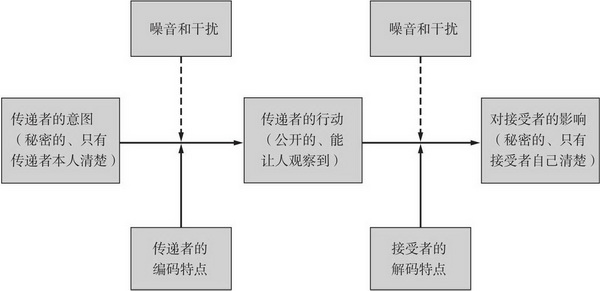
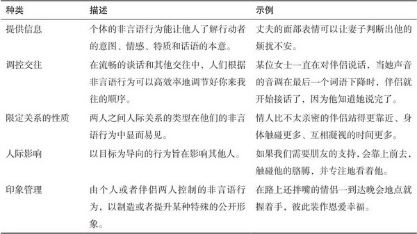
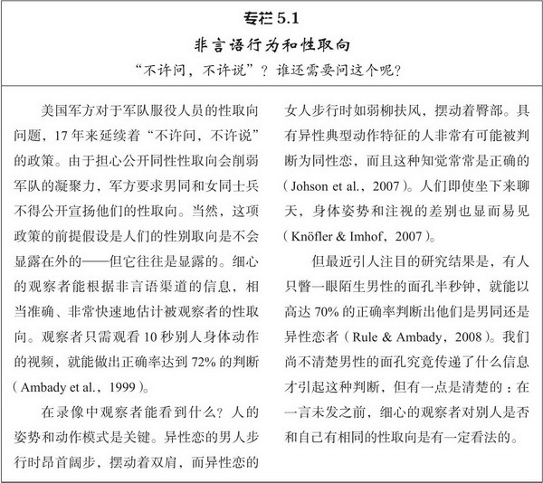
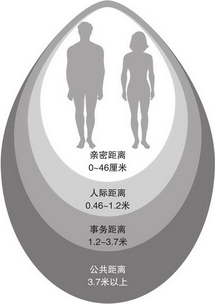
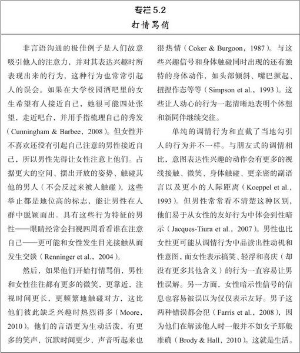
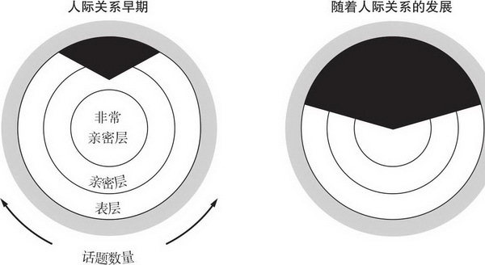
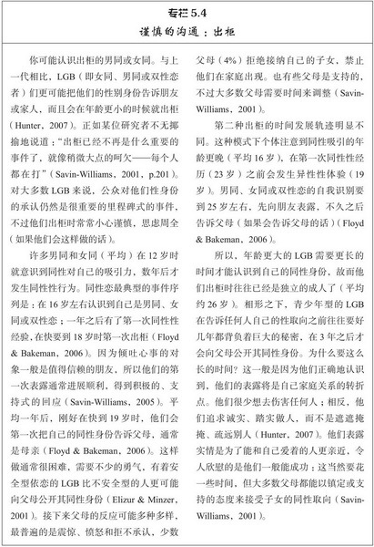
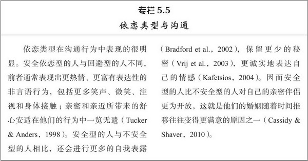
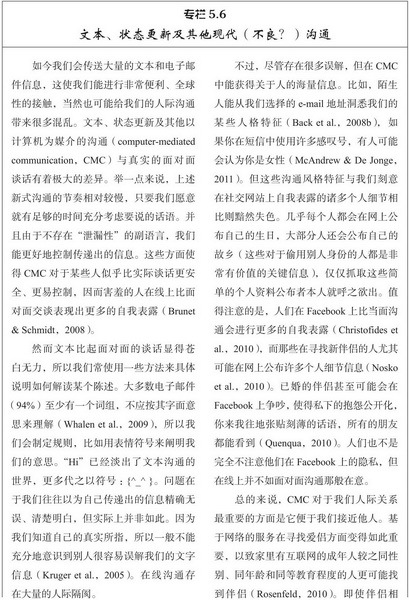

# 第5章 沟通

设想你和爱侣单独坐在舒适的房间里，讨论上次你们发生分歧的话题。你们的谈话非常有结构性，因为在你和伴侣说话之前，都会记录自己下一句话的快速评价。通过按压标有“非常消极、有点消极、中性、有点积极及非常积极”的五个按键，你能评价你说的话可能产生的影响。在你说完之后，你的伴侣会用同样的方法快速评定他/她对你发出的信息的知觉，然后再回答你。就这样你们轮流地一方说出自己的观点，然后反过来聆听伴侣的谈话，整个谈话过程得以持续进行。这种研究程序就是**谈话桌（talk table）技术**，研究者可以记录你内心的想法和公开的行为。这一技术引人注目之处是，如果你对自己的亲密关系不满意，谈话中你或许不会故意惹恼或鄙视你的伴侣，但无论如何你都很有可能引起这样的结果。在谈话的内容上，痛苦不满的夫妻与幸福美满的夫妻大体上没有什么不同，但夫妻相互不满时表达出的信息——即他们的伴侣认为自己听到的内容——却更加有批评指责和不尊重对方的意味（Gottman et al.，1976）。这一点有着深远的影响，因为在谈话桌边一个下午的谈话能预测伴侣双方在一起的幸福程度；不管起初伴侣双方彼此多么满意，沟通时产生沮丧结果的伴侣在结婚五年后都不怎么幸福（Markman，1981）。

图5.1　人际沟通的简单模型

在传递者想表达的信息和接受者认为自己获知的内容之间通常存在差别，即人际隔阂。

资料来源： Gottman et al.，1976.

沟通在亲密关系中极其重要，也比我们通常所认识到的要复杂得多。先来考察一下图5.1所示的简单沟通模型。沟通的起点是传递者的意图，即传递者希望表达的信息。问题在于传递者的意图是秘密的，只有传递者本人才知道。这些信息要传达给接受者，就必须编码成公开的、可观察到的言语或者非言语信息。**信息传递者的心情、社交技能和周围环境的噪音干扰等许多因素都会影响这一过程**。然后，接受者必须对传递者的行动进行解码，这里同样可能会发生干扰（Albright et al.，2004）。最终对接受者产生的影响，同样是私密性质的，只有接受者本人清楚。

问题的关键是，从信息传递者的意图到信息对接受者产生的影响，这中间会涉及多个环节，其中就有可能产生错误或误解（Puccinelli，2010）。我们常常认定自己发出的信息会产生我们所期望的作用，但我们却很少真正能确知它的效果。我们常常认识不到（Keysar & Henly，2002），**传递者的意图和对接受者产生的影响并不相同**，这就是我们所面临的**人际隔阂**（interpersonal gap）。事实上，**人际隔阂更可能出现在亲密关系之中，而非陌生人之间**（Savitsky et al.，2011）。**我们不会想到伴侣也会误解自己，故而不像与陌生人相处那样努力检查彼此是否达成共识**。

人际隔阂令人沮丧，不仅与亲密关系中的不满有关，而且会妨碍有奖赏价值的亲密关系的建立。假设有位害羞的大学男生找到了机会，向某位女同学表白自己的爱慕之意。课后闲聊时，他进行了一次胆怯而天真的试探——“这个周末你有什么安排？”——心里认为自己的示爱意图显而易见，希望得到对方热情的回应。很不幸，他可能认为自己的求爱目的对于心上人是再明显不过了，但实际上并非如此（Cameron & Vorauer，2008）。如果她没有注意到他对约会的暗示，做出了无动于衷、含糊其辞的反应，他或许认为自己清楚的表白和邀请（女生实际上并未接受到）遭到了对方明确的拒绝。心灵就会受到伤害，从此和该女生保持距离，而她或许永远不知道究竟发生过什么。

这种事情在实际生活中的确会发生（Vorauer et al.，2003）。不过希望这类情形不会出现在你的身上，所以我们现在就来学习本章的知识，帮助你消除人际隔阂。我们先来考察人际沟通中人们的非言语行为，然后探究人们的言语沟通。伴随着言语沟通进行的还有很多非言语动作，它们也承载着许多信息，无论你是否有意做出这些动作。

## 非言语沟通

设想你要参加一项研究，要戴着一顶受人敬重或令人讨厌的帽子在街上走来走去，购物、进餐或应聘。但你事先并不知道自己戴的是哪种帽子。那么通过观察他人对你的态度反应，你能推断出自己戴的是哪种帽子吗？或许可以（Hebl et al.，2002）。如果你戴着令人讨厌的帽子，女服务员或许不会像往日那般热情而愉快地招待你。商场上擦身而过的人会瞥你一眼，目光中满是鄙夷唾弃之色。即使没有人提及你的帽子，他们的行为足以明确无误地表明他们不喜欢见到你。实际上，因为你对别人的反应方式充满好奇和警觉，他们的情绪表现就再明白不过了。

在这种情境下，你可能注意到非言语行为所传达的大量信息，除了口头表达的话语和句法外，它几乎囊括了人们在人际交往中的所有行为。的确，非言语行为在我们的日常交往中起着重要作用，表5.1列出了非言语行为的五种功能，我们特别关注其中三种功能。

首先，非言语行为具有提供信息（providing information）的作用，提示着人们的情绪状态和所说话语的真实意图。比如你**在和人调侃时，你的面部表情和说话的音调、节奏是对方判断你是否具有敌意的唯一线索**。这一功能非常重要，所以在网络线上交流时我们会用到模仿人们面部表情的情感符号（emoticon），从而表达自己真实的意图。

非言语行为在调控交往（regulating interaction）方面也起着重要作用。**非言语行为表露出的兴趣，常常一开始就决定了人们的沟通能否进行下去**，之后人们还能根据微妙的非言语线索你来我往地进行谈话，从而整个沟通过程得以流畅而优雅地持续下去。

表5.1　非言语行为在人际关系中所起的功能

资料来源：Patterson，2011.

最后，非言语行为还能**表达亲密、传递权力和地位的信号**，从而能限定关系（define the relationship）的性质。关系亲密的人彼此之间与一般熟人之间的非言语行为并不一样，居于支配地位、社会地位高的人与下属的行为也不一样。即使双方一言未发，旁观的人也能分辨出谁喜欢谁，谁是老板。

这些功能是怎样实现的呢？答案涉及非言语沟通的各种不同成分，我们接下来一一考察。

### 非言语沟通的组成

非言语沟通具有巨大的影响力，表现形式之一就是它传递信息的渠道非常多，我们来看看以下六个方面。

#### 面部表情

面部表情表明了人们的情绪和情感状态，不管你到了哪里都能辨认出他人表情的含义（Matsumoto et al.，2009）。比如你在国外，不懂当地的语言，却能够看出别人是否高兴：如果高兴，他们脸颊上的肌肉会把嘴角往上牵动，眼皮也会皱起来。显然这种动作就是微笑，而快乐和其他几种情绪（哀伤、恐惧、愤怒、厌恶和惊奇）一样会引起独特的面部表情，每种面部表情所传达的情绪在全世界都是一样的。其他情绪（如尴尬）所涉及的面部系列动作和表情也是明白无误的（Keltner & Shiota，2003）。事实上，面部表情的这种普遍性表明它们是人类生而具有的天赋。人们在高兴时不用去学习微笑——他们生下来就会微笑。天生就失明的人也和我们有一样的面部表情（Matsumoto & Willingham，2009）。

面部表情蕴含的信息通常较为可信。你在自己Facebook个人主页上的照片是否有灿烂的笑容，还是显得像个牢骚满腹的愤青？**大学生在第一学年展示的笑容越灿烂，四年之后毕业时他们对自己的社会生活和学业生涯就越满意**（Seder & Oishi，2010）。大学生在大学年鉴里的笑容越阳光，他们毕业之后越不可能离婚（Hertenstein et al.，2009）。更令人惊叹的是，美国职业棒球大联盟选手1952年在团队照片里显示的笑容越饱满和真实，他们的寿命就越长（Abel & Kruger，2010）！快乐的表情显然与人生的成功有关，某方面来说，可以根据你遇到的每一个人来预测你的未来。辨别我们自己所处文化群体里个体的面部表情，比辨别世界其他文化里个体的表情好不了多少（Elfenbein & Ambady，2003）。不过，根据他人的面孔表情准确识别其情绪几乎是自动化的过程：美国大学生能在四分之三秒或者更短的时间内辨认出高兴、哀伤、厌恶和惊奇等表情（Tracy & Robins，2008）。

所以面部表情含义的普遍性使其包含非常丰富的信息——当然是在它们真实表现的情况下。遗憾的是，面部表情在非言语沟通中如此惹人注目，人们有时会刻意控制以掩饰自己真实的情感。有时，这样做是因为要遵守表现规则（display rules），**即在特定情境下为适合文化规范而展示面部表情**（Zaalberg et al.，2004）。我们至少可以采用四种方法来调节情绪的表达，以遵循这些表现规则。首先，我们可以增强表情，刻意夸大它们，好像我们体验到比实际感受更强烈的情感。如果打开礼物时你并不是很喜悦，但如果馈赠者在场，你会表现得非常高兴。其次，有时我们还会减弱表情，试图使情感显得没有实际上的那般强烈。因为我们的文化要求“男儿有泪不轻弹”，男人应该显得很坚毅，不太容易被悲剧电影打动。第三，我们会中和自己的表情，把所有感情掩盖起来。扑克牌高手就是这样喜怒不形于色，谁也猜不透他手里的牌。最后，我们可以伪装自己真实的情感，代之以完全不同的外显情绪。当另一名选手赢得了选美比赛冠军，走在最前面的亚军仍显得十分兴奋，那么几乎可以肯定她在掩饰自己真实的情感。

不过，即使人们试图控制自己的表情，仍然会泄露真实的情绪。首先，伪装的表情往往和真实的表情有着细微的差别。比如要假装开心微笑，很容易往上拉动嘴角，但真假微笑在时间进程和细微动作上仍有微妙的差别；因而在细心的观察者眼里，真实微笑和伪装微笑的区别洞若观火（Ambadar et al.，2009）。其次，尽管我们努力控制，但真实情绪的自然闪现，即微表情（microexpressions）在短暂的失控后显露无遗。即使你想有意识地努力控制自己的表情，如果你突然看到一张断肢照片也会惊慌失措地流露出害怕的表情（Porter & ten Brinke，2008）！

#### 注视行为

显然，面部表情能提供伴侣情感方面有价值的信息。不过个体观看行为的指向和时长即注视（gazing）也很重要（Wirth　et al，2010）。比如，**仅仅看着别人就表达出自己对其有兴趣**，而表情友好的人如果能吸引我们的视线并继续看着我们，则比看我们一眼后马上转移视线显得更讨人喜欢和有吸引力（Mason et al.，2005）。如果在单身酒吧发现有人盯着你瞧，而你不想和他/她交谈，那么就应该看向别处，而不是与之对视。

根据注视行为还能确定沟通双方的关系属于哪一种类型。恋人比朋友会更多地相互注视，而朋友比一般熟人也会更多地相互注视（Kleinke，1986）。而且，如果陌生人在交往时更多地注视彼此的眼睛，比在一起时眼睛张望别处更加喜欢彼此（Kellerman et al.，1989）。**沟通双方更多的注视行为，不仅能表露单纯的兴趣，而且能传递关爱之情**。

注视还能传递社会地位的信息。**在日常交往中，人们在交谈中倾听的时候更多地看对方（平均有60%的时间注视讲话者），讲话时更少地看对方（约40%的时间看向倾听者）**。然而，**有权力、地位高的人的表现却不一样——与一般人相比，他们讲话时看对方更多，而倾听时看对方更少**（Koch et al.，2010）。研究者通过比较“注视-讲话”（讲话者注视对方的时间）和“注视-倾听” （倾听者注视对方的时间）即视觉支配性比率（visual dominance ration，VDR）来总结这一模式。位高权重者的注视模式刚好把普通人的40/60比率掉了过来，成为60/40的VDR（Ellyson et al.，1992）。居于支配地位的人在交往中会坚持，“我跟你说话时要看着我！”，但通常不会反过来也给予对方同样多的视觉注意。

#### 身体动作

目前我们只谈到了颈部以上的非言语沟通，不过身体的其他部位也有沟通作用。我们进行言语沟通时常伴有身体动作，并得到其支持，从而使我们更容易传递信息——试试不用双手比划，描述一下你所捕之鱼的大小（Holler et al.，2009）——不过身体动作有时能完全代替口语，只要身体姿势的含义大家都能理解。（且不论其含义是好是坏，很能说明问题的例子是，把中指竖起来。这个手势指向的人肯定知道它的意思。）姿势的含义与面部表情不同，在不同的文化之间可能差别很大（Pease & Pease，2006）。例如用食指接触拇指，而其他手指伸直的手势在美国表示“行”或“好”。然而在法国则表示“零”，在日本表示“钱”，在中东则是猥亵的侮辱（就像美国人竖起中指一样）。面部表情的含义无需解释，但手势语却并非如此。

身体的姿势或动作传达的信息虽不太明确，却仍很有用（Hugill et al.，2010）。例如观看短暂的（10秒）无声教学录像，观察者就能预测大学生对教授教学的评价结果（Ambady & Rosenthal，1993）。更引人注目的是，**根据身体的姿势和动作还能（比几率水平）更好地判断陌生人的性取向**（见专栏5.1）。陌生人只要观察30秒就能相当准确地判断出我们的人格特质（Yeagley et al.，2007）。**身体语言能有效传递信息的原因之一是它比面部表情更难以控制**；它更具“泄露性”，也就是说即使我们企图加以掩饰，它仍可能暴露我们真实的感受（Babad et al.，1989）。美国海关的检查员就是利用旅客不安或焦虑的身体信号，而不是面部表情，来检查其箱包是否携带走私物品（Kraut & Poe，1980）。

身体姿势还能显示人的地位高低。地位高的人常表现出开放的、不对称的姿势，身体的左右两侧摆出不同的姿势（Carney et al.，2010）。他们占据的空间更大。相形之下，地位低的人常表现出封闭、对称的姿势，相对狭小。如果强势的老板和下属面对面地坐在一起谈话，只要观察一下你一般就能分出他们的身份（Bente et al.，2010）。

#### 身体接触

与他人的身体接触也有着丰富的含义。在很多文化中，人们首次相遇会彼此握手。众所周知，对方与你握手的力量、气势、时间和部位都传递着重要的信息。握手行为和一些人格特质有关；**握手时满握、有力和持续时间长的人与软弱无力的握手者相比，往往更加外向和开放，神经质较低**。**握手有力的女性往往更随和**（Chaplin et al.，2000）。

所以，从人们相遇那刻起身体接触就可能传递着信息。之后，不同的身体接触传递着截然不同的含义。喜爱（会使你轻触对方的手臂）和同情（会使你会轻拍对方）等支持式的积极情感引起的身体接触，和表达厌恶（推开对方）或者愤怒（击打对方）的身体接触迥然不同。身体接触显露的情绪往往非常明确，触碰动作的接受方和旁观的观察者都能分辨出当前的情感状态（Hertenstein et al.，2009）。

当两人的关系变得更加亲密时，彼此身体的接触也往往会增多（Emmers & Dindia，1995），这是好事。**充满爱意的身体接触实际上有益于我们的健康**：经常与伴侣接吻能降低你的胆固醇（Floyd et al.，2009），一周进行3次30分钟的头部和颈部按摩可以降低你的血压和应激荷尔蒙的分泌（Holt-Lunstad et al.，2008）。身体接触显然能传递亲密和关爱，同时具有保健功效。

#### 人际距离

使得身体接触如此重要的一个方面是，人们必须离得很近才能发生身体接触。这表明交往双方一般要位于人际距离（隔开两人身体的实际空间）的范围之内，也即私人交往中保持的空间。人际距离的亲密区（intimate zone）从我们的前胸向外延伸至46厘米处（Hall，1966）。（见图5.2。）如果两人面对面如此接近地站立着，他们之间的关系只有两种可能，非常亲密或十分仇视。人际交往更多是在较远的距离进行的，人际区（personal zone）距离我们身体46厘米到1.2米之间。在人际区，朋友之间可能在较近的距离内交往，而一般的熟人则离得较远，所以根据人们交往时的距离可以确定他们之间关系如何。再远一些就是约1.2米到3.7米的事务区（social zone），在这一人际距离里的交往更倾向于事务化。如果你面向面试官或者教授隔桌而坐，你就处在事务区，这样的距离是合适的。但如果相隔1.5米与好友私下交谈就显得很怪异。超过3.7米就是公共区（public zone）了，这种距离的交往往往非常正式，主要适用于结构式的交往，如课堂上师生的互动。

这里给出的人际距离数据是北美人际交往的模式，上述人际距离通常比世界其他地区要大一些（Pease & Pease，2006）。**法国、拉丁美洲和阿拉伯地区偏好较小的距离**。个体的性别和地位也会影响到人际距离的大小（Holland et al.，2004）。男性往往比女性保持的人际距离稍大，人们与社会地位高于自己的人保持的距离，通常比与权力和声望较低的人所保持的距离更远。无论人的偏好怎样，**人际距离都是测定人际交往亲密程度的巧妙手段，甚至能用来间接衡量人际关系的质量**：不幸福的配偶比满意的配偶保持的人际距离更大（Crane et al.，1987）。

图5.2　人际距离区域图

不同类型的社会交往对应着四种不同的空间区域。

#### 副语言

非言语沟通最后的组成部分不像其他部分那样寂静无声。副语言（paralanguage）指除了言语过程中的词语之外，个体发出的各种声音特征，如节奏、音调、音量和速度，比如说话时气喘、嗓子沙哑或者尖溜、哧哧笑、整句话带鼻音、某个字音拉得很长、结结巴巴说话不连贯等等。此外，诸如喊、叫、哭、笑、叹气、咳嗽、沉默等也可以视为副语言现象。故而，**副语言与人们说话的内容无涉，而与说话的方式有关**。副语言的典型例子是我们发出的声音（根本不需要使用词语）特征，足以告诉他人我们心中的感受。如果你想仅以短暂的声音向人表示你受到惊吓、愤怒或悲伤，你能做到吗？宽慰、愉悦或敬畏又该如何表示？研究参与者的确能不使用任何词语就能有效地向倾听者表达诸如此类的情绪（Simon-Thomas et al.，2009）。

根据副语言还可以确定人际关系的性质，因为情人之间和朋友之间彼此谈话的节奏并不一样。**情人之间延迟应答的时间更长，谈话间经常有沉默，总体上说得更少**（Guerrero，1997）。即使面对陌生人，人们面对俊美的人和容貌平庸的人说话方式也不一样；**男女两性在给俊美而非平庸的异性留下声音短信时都会使用更低频的声音**，而且这样做他们感觉更愉悦（Hughes et al.，2010）。副语言是否有助于判断恋爱关系的开始？

**某些嗓音往往很诱人，有着魅力嗓音的人往往也有着吸引人的面孔和身材**（Saxton et al.，2009）。与一般人相比，他们与人发生性关系时的年龄更小，次数也更多（Hughes et al.，2004）。更令人咂舌的是，如果你倾听女性在月经周期不同时间录制的磁带，内容只是从1数到10，你会发现女性在排卵前几天的声音听起来更吸引人（Pipitone & Gallup，2008）。这可能是因为女性荷尔蒙的变化对其咽喉声带造成的影响，如果服用避孕药就没有这种效应，这就是非言语渠道巧妙传递重要人际信息的极佳示例。

#### 各部分的结合

我们已经介绍了非言语沟通的各个部分，它们看起来好像是各自独立、分离的信息源。在某种意义上来说，它们的确是这样：每个部分对人际交往都有着自己独特的影响（Rashotte，2002）。不过，它们通常会彼此强化，共同作用以传递个体连贯一致的情感和意图。如果你面对面地和人交流，非言语的所有部分都在起作用，把所有这些信息结合起来你就能知道人们行为的真正意图。比如我们讽刺别人时，往往会指桑骂槐：**真实的意图并不会表现在我们的话语中，而是表现在动作和副语言上**。大部分时间，非言语行为和话语传递着相同的信息，这种情况下我们对人的喜好会增加。但如果人们的话语和动作之间存在不一致，言语背后的真实意图往往表现在非言语沟通当中，而不是言语沟通中（Vrij，2006）。

> 那如果是使用文字来反讽，而不能使用动作，神态，副语言等，那怎么传递真实信息呢？

如果交谈的双方采取了类似的姿势和风格、表现出类似的表情、使用类似的副语言，就出现了**无意识的行为模仿**（mimicry），这可能涉及非言语的所有部分。如果人们的交往轻松愉快，往往会自动地使他们的非言语行为保持同步，根本无需思考；如果一方用手抓了下自己的鼻子，另一方也很可能会这么做。一旦出现这种情形，交谈往往非常流畅顺利，更重要的是交谈双方更倾向于喜欢彼此，即使他们并没有注意到相互之间的模仿（Chartrand & van Baaren，2009）。的确，如果他人具有和我们相似的非言语行为似乎有奖赏意义。一个实验演示了这一效应，研究者通过机械设备记录了参与者握手的物理特征；然后参与者要和其他“人”握手，当然有时会用机械手代替人的手。有些参与者是与模拟自己握手姿势的机械手握手，而不是与陌生人真实握手。结果发现人们喜欢自己的握手甚于其他人的握手（Bailenson& Yee，2007）。另一项研究中，参与者要观看IVE[^ 1] 场景中虚拟人物的说服性的辩论，其非言语动作要么采用录下来的某个真人的动作，要么单纯模仿参与者4秒钟之后的动作。参与者并没有意识到模仿，但如果虚拟人物重复参与者的动作，则比表现另一人的真实动作得到参与者更积极的评价，参与者也更易被它的辩论所说服（Bailenson & Yee，2005）。（这是高科技的广告宣传的未来吗？）如果发生了非言语的模仿，显然我们会感到高兴而舒心，而与一点也不模仿我们的人互动则会非常紧张（Kouzakova et al.，2010）。

非言语行为的这些不同方面也能让我们对交往的亲密程度进行精细调整，从而确定令人舒适自在的亲近水平（Patterson，2011）。设想你与一位熟人同坐在一张双人沙发上，这时你们的谈话发生了重大转折，此人开始谈到亲密的私人问题。如果这种发展令你不自在（或许你不想听到这么多），你可以通过非言语的“退避”来调整交往亲密程度。你可以转向一边、往后靠使两人之间保持更大的人际间距。你可以转移注视的目光。你也可以借助不太活跃的副语言和不太愉悦的面部表情来表明你的不舒适，所有这些都用不着说一句话（Andersen et al.，2006）。非言语沟通在交往中发挥着重要的作用，也是社会生活中既实用又巧妙的技能。

### 非言语的敏感性

根据以上种种，你可能会预期配偶们在娴熟运用非言语沟通方面具有得天独厚的优势，你的看法是对的。**伴侣们运用非言语沟通的敏感性和准确度能预测他们亲密关系的幸福程度**。非言语沟通不良的夫妻往往对婚姻不太满意。而且如果出现这类问题，**一般都是丈夫的过错**（Noller，2006）。

什么？研究者是如何得出这样的结论的？如果非言语交流失败了，可能是编码或解码出错（Puccinelli，2010）：信息的传递者可能发出了让人难以解读的混淆信息（即编码不良），或者接受者没能正确解释人人易懂的信息（即解码不良）。女性往往在这两方面都有优势，因为如果不存在欺骗，女性一般比男性更像个娴熟的编码高手、精明的解码高手（Brody & Hall，2010）。（两性在觉察欺骗的能力上却没有差异，在第10章会详述。）因而，“女人的直觉”这一传统的刻板印象实际上是有事实根据的；女性比男性会更细心地运用微妙却真实的非言语线索来辨明实际情况。难道女性拥有更好的非言语沟通的技能，抑或她们只是更加努力罢了？问得好，我们稍后回答这个问题。

研究者请夫妻一方发出特定的非言语信息，由另一方来解码，从而评价夫妻双方编码和解码的质量。这些信息都是有着多种含义的陈述，具体意思取决于非言语的编码方式。比如短句“我冷，你呢？”可以是充满温情的邀请（“过来拥抱我，你这个小可爱”），也可以是蔑视的抱怨（“把暖气打开，你这个小气鬼！”）。在非言语敏感性的研究中，分派配偶一方表达某种意思，并录下他/她传递信息的非言语动作。然后让中立的陌生人观看录像，如果他们弄不明白配偶一方表达的内容，那么该配偶的编码就认定为有缺陷。另一方面，如果他们能解读信息，而配偶另一方不能，则该配偶的解码能力不言而喻。

诺勒（Noller，1980）首先对这类问题进行了精巧的研究，发现与婚姻幸福的丈夫相比，不幸福的丈夫传递了更多混淆的信息，也发生了更多的解码错误。在妻子们中间却没有这种差别，所以诺勒在痛苦的婚姻中观察到的沟通不良现象似乎都是丈夫的过错。处在婚姻困境中的丈夫，竟然会误解妻子传递出的连陌生人都能清晰解读的信息。更糟糕的是，他们对自己的错误竟然一无所知，还认为自己在和妻子的沟通中做得很到位，自信地以为夫妻之间彼此是相互理解的（Noller & Venardos，1986）。男性在沟通方面做得很差却不自知，这似乎就是他们难辞其咎的原因。

另一方面，公平地说，婚姻中非言语方面的沟通不良（miscommunication）并不全部是丈夫的过错。诺勒（Noller，1981）在另一项研究中比较了配偶在解读伴侣和解读陌生人信息方面的情况。结果发现，在不幸福的婚姻中，夫妻双方都能更好地理解陌生人，却不能很好地理解彼此。显然苦闷的夫妻尽管有能力和其他人进行非言语交流，但彼此之间却存在沟通不良。

这就是问题的关键，既然你已经对人际关系科学有所了解，你可能已经认识到非言语的沟通不良和亲密关系不满意之间的相关存在多种可能的解释。一方面，伴侣的非言语沟通技能可能决定他们关系的满意程度；技能差会导致关系差，而技能好则会提升愉快的伴侣关系。另一方面，伴侣的关系满意度可能决定他们在沟通中努力的程度；关系差会引起沟通不良，而关系好则会促进良性沟通。

实际上，上面两种主张都是正确的。配偶非言语信息的不敏感使伴侣一方的奖赏价值更低，否则他/她的奖赏价值会变得更高（Koerner & Fitzpatrick，2002）。而不管何种原因，**只要伴侣变得不满意，他们就倾向于不理会彼此，这使得他们的沟通更显笨拙**（Noller，2006）。就是这样，**非言语的敏感性不足和关系的不满意形成了恶性循环，每一方都加剧了另一方**。

无论如何，人们的沟通问题都可能因缺乏技能或沟通中表现太差引起，这种区分很重要。有些人只是不太有非言语沟通的才能，他们的缺陷令人恼火（还有些令人恐惧）。比如殴打妻子的男人较温和的男人更难理解妻子的感受（Marshall & Holtzworth-Munroe，2010）。虐待孩子的母亲难以识别婴儿痛苦的信号，甚至婴儿受惊或不悦时也懵懂不知（Kropp & Haynes，1987）。于是，**技能缺陷可能造成了人们的盲点，使他们不太可能认识到自己的行为给他人带来的伤害有多深**。

> 因此，我一直倾向于认为：共情能力过差的人往往会给他人带来苦难

那么，为什么女性在非言语沟通上的表现比男性更好？技能和动机似乎都有其作用：平均而言，女性拥有更好的非言语才能，也更致力于沟通任务（Ciarrochi et al.，2005）。如果激励男性更密切地注意和正确地判断别人，他们的成绩会改善，但还是不如女性做得好（Hall & Mast，2008），看来女性天生就比男性能更快速、更准确地判断他人的情感（Hampson et al.，2006）。考虑到非言语沟通不良的不利影响，男性的不良表现就是烦人之事。**这里有个小点子：请看别人的眼睛**。女性比男性花更多时间看别人的眼睛，这似乎是她们能更准确地解读他人表情的一个原因（Hall et al.，2010）。正如这个点子所示，培训和练习能促进个体的技能（Blanch-Hartigan et al.，2011）。令人欣慰的是，如果男女两性都仔细看、耐心听、用心思索，他们在非言语沟通上都能做得更好，并且我们通常能更娴熟地解读亲密伴侣的非言语线索，而不是熟人或陌生人的非言语线索（Zhang & Parmley，2011）。令人不安的是，如果伴侣一方对非言语行为漫不经心，就可能比那些更专注的配偶产生更多误解，幸福感和满意度都更低（Noller，2006）。

## 言语沟通

如果非言语沟通这么重要，我们说出的话语又如何呢？当然，它们可能更加重要（Greene & Burleson，2003）。言语交流是亲密关系非常重要的一部分，一开始就与亲密关系发展密不可分（Derlega et al.，2008）。

### 自我表露

设想你要参加一个心理实验，你会遇见一位陌生人，你的任务是逐渐地向此人透露越来越多的关于自己的个人信息。比如描述你与母亲之间的关系，曾经的尴尬时刻或者深深的遗憾。陌生人也这样做。45分钟后，你们彼此有了许多个人细节的了解。会发生什么结果？相比于同样的时间内你们只进行浅谈，你会更喜欢这个陌生人吗？在大多数情况下，答案当然是肯定的。这样的实验常常会让参与者产生直接的亲密感。即使他们只是听从研究者的指示，彼此敞开心扉，也比信息透露更少的两个人更喜欢对方（Slatcher，2010）。

**向他人透露个人信息的过程就是自我表露（self-disclosure），它是亲密程度的指标之一：如果两个人彼此之间不共同拥有一些相对秘密的私人信息，他们的关系就称不上亲密**（Laurenceau et al.，2004）。

#### 自我表露的发展过程

当然，在实际生活中，有意义的自我表露所需要的时间远不止45分钟。大多数人际关系是以肤浅的信息交流（即“浅谈”）为起点的，然后再逐渐地转到更有意义的披露。人际关系的这种运行方式就是**社会渗透理论**（social penetration theory）研究的主题。社会渗透理论认为人际关系通过人际沟通的系统性变化而得以发展（Altman & Taylor，1973）。初次相识的人或许只会随意地讨论一些不带个人色彩的话题：“你是哪儿的人？”“你的专业是什么？”不过如果这类肤浅的问题有奖赏价值，人们可能通过拓展沟通的范围来进一步接近，沟通范围的拓展体现在以下两方面：

1.　沟通的广度：所讨论话题的多样性，

2.　沟通的深度：所讨论话题对于双方的个人**意义**。

根据这一理论，如果用图形来表示结交某个人的全部过程，人际关系刚建立时，自我表露可能是个又窄（讨论的只是少数几个不同的话题）又浅（透露的只是不带个人色彩的信息）的楔形（见图5.3）。然而随着人际关系的发展，这个楔形变得更宽（讨论更多的话题）更深（透露更多有着私人意义的话题）。

图5.3　奥尔特曼和泰勒的社会渗透楔形变化图

**如果个体的信息存在多个层级，那么随着人际关系的发展，自我表露在广度和深度上都会增加**。

人际关系的发展大体上就是这样（Derlega et al.，2008）。此外，与熟人早期交往的自我表露通常会表现出明显的相互作用（reciprocity）。**新伙伴们倾向于匹配彼此的开放程度**，如果对方表露多自己也表露多，如果对方的自我表露减少自己也表露更少。人们透露自己信息的程度，则往往取决于不同的对象，在不同的人际关系间也有很大的变化（Dindia，2002）。这往往也是个渐进的过程，新伙伴们通常分阶段地转到更深层次的话题，而不是一步到位。**一次说太多、太快是危险的；因为这样会突破别人的期望，常常会给人留下糟糕的印象**（Buck & Plant，2011）。**最好的策略通常是保持耐心**，让可以感觉到的相互作用逐渐地增加你们交往的亲密感。

然而**人际亲密过程模型**（interpersonal process model of intimacy）认为只有满足某些条件，两人之间真正的亲密感才有可能建立（Reis & Shaver，1998）。当我们对他人敞开心扉，我们希望自己的表露能引起他人明显的兴趣、同情和尊重。也就是说，我们希望他人表现出应答性（responsiveness），以证明他们理解和关心我们。如果他们应答适当，就能建立互信，表露会加深，亲密感也会增加；反之如果他们看来漠不关心或心不在焉，我们就会向后退缩，表露就会减少。故而，两个人要变得亲近，必须满足三个条件。首先，他们必须进行**有意义的自我表露。开诚布公一般有益于人际关系**（Brunell et al.，2010）。其次，他们必须对彼此的个人信息有**兴趣和同理心**，在异性恋的关系中如果男性能做到这一点尤其有价值（Mitchell et al.，2008）。最后一点很重要，双方必须都**认识到另一方具有应答性**。判断出自己的伴侣理解和关爱自己（即所谓的感知到的伴侣应答性），这是亲密关系发展过程的关键要素（Laurenceau et al.，2005）。如果我们认为伴侣不关爱、不理解、不尊重自己，就不会把自己的秘密告诉他们。

> 我的分数是36分，我自认为我的倾听能力是不错的。

#### 秘密和禁忌话题

即使人际关系变得非常亲密，人们也可能保留一些只属于自己的秘密。社会渗透几乎达不到所有方面，也不应该这样，因为即便是情侣也希望保留一些自己的隐私，也有必要这样做（Petronio & Durham，2008）。长期来看，没有任何关系能够维持全部的开放和坦诚（Derlega et al.，2008），即使**尝试这样做都是错误的**：**亲密的自我表露和选择性地保留一些秘密都能促成婚姻的美满**（Finkenauer，Kubacka et al.，2009）。即使是在非常亲密的人际关系中，保留一些隐私还是可取的。（由此我想起《大都会》杂志的封面文章，它问了这样一个问题，如果你有婚外恋，“你会告诉你的伴侣吗？”经过大量讨论后，得出的答案是“可能不会”。）

当然，要保守秘密并不总是那么轻松，特别是在亲密关系中。要成功地保守秘密往往需要努力（Uysal et al.，2010），也有一定的风险：**如果人们得知自己的伴侣隐瞒了某些事情，关系会受损**（Finkenauer, Kerkhof et al.，2009）。为什么还要不厌其烦地保守秘密？有几个可能的理由。如果人们有意地对他人保留信息，“人们一般是渴望保护自己，保护他们的亲密关系，或者保护其他人”（ Afifiet al.，2007，p.79）。真的非常明显：如果人们认为保守秘密弊多利少，他们常常过不了多久就会把秘密透露给其他人了（Caughlin et al.，2005）。另一方面，如果人们担心自己或者其他人会受到伤害，觉得没有必要透露事实真相，他们就会努力地永远隐瞒（Afifi et al.，2005）。

伴侣双方还有一些完全不想讨论的重要话题（Afifi，2010）。无论是明说还是暗示，伴侣们都会有意避开禁忌话题（taboo topics），在伴侣看来，敏感的问题会危及亲密关系的质量。令人奇怪的是，**最常见的禁忌话题是亲密关系本身的状态**；在一项调查中，68%的应答者承认，最好不要提及他们爱情关系的现状及未来（Baxter& Wilmot，1985）。其他常见禁忌包括与其他伴侣的关系状况，31%的受访者避开了此问题，25%的人避开了过去的亲密关系。受访者通常还会避谈过去的性经历（Anderson et al.，2010）。人们经常对自己恋爱关系的未来非常感兴趣，也迫切想知道伴侣的期望和意图，但他们不会明问。相反，**他们会对恋人的承诺和投入程度进行秘密测试**（Baxter & Wilmot，1984）。他们会仔细观察恋人对有吸引力的异性反应怎样（即“三角测试”）；他们煞费苦心地制造困难让恋人来克服，以验证恋人对感情的忠贞（即“耐力测试”）；他们还会找到暂时分开的理由来考察恋人欢迎自己回来时的热忱（即“分离测试”）。这一切好像是自寻烦恼，他们只要直接询问伴侣就能得到这些问题的答案——他们的确常常请教伴侣的朋友——但是在很多伴侣之间，这些内容过于微妙不好公开谈论。的确，这样做往往给伴侣们带来切实的紧张（Loving et al.，2009）。总的说来，**亲密关系中禁忌话题越多，伴侣间的满意度就越低**，除非他们认为避开敏感话题能改善和保护他们的亲密关系（Dillow et al.，2009）。**因为怯懦或能力不足而逃避讨论**，会降低伴侣的满意度，但有礼貌地一起努力维持伴侣关系很少有什么不好的影响。

#### 自我表露和亲密关系的满足

归根结底，与沟通情境相符合的自我表露能在亲密关系中孕育喜爱和满意。比如**恋人彼此的自我表露越多，他们就感到越幸福**（Sprecher & Hendrick，2004）。的确，幸福的爱人就连谈话方式也与不太亲密的伴侣不同。他们可能有着双方都能明了的独特暗语和比喻用语，这样他们之间的沟通别人是听不懂的。他们会用到口头禅、特定的词汇或惯用语（idioms），只有他们自己才明白其中的含义，**他们使用的惯用语越多，就越幸福美满**（Dunleavy & Booth-Butterfield，2009）。这样的人际交往与众不同，在研究中倾听伴侣谈话的陌生人都能分辨出谈话人是好友还是只是熟人（Planalp & Benson，1992）。与一般伙伴的谈话相比，亲密伴侣之间的谈话显著特点是：清楚地了解对方，表现出更多的自我表露，令人更加放松。

自我表露与喜爱相关的原因很多（Collins & Miller，1994）。首先，我们倾向于向自己喜欢的人透露更多的个人信息。如果别人吸引了我们，我们往往会对他们更加开放。不过，我们也可能因为对他人进行了自我表露，从而倾向于喜欢他们。如果其他条件相同，对他人越开放，我们就越喜欢他们。最后，也可能是最重要的一点，别人信任我们而对我们进行自我表露，具有奖赏意义。亲密表露多的人比那些对自己的信息保留的人更招人喜爱（Sprecher et al.，2011）。所以，**得到和给予自我表露都让人感觉良好**，并且这方面的言语沟通是构筑亲密关系必不可少的基础。你可以试着这样做45分钟，可能就会交到一个新朋友（Slatcher，2010）。

> 在选择自我表露的对象时需要谨慎——

最终，自我表露不仅有益于我们的人际关系，而且有利于身心健康。与那些只是肤浅地闲聊的人相比，**能触及人性的深入交谈和彼此敞开心扉的人更加健康**（Sloan，2010），对生活也更为满意（Mehl et al.，2010）。**有一种自我表露你绝对应该积极地勤加练习：告诉你爱的人你爱他**。你诚实表达的钟爱、关心、温情和呵护对于想亲近你的人都是巨大的奖赏（Floyd & Pauley，2011），**心中光有爱还不行，你还必须清楚明白地传达出来**（Horan & Booth-Butterfield，2010）。本段真正的要点是：充满深情的沟通不仅能让你的伴侣得到肯定与愉悦；显然还对你有益。在实验室研究中，随机分配参与者写情书，向伴侣表达他们的爱意，结果发现他们应对压力的神经内分泌反应得到了改善（Floyd et al.，2007b），而且后续阶段胆固醇水平、心率和血压都下降了（Floyd et al.，2007a）。请说出你对伴侣的爱，这对你们双方都有益。[^ 2]

### 言语沟通中的性别差异

将男性和女性描绘成来自不同的星球、说着不同语言的不同物种，这类书大赚其钱。而我在本书始终反对这种简单的思维模式，因为两性相像的程度远大于差异程度。不过，男性和女性在相互交往时，他们的非言语沟通风格的性别差异会影响彼此的交往，在言语沟通中两性也存在一些差异。男性和女性并非说着不同的语言，只不过有时谈论的事情不一样罢了。

#### 谈话主题

如果看一下两个朋友之间的谈话记录，你能否分辨出他们的性别？很有可能。**女性之间的谈话比男性更可能讨论她们亲密关系中的情感问题，以及生活中的其他私人问题**。在女性的谈话和即时通讯中，经常出现的是情感和人物话题（Fox et al.，2007）。相形之下，男性倾向于谈论更客观、不带个人色彩的内容，比如物品和活动，聊些名人和政治人物而非朋友，找些乐子而非支持和忠告（McHugh & Hambaugh，2010）。因此，与女性之间的谈话不同，男性彼此倾向于不太亲密和不带私人色彩的话题（Reis，1998）。

不过，男性和女性彼此互动时，这些差异并不如你认为的那般明显。当年轻人在网上用文字与陌生人聊天时，如果研究者不告诉他们对方的性别，他们一般难以判断对方的性别。区分两性谈话的所谓标准远没有出现，所以通常并没有判断谈话对象性别的方法（Williams & Mendelsohn，2008）。男性和女性话语中的差异显然相当微小。[^ 3]

#### 谈话风格

女性说话有时不如男性那般强硬，她们更为间接，表面上不太确定（Mulac，2006）。她们会使用模棱两可的话来缓和主张，询问而不是直截了当地提要求，正如这个讽刺的例子一样：“女人是某种较男人更具试探性的动物，不是吗？”（Palomares，2009，p.539）。然而事实证明，只有在与男性谈论男性话题时她们才更具试探性。而且，当男性与女性谈论女性话题时他们比女性更具试探性。当男女两性在另一方的主场时言谈都不太强势，而男女彼此讨论中性话题时则不存在谈话风格差异（Palomares，2009）。不过，女性较少爆粗口（McHugh & Hambaugh，2010）。

陈腐的刻板印象认为女性比男性更健谈，但事实并非如此。对大学生交往的便携式录音研究表明，女生平均一天要说16 215个单词，而男生则说15 559个单词。这种差异微不足道（Mehl et al.，2007）。更醒目的是，**男性不如女性那样经常畅所欲言、抒发观点，但一旦男性开谈，就滔滔不绝，容不得别人打断**（Leaper & Ayres，2007）。女性虽然说话较多，但很少做长篇独白式讲演。

所以男女两性的言谈并不存在巨大的整体差异，尽管某些刻板印象不这么认为。不过，人们在语用上存在有意义的个体差异，我们使用的词语蕴含的信息如此丰富，以至于陌生人无意中听到我们几分钟的谈话就能留下精确的印象（Holleran et al.，2009）。人格特质也表现在我们使用的词语中。比如，仔细分析了近700名博客使用者的文章后发现，高神经质的人比乐观的人更多地使用“可怕”、“糟糕”、“恐怖”和“烦人”这类词语。“喝酒”和“跳舞”表示性格外向，而“拜访”、“一起”、“拥抱”和其他这类友好的词则与宜人性有关（Yarkoni，2010）。[^ 4]我们使用的词语的确向他人泄露了我们的信息，值得注意的是，快速约会上的两个人如果使用语言的方式一样，则彼此更可能相互吸引（Ireland et al.，2011）。

#### 自我表露

至此我们还没有发现男女两性的言语沟通存在巨大的差异。但这里有个差异很重要：在已确立的人际关系中，女性比男性表现出更多的自我表露，并且与她们在“开启者”量表（见专栏5.3）上的高分相一致，她们也能引导对方进行更多的自我表露（Dindia，2002）。的确，男性对女性伙伴进行的亲密自我表露一般多于对同性伙伴（如最要好的朋友）的表露——结果是有女人参与的人际交往通常比只有男性参与的交往更加亲密、更有意义（Reis，1998）。男性对女性较为开放，女性彼此之间也较为开放，但男性不怎么对其他男性进行自我表露。

这一切造成的重要后果是，**男性常常依赖于从女性那里得到温情和亲密，反过来女性却较少依赖于男性**（Wheeler et al.，1983）：女性可能与男女两性伙伴都有着亲密的、开放的和支持性的联系，而男性则可能只与女性共享最有意义的亲密情感。因而，男性一生中或许需要与女人交往来避免孤独，但在这方面女性通常并不需要男性。

#### 工具性对表达性

然而更为重要的是，**自我表露上的两性差异是性认同差异，这种差异更多地与性别角色而不是生理性别有关**。女性之所以能与信赖的伴侣进行亲密的言语沟通，是因为她们往往有更高的表达性，[^ 5]可以轻松自在地谈论自己的情感。具有高表达性的男性自然也能这样，正如双性化的男性就能像女性一样容易和两性都建立有意义、亲密的交往（Aubé et al.，1995）。所以有必要精确阐述一下上述观点，实际上只有传统的大男子主义的男性才会与最要好的朋友也只维持着表层肤浅的沟通，故而需要与女性建立亲密关系以避免孤独。**大男子主义的男性也常把男性朋友拒之于千里之外**（Shaffer et al.，1996），**如果没有保持浪漫爱情关系的女性情侣，就往往会感到痛苦和孤独**（Wheeler et al.，1983）。与此相反，双性化的男性（既自信果断又热情外向）能很轻松地向男性和女性进行自我表露，从而体验到与所有朋友交往的乐趣；结果他们不会感到孤独，与表达性低、传统型的男人相比，他们会花费更多的时间与女性交往（Reis，1986）。

> 因此，我无法与大男子主义的男性建立亲密友谊；

有鉴于此，认为男人和女人来自不同的星球，说着不同的语言是很不妥的。当然会有很多男性比一般的女性更沉默寡言，但也有比大多数女性更开放、更多进行自我表露的男性。个体交往的亲密程度一般与他/她的表达性水平有关，而一旦你把这一因素考虑进来，沟通双方是男性还是女性就不再显得那么重要了。而且，表达性对于男性和女性都是一种能高低变化的特质，所以关注两性在沟通风格上表现出的个体差异，远比把所有男性归成一类，视为与女性截然不同的群体更有意义。

人们交谈时还在健谈和热情方面有所不同。有些人把思想和情感组织成文字的速度很快——不管心里想的是什么都能脱口而出，因而交谈得以活跃地、快速地进行——但另一些人用言语表达情感时则比较缓慢、深思熟虑、犹豫不决。且不论谈话的内容，心理专家把这些谈话风格的差异定义为交谈反应性（blirtatiousness）[^ 6]上的个体差异（Swann & Rentfrow，2001）。交谈反应性高的健谈女性和沉默寡言的男性在刚相遇的时候相处不错（Swann et al.，2006）——男方无需讲太多话语，因为女方一直在很快乐地说话——但如果他们想安顿下来在一起生活，这样的配对就存在危险（Swann et al.，2003）。出现冲突时，女方很可能会控制整个讨论的进行（她们一直就是这么做的；详见第11章），这种模式违反了男人是一家之主的传统社会期望。但这种模式并不会给开明的、双性化的男人造成什么麻烦，但却打击了传统型的大男子，因为后者如果和果断、健谈的女人配成双的话，从长期来看他们往往会变得很不满意（Angulo & Swann，2007）。在讨论冲突时，丈夫比较沉默而妻子却很健谈，也会给旁观者留下糟糕的印象（Sellers et al.，2007），所以性别角色的刻板印象显然影响到我们关于异性交往的一些想当然的看法。

的确，男性比女性更看重工具性的沟通技能，比如给出明确指示和命令的能力。女性比男性更看重表达性的沟通技能，比如表达关爱和情感的能力。不过，男性和女性都认为在亲密关系中，表达性技能比工具性技能更为重要（Burleson et al.，1996）。有时候，我们在漫画中看到男性和女性说着不同的语言，但两性都认为，伴侣要充分地表达出对自己的爱意、尊重和呵护，这一能力是亲密关系不可或缺的（Flolyd，2006）。

## 沟通障碍及其应对

在前文我们已经知道，伴侣彼此自我表露得越多，他们往往会越幸福美满（Sprecher & Hendrick，2004）。但我们说出心里话，努力与伴侣沟通，并不总会带来积极的结果。我们常常认识不到，在那些听我们唠叨的人的心里面产生了人际隔阂，这会导致他们的误解和困惑。在痛苦和不满的亲密关系中，沟通不良及其后果是显而易见的问题之一。不幸福伴侣之间的言语沟通一般只会延续他们的不满，使关系变得更糟糕。

### 沟通不良

的确，通过仔细比较幸福伴侣和不幸福伴侣的沟通行为，我们能获得有价值的深刻的见解：与他人交谈时应避免的沟通不良行为。华盛顿大学的研究者们对此研究了30多年，观察到几种重要的沟通模式。首先，不幸福的伴侣在表述意图上表现得很糟糕（Gottman，1994b）。如果他们抱怨某事，很少能准确到位；相反，他们倾向于数怨并诉（kitchen-sinking），即同时谈及几个问题（以至于谈到许多问题反而忘记了刚刚抱怨过的事情）。这通常使他们最为关注的事情掩埋在同时责难的许多沮丧事件之中。例如，如果因为伴侣迟还录像店的影碟被罚款而感到恼怒，他们可能会说，“不只是因为你粗心，都是你和你那帮狐朋狗友瞎玩，对家里的事情从来不上心”。因而，他们的谈话经常偏离主题（off-beam），从一个问题转到另一问题，以致谈话从来不能在一个问题上维持足够长的时间：“我说的你从来不去做。你和你母亲一样顽固，你老是站在她那边。”在一长串关心的问题上扯来扯去，结果一个都不能解决好。

其次，不幸福的伴侣在彼此倾听方面也表现得很糟糕。他们很少有耐心仔细思索伴侣所说的话，反而仓促地得出结论（常常假设最糟糕的情形），并根据自己揣测的伴侣意图突然改变做法。其表现之一就是读心术（mindreading），即人们想当然地认为无需询问就能理解伴侣的思想、情感和观点。所有的亲密伴侣都会表现出某种程度的“读心”，但苦恼的伴侣却以挑剔和恶意的方式来“读心”；中性或积极的动机往往被他们解读为存心不良：“你这么说就是要惹我生气，是因为昨天的事向我报复”。不幸福的伴侣比幸福的伴侣更多地以消极方式打断（interrupt）对方的谈话。打断谈话并不都会引起人的反感，为了表示赞同或者要求解释而打断伴侣，沟通实际上仍能愉快而有效地进行。但如果打断谈话是为了表示反对意见或转换话题，就可能会显得不够尊重和欣赏伴侣（Daigen & Holmes，2000）。

苦恼的伴侣总是能在对方所说的任何事情上都找出纰漏或不可行性，这样他们的倾听能力很差。总是使用是的——不过（yes-butting）句式，它不断地传达出对伴侣观点的批评：“是的，我们可以试一试，不过这并不可行，因为……”不幸福的伴侣还会进行反向抱怨（cross-complaining），避开对方关注的问题，只用自己的抱怨来应对伴侣的抱怨，而不是对伴侣所说的话表示关注：

“我讨厌你把盘碟堆在洗涤池里不洗。”

“哼，我讨厌你把衣服随便扔在地板上。”

最后，不幸福的伴侣在交谈时常常表现出消极情感（Gottman & Levenson，1992）。他们常常对伴侣的抱怨报以讽刺挖苦，贬低和鄙视伴侣的人格。这不仅于事无补，反而使问题变得更加严重。这类有破坏性的交往通常以批评（criticism）开场，攻击伴侣的人格和品德，而不是针对引起抱怨的具体行为。比如不去讨论某个特定的令人懊恼的事件（“你把用过的湿毛巾丢在地板上让我很生气”），而是全面指责对方的性格缺陷，这样的批评只能使伴侣交往的矛盾更加激化（“你就是烂人一个！”）。不良沟通还包括经常以侮辱、嘲笑或者充满敌意的幽默等形式表现的蔑视（contempt）。伴侣对这类攻击通常的反应是防卫（defensiveness）；伴侣通常会寻找借口或者拒绝反向抱怨，激烈地发起反攻，以保护自己免受不合理攻击的伤害，而不会认为这种话糙理不糙的抱怨合情合理。接下来伴侣可能会出现拒绝回答问题或者拒绝合作的石墙（stonewalling），面对乱糟糟的情境退守到石头般冷漠的沉默中（Papp et al.，2009b）。人们或许会认为不再争辩会改善当前的情形，但伴侣没有反应更令人生气（Williams，2007）。石墙一般传达出的是“反对、冷冰冰的距离、沾沾自喜”，而不是对伴侣抱怨的适度认可和关注（Gottman，1994b，p.94）。最终可能会出现毁灭性的交战状态（belligerence），伴侣一方会咄咄逼人地完全拒绝另一方（“那又怎样？你到底想干什么？”）

当沟通令人厌烦地倒退到这种争执状态，亲密关系的前景就堪忧了（Gottman et al.，1998）。伴侣间暴躁、敌意的沟通可以预测之后的不满和苦恼（Markman et al.，2010）。事实上，研究者只要观看婚姻冲突录像的开头3分钟，就能以高达83%的正确率预测哪对夫妻会在6年后离婚（Carrère & Gottman，1999）。婚姻注定失败的夫妻比起那些能长相厮守的夫妻，明显地表现出更多的蔑视、防卫和交战状态。而且在长相厮守的夫妻中，沟通良好的夫妻比起经常发生误解的夫妻更加幸福美满（Markman et al.，2010）。

当然，挑战在于，要避免这些问题并不容易。如果我们感到愤怒、憎恨或焦虑，或许会发现自己正在进行反向抱怨、数怨并诉或者其他诸如此类的行为。如何避免这些沟通陷阱呢？这要根据情境而定，我们或许需要表达更为清楚、不太有火药味的信息，更好地倾听，保持冷静和礼貌，有时这三条都需要做好。

### 精确表述

那些批评伴侣人格和品德的抱怨会贬低伴侣，往往是小题大做，把小问题看成严重、不容易解决的难题。（想想我们对伴侣的那些苛刻的抱怨，无怪乎他们有时会采取防卫行为。）尽可能清楚明白、详细具体地指出惹怒我们的特定行为，伴侣间的沟通就会变得更为明智、准确。这种方法就是行为描述（behavior description），这样不仅能告诉伴侣自己的想法，还能把谈话重点集中在可处理的、单独的某个行为上，而行为比人格更容易改变。正确的行为描述专指某一特定事件，不会涉及普遍性；因而，在沟通中指出问题时不应该使用总是或从不这样的词语。“你总是打断我！从不让我把话说完！”，这样的表达并非正确的行为描述。

我们还应该使用第一人称陈述（I-statements）来明确说明自己的感受。第一人称陈述的句子以“我”打头，然后描述清楚明白的情感反应。这种句式能驱使我们辨识自己的情感，这对伴侣双方都有好处，也有助于我们“拥有”并承认自己的情感，而不是把关注全部放在伴侣身上。因而我们应该说“我现在感到非常生气”，而不要说“你真惹怒我了”。

把行为描述和第一人称陈述结合起来的简单方法是把它们整合成XYZ陈述（XYZ statement），从而更清楚而准确地进行沟通。XYZ陈述格式如下，“当你在Y情境下做X的时候” （标准的行为描述），“我感到Z”（第一人称陈述）。下一次听听你自己对伴侣的抱怨，你是在说：

“你怎么这么不为我着想！从来不让我把话说完！”

如果妈妈使用适当的行为描述方法，杰米就不会进行反向抱怨，那么这次交谈会进行得很顺利。你能明白这对母子沟通不良的原因吗？

抑或，力求简明而准确地说出自己的意图：

“你刚刚打断我讲话的时候，我感到很生气。”

两者的效果差别很大。其中一个陈述有可能得到伴侣体贴的、表达歉意的回应，但另一个则可能适得其反。

### 积极倾听

在沟通中当我们接受到他人的信息时，有两个重要的任务要完成。第一是要准确地理解对方话语所表达的意思，第二是要向对方传达关注和理解，让他知道我们对他的话是在意的。这两个任务都可以通过复述（paraphrasing）接受到的信息而完成，即用自己的话重复对方的意思，让信息的传递者有机会肯定那就是他真正想要表达的意思。人们在谈话中用到复述时，并不想当然地认为自己理解了对方的话，并马上给予答复。相反，他们会复述对方的话并向对方重复地说出，从而花些时间来检查自己的理解是否正确。这看起来会使沟通不太流畅，但它确实是避免争吵和冲突的非常好的方法，不这样做就容易引起误解和错误。无论谈话在什么时候开始变得过激，复述都可以使之免于失控。看看下面的对话错在哪里：

妻子：（叹气）我感到很高兴，婆婆决定下周不来我们家住了。

丈夫：（发怒）我妈怎么了？你总是拿她说事，你真是个忘恩负义的贱人。

也许丈夫在冒火之前，做一点复述就能缓和关系。

妻子：（叹气）我感到很高兴，婆婆决定下周不来我们家住了。

丈夫：（发怒）你是说你不喜欢她来咱们家？

妻子：（吃惊）不，我一直欢迎婆婆来我们家。只是我的课程论文就要交了，下周我没多少时间待在家里。

丈夫：（松了口气）哦！

另一个有价值的倾听技巧是知觉检验（perception checking），它与读心术恰恰相反。在进行知觉检验时，人们要求伴侣阐述自己说过的话，澄清某些说辞，从而能评价自己对伴侣的感受所做的推断是否准确。这表达了自己的专注和兴趣，也鼓励了伴侣更加开放：“你好像对我说的话感到很不安，对吗？”

人们在谈话中能够复述和检验自己的知觉，积极主动地努力理解自己的伴侣，这种关心和体贴往往能得到伴侣极大的赏识。根据人际亲密过程模型，这些人具有应答性，这非常有益于人际关系。这种积极倾听有助于缓解任何人际关系都不可避免的困境。的确，比起那些仅仅想当然地认为自己理解伴侣话语的人，能经常运用这类沟通技巧的伴侣一般有着更幸福的婚姻（Markman et al.，1994）。

### 守礼而镇定

不过，如果我们在谈话时经常大发脾气或者充满敌意，即使信息的传递和接受都非常准确也可能没有多少裨益。如果我们遭遇他人的蔑视和敌视，心态就很难保持平和和放松。嘲弄和鄙夷伴侣的人反过来也会受到伴侣暴躁、愤怒的对待。的确，不美满的配偶与美满的配偶相比，更经常地陷入负面情感相互作用的沟通困境中，彼此蔑视对方，根本不把对方说的任何话当回事（Levenson et al.，1994）。幸福的伴侣偶尔也有这样的行为——大多数的亲密关系中都可能会发生尖酸刻薄的蔑视——但是他们比起不幸福的伴侣能更快地摆脱这些恶性循环（Burman et al.，1993）。

当发生争执时，不幸福的伴侣之间的沟通存在下列困难：不能准确地表述自己的意图，彼此难以有耐心仔细倾听，更难保持礼貌和镇定。

实际上，在争吵不断升级之初就进行化解是非常有益的，但却不太容易做到。虽然XYZ陈述和积极的倾听技能都有助于伴侣避免愤怒而敌对的沟通，但研究者发现，一旦人们开始变得愤怒，头脑里根本想不到运用这些技巧（Gottman et al.，2000）。当你处在“痛恨伴侣，想要报复，感到心被刺痛而想反击”的心理状态时，要想做出第一人称陈述非常困难，甚至根本不可能（Wile，1995，p.2）。

因而，在被伴侣激怒的时候能保持清醒，在开始生气的时候能冷静下来，都是非常可贵的技能。如果把愤怒诠释为只是思考问题的另一种方式，你的沟通会更好。如果认为他人强词夺理、有失公允而造成本可避免的悲痛和不幸，这种认知就会引起愤怒反应。换一种观点来看问题，愤怒就能减轻甚至完全可以避免（Tice & Baumeister，1993）。更有适应价值的想法是，“哈，挚爱我的人持反对意见。我想知道这是为什么？”而不应该这样想“她/他没有权利这样子数落我！”

当然，人在被激怒的时候很难保持平静，镇定地思考。所以只要有可能就应该事先允诺与伴侣彼此以礼相待，这也是（试着）减少使人愤怒的事件的好方法（Gottman，1994b）。你或许愿意和伴侣定期地会谈，双方（礼貌地）表达各自的不满；如果你知道伴侣会设法解决你提出的问题，你在这周的其他时间里就都能轻松愉快地和伴侣相处（Markman et al.，1994）。在任何情况下，双方都不应该彼此来回反复地侮辱和讥讽。如果你发现自己处在这样一种消极情感相互作用的状况，可以暂停一下以打断这种恶性循环。要求休息片刻——“亲爱的，我太生气了，想不清楚。给我10分钟让我冷静一下”——等你不再那么激动的时候，再回来讨论刚才的问题（Markman et al.，1994）。独自一人待着，每分钟最多做6个深长的呼吸，你就能更快地平静下来（Tavris，1989）。

### 尊重和确认的力量

良好的沟通包括很多构成要素：有意识地努力传递清晰、直接的信息，认真倾听，即使出现争执仍保持礼貌和克制等等。但最关键的要素却是明确地表现我们对伴侣观点的关心和尊重。我们也期望能从亲密伴侣那里得到这样的关心和尊重。如果认为伴侣不尊重自己，就会滋生苦恼和憎恨。所以，对伴侣的确认（validation），即承认他们观点的合理性，表达对他们立场的尊重，一直是亲密交往中值得拥有的目标。

确认并不需要你一定与伴侣观点一致。即使与伴侣的观点相左，你也能对其观点表示适当的尊重和认可。请思考以下三种抱怨的回应方式：

巴尼：我讨厌你那样做。

反向抱怨　贝蒂：我讨厌你和汤姆喝醉酒。

赞同　贝蒂：好吧，你说的对，我不会那样做了。

认可　贝蒂：是的，我明白你的感受。你说的话有道理。但我希望你也能理解我的感受。

只有最后一个回应既承认了巴尼观点的合理性，又表达了贝蒂自己的情感，从而能开启坦诚而平等的对话。即使我们与伴侣持有不同的意见，也不需要虚假或谦卑地屈从伴侣的意见。

的确，对伴侣的确认常使意见不合变得更能让人容忍。我们这里提到的所有沟通技能可以构筑起反应灵敏、充满关心和关注氛围的沟通环境，从而减少伴侣争执的强度和不利影响（Verhofstadt et al.，2005）。通过练习这些技能，并保证即使出现困难彼此也要保持礼貌和尊重，你甚至能让陷入绝境的亲密关系起死回生（Stanley et al.，2000）。

## 请你思考

吉米很喜爱狩猎的季节。他喜欢在黎明前的寒冷中蹲坐在捕兽夹旁边，全身冷得发抖，嘴里啜着咖啡，等候天亮看看会逮到什么野兽。但他的妻子朱迪却常常害怕狩猎季节的到来。因为吉米一去就是连续几个周末，每次回家时不是因为空手而归牢骚满腹，就是带回一大堆兽肉要她处理，这可是个本不该有的辛苦活。往返的汽油费、狩猎费和租金也是笔很大的开支，这样他们就没有钱去湖边享受她最喜欢的周末了。

所以，在狩猎季节第一天的凌晨4:30，当朱迪递给吉米一暖瓶热咖啡并送他到门口时，朱迪真的感到非常忧郁而孤独。她看着吉米，强颜欢笑，但她的微笑很僵硬，表情也很低落，以伤感的语气说道，“周末愉快，亲爱的。”吉米愉快地回答道，“好的，谢谢，甜心，星期日晚上见！”然后就上路了。

你认为吉米和朱迪的未来怎样？为什么？

[^ 1]: IVE是什么？请翻到第2章56页的专栏2.2。

[^ 2]: 没必要告诉他们是我让你这么做的。

[^ 3]: 所以严肃地说，如果我们还不认识谈话对象，我们甚至无法分辨他们的性别，那么认为两性来自不同的星座，说着不同的语言，是否有点荒诞不经？

[^ 4]: 如果你不能准确回忆这些特质，请翻到第1章28页。

[^ 5]: 表达性、工具性与双性化？见24~27页。

[^ 6]: blirtatiousness这个词来自测量谈话者反应能力的量表即Brief Loquaciousness and Interpersonal Responsiveness Test（BLIRT），交谈反应性即指人们对交谈伙伴反应的速度、频次和情感表露程度。——译者注