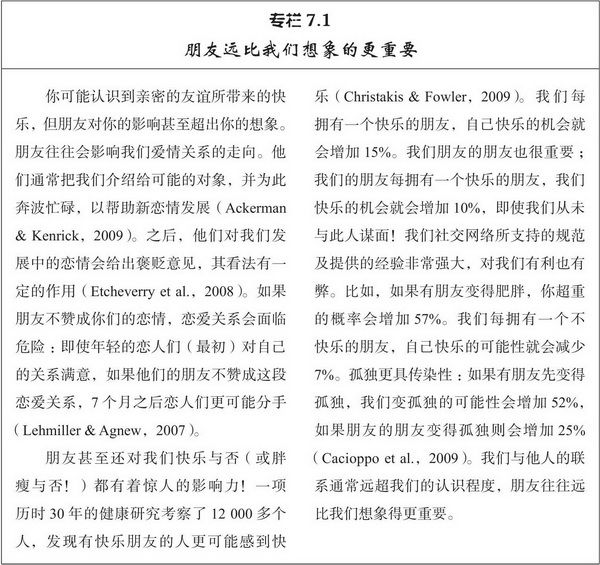

# 第7章 友谊

朋友的点滴相助才使我走到今天。

——约翰·列侬（John Lennon，英国甲壳虫乐队成员）

请回想一下你最好的两个朋友。为什么他们和你如此亲近？为什么你把他们当成朋友？你是否可能只是喜欢他们，而非爱上他们。（或者至少你不是“痴恋”他们，抑或你可能认为他们只是比“朋友”稍好一点。）你可能和他们共度过很多美好的时光，他们在身边让你感到舒适安心；你知道他们也喜欢你，如果你需要帮助，他们都是你的依靠。

的确，朋友能带给你非常多样而复杂的积极情感体验。**朋友有时会让你厌烦，但你还是会喜欢他们**。因为他们是你最好的朋友，所以他们能了解你不为人所知的私人信息。你喜欢与他们共处，并希望你们的亲密关系能永远持续。事实上，如果你回顾一下亲密关系的特征（见第1章第2页），就会发现你和最要好的朋友之间的联系的确非常亲密。你或许非常了解他们，对他们有着高度的信任和忠诚；你体验到的关心程度、相互依赖性和相互一致性可能没有和恋人相处时那么深厚，但这三个因素在朋友之间仍会出现。

那么，朋友关系是否和爱情关系一样，只不过亲密程度更低而已？答案既是肯定又是否定的。**友谊和爱情关系的构成因素是一样的，但各个因素的结合不同。并且友谊通常也并不具备爱情的某些成分，所以两者的构成并不一样**。但友谊和爱情的许多要素也非常类似，本章要详细描述亲密伙伴的特征，从而为爱情（第8章）的学习打下基础。我们还会涉及一些其他主题，比如友谊的各种特征，探讨男人和女人能否“仅仅做朋友”。

## 友谊的本质

友谊是我们获得快乐和支持的必不可少的源泉。对年轻人的一项研究发现，超过三分之一的人（36%）认为友谊是他们目前“最亲近、最深刻、投入最多和最亲密的”人际关系（Berscheid et al.，1989）。很多人（47%）明确指出爱情关系是他们最为重要的伙伴关系，但友谊显然是我们和他人发生联系的重要方式。即使人们结婚之后，友谊仍然非常重要。另一项研究采用体验式取样[^ 1]跟踪人们的交往，结果发现参与者与朋友在一起时一般比独自一人或者与家庭成员（包括他们的配偶）在一起时，有着更多的乐趣。**如果配偶和朋友都在身边，那将是最美好的时光**。但如果两者只能择一，**朋友带来的快乐和兴奋往往比配偶带来的要多**（Larson & Bradney，1988）。为什么友谊竟然如此重要？

### 友谊的属性

人们在谈到朋友时会想起各种各样的特征（Fuhrman et al.，2009；Hall，2009）。首先，亲密的朋友能感受到彼此间的温情。他们彼此欣赏、信任和尊重，珍视忠诚与真诚，双方都能无拘无束地做真实的自己，根本不用娇柔做作。其次，友谊涉及共同参与和分享。朋友之间反复进行有意义的自我表露，提供情感支持和实际援助，遵守平等规范，双方的喜好都受到应有的重视。最后，朋友还能彼此相伴。他们分享兴趣，参与活动，认为彼此才是娱乐和搞笑的源泉。最好的友谊显然是一种紧密、有奖赏价值的关系，故而有学者把友谊（friendship）定义为“一种自发的人际关系，通常表现出亲密和扶助，双方彼此欣赏，并企求对方的陪伴”（Fehr，1996，p7）。

### 友谊和爱情的差异

那么，怎么区分友谊和爱情？我们在第8章详细讨论爱情时将会看到，爱恋包含着比喜欢更复杂的情感。喜欢和爱恋都包含对伙伴正面、热情的评价，但浪漫的爱情还包括**对伴侣的着迷、性的欲望和比友谊强烈得多的排他性的愿望**（Giordano et al.，2006）。爱情关系还有着**更严厉的行为标准**；对待爱人应该比对朋友更加忠诚、更加愿意伸出援手（Fuhrman et al.，2009）。调节友谊的社会规范较之爱情关系的规范约束力较小，友谊也更易于解体（Fehr，1996）。此外，**朋友不太可能会公开表达正面情感**(friendships are
less likely to involve **overt** expressions of positive emotion)，他们在一起相处的空闲时间一般也比情侣要少得多。

> overt: An **overt** action or attitude is done or shown in an open and obvious way.
>
> 此处翻译成“公开”并不好，翻译成“开放”可能更好。“正面情感”可能翻译成“积极情绪”较佳。

这些差别并不仅是因为大多数友谊发生在同性之间。异性之间的友谊一般也不如爱情那么激情澎湃、忘我投入（Fuhrman et al.，2009）。所以，友谊一般比爱情承担的责任更少，情感强度更弱，排他程度更低。并且和爱情不同，友谊一般并不存在性的亲密（**虽然有些友谊中存在**；我们稍后再来考察“发生性关系的朋友”）。

所以，深厚的友谊虽然不如爱情充满激情，但仍然具有奖赏价值，包含着亲密关系的所有其他组成部分。下面我们就来看看友谊的这些成分。

**尊重**

当我们尊重别人时，我们会非常钦佩和重视他们。值得尊重的特质看来包括令人赞扬的道德品质、对他人的体贴入微、接纳他人、诚实、倾听他人的意愿等等（Frei & Shaver，2002）。我们一般喜欢那些令我们尊重的人，对朋友或爱人越尊重，那么与此人的关系越令人满意（Hendrick et al.，2010）。最亲密的朋友往往是我们尊重的人（Guthrie et al.，2011）。

**信任**

当我们自信地认为朋友会仁慈地对待我们，无私地考虑我们最大的利益时，我们就对他们产生了信任（Rempel et al.，2001）。这种自信需要时间来培育，但如果有人留意我们的愿望，无私、可靠地对待我们，信任就能建立起来（Simpson，2007）。**信任在任何亲密关系中都是弥足珍贵的**，因为它使得相互依赖更加愉快；让人舒适自在，与朋友轻松相处，不能充分信任伙伴的人往往戒心重重，对关系不满意（Rempel et al.，2001）。丧失信任会侵蚀紧密关系，产生破坏作用（Miller &Rempel，2004）；**曾被朋友背叛的人常常很难恢复对朋友的信任和对人际关系的满意**（详见第10章）。

**资本化**

我们和好友分享快乐时，快乐倍增，不会减少。当我们交好运时，并不总能从别人那里得到热心的祝贺；偶尔我们会得到别人言不由衷的祝福，有时别人根本漠不关心。但好友通常会为我们的成功感到欣喜，他们的兴奋能增加我们的欢乐（Gable & Reis，2010）。所以在资本化的交往模式中(in a pattern of interaction
known as capitalization)，我们常常能和朋友分享好消息，得到有益于紧密关系的热烈而有价值的反应：与那些对我们的好运漠然或冷淡的人相比，**那些能提升我们快乐的人让我们感到更亲近**（Reis et al.，2010）。具有资本化特征的人际关系通常比资本化不足的人际关系更令人满意、持续的时间也更长（Gable et al.，2006）。

> - capitalize: If you **capitalize on** a situation, you use it to gain some advantage for yourself.
>
> 此处翻译成“资本化”会很奇怪，我倾向于认为这个地方是互利的意思。

**社会支持**

成功的资本化能提升积极事件带给我们的快乐。我们还依赖朋友帮助我们克服困难，他们帮助和鼓励的方式很多。我们获得的援助或社会支持有4种（Barry et al.，2009）。表现为关爱、接纳和安慰等形式的**感情支持**；表现为拥抱或搂抱的**身体安慰**；表现为资讯和指导形式的**建议支持**；和表现为金钱或物品的**物质支持或有形援助**。当你对即将到来的考试感到紧张时，朋友试图打消你的疑虑，就为你提供了感情支持。而朋友把她的轿车借给你使用就是一种物质支持。但不要太过呆板地看待这些分类，因为这些不同种类的援助有时会交叉在一起；慷慨的物质帮助也能在情感上打动人，朋友一旦得知你的轿车送去修理了，就把她的汽车借给你，这种帮助既提供了感情支持又提供了物质支持。

社会支持价值巨大，随着时间的流逝，个体接受的这4种社会支持越多，关系满意度和主观幸福感就越大（Barry et al，2009）。的确，伴侣温暖而关注的支持所带来的幸福感比金钱更大；**你的收入对你快乐的影响可能还不如社会支持大**（North et al.，2008）。但它在紧密关系中起作用的方式有些复杂。请思考以下观点：

- 感情支持具有实际的生理效应。长期来看，与伙伴有着深情厚谊的人，与那些得不到多少鼓励和关爱的人相比，他们的血压、胆固醇水平和应激的荷尔蒙水平都更低（Seeman et al.，2002）。在实验室研究中，他们把手臂浸入冰冷的水里体验到的疼痛感更微弱（Brown et al.，2003）。如果人们处在紧张状态，只要心中能想起支持自己的朋友，一般就能降低心率和血压（Smith et al.，2004）。

- 有效的社会支持使人们感到与帮助者更亲近。朋友敏感的、应答性的支持能增加我们的幸福感、自尊和对未来的乐观（Feeney，2004），这些都有益于亲密关系。伴侣新婚时的社会支持越大，10年后离婚的可能性越小（Sullivan et al.，2010）。

> 除了校园恋情，很多时候对象确实都是朋友介绍的。

- 有些人更擅长于提供社会支持。例如依恋类型就会产生影响。安全型的人能轻松地接纳与他人相互依赖的亲密关系，往往能提供有效的支持，安慰和鼓舞受援者，他们这样做是出于利他和同情（Davila & Kashy，2009）。相形之下，**不安全型的人则更为自私，他们往往是出于义务或者为了回报才提供帮助。而且他们的社会支持效果往往较差**，这要么是因为（就回避型的人而言）他们比安全型的人提供的帮助更少，要么是因为（就焦虑型的人而言）他们的**帮助太冒失而有控制性**(intrusive and controlling)（Collins et al.，2006）。一般而言，安全型依恋伙伴（而非不安全型）提供的支持更令人们满意（Kane et al.，2007）。此外，如果伴侣细心，又有同理心，因而明白伴侣的需求，往往就能提供更好的社会支持（Verhofstadt et al.，2010）。**人们需要帮助时很少直截了当地开口求助**（Bohns & Flynn，2010），所以伴侣如能更好地理解对方的感受，往往能为对方提供更好的社会支持。
- 进而，最好的支持应该切合我们的需要和偏好。并非所有的社会支持都完全对受援者有益。即使提供支持的朋友动机良善，具有利他精神，他们的支持也可能不对路或者太过殷勤（Brock & Lawrence，2009）；**帮助行为可能威胁到我们的自尊或者显得冒失，而我们接受这类帮助时会讨厌这种受惠或蒙恩的感觉**（Gleason et al.，2008）。所以，社会帮助有时候会伴随有情感的代价，**因此最好的援助有时或许是无形的支持**（invisible support），悄然施行而不为受援者所察觉（Howland & Simpson，2010）。当同居的情侣有一方正在准备紧张的律师资格考试时，双方把各自给予和得到的支持都记录下来，结果发现最能减少应试者焦虑的，是情侣提供而应试者并未觉察到的帮助（Bolger et al.，2000）。有时候，**帮助朋友最好的方法就是默默地提供支持，从而不会增添他/她的心理负担**。

当受援者觉察到有形的支持时，如果这种支持能切合受援者当前的需要和目标就会更加有效（Brock & Lawrence，2010）。另一项研究考察了备考律师资格的学生，结果发现物质支持——比如情侣为之下厨烹调——有帮助作用，而感情支持只会使应试者更加焦虑（Shrout et al.，2006）。另一方面，对视力受损的老年人的调查发现，他们会被物质支持惹恼（或许是因为物质支持使他们感到自己更加软弱无助），但感情支持却使他们感到振奋（Reinhardt et al.，2006）。显而易见，并没有适合所有情境的单一固定 的支持模式；朋友所欣赏的帮助和支援的类型取决于他/她目前的需要、你的能力和友谊当前的状态（Iida et al.，2008）。如果我们要为朋友提供有效的支持，虽然存在某些始终如一的模式——安全依恋型的人一般喜欢感情支持，而疏远型的人则偏好具体的建议和意见（Simpson et al.，2007）——但我们更需留心朋友的私人偏好和特定环境。

- 不论社会支持的具体内容是什么，研究得出的一个最重要的结论是：长期来看，真正起作用的并非朋友具体的帮助行为，而是我们对朋友帮助行为的认知。我们知觉到的支持和我们实际得到的支持只能粗略地匹配（Lakey et al.，2002），当人们认为自己的朋友不肯仗义相助时，则无论朋友是否真正如此都会感到苦恼（Lakey et al.，2004）。事实上，知觉到的支持比实际得到的援助与我们对伴侣的满意程度更有关联：当我们对朋友或爱人感到满意时，我们都会把他们视为支持式的良师益友；但当我们不满意时，则会认为他们麻痹大意、袖手旁观（Kaul & Lakey，2003）。当然我们的判断并非完全不切实际；朋友为我们提供的支持越多，我们通常认为他们越能仗义相助（Priem et al.，2009）。而且，如果我们信任他们，对他们感到满意，我们就更加可能注意和体察他们的帮助和支持，故而认知到的支持在增加满意度的同时，满意度也能提升认知到的支持（Collins et al.，2006）。总而言之，我们对所获帮助的判断“可能既拥有客观事实的内核，又裹有认知所装饰的外壳”（Reis et al.，2004，p.214）。

- 最后，个人特征也会影响我们对社会支持的认知（Iida et al.，2008）。那些对他人的关心和照顾怀疑的人，往往会以一种片面的、不应有的挑剔眼光来看待他人的帮助。具体来说，与对自己和人际关系更积极、更自信的人相比，依恋类型不安全的人认为他们所得到的社会支持不够体谅、帮助作用不足（Collins & Feeney，2010）。很显然，即使朋友真正能慷慨地帮助不安全型的人的，他们仍可能认为朋友的帮助和鼓励是不充分的（Collins et al.，2010）。

总的来说，我们依赖于朋友和爱人以获得宝贵的支持，但**我们（感觉到）的支持数量和质量会受到我们自己和伴侣特征的影响**。我们知觉到的社会支持也极大地受到人际关系质量的影响；一般而言，能与之愉快相处的朋友与那些不太让人满意的朋友相比，前者看起来更能仗义相助。当我们需要帮助时，我们也更可能向我们信任的、反应灵敏的伙伴求助（Collins et al.，2010）。然而不论社会支持明显与否，最好的支持总是那些能表示朋友关注和理解我们（因而具有应答性）、满足我们需要的帮助行为（Maisel & Gable，2009）。

### 应答性

上述亲密友谊的每种特征（尊重、信任、资本化和社会支持）让我们感到有人理解、关心和珍视自己，因而它们都与有奖赏价值的亲密关系最后一个部分有关系，这部分可能是亲密友谊中最重要的成分（Reis，2009）：应答性（responsiveness），即**在认知层面上对朋友的需要和兴趣表现出关注与支持**。大多数时间，朋友对我们是谁，我们要说什么都会有兴趣。他们关注我们，藉此表达他们珍视与我们的朋友关系。他们通常还表现出热情和支持，看来理解和欣赏我们。这些都是彼此能成为朋友的原因。认为某人对你的需要和欲望表现出关注、尊重、热心和支持，这种判断就是所谓的感知到的伴侣应答性（perceived partner responsiveness），它非常具有奖赏价值，[^ 2]那些能让我们感受到自己有价值、理解和尊重的人都会吸引我们。

**感知到的伴侣应答性能提升亲密感**（Maisel et al.，2008），促进自我表露、信任和相互依赖，毫无疑问有益于人际关系。两个人如果相处融洽，开始留意对方的需要，彼此就会感觉更亲密、更满意（Canevello & Crocker，2010）。而且，如果我们大方地关注他人，我们往往会认为这些人也支持和关心我们，这也能促进我们的人际关系（Lemay & Clark，2008）。更突出的是，对伴侣敏感应答对我们自己和伴侣都有益；努力理解和支持室友的大学新生比缺乏应答性的新生能更好地适应大学生活（Canevello & Crocker，2011）。应答敏感的伴侣表现出的理解、尊重和关心具有很大的价值，朋友显然能为我们提供有效的人际奖赏。

### 友谊的规则

根据某些规则，我们也能指望好友做出适当的行为。虽然我们通常不会在内心详细阐述朋友的含义，但大多数人都会有一套人际关系的规则（rules for relationships），这种规则即是朋友应（或不应）履行某些行为的共同文化信念。这些行为的标准是人际关系平稳运行的润滑剂。我们在孩提时代就已学会了这些规则，并且知道，一旦违背这些规则就会引起他人的指责和关系的混乱。例如英国心理学家在一项开创性的研究中，列出了很多可能的友谊规则，并请来自英国、意大利、中国香港和日本的成年参与者从中选出他们认可的规则（Argyle & Henderson，1984）。表7.1列出了规范友谊的几个普遍的规则。或许如你所料，这些普遍规则包括公平、信任、自我表露、支持、关爱及亲密关系其他令人满意的方面。

规则限定了人们应该表现出和不应该表现出的行为模式，但我们不会总是遵守友谊的规则。当要求旧金山两所大学的学生判定会有多少人遵守各种人际关系规则时，他们估计大多数规则只有50%左右的人会遵守（Gambrill et al.，1999）。但这并不表明规则不重要。我们越是恪守这些规则，我们与朋友的关系就越是亲近、满意（Kline & Stafford，2004）。而且，在友谊失败的大多数情形下，总会发现有人违背了这些规则（Argyle & Henderson，1984）。因而，无论我们是否有意识地考虑这些规则，在友谊之中还是存在某些行为标准，即人际关系的社会规则，它决定了友谊的成败。

表7.1　友谊的规则

资料来源：Argyle & Henderson, 1985.

## 友谊的毕生变化

友谊的形式会随其所处的社会背景（比如朋友是工作中的同事抑或生活中的邻居）、亲密程度、个体的年龄和性别的变化而有所改变（Fehr，1996）。随着我们长大和变老，友谊的特征也会发生变化。本节我们就来考察这些变化。

### 童年期

学前期儿童和自己喜爱的玩伴之间就有着低级形式的友谊。此后，儿童在发育和成熟过程中所遭遇到的各种巨大变化，无不反映在他们的友谊之中，友谊也逐渐变得更加丰富和复杂（Howes，2011）。友谊发生重大变化的原因之一就是儿童认知的发展；随着儿童年龄增长，认知复杂度增加，儿童对人际需要的变化也愈加显著。根据比尔迈斯特和费曼（Buhrmester & Furman，1986）的观点，这些关键的需要表现为：**小学低年级阶段的接纳需要，青春期前期（9\~12岁或小学高年级）的亲密需要，青春期（13\~19岁）的性需要**。在每一阶段新的需要都凌驾于旧的需要之上，所以年龄大的儿童比年幼的儿童要满足更多的需要。每一阶段需要的顺利解决都要求发展出新的特殊能力，这种能力会影响到儿童在后面阶段的应对方式；如果儿童没有获得这些技能，就会发生问题。

比如当儿童进入小学阶段，其他儿童的相伴或者接纳就变得日益重要；那些不被同伴充分接纳的儿童会感到被人排斥和孤立。随后在青春期前期，儿童发展出对亲密的需要，典型表现为关注与自己年龄和兴趣相似的朋友。此时充分发展的友谊首次登台，它以广泛的自我表露为特征，并且在此阶段儿童表现出观点采择、同理心以及利他主义，这些都是成人亲密关系的基础。先前不被同伴接纳的儿童要克服孤立感，但如果他们做不到，就会生平头一遭地体验到真正的孤独。此后，是蓬勃迸发的性需要，青少年一般发展出对异性的兴趣。刚刚步入青春期的儿童很难建立起能满足这些新需要的人际关系，但大多数青少年随后会努力建立敏感、关爱和公开的恋爱关系。

总的来说，学者普遍地认为，随着人们年龄变大人际关系也会发生变化。成人应对友谊问题时丰富和复杂的方法都是历经岁月锤炼的结果。从某种程度上来说，儿童期成功的人际关系为成年阶段亲密关系的美好结果奠定了基础。比如，能与照料者形成安全型依恋的婴儿往往在入学时招人喜爱；因此，他们在童年期能建立更丰富、更安全的友谊，这让他们在青年期恋爱时更容易建立安全而舒心的亲密关系（Simpson et al.，2007）。另一方面，被同伴所拒绝的儿童往往会遭遇各种困难——诸如失学、刑事拘留和心理适应不良——远远多于那些为同伴所喜爱的儿童所遭受的（Bukowski & Cillessen，1998）。单纯的拒绝未必会导致这类问题，但却存在风险：有助于培养社交技能的干预措施能促进儿童被同伴的接纳，并能减少之后适应不良的风险（Waas & Graczyk，1998）。

### 青少年期

在13~19岁的青春期，友谊还有其他方面的变化。首先，青少年与家人相处的时间越来越少，而与伙伴相处的时间越来越多。在芝加哥进行的一项体验式取样研究发现，小学5年级的儿童约有35%的时间与家庭成员待在一起，而高中阶段的学生与家人相处的时间只占14%（Larson et al.，1996）。

第二个变化是青少年日益转向朋友来满足自己的依恋需要（Fraley & Davis，1997）。依恋学者确认了青少年时期的四种依恋方式（Hazan & Zeifman，1994）：（1）寻求亲近，指对依恋对象的趋近、保持临近和发生接触；（2）抗议隔离，青少年抵制把自己与伙伴分开，并因这种隔离而苦恼；（3）避风港湾，在危急困难时刻求助于依恋对象以获得安慰和支持；（4）安全基地，依托伙伴来探索新环境和进行其他大胆的尝试。所有这些依恋成分在年幼儿童和父母的关系中亦有所表现，只不过随着他们长大，青少年逐渐地把主要的依恋对象按成分逐个从父母转移到同伴身上。

比如11~14岁左右的青少年常常把避风港湾的依恋对象从父母转换到同伴；如果有事情令他们不安，他们在接近父母前会寻求朋友的帮助。的确，约有三分之一的青少年把同伴（一般为恋人而非普通朋友）而非父母视为他们主要的依恋对象（Rosenthal & Kobak，2010）。

所以在青少年的生活中，同伴会逐渐取代父母的角色，但即便是年轻的成年人仍会依赖父母以获得某些依恋。大学生最有可能向朋友们寻求亲近，也愿意将他们视为避风港湾，但不太可能把朋友作为安全基地（Fraley & Davis，1997）。这一角色通常是保留给父母来担当的。当人们搬到新的住所、从事新的工作、接受新的职业培训时，心中知道只要自己愿意就可以随时回家探望父母、清洗衣物和免费吃住，这仍令大多数人感到心安。

### 成年早期

在少年晚期和20多岁的时候，人们就进入了成年早期阶段，根据著名的人格理论家艾里克森（Erikson，1950）的观点，此时期的中心任务是“亲密对孤独”的冲突。艾里克森认为正是在这个年龄段，我们学会了怎样建立持久、忠诚的亲密关系。

对于本书的许多读者而言，对亲密关系的探寻大多是在陌生环境中进行的：即远离家乡的大学院校。离家求学可能会影响到你的友谊（Roberts & Dunbar，2011），但即使你近期并未见过中学时的许多好友，却并不会感到孤独。对美国丹佛大学新生持续1年的调查发现，学生在家乡建立的友谊逐渐消失，被随后在校园中新建立的人际关系所取代（Shaver et al.，1985）。这一过程并不能迅速完成，秋季刚入校的学生对其社交网络的满意度是最低的。但几乎所有的大学新生都能很快找到新的“亲密”朋友，但这些刚建立的友谊多数容易发生变化；只有三分之一的人在春季学期仍保持着最好的友谊。显然大学新生在不断地调整他们的社交圈，外向坦率和善于自我表露的学生应对得更为轻松；较之笨拙的新生，社交技能娴熟的新生对人际关系更为满意。然而，到春季学期快要结束时，大多数学生再次对自己的社交圈感到满意。他们都结交了新的朋友，但这需要一定的时间。

大学毕业之后友谊会怎样变化？在一项令人印象深刻的研究中，113位年轻人用日记记录了他们两个时期的社会交往，一个时期是他们还在大学求学时，另一个时期是毕业六年之后（Reis et al.，1993）。总的看来，参与者离开学校后每周看望朋友的时间变得更少；具体来说，与同性朋友及与三个人或三个人以上的团队相处的时间减少了。与异性伙伴相处的总时间增加了，但异性伙伴的数量却减少了，在这点上男性尤甚。尽管如此，正如发展理论所认为的，在参与者20多岁时，他们社会交往的平均亲密程度却是增加的。**大学毕业之后，人们往往只与少数几个朋友交往，但与朋友之间的人际交往层次更深、相互依赖程度更强**。

### 中年期

当人们和爱侣安居后友谊又会怎样变化？友谊和爱情之间的关联非常清晰：当人们有了恋人时，他们与家人和朋友相处的时间会减少。这时会发生二元退缩（dyadic withdrawal）现象：人们与爱人见面的次数越来越多，而探望朋友的次数越来越少（Fehr，1999）。一项研究发现，当人们还是偶尔与恋人约会时，平均每天和好友相处的时间是两小时，但一旦与恋人订婚后每天探望朋友的时间还不到30分钟（Milardo et al.，1983）。相爱的情侣确实会与具有共同特点的朋友有着更多的接触，但这并不能抵消他们朋友总数的下降以及与朋友相处时间的减少。

人们友谊的消退在结婚之后仍不会停止。与异性朋友的友谊尤其会受到影响；异性朋友可能会被配偶另一方认为是潜在的情敌，所以已婚人士一般很少探望异性朋友（Werking，1997）。尽管如此，即使夫妻们很少探望他们的朋友，他们仍比单身的时候有着更大的社交网络，因为他们会更多地看望他们的姻亲（Milardo et al.，1983）。（请不要误会这一点，如果你不喜欢爱人一方的家庭成员也请当心：一旦你结婚了将会更频繁地看到他们！）

因而，当人们投身于配偶和孩子时，他们的社会生活并不会完全萎缩破灭，但他们社交活动的重心的确从私人朋友转移到家庭和夫妻共同的朋友上。事实上，如果夫妻双方没有共同的朋友，这样的婚姻通常很艰难。正如图7.1所示，如果夫妻双方都没有一个共同的朋友，配偶们就会面临更多的婚姻问题（Amato et al.，2007）。已婚人士有自己的私人朋友没什么坏处，但如果只有独享式的友谊似乎就有风险。

### 老年期

最终，**老年人较之年轻人社交圈子更小，朋友也更少**（Carstensen et al.，1999）。老年人并非不会交际，他们只是更加挑剔；他们的亲密好友数量和年轻时一样多，但他们和一般的朋友以及不太重要的社交伙伴相处的时间更少（Fung et al.，2001）。

图7.1　朋友圈和婚姻调适

如果夫妻没有共同的朋友就会遭逢许多挫折和困难。

资料来源：Amato et al.，2007.

社会情绪选择理论（socioemotional selectivity theory）认为，友谊随年龄的这种变化是因为老年人有着与年轻人不同的人际目标（Lockenhoff & Carstensen，2004）。年轻人的人生道路还很漫长，所以该理论假定他们会追求旨在获取信息、指向未来的目标，这有利于他们今后的生活。（这大概正是当代大学生们的社交活动的特征。）心中带着这样的社交目的，年轻人会追求各种类型的社交伙伴和相对更大的社交网络。然而，**当人们变老，未来显得越来越有限，他们的社交目标大概更多地指向现在而不是未来，也更注重最大限度地满足自己的情感需要**（Fung & Carstensen，2004）。社会情绪选择理论的观点认为，随着有生之年变得越来越屈指可数，老年人交际的目标指向友谊的质量而非数量；他们更注重精选出的深厚友情，不愿发生冲突（Fingerman & Charles，2010），而让更普通的朋友关系自然消失。的确，该理论预测：任何人，只要认为自己的未来不长久，就会花更多的时间与少数几个亲密好友相处，而不是把时间用来和各种各样的普通朋友交往——这也是年轻人感染艾滋病病毒后，所剩时日无多时与人交往的情形（Carstensen et al.，1999）。一般而言，社会情绪选择理论看来是对与衰老有关的社交活动变化的合理解释。

最后，我们还应注意到，当我们年老体衰、能力下降时，友谊所能提供的社会支持尤为重要。对美国康涅狄格州的2 812名老年人为期10年的纵向研究发现，经常与朋友保持接触能降低罹患残疾（比如不能自己穿衣或者行走）的风险（Mendes de Leon et al.，1999）。此外，如果老年人不幸罹患残疾，紧密的友谊常与较高的康复率联系在一起。整体来看，有着亲朋好友的老年人比那些较少与人接触的鳏寡孤独者更健康、更长寿（Sabin，1993）。只要我们活着，友谊就是无价之宝。

## 友谊的差异

友谊不仅在整个生命周期中有变化，在不同的个体之间和伙伴之间也存在差异。本节我们就要考察友谊的本质如何与性别及其他个体差异交织在一起。

### 同性友谊中的性别差异

请思考以下两种同性友谊的情形：

小莉和贝蒂是闺中密友。遇到麻烦时，另一方总能提供支持和忠告。只要她们在恋爱中出现任何问题，就会马上给对方打电话，请求并能得到所需要的建议和安慰。小莉和贝蒂觉得她们了解彼此的一切。

汤姆和巴尼有着过硬的交情。他们常常一起熬夜玩纸牌，或者修理汤姆那辆1980年出产的、总是发生故障的雪弗兰汽车。他们一起出没于各种场所——酒吧、篮球场、集体聚会等等。巴尼和汤姆觉得他们是最要好的朋友。

你觉得上面描述的两种友谊合理吗？或许合理。大量研究表明女性之间的友谊是以**情感分享**（emotional sharing）和**自我表露**为其特征的，而男性友谊则是围绕着**共同活动**（shared activities）、相伴相随和搞笑娱乐而展开的（Fehr，1996；Marshall，2010）。这显得过于简单化，但多年前赖特（Wright，1982）创造出的两个精辟词语今天看来仍熠熠生辉：女性的友谊是“面对面”（face-to-face），而男性的友谊则是“肩并肩”（side-by-side）。[^ 3]

同性之间的友谊差异主要表现在以下几个方面（Fehr，1996）：

- 女性朋友之间电话交谈的时间更多；

- 两性朋友谈论的话题不同：女性更可能探讨人际关系和私人问题，而男性更可能探讨客观事件，比如体育比赛等；

- 女性进行的自我表露多于男性；

- 女性给予朋友的感情支持多于男性；

- 女性在友谊中比男性表达出更多的爱意和温情。

归纳一下，女性之间的友谊往往比男性更亲切、紧密。最终结果是，**女性在爱情关系之外仍会向朋友寻求敏感、体贴的理解和支持，而男性常常做不到这点**。请思考下面这个有启发性的问题（Rubin，1986，p.170）：“某晚你回到家里，恋人或者爱人宣布要离你而去，你会向谁寻求帮助？”当研究的参与者真正地思考这个问题时，几乎每位女性都能轻易地提到同性朋友的名字，但只有少数几个男性能做到这一点（Rubin，1986）。（**事实上，如果男性的爱侣抛弃他们，大多数男性根本想不出可以向谁寻求安慰**。）

为什么男性之间的友谊不如女性那样亲密？是因为男性缺乏彼此建立亲密友谊的能力？抑或他们只是不愿意这样做？通常，是因为他们不愿意；如果社会环境支持男性之间的亲近，男性完全有能力与其他男性建立亲密的友谊——但社会对这种男性同性亲密的接纳程度远低于女性，所以他们不会这样做（Reis，1998）。为何如此？**文化规范和性别角色看来是主要的原因**（Bank & Hansford，2000）。传统的教养鼓励男性应该具有工具性而非表达性的特质，[^ 4] 并且（正如第5章所述）个体的表达性能预测他/她自我表露的方式。双性化的男性一般比传统的、性别刻板化的男性有着更为亲密的友谊，但性别刻板化的男性在数量上要多于双性化的男性。为了和典型的性别角色保持一致，我们也会对男性施加压力，促使他们表现出比女性更多的情感约束。社会规范致使男性比女性更不愿意向他人表达出他们的焦虑和情感，如果社会鼓励表达性的男性友谊（如中东），亲密友谊中的性别差异就会消失（Reis，1998）。

因此，男性友谊缺乏亲密，可能不是因为他们没有能力和其他男性分享有意义、亲密的相互依赖。相反，它是社会文化压力之下迫不得已的选择。如果西方文化不打击男性友谊心理上的亲密感，许多男性可能会拥有更亲密的同性友谊。

### 友谊的个体差异

除了性别效应之外，还存在其他影响友谊的个体差异。其一就是我们在第4章中谈到的自我监控（见133~135页）。自我监控水平高的个体倾向于建立较宽泛的社交网络，其同伴大多是“活动专家”，可以与之分享特定的快乐，但此外他们没有其他更多的共同点。因此，高自我监控者在友谊中的投入往往比低自我监控者更少；低自我监控者的朋友数量较少，但彼此有着更多的共同点，他们的友谊一般看来更加亲密（Snyder & Simpson，1987）。

另一个影响社交网络的个体特征是性取向。在对美国方便样本[^ 5] 中的1,415人调查发现，大部分异性恋男女的密友不是男同、女同或双性恋，但大部分男同、女同或双性恋者（GLBs）都有正常性取向的朋友（Galupo，2009）。只有约六分之一的异性恋者（知道他们）有朋友是GLB，但80%的GLB有亲密的异性恋朋友。所以，就性取向而言，异性恋者的朋友圈一般不如GLB那么多样化。如果异性恋者真要回避与GLB的友谊，他们就可能犯错：一般来说，GLB们与异性恋者之间的友谊完全像GLB们之间的友谊一样亲密和有奖赏意义（Ueno et al.，2009），异性恋者与GLB们接触越多，就越喜欢他们（Vonofakou et al.，2007）。

最后，有些人认为他们是独立自主的主体，其自我概念最主要的特征就是能把他们与其他人区分开来的特质。相反，另外一些人则很大程度上依据与他人的人际关系来界定自我；他们的自我概念强调自己所担当的社会角色，以及在亲密的伙伴关系中表现出的特征。另一个有趣的个体差异是相互依赖的自我构念（interdependent self-construal），指人们在多大程度上把自己看成是与他人相互依赖（而非各自独立）的人。对于相互依赖的自我构念较强的人而言，人际关系是他们自我概念的核心特征，他们“思考和行动往往都是为了建立、提升和维持与重要人物的和谐、亲密的人际关系”（Cross & Morris，2003，p.513）。相互依赖的自我构念可以使人成为合意的朋友（Mann & Morry，2011）；和那些更加独立的人相比，相互依赖的人能更好地理解别人的观点和价值观，努力使他人及自己都获益。由于动机的作用，独立和依赖往往在每个人身上都会有所表现，但诸如美国的西方文化往往赞美和推崇独立自主。所以，**相互依赖的自我构念在美国之外的世界更为普遍**（Cross et al.，2009）。

## 友谊发展的障碍

在本章的最后部分，我们来考察一些对宝贵友谊造成阻碍的个人特质。我们将重点研究两个非常普通而又令人痛苦的问题，即**羞怯和孤独**。我们都清楚，羞怯者或孤独者通常都希望建立亲密的友谊，但他们的行为举止却往往使他们很难做到这一点。

如今，我们或许需要身边的每一位朋友。在2004年对全美国有代表性的人群样本面对面的访谈研究发现，**美国人的亲密友谊并不如过去那样普遍**（McPherson et al.，2006）。认为自己没有任何知心朋友的人从1985年的10%（该研究上一次问到这些问题）猛增到2004年的25%。每4个美国成人中就有1位根本没有好友，无法向好友寻求亲密忠告和社会支持。另有19%的人报告他们只有1位知己好友（通常是其配偶或者兄弟姐妹），整体来看，人们亲密伴侣的平均数量从3个（1985年）骤降到2个。许多大学生在Facebook校园交友网站上有几十或上百个“朋友”，但这些网友并不是能提供丰富的、有价值、有意义的亲密感的伙伴。一旦他们离开大学校园，只有一半多点的美国人（57%）还能和没有实际接触过的网友成为亲密的好友。许多美国人没有好朋友。毫无疑问，羞怯和孤独使情况变得更糟。

### 羞怯

与人交往时你是否会感到焦虑和拘谨，担心别人对你的评价，交谈时觉得自己笨嘴拙舌？大多数人都会这样。80%的人都曾体验过羞怯（shyness），羞怯是在社交情境下沉默寡言和抑制行为结合紧张不安的综合症状（Miller，2009）。看看表7.2，人们羞怯时会担心社会指责，忧心忡忡地预计别人对自己的苛评。羞怯者在与人闲聊时还会感到忸怩做作、笨拙无能、局促不安、效率低下（Arroyo & Harwood，2011）。因此，他们的社会交往会陷入山穷水尽的困境。如果他们不能完全避开人际交往，他们的行为也会表现出拘谨防卫的特点；看向他人的目光、保持的微笑、讲述的话语以及应答性的交谈都明显匮乏（Ickes，2009）。与泰然自若的人相比，他们应对日常谈话的能力非常低下。

表7.2　羞怯量表

资料来源：Cheek & Buss，1981.

几乎任何人都会不时地受到羞怯的困扰。当我们置身于陌生的环境，第一次见到有魅力、地位高的陌生人时，很容易产生羞怯，但是当我们在熟悉的环境下与老友交往时，则不太可能会感到羞怯（Leary & Kowalski，1995）。然而有些人会长期习惯性地感到羞怯，更频繁地体验到羞怯。与坦荡的人相比，他们具有三个特征。首先，惯常羞怯者害怕别人的负面评价。一想到别人讨厌自己他们就坐卧不安，他人的嘲笑和蔑视更令他们害怕恐惧。他们对社会指责的担忧要甚于其他人（Miller，2009）。其次，他们倾向于怀疑自我。低自尊通常伴随着习惯性羞怯，羞怯者往往有低自尊。最后，在与人交往的过程中，他们会感到自己能力不足，有时还能找到充分的理由：整体看来，他们的社交技能不如不羞怯的人（Ickes，2009）。

羞怯者这种负面认知和行为缺陷令人生厌，使得他们与人交往时进退两难。他们担心别人的看法，害怕别人的指责，却又觉得自己没有能力营造良好的印象，以消除此类指责。结果，他们的社会交往通常显得小心谨慎、畏畏缩缩，这会打断、转移别人对自己的兴趣和热情（Oakman et al.，2003）。比如，如果羞怯的男性发现漂亮的女人注视自己，他们不会回望与之对视，更不会微笑问好；相反，他们的眼神游离不定，一言不发（Ickes，2009）。本来男女之间可以进行的良性沟通，男性一旦显得羞怯就根本不可能发生。

具有讽刺意味的是，无论人们的羞怯是暂时性或习惯性的，只要他们胆怯畏缩，就会给人留下负面印象，而这恰恰是他们与人交往时希望避免的。他们疏离冷漠、毫无价值的行为并不能博得别人的同情，反而经常予人以沉闷单调、兴味索然的印象。我们且来彻底地分析这一现象。设想你在舞会现场，一些熟人三三两两地在舞池里随着音乐翩翩起舞。他们向你嚷道“来吧！”，鼓励你加入他们的行列。但你对自己的舞步没有信心，不想让人觉得自己蠢笨，所以你待在了舞池的边缘。你当然想和他们一起跳舞，但却过分在乎别人对你的评价，所以你踌躇不前，保持观望。这种沉默寡言会妨碍你的社会交往，它当然不能表现你的随和友善，也无助于聚会欢快、狂热的氛围，你只是干站在那儿。你的心里或许还觉得自己很友好，但别人从你的行为表现上很难觉察到这一点。你当然不喜好跳舞嬉闹，从各方面的表现来看，你或许看上去有点笨手笨脚、呆头呆脑。的确，或许更稳妥的说法是，与其一个人在舞池边上尴尬地站立给人负面印象，还不如加入跳舞的队列笨拙地舞动起来；只要你生气勃勃、兴高采烈，没有人会在乎你的舞姿怎样。但是当你站在舞池边了无趣味时，人们的确会注意到你。

事实上，正如图7.2所示，羞怯行为并不能给人留下好印象。**羞怯所表现出的懦弱、寡言和犹豫的行为特征看来好像冷漠无情、不太友好。和合群的行为相比，羞怯行为很可能引起对方冷淡和排斥的反应**（Bradshaw，2006）。久而久之，羞怯者更可能受到别人的忽视和拒绝，而得不到他人的谅解和同理心，而这样的结果又会强化他们的羞怯。

的确，与不羞怯的人相比，羞怯者结交新朋友的过程缓慢得多（Asendorpf & Wilpers，1998）。他们的友谊一般也不怎么令人满意和具有支持性，所以他们也往往更加孤独（Bradshaw，2006）。这些影响非常重要；他们结婚时，羞怯的人会发生更多的问题，对婚姻生活也更不满意（Baker & McNulty，2010）。

图7.2　羞怯引起的人际循环效应

羞怯行为会给人造成负面的印象，通常还会产生羞怯者所害怕的不利评价。导致更糟糕的互动，加重了羞怯者的恐惧，如此循环往复。

因而，羞怯行为只会使个体的羞怯感更为严重，很显然，在社交生活中自信满满的表现通常比羞怯懦弱要好得多。当然，羞怯有时也有益处：当人们真正地遭遇新异情境，不知道如何行动时，羞怯片刻的警惕作用可以防止他们举止失当（Leary，2010）。然而，更常见的是，羞怯者会被社会指责所带来的威胁吓跑，而这种社会指责根本不曾发生过或者永远也不会出现，所以他们的羞怯完全没有必要，反而是起相反作用的心理负担（Miller，2009）。有一些正式的培训项目帮助人们克服习惯性羞怯，教导羞怯者要用积极的心态来认识和思考问题，帮助他们应对焦虑并正确理解社会评价，还重点传授如何开启谈话和果断处事等社交技能。在角色扮演任务和其他实践训练中，会一直排演练习积极思维和有效行为，直到受训者能独自得心应手地应用它们为止（Henderson & Zimbardo，2010）。

然而，大多数羞怯者可能根本就不需要接受社交技能的正式培训，因为他们只要精神放松，不再担心别人的评判，就可以表现得坦荡豁达。假如现在你受到羞怯的困扰，只要你实际上能较少在意别人对你的看法，就能给人留下更好的印象。利里（Leary，1986）的一项有趣实验证实了这种可能性。实验要求参与者在一个模拟单身酒吧的热闹嘈杂环境下，会见并招呼一位陌生人。利里将谈话声、三首不同的歌曲、电台静电噪声和聚会的喧闹声（诸如大笑和叫喊声）等不同的声音叠加在一起，制作出多音轨的录音带——这当然是千真万确的“噪音”——并且在每对参与者交谈的时候以略微令人讨厌的音量播放磁带。重点在于，所播放的磁带音量总是恒定的，只不过告知一些参与者，噪音太响亮可能会干扰他们的谈话，他们很难轻松愉快地聊天。而告知另外一些参与者，噪音足够轻柔不会有什么影响。一旦参与者形成适当的预期，就让羞怯或不羞怯的参与者和陌生人单独相处——与人独处的场景对于羞怯者通常具有威胁意义。利里监测了参与者的心率以便追踪他们的焦虑和唤醒水平，研究结果如表7.3所示。当噪音“轻柔”，参与者拙劣的交往找不到好的托词，羞怯者就会表现出比正常人高得多的唤醒和焦虑；他们的心率变化增加到3倍之多（Shimizu et al.，2011）。更糟糕的是，事后观看自己的谈话录像的人也显然认为他们羞怯、不安。另一方面，当他们有了能降低社交预期的托词时——实际上不可能存在过于“响亮”的噪音——则他们的社交行为看上去一点也不羞怯。这种情况下，当他们开始与陌生人交往时，他们的心率增幅正常、适度，也不会给观察者任何羞怯的迹象。

表7.3　有了托词后羞怯者的社交表现更好

有趣的是，如果他们的交往行为表现拙劣而无可指责，利里（Leary，1986）研究中的羞怯参与者则能保持相对轻松舒适的心态，可以毫无困难地与陌生人交谈。从某种意义上来说，当他们能以平和的心态来思考即将发生的人际交往时，羞怯感就会消失。他们的羞怯并不是因为长期缺乏社交技能造成的结果；羞怯取决于交往发生的背景。同样地，当羞怯者能以相对匿名的方式以及轻松自在地以自己的节奏和他人进行在线交流时，他们就能更加放得开（Shepherd & Edelmann，2005）。但如果在线交流使用摄像头，双方能实时同步地看到彼此的影像，羞怯者又会恢复原来的沉默寡言；他们的自我表露减少，羞怯特征再次变得清晰可见（Brunet & Schmidt，2007）。

如果羞怯取决于羞怯者是否受到别人的注视，那么人们（可能包括你在内，如果你感到羞怯）根本不需要基本社交技能的培训。他们所需要的是更多的镇静和自信（Arroyo & Harwood，2011）。虽然要做到这一点并不容易，但羞怯者应该考虑另一种选项：一味羞怯并不能帮他们赢得朋友和影响他人；那么相信自己并期望交往能顺利进行，又能失去什么？如果你是个羞怯的人，下次你结交新朋友时不要光想着你自己，只要尽你所能地努力寻找对方的特点即可[^ 6]。事情或许出乎你意料地变好（Sasaki & Vorauer，2010）。

### 孤独

在社交场景中我们有时会感到焦虑和胆怯，有时还会因为没有亲密朋友而感到不满和苦恼，这两种社交体验并不一样。如果我们所期待的人际关系**数量和质量**与我们当前实际情形存在较大差距，就会产生令人不悦的厌烦、悲伤和绝望的孤独体验（de Jong Gierveld et al.，2006）。孤独与独处并不是一回事；在完全独处的状态我们通常也能感到满足（Leary et al.，2003）。相反，**当我们想拥有与他人更多、更亲密的接触而不得时，就会产生孤独感**（Mellor et al.，2008）。因此，如果你与他人的人际关系很淡漠，即使你身边有很多人或者你在脸谱网上有许多“朋友”，你仍可能会感到孤独。

孤独有着不同的层面。心理学家罗伯特·韦斯（Robert Weiss）首先提出人们会受到两种孤独的困扰（Weiss，1973），其一是**社会隔离**（social isolation），指的是我们不满于缺少朋友和熟人的社交网络而引起的孤独；其二是**情感隔离**（emotional isolation），指的是我们缺乏深厚的人际关系而引起的孤独。这两种孤独成分在UCLA（美国加州大学洛杉矶分校）孤独量表上都有所表现，该测验已广泛地用于成人孤独的研究。UCLA孤独量表（见表7.4）包括三方面的内容（Hawkley et al.，2005）。首先是与他人的隔离。孤独者感觉自己形单影只，与他人的接触次数达不到他们所期望的目标。其次他们还会觉得与他人的亲密接触也达不到他们所期望的程度。最后，如果与他人总的社会联系太少也会引起孤独。孤独者感到他们与朋友和玩伴的联系不充分，所以他们在人际交往中体验到的快乐很少，也没有足够的社会支持。

表7.4　UCLA孤独量表（第3版）

注意在量表中并没有出现“孤独”这个词。这是有意为之的。**男性与女性相比更不愿意承认他们孤独**，所以量表并没有出现这个词。要计算你的得分，请把注有星号题目的评分颠倒过来。如果该项你评为1，变成4；2变成3，3变成2，4则变成1。然后合计你的评分。年轻男性往往比女性更孤独，他们的平均得分是42。年轻女性的平均得分是39（Russell，1996）。男女两性得分的标准差都是9.5。所以，如果你的得分等于或大于53，你就比大多数男性更孤独；如果你的得分等于或大于49，你就比大多数女性更孤独。如果你的得分等于或小于31，你的孤独感就比大多数男性更弱；如果你的得分等于或小于29，你的孤独感就比大多数女性更弱。顺带提一下，老年人的平均得分是32。你的得分和他们比起来如何？

资料来源： Russell, D.W. (1996)

如果人们的社会联系非常糟糕则会受到伤害。在第1章我们曾提到人类有归属需要，**孤独正是归属需要得不到满足的恶果**。长期来看，**孤独者与那些有着丰富、满意友情的人相比，他们的血压更高，血液中应激荷尔蒙的水平也更高。他们的睡眠质量很差，免疫系统的功能也不正常**（Cacioppo & Hawkley，2009）。久而久之，孤独对老年人整体幸福的损害非常明显：对美国爱荷华州3 000名老年人的追踪研究发现，孤独的老人四年之后有40%的人进了疗养院，而社交活跃的老人则只有10%的人进入养老院（Cutrona et al.，1997）。如果孤独持续存在，会对我们的健康会造成非常糟糕的影响（Hawkley & Cacioppo，2007）。

然而，令人欣慰的是，孤独通常是一种短暂的状态。任何人与自己的社交圈子隔离一段时间，都会感到苦恼，但它持续不了多久，重新回到自己的社交圈子或者建立了新的友谊，孤独就会结束。令人不安的是，与孤独有关的一些个人特征具有耐久性，只能逐渐地加以改变（如果确实能改变的话）。举例来说，孤独具有遗传性。也就是说，人与人之间孤独的变异约有一半（48%）来自基因的影响，这种影响是出生时就继承的（Boomsma et al.，2005）。有些人在社会生活中确实天生就比一般人更可能体验到孤独。的确，人们的人格特点能预测他们后来孤独的程度；高水平的外倾性、随和性和尽责性都和低孤独有关联，而高神经质会增加孤独的发生（Cacioppo et al.，2006）。

孤独也会随着其他更具变化性的个人特征而变化。不安全型依恋就是例子之一。依恋的两个维度——忧虑被弃和回避亲密——都与孤独有关，人们忧虑和回避的程度越低，他们体验到的孤独一般更少（Wiseman et al.，2006）。自尊是另一个影响孤独的可变化的特征。和社会测量模型的自尊假设相一致 [^ 7] ，不能和他人保持满意、充实的人际联系的人一般也不怎么欣赏他们自己：孤独者倾向于低自尊（Cacioppo et al.，2006）。

表7.5　是否拥有爱侣的男女之间的孤独对比

资料来源：Wheeler et al.，1983.

而且，**平均而言男性比女性更孤独**（Pinquart，2003），但更多地取决于他们当前是否能与女性伙伴保持亲近。因为女性常常与其他女性有着亲密的友谊，即使她们没有任何约会情人，她们在生活中通常也能与其他女人分享亲密的情感。**男性则相反，他们与其他男性只能保持相对肤浅的人际交往**，一般只有在与女性交往时，他们才能真正敞开心扉。因此，**男性似乎依赖于女性以避免孤独，而女性则不会反过来依赖男性避免孤独**（如表7.5所示）。

然而实际上更准确的说法是，**大丈夫式的男性才真正需要女性来防止孤独**。能够促进人们有意义、充实的人际交往的心理要素之一是表达性 [^ 8]，表达性是使人变得热情、敏感和亲切的品质，具有表达性特征的人看来不太可能感到孤独（Wheeler et al.，1983）。女性往往有较高的表达性，这可能是她们不会像男性那样孤独的主要原因。但是双性化的男性也有着较高的表达性，与更传统的大丈夫式的男性不同，他们并不比女性更孤独。所以，男性和女性在孤独上的总体差异看来是一种性认同差异而非性生理差异。如果没有表达性高的伙伴为伍，在他们的生活中注入亲密感，表达性低的人（当然包括大多数男性）往往会感到孤独。但许多男性（大约三分之一）和大多数女性的表达性一样高（Bem，1993），他们不需要依赖女性以防止孤独。

最后，如果人们感到孤独，他们的生活就会了无趣味。他们在对待他人的消极态度上表现出的苦恼和绝望显而易见（Tsai & Reis，2009）。具有讽刺意义的是，孤独者所怀疑和讨厌的人往往恰恰是他们要向之寻求接纳和尊重的人。可能导致的结果是，他们的人际交往通常单调沉闷、迟钝乏味。孤独者对别人的话语反应迟缓，不会询问任何问题，从他人不带恶意的话语中却能品读出拒绝，所以**与孤独者聊天没有任何乐趣**（Edwards et al.，2001）。此外，他们不会进行太多的自我表露；他们的谈话通常淡漠肤浅、毫无意义，所以他们很难形成他们所渴望建立的亲密关系（Cacioppo & Hawkley，2009）。

不幸的是，所有这些都逃不开别人的眼睛。孤独者愤世嫉俗的观点和迟钝乏味、心不在焉的处世方式经常会引起他人的消极反应，他人一般会认为孤独者并不十分了解和喜欢自己（Tsai & Reis，2009）。孤独和羞怯相似，都存在可能的自我延续倾向，但孤独的效应可能更加强烈。尽管羞怯行为实质上并无害处，羞怯者只不过显得疏离冷漠，但孤独行为却有破坏作用，令人憎恶。羞怯者只是要与人保持距离，但孤独者却会烦扰和激怒我们。在大学校园里，孤独的学生与同伴的交往几乎和其他任何人一样多，但他们体验到支持和关爱之类的积极结果较少，而消极结果（如冲突和怀疑）却较多（Hawkley et al.，2005）。因而，即使孤独者身边有许多人，他们的行为方式却令人生厌，这使得他们的孤独更严重。

雪上加霜的是，孤独还会引起抑郁（Cacioppo & Hawkley，2009）。抑郁是比孤独更宽泛、更不满和苦恼的状态——孤独产生于人际障碍，而抑郁则来源于各种各样的失落和挫折（Weeks et al.，1980）——但他们能相互激化对方，抑郁使人更难有效率地行动以吸引他人（Rehman et al.，2008）。除了悲观和忧郁之外，抑郁者还会表现出可憎的行为模式，即过度寻求保证：他们持续不断地探查以确保他人喜欢并接纳他们，但当他们得到保证后又质疑这种保证的真实性（Haeffel et al.，2007）。在不满和焦虑中，他们仍继续寻求更令人信服的安慰，也逐渐把他们伙伴的耐心消磨殆尽（Eberhart & Hammen，2010）。

上述孤独的影响没有一条令人愉快。孤独者又应该怎样克服呢？如果你现在正处于孤独，前面的论述可能看起来非常悲观，但并非完全没有希望。有些人可能很容易遭逢孤独，但我们面对的环境显然也有影响（Larose et al.，2002）。不利的环境会使任何人变得孤独——但环境会发生变化，所以始终保持希望非常重要。孤独未必一直持续。的确，当年轻人被催眠，并要求他们想象友谊和归属感的体验时，则和他们把注意力集中在孤独感时相比，他们更少羞怯、更好交际、更加快乐、更不孤独（Cacioppo et al.，2006）。个体的观念就能引起巨大的变化。

不管是好是坏

孤独者往往对他人持有消极的态度，这使得他们更难克服孤独。

资料来源：c 1989 Lynn Johnston Productions. Dist. by Universal Press Syndicate。Reprinted with permission.All rights reserved.

详而言之，如果大学新生能把他们的苦恼归因于不稳定、短暂的影响因素，而不是他们自己或者其他人持久的缺陷，他们就能更轻松地克服孤独（Cutrona，1982）。把自己的孤独判断为暂时的或能改变的困难，就能乐观地期待事情会好转，而充满希望比消极悲观更有可能医治好孤独（Newall et al.，2009）。再者，因为孤独产生于我们所期望的伙伴关系与我们当前已拥有的人际关系之间的落差，所以孤独者应该当心别把自己的眼光放得太高。例如，离家求学的莘莘学子通常有段时间会感到孤独；孤独伴随着（新异的、陌生的）新环境而发生（Weeks et al.，1980）。但接下来的一年，那些只想结交新朋友的学生通常都能得偿所愿，变得不再孤独，而那些渴望寻觅浪漫爱情的学生通常会感到失望，变得更加沮丧（Cutrona，1982）。

**要克服孤独，我们就应该寻求新的友谊，而不是爱情**，尽力使自己显得友好。如果你现在正处于孤独，小心你自己的任何乖戾、自我挫败态度（Masi et al.，2011）。你是否开始认为人们一般都是自私的、浅薄的和没有爱心？这种消极的人生观几乎肯定地会降低你的魅力，并且会变成自我实现的预言：你所期望的也许正是你所得到的。的确，如果你能采用更积极的方法——关注他人的优秀品质，期望他们愉悦友善，并且耐心地承认友谊的建立需要花费时间——你就可能会享有与他人更有价值的交往。

## 请你思考

大卫和安妮在一起读研究生时成为最要好的朋友。他们同一年入学，选修了同样的课程，还在课外的几个项目上一起精诚合作。他们了解彼此，双方都尽责、聪明，并且完全尊敬和信任对方。他们彼此知悉对方最私人的秘密。一起游玩时他们感到极大的快乐。他们都不是墨守成规的人，能分享具有讽刺意味、不落俗套的幽默；其他人不怎么看好的笑话，却经常能引起他们的开怀大笑。在安妮完成她博士论文的那天晚上，他们喝醉了，几乎发生了性关系，却被人打断，机会就这样溜走了。不久之后，他们毕业了，在美国不同的地方找到了工作，他去了加州，而她去了明尼苏达。而今，6年之后，他们都已结婚了，只能在每年的学术会议上才能见上一面。

你认为大卫和安妮之间的友谊未来会怎样？为什么？

## 参考文献

[^ 1]: 如果需要提醒你什么是体验式取样，请翻到59页。（第2章仍然很有用，不是吗？）这项研究的参与者要戴上无线寻呼机，从而在白天每两个小时就会提醒他们记录他们和谁在一起，做些什么。
[^ 2]: 的确，感知到的伴侣应答性如此重要，这是我第二次提到它了。在第5章159页曾提及它是影响自我表露的重要因素。
[^ 3]: 这一聪明的论断当然过于简单化，因为它意味着女性朋友只会交谈而男性朋友只会玩乐，这当然不符合实际。女性也和男性一样喜欢和朋友一起进行令人快乐的活动（Fehr，1996）。然而，男性与女性相比，更不乐意和朋友分享他们的情感和恐惧，所以一般而言，情感分享这一特征的确能区分男女之间的友谊（Marshall，2010）。
[^ 4]: 要提醒你工具性和表达性的特质吗？请翻到第1章24页。
[^ 5]: 参见第2章46页。
[^ 6]: 如何做请查看第225页的专栏7.2。
[^ 7]: 需要提醒你社会测量理论模型吗？请翻到第1章29页。
[^ 8]: 你可能已经记住了这个概念了，但如果你想回顾一下，请翻到第1章24~26页。