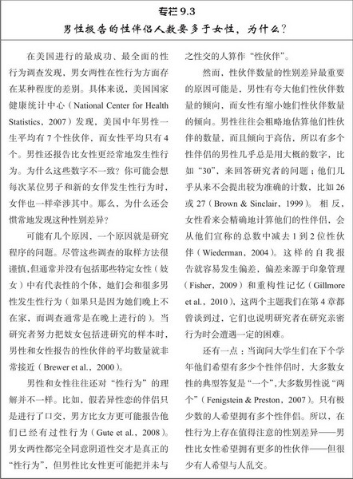
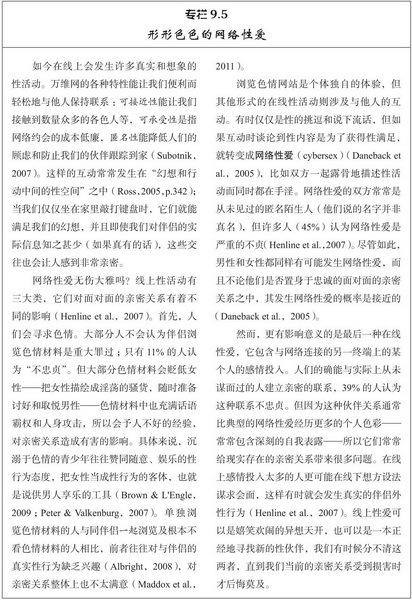
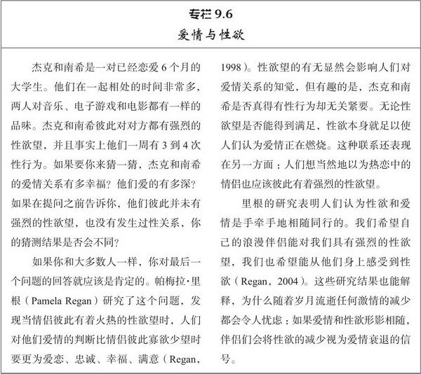
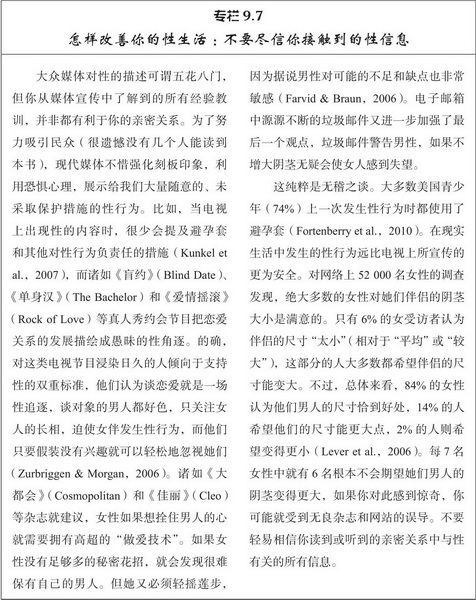
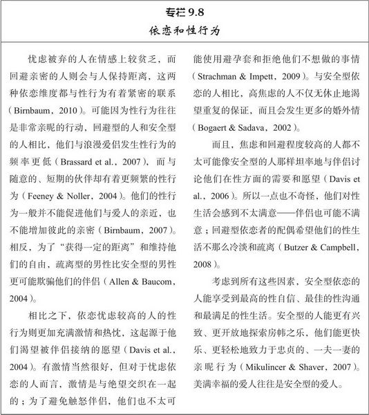

# 第9章 性爱

我要向你请教两个问题。第一，如果有个淘气的妖精能毕生为你提供非常强烈的性高潮，但要求你独自一人去体验，并且决不可再与其他任何人发生性关系，你会同意吗？第二，如果你在蜜月期发现自己的新婚爱人偷偷地服用诸如伟哥的春药，以提高他/她对你的性反应，你会感觉受伤吗？

毫无疑问，不同的人对这两个问题的回答不尽相同。那些和亲密伴侣长期没有发生过性关系的人，可能认为强烈的性高潮（即使是独自一人得到的）非常具有诱惑力。但我们相信大多数人都不愿意放弃与爱人发生身体接触的机会。如果不能与所爱的人共同享受性爱，大多数人会感到失望。我们希望爱人认为我们迷人，并且也希望我们迷恋他们。所以，如果我们得知伴侣对我们强烈的性欲望显然（至少部分地）是因为某种春药作用的结果，我们就会受到伤害（Morgentaler，2003）。

正如这些问题提示的，**人类的性爱远不止满意的性高潮这么简单**。至少有些人认为性行为并不总是意味着亲密的爱情，**但大部分人认为亲密的爱情理应包含性行为**。亲密的爱情关系往往包含了性的成分，而且我们的性行为和性满足常常取决于爱情关系的性质和健康状态。你将会看到，性爱和亲密关系有着紧密的联系。

## 性态度

### 对随意性行为的态度

时代在进步，你可能比起祖父辈的人来更能接受婚前性行为。[^ 1] 在你的父辈出生时，大多数人并不赞成“在结婚之前”发生性行为，但如今只有不到25%的人认为婚前性行为“总是或几乎总是错误的”（ Wells & Twenge，2005）。现在大多数人还能容许发生在婚姻之外的性行为，但这要看具体的环境因素。大部分人一般仍然不赞成彼此没有承诺的人发生性关系（Willetts et al.，2004），因此，我们会持有以情感为标准的性认可态度（Sprecher et al.，2006）：只要未婚的恋人是在有承诺的爱情基础上发生性行为，就可以得到容许。我们不能再指望人们像老太太认为的那样“为婚姻守身如玉”，但亲密关系中的依恋和情感仍然被公认为是性行为最合理的前提。

男性和女性的性观念是否存在差异？平均来看，的确存在差异：男性在性的价值取向和态度体验上更为宽容，虽然随着时代的进步这种差异会越来越小，但差别大小取决于所要测量的具体态度（Petersen & Hyde，2010）。**男女两性在性观念上的最大的差异是对待婚前随意性行为的态度**；男性比女性更可能认为没有爱情的性也可接受。这种差异毫无疑问会影响男女两性对过去性行为的反思：**女性更可能后悔自己过去的行为（如发生一夜情），而男性更可能悔不当初（如有人追求自己时没有发生性关系）**。谈到随意性行为时，女性往往后悔自己的行为，而男性则后悔自己没有行动（Galperin et al.，2011）。

个体的性可能还涉及其他性态度。传统上，人们对女性性经历或性宽容的评价要比男性更为严厉。男性如果有许多性伙伴，会被人称赞为“风流帅哥”，而女性如果有同样数量的性伙伴，则会被人贬斥为“淫荡骚货”。这种不一致就是性的双重标准，它在几年前还非常明显地存在，但今天看来却更为微妙（Crawford & Popp，2003）。如今，挑逗别人并发生性关系的女性，比发生类似行为的男性所受到的评价更为宽容；人们认为前者较后者更热情、更安全、床上表现更好（Conley，2011）。并且，乱交的男女都会受到他人负面的评价（Marks & Fraley，2005）。然而男性和女性如果同样身患性传播疾病，人们对女性的评价远比对男性的评价更为苛刻严厉（Smith et al.，2008），在参与3P的男女中，女性得到的评价更差（Jonason & Marks，2009）。[^ 2] 所以，明显的性双重标准貌似不再存在，但个体的性行为仍然会影响人们对其性经历的评价。

### 对同性恋的态度

到目前为止，我们的讨论还集中在人们对异性恋者性行为的态度。然而，人们对同性恋者的态度确凿无疑要更为负面，许多美国成年人（43%）认为成人之间的同性性关系是“道德败坏的”（Saad，2010）。同性恋会导致各种非议。好的一面是，大部分美国人不再如此看待同性恋，随着时代的进步他们对同性恋者显然变得更为宽容，2010年大多数美国人（52%）前所未有地认为男同和女同关系是“道德容许的”（Saad，2010）。

图9.1　个体对同性恋的宽容取决于其对同性恋起源的看法

这是2007年5月在美国进行的盖洛普民意调查的结果。如果人们认为性取向是人类出生就具有的特性，他们就更可能宽容同性恋——认为同性恋是“可以接受的另一种生活方式”。另一方面，如果人们认为同性恋者是因为后天养育才成为男同或女同，则不会宽容此类行为。

资料来源：Saad, 2007.

有趣的是，正如图9.1所示，人们对同性恋关系的评价与他们对个体成为男同或女同的原因的理解有密切的关联。当人们认为性取向来源于在出生之前就已经确定了的生物因素时，非常多的人认为同性恋是可以接受的生活方式。另一方面，如果人们认为同性恋是个体通过后天养育而习得或选择的结果，则会有相当多的人认为同性恋难以忍受。近30年来，认为个体的性别身份在出生之时就已确定的人数正逐渐在增长，而认为同性恋乃后天养育所致的人已经减少（Saad，2010）。这点很重要，以致现在更多的人认为同性的性取向是先天遗传而非后天教养所致的。（从研究资料来看，他们看来是对的：同性性行为显然部分基于个体的基因[Langstrom et al.，2010]，绝大多数同性恋者认为对于自己的性取向别无选择[Herek et al.，2010]。想更深入地了解这一有启发意义的问题，请看专栏9.1）。

人们对富有争论性的“同性婚姻”这一问题的态度反应，也表现出类似的模式。大部分美国人（53%）反对同性伴侣的正式婚姻（Jones，2010），但他们的人数正在减少，支持同性关系合法化的人数却在增加。具体而言，绝大多数的美国人现在认为应该允许同性伴侣缔结法律认可的民事结合（见表9.1）。

表9.1　 美国人如今赞成同性伴侣的民事结合

以下是《华盛顿邮报》与美国广播公司新闻网(ABC News)联合进行的4次民意调查的结果。每项调查的对象都是全美成人有代表性的样本。如你所见，还在不久之前美国人并不支持同性伴侣的正式法律上的结合，但现在支持了。

注意：每次民意调查的误差在±3个百分点之间。

资料来源：www.washingtonpost.com/polls/postpoll_021010.html.Accessed Augutst 20, 2011.

社会学家也公开发表结论：没有实证论据支持剥夺男同和女同获得与异性恋夫妻一样的法律权益（例如纳税、健康保险、养老金和财产等权利）（Myers & Scanzoni，2005）。的确，美国心理学会已经做出决议：因为（1）**同性关系与异性的伴侣关系运转的方式大抵相同**（Balsam et al.，2008）；（2）**性取向与个体能否成为富有爱心、善于养育的父母根本没有关系**（Biblarz & Stacey，2010）；（3）**婚姻对人们（包括男同和女同）有益**（Riggle et al.，2010），所以如果拒绝在法律上承认男同和女同的同性恋关系，就是坐井观天、偏颇不公和歧视对待。（这份表明心理学家立场的正式决议是非常有趣的阅读材料[只有4页纸的内容]；在下面的网址可以下载这份材料：http://www.apa.org/releases/gaymarriage_reso.pdf。）

所以人们对同性恋的态度正在发生变化，同性恋者的形象可能缓慢而持续地变得更为积极。在公众场合，男同和女同比以前任何时候都更多地出现在人们的视线下，只要看看那些非常流行的电视节目，如《欢乐合唱团》和《摩登家庭》。人们与男同和女同接触得越多，对他们的情感就会越倾向于赞许（Smith et al.，2009）。

### 性态度上的文化差异

一般而言，随着时代进步，性态度会变得更加宽容。如果你是美国人，看到这些变化，你或许会忍不住认为美国比其他国家更为性开放。但是你错了。事实上，与其他国家相比，美国人的性态度看来格外保守。丹麦自1989年、挪威自1993年、瑞典自1995年就在法律上登记男同和女同的亲密关系为同性婚姻（civil union，或译民事结合），享有和异性恋婚姻同样的权益；阿根廷和墨西哥在2010年还给予男同和女同完全的婚姻权利（Warren，2010）。所以，美国在这个问题上肯定没有领先潮流。的确，一项跨文化的大型研究发现，美国对婚前性行为、婚外性行为和同性关系的看法比澳大利亚、德国、英国、以色列、俄罗斯、西班牙和瑞典都要更为保守（Widmer et al.，1998）。加拿大对性也比美国更为宽容，所以即便是一衣带水的邻邦也不一定有着同样的性态度。时代或许在发生变化，但美国人的性态度仍然相对保守。

在美国，非裔美国人的性态度较白人更为宽容，而西班牙裔和亚裔美国人则更为保守（Fugère et al.，2008）。不过，非裔美国人对男同和女同的态度比白人更消极（Vincent et al.，2009），美国共和党成员、宗教原教旨主义者、老家伙比民主党成员、无宗教信仰的人、年轻人更反对同性婚姻（Sherkat et al.，2011）。性态度显然受到各种历史、宗教、政治及其他社会因素的影响：因国家和群体而千差万别。

## 性行为

询问人们心中所想是一回事，而查明他们实际所为是另一回事。研究人的性行为更令人着迷，因为它为理解我们自己的行为提供了背景。不过，请记住，本节中你所读到的内容仅仅是对性行为的宽泛描述，它掩盖了人们实际生活中可能存在的巨大差异。而普通的性行为并不见得就一定比那些不太典型的性行为更健康、更令人满足。我们将会发现，亲密关系中性行为最重要的特点是：性生活为伴侣双方所期待，并且双方都能得到满足。

### 第一次性行为

如今，几乎所有的人（95%）都在结婚前有过性行为（Finer，2007）。你可能还记得，普通的美国人直到25~30岁时才结婚，但男性和女性第一次性交的平均年龄——即一半人开始有性行为，而另一半人没有——现在为17岁。到20岁时，只有少数人（15%）还未曾有过性行为（National Center for Health Statistics，2007）。

这些现象与我们祖父辈的经历迥然不同——他们那辈人一般要晚2~3年才开始发生性关系（Wells & Twenge，2005）——而现在的这种情形利弊参半。一方面，美国青少年比过去更有责任感。大多数青少年在第一次性交时都会采取一定的避孕措施，现在青少年的生育率比起15年之前要低得多（Hendrick，2011）。另一方面，美国青少年却不够小心：在美国超过四分之一的少女感染了性传播疾病！最常见的是人类乳头瘤病毒（HPV），这种病毒会引起生殖器尖锐湿疣，有18%的年轻女性感染了这一疾病（Tanner，2008）。

绝大多数青少年第一次发生性行为的伴侣，都与他们有着稳定的、感情上所重视的亲密关系，他们发生关系的过程都遵循行为越来越亲密的轨迹：接吻导致爱抚，最终发生性行为（de Graaf et al.，2009）。他们第一次的性伙伴较少（21%）为仅仅相识的人或者是一般的朋友（National Center for Health Statistics，2004）。然而，年轻的女性在发生第一次性行为时一般会有复杂的情感体验。她们中的大多数对性行为有着矛盾的情感，有些女孩甚至反对发生性关系，只有三分之一的女孩真正渴望性行为。年轻的男性通常有不同的看法：只有三分之一的男孩具有矛盾的情感，大多数人渴望发生性行为（National Center for Health Statistics，2004）。

一旦伴侣之间发生性关系，其发生的背景会影响性行为的结果。如果第一次性行为遵循了伴侣明确表达出的爱意和承诺，则伴侣们常常会把它体验成关系的积极发展，能增加彼此的亲密情感（Higgins et al.，2010）。然而，如果第一次性行为没有这样的表达，性行为的结果通常是使关系发生令人讨厌的变化，导致不确定性和悔恨（Metts，2004）。伴侣之间的相对权力对比似乎也会产生影响，因为如果与比自己大上几岁的人发生第一次性行为，男女双方往往都会体验到更多的悔恨；与年龄差不多的伴侣的第一次性行为相比，这类伴侣的性行为发生得更早、更不可能使用避孕套（Mercer et al.，2006）。除此之外，男女两性对性经历后悔心态的差别并不大——当性行为方式与他们的道德不一致、醉酒性交或者没有使用避孕套时，男女两性都会感到深深的懊悔（Oswalt et al.，2005）。

### 忠诚关系中的性行为

那么人们发生性行为动机是什么？各种各样的理由实在有几百条。当研究者请得克萨斯大学的学生“列出你能想到的你自己或者你认识的人过去发生性行为的所有理由”时，发现了237条截然不同的理由（Meston & Buss，2007，p.479）。最普遍的积极理由有：“吸引力、感官愉悦、情感、爱恋、浪漫、感情的亲密、性唤醒、取悦他人的愿望、探险、体验、接触、庆祝、好奇和运气”（ Meston & Buss，2007，p.498）。不常见的理由则更工于心计、冷漠无情，涉及各种意愿，如伤害伴侣（“伴侣令我很恼火，所以我要和其他人发生性关系”），赢得某些优势（“我想得到提拔”），或者提高个体的社会地位（“我想给我的朋友留下深刻的印象”）。性动机显然非常广泛，从利他的动机到报复的动机，从不带感情色彩的动机到具有亲密情感的动机。

发生性行为的各种理由如此纷繁庞杂，可以将其大体分为四个方面。其一涉及性的情感成分，以性行为作为沟通、传递爱意和忠诚的手段。其二涉及性的肉欲方面，包括从性行为中获得的感官享受和未来伴侣的长相吸引力。其三是更为实用的理由，包括要实现某些长远目标或完成某些具体目的的愿望，从生孩子到使伴侣嫉妒，范围极广。最后是不安全的理由，包括提高个体的自尊或防止伴侣移情别恋。男性和女性都会同等地赞成情感的理由，但男性比女性更可能因为肉欲、实用和不安的理由而与人发生性行为（Meston & Buss，2007）。这些差异常常非常细微，但男性所报告的性行为理由仍然比女性更多样化、更实际。显而易见，虽然性行为是表示爱意的行动，但它有时却并不带有浪漫的目的。

人们性行为的次数受到其亲密关系性质（和持续期间）的影响。同居的情侣平均每周会有3次性行为，而已婚的夫妻每周的性行为约为2次（Willetts et al.，2004）。然而，这两种关系下的伴侣性行为的次数都多于那些单身人士（Smith，2006），这可能是因为单身人士不太可能拥有稳定的性伴侣。**已婚人士有时或许会羡慕单身人士性放任的生活，但他们性行为的次数通常比单身人士更多**。

另一个和性行为频率有关的重要因素是个体的年龄。请翻到第8章277页的图8.3：老年人性生活的频次一般远不如年轻人。在2009年，大多数25~30岁的美国青年（86%）报告去年与人发生过性关系。然而，50多岁的人只有约一半的男性（58%）和女性（51%）如此报告，而70多岁的人只有少数的男性（43%）和女性（22%）有过阴道性交（Herbenick et al.，2010b）。美国大多数老年人在近12个月没有与任何人发生过性行为。这可能是受到身体老化的影响（Call et al.，1995）：荷尔蒙水平的减少会降低个体的性欲望，而身体健康的衰退会侵蚀个体的活力，所以性欲望随着年岁的增加而减弱一点也不奇怪。然而，对于那些长久厮守在一起的夫妻，存在着另一种更微妙的可能性：随着夫妻双方变成熟悉而老套的性伙伴，探索和新奇的兴奋消失殆尽，长远来看伴侣们彼此从对方感受到的激情会最终平静下来（Vohs & Baumeister，2004）。正如第8章所述，这或许是浪漫的爱情随着夫妻关系的延续变得越来越不强烈的一个原因，其影响的程度（见图8.3）使我们提出以下告诫：如果你是位年轻人，你的亲密关系能得以维系（至少部分地）是因为非常火热的性生活，如果你期望自己对伴侣的激情、性欲和需要将来都不会变化，那将是十分愚蠢的。性行为当然会随着年龄发生变化。

最后一个和性行为频率有关的因素是性取向。当他们的亲密关系刚确立时，男同比女同和异性恋者会发生更多的性行为（见图9.2，在下面讨论性欲望时，请牢记这一性行为模式）。在一起10年之后，每种类型的情侣性交的频次都会下降，但**男同频率下降的最多，他们最终发生性行为的频率还不如异性恋伴侣**。另一方面，如果不考虑亲密关系的持续期间，**女同性行为发生的次数要少于任何其他关系的伴侣**。如果仅仅就女性而论，女性之间的性行为远不及有男人参与时那样频繁。

图9.2　根据亲密关系的类型和持续时间而区分的性行为频率差异

纵坐标的数字显示的是，每种伴侣关系中报告每周至少有一次性行为的伴侣所占的比例。（图中并未提供同居关系持续超过10年的伴侣的数值，因为这种类型的伴侣人数不足以提供可靠的数据。）

资料来源：Blumstein & Schwartz，1983.

### 不贞

世界上大多数人都会强烈反对处在忠诚伴侣关系中的人发生伴侣外性行为（extradyadic sex），即与自己的伴侣或者配偶之外的人发生性行为（Widmer et al.，1998）。[^ 3]故而，我们或可预计性事上的不贞会比较罕见。真的如此吗？研究者对47项不同的调查进行了总结，一共涉及逾58 000名参与者，大部人居住在美国并且已婚，结果发现21%的女性和32%的男性在性方面至少有一次出轨，不忠于他们的爱情伴侣。大部分丈夫和妻子在结婚后从未与其他的人发生过性行为，但约有五分之一的妻子和三分之一的丈夫有婚外性行为（Tafoya & Spitzberg，2007）。

我们都清楚，男性比女性更有可能会欺骗自己的伴侣。他们对随意性行为的态度更为宽容，为了性的花样翻新他们常常会追求伴侣外性行为（而女性则更可能找寻感情上的联系）（Blow & Hartnett，2005）。的确，这种不同的性行为风格在男同和女同的同性关系中尤为突出，同性恋中男性和女性的不贞行为完全不会受到异性的影响。同性恋男子比同性恋女子和异性恋男子有着更多的伴侣外性行为（Peplau et al.，2004）。

图9.3描绘了1980年代初在美国进行的一项大型调查结果，收集了已婚夫妻、同居伴侣、男同和女同伴侣的数据（Blumstein & Schwartz，1983），很显然，**男同性恋者与其他伴侣相比更可能在他们的亲密关系之外和别人发生性行为**。多数情况下，男同的这种性行为方式能得到其伴侣的容许，他们的伴侣也期望同样的自由（Hoff & Beougher，2010）,**有研究者推测：如果异性恋男子的性放任行为没有受到他们女伴保守态度的阻止，很多人就会表现出和男同类似的性行为方式**（Peplau，2003）!

图9.3　自亲密关系建立后个体报告发生伴侣外性行为的人数百分比

同性恋男子显然比其他任何人都有更多的伴侣外性行为，但他们不会“欺骗”自己的伴侣。也请注意，同居的伴侣比已婚的夫妻更可能与他人发生性行为。婚姻比同居有着更彻底的承诺。

资料来源：Blumstein & Schwartz，1983.

当然，并非所有的男性都喜好乱交，也并非所有的女性都是贞洁圣女。还有比性别差异更重要的个体差异，它使得男女两性都更可能发生伴侣外性行为。对某些人而言，性行为与爱情和承诺联系在一起：与自己不很了解或不太关心的人发生性行为，并没有特别的奖赏价值，他们极少与泛泛之交或陌生人发生随意的性行为。然而，对另一些人而言，性行为与爱情和承诺没有多少联系；他们认为“没有爱情的性行为也很好”，与没有感情的人发生性行为也令他们感到满足。这种性态度差别来自于**个体的社会性性行为取向**（sociosexual orientations），它是一种类似于信念和行为等特质的集合，可以用来描述个体对性行为的看法（Simpson et al.，2004）。杰夫·辛普森（Jeff Simpson）和史蒂夫·甘杰斯特（Steve Gangestad）发现，人们在社会性性行为取向上存在个体差异，他们用专栏9.4所列的测量工具来测量人们的社会性性行为取向（Simpson & Gangestad，1991）。只有在承诺和充满深情的亲密关系背景下才愿意发生性行为的人就具有“保守的”社会性性行为取向，而那些在追求性行为时并不寻求足够的亲密和承诺的人就具有“开放的”性行为取向。具有开放的性行为取向的人往往精力充沛、喜欢调情卖俏，总是在寻觅猎取新的性伙伴（Simpson et al.，2004）。他们喜好交际、外向开朗，千杯不醉（Clark，2004）。在全世界，平均来看男性比女性更为开放（Schmitt，2005b）。

社会性性行为指数和人们的伴侣外性行为可能有关联，对于这点你或许不会感到奇怪。与那些有着更为保守的性取向的人相比，具有开放的性取向的人一生之中性伴侣的数量更多，更可能欺骗他们的爱人（Ostovich & Sabini，2004）。大卫·西尔（David Seal）和其同事（Seal et al.，1994）在一项聪明的研究中清楚地阐明了这一现象，参与者是当前正在恋爱的异性恋大学生。参与者要观看并评价一些有吸引力的异性约会视频，录像由计算机呈现。看完录像后，告诉参与者他们可以输入异性对象的图片，从而可以免费和视频中的人约会，并要求参与者表明他们与约会对象发生各种身体亲密接触的意愿强度（如果他们前往约会并玩得痛快的话）。研究者发现在社会性性行为指数上开放的大学生有36%的人输入了约会对象的图片，而保守的大学生只有4%的人这样做。（记住，所有的参与者当前正处在恋爱关系中！）开放的个体比起保守的个体，更有兴趣与新的约会对象发生性行为。社会性性行为指数显然是区分人们是否可能欺骗伴侣的一项重要特征。

然而，有趣的是，如果把这些人的面孔照片并排呈现，观察者一般都能分辨性行为取向开放者（他们看上去就在猎色）和性行为取向保守者（他们显得更为忠贞）（Boothroyd et al.，2011）。**性开放女人的面部特征比保守的女人总显得有些男性化**，更明显的是，虽然她们更吸引人，但男人认为她们并不适合做长期的伴侣。她们显得可爱，但与其他女人相比似乎不值得信赖（Campbell et al.，2009）。**性开放的男人看上去也很有阳刚之气，但女人更喜欢性保守男人的面孔，认为他们更适合做长期的伴侣**（Boothroyd et al.，2008）；她们似乎意识到开放的男人将来都会成为危险的丈夫。

演化学理论对所有这些现象给出了有趣的诠释。男性有着较低的养育投入，[^ 4] 他们能负担得起相对随意的性行为，并且可以认为，在人类漫长的演化历史进程中，性选择[^5] 偏利于那些尽可能多地与女性交配的男性。可是为什么演化也支持女性背叛欺骗自己的爱人？考虑到女性不贞的行为如果败露，可能要付出惨重的代价（Kaighobadi et al.，2008），这样还会有生殖优势吗？有争议性的回答是，女性通过伴侣外性行为并不能生育更多的孩子，但她可能更优秀地生育孩子（也就是说更健康、更俊美的后代）。优质基因假说（good genes hypothesis）认为某些女性——尤其是那些配偶不太合意的女性——能从双重交配策略中获益，通过这种策略她们（1）能追求到长期的伴侣，为她们提供保护和喂养后代的资源，同时（2）暗中从其他男性那里为她们的后代寻求更好的基因（Pillsworth & Haselton，2006）。从某位男性那里得到承诺和安全，而和另一位男性孕育更高挑、更强壮、更健康的孩子，女性生育的后代就特别可能存活下去并能茁壮成长。

现代人的某些行为模式是与优质基因假说相一致的。首先，正如我们在第3章所指出的，在每个月能怀上孩子的受孕期，女性会发现外貌性感、对称的男性——即那些表现出明显阳刚之气、具有健壮体型标志的男性——特别有诱惑力（Thornhill & Gangestad，2008）。其次，如果父母双方能给予子女不同的基因，他们的孩子就会拥有更强大的免疫系统——所以其伴侣有着类似基因的女性，比起那些伴侣具有不同基因的女性来，更可能与其他男人发生性行为，尤其是当她们处在受孕期时（Garver-Apgar et al.，2006）。如果女性仅仅是为了性的多样化目的而追求伴侣外性行为，那么在每个月仅有数天的受孕期里取悦于其他的性伙伴就显得非常愚蠢，但她们恰恰正是这么做的；女性在受孕期比其他时候更容易受到伴侣外性伙伴的吸引，这种倾向在她们的爱人相对丑陋的情况下更为突出（Haselton & Larson，2011）。

如果我们远古的女性先祖如此行事，她们生养的孩子通常比那些由女性正常配偶生养的孩子更为健康和俊美（因而，她们的伴侣外性行为也能提供某些生殖优势）。今天还会发生这样的事情吗？仍会发生。对67项父子关系研究的元分析发现，全世界平均有2%的“父亲”并不知道孩子的亲生父亲另有其人（Anderson，2006）。而且在美国每400对异卵双生子中就有一对有着不同的生父（Blickstein，2005）。

这些结果表明，在遥远的过去男性偶尔会碰到精子竞争（sperm competition）的情形，当两个或更多男性的精子同时充溢着一位女性的阴道时就会产生竞争（Shackelford & Goetz，2007）。有研究者声称为了应对这种情况，长期演化使得男性的阴茎具备了最完美形状，从而能把其他男人的任何精子从他们伴侣的子宫颈排挤出去（Gallup & Burch，2006）。根据常识人们会认为，第二位性交的男性只会把先前男性的精液从子宫颈推进到女性的子宫里，但实际情形并非如此；阴茎纵深的抽插会把任何已经出现在阴道里的精子挤压到龟头后方，随后把精子带出女性的体内。的确，与这种看法一致的是，如果女伴把男性置于精子竞争的风险之中，他们往往会表现出特定的性交方式——在较长的时间阶段里出现更多次非常深的插入——这特别有可能替换掉先前其他人可能留下的精子（Goetz et al.，2005）。

> 这一块完全触及我的知识盲区……

因此，演化学的不贞理论主张，伴侣外性行为对某些女性来说具有生殖利益，为了应对这种挑战男性已经做出适应。另一个完全不同的不贞理论则强调伴侣关系当前的质量。一般而言，你能预料到，如果人们对他们当前的伴侣不满意，并且替代伴侣的质量又很高，就更可能会出轨（Tsapelas et al.，2011）。不幸福的爱人如果有着诱人的替代伴侣就不太可能保持忠贞。如果在这样的情境下他们的确出轨，女性比男性更可能与原来的伴侣分手，而与新配偶建立新的长期的亲密关系（Brand et al.，2007）；因此，女性更可能因为婚外情而更换配偶。然而，即使婚姻生活大体上还算满意，如果伴侣间的性行为乏味、单调、次数太少，男女双方都更可能会追求伴侣外性行为（Krishnamurti & Loewenstein，2008）。如果女性渴望更多的性行为而伴侣做不到，她们就特别有可能会红杏出墙（但正如下一节所示，这种不贞并不会那么频繁地发生）。

### 性欲望

男性社会性性行为指数得分高和不贞行为的多发，或许（部分地）是由另一个更大的两性差异所引起。平均而言，男性比女性有着更高的性驱力（sex drive）。他们比女性体验到更频繁、更强烈的性欲望，通常他们的性活动有着更强烈的动机激励（Vohs et al.，2004）。对年轻人的研究发现，男性每周会体验到37次性欲望的经历，而女性体验到的只有9次（Regan & Atkins，2006）。由于你现在已经是明智的关系科学爱好者，请记住在男性之间和女性之间存在着相当大的个体差异，并且肯定有很多男性长期来看并不如某些女性那样好色。尽管如此，大量事实表明在全世界男性整体上比女性有着更高的性驱力（Lippa，2009）：

- 男性更经常手淫。有着固定性伙伴的男性几乎有一半的人仍然每周手淫一次以上，而置身于性关系中的女性只有16%的人这样频繁地手淫（Klusmann，2002）。在英格兰，16~44岁的男子中73%的人在上一个月手淫过，而女子只有37%（Gerressu et al.，2008）。

- 男性比女性更经常地渴望性生活，在性行为次数一样的情形下，男性比女性更有可能感到不满足（Sprecher，2002）。

- 在亲密关系发展的过程中，男性希望开始发生性行为的时间一般要早于女性（Sprecher et al.，1995）。结果，女性通常是新的亲密关系中决定何时开始性行为的“看门人”。通常来看，当他首先想要发生性行为时，他必须等待，但当她想要发生性行为时，他们就能进行。

- **男性比女性更经常地进行性幻想**（Leitenberg & Henning，1995）。男性每周约有60次想到性行为；是女性只有15次（Regan & Atkins，2006）。

- 男性在性上花费更多的金钱，购买更多的性玩具和色情素材（Laumann et al.，1994）。具体来说，男性有时会付费以获得性交——澳大利亚的一项研究发现，23%的男性至少有一次为性行为付过款——但女性几乎从来不会这样做（Pitts et al.，2004）。

- 最后，我们曾经提到过，男性平均比女性更能接受随意的性行为（Ostovich & Sabini，2004）。他们也愿意与更多的人发生性行为（McBurney et al.，2005）。

把这些现象加在一起，性驱力方面的性别差异或许就不是个小问题了。当异性恋的夫妻协商他们的性互动时，上述每一种现象都或多或少地会引起误解或烦恼。有些丈夫得到的性事次数少于他们想要的，就可能会长期遭受挫折感。而同时，他们频繁的性行为常常惹怒他们的妻子。（在此我们想到了电影《安妮·霍尔》[Annie Hall]在1977年击败《星球大战》[Star Wars]赢得奥斯卡金像奖中巧妙的一幕：在对分的屏幕上，浪漫夫妻双方都在探访他们的治疗师，治疗师问他们的性行为频率：他悲叹，“几乎从来就没有，或许一周3次，”她则抱怨，“经常发生，我肯定一周3次。”）在性驱力上典型的性别差异意味着有些伴侣在性欲望方面会面临不协调，这可能会引起麻烦（Schwartz & Young，2009）。这种不协调随着时间推移只会变得更严重；大多数女性在绝经期之后性欲望都会下降（Birnbaum et al.，2007）。一项对德国60多岁的老年夫妻研究发现，没有任何一个妻子能满足丈夫想要的性行为次数（Klusmann，2006），对这样的研究结果我们应该不会奇怪。

男性比女性期待更多的性行为，可能还会引起更严重的后果。女性作为决定性行为发生与否的看门人，会发现男性为了换取性行为愿意做出各种让步（Kruger，2008b）。男性对性行为的更多兴趣可能使较小利益原则[^ 6] 发生作用：女性控制了男性想要的事物的使用权利，这让她们拥有了影响男性的力量。在某些关系中，性行为可能是“亲密关系市场中女性作为卖方，而男性作为买方的一件待价而沽的珍品”（Baumeister & Vohs，2004，p.359）。

这点看上去粗鄙不堪，但情侣们无需介意于这一现象，以免影响他们的交往。相反，人们总是想当然地认为，女性如果长期接受男性许多的礼遇——比如昂贵的约会和其他令人满意的招待——就应该有义务使他们关系更加亲密（否则她就应该停止接受这些礼遇）。咨询专栏作家认可了这一点：“女性并不认为免费的宴请就应以性来报答，但承担所有约会开销的男性却认为女性对浪漫的、最终亲密的关系感兴趣。否则他们就会觉得被人利用并痛恨此事”（Mitchell & Sugar，2008，p.B2）。这一模式的消极后果是，当男性感到女性“亏欠”他们时，就会理直气壮地施加压力或强制女性发生性行为（Basow & Minieri，2011）。

### 安全而明智的性行为

每天都会发生很多随意的性行为，但只有部分性行为是安全的。大多数大学生——约四分之三——都曾有过随意的性关系（hookup），即和没有恋爱的伴侣发生性关系，而且常常只持续一个晚上，根本不会有任何建立长期关系的愿望（Paul et al.，2008）。大多数一夜情的双方是非常熟识的——很多时候性伙伴是自己的朋友——但有很多一夜情（37%）的双方并不认识或者不是很了解（Grello et al.，2006）。一些一夜情只有接吻和性爱抚，但大约有一半的当事人会发生口交或者性行为（尤其如果有人醉酒时），如果发生了性行为，大概只有一半的情形会使用避孕套（Paul et al.，2008）。

在恋爱关系中性行为更加不安全——大学生在和新的恋人开始发生性行为时，只有—半的人会始终坚持使用避孕套（Civic，2000）——而在校园之外，情况更为严重。对在约会网站上寻找男友的740名妇女（大多数人的年龄在30岁和40岁左右）的调查发现，当她们第一次和新的伙伴面对面坐在一起之前，一般非常谨慎；先要进行漫长的对话，检查对方的背景，并且在答应会面之前要商谈好界限，然后才会在公共场合会面，携带上辣椒水喷雾器，或者让一位朋友待在附近。但所有这些小心举措并不能确保安全的性行为。或许因为她们（相信）彼此已经非常了解，30%的妇女在第一次和新伙伴会面时就会发生性行为。并且总体上看，不论何时发生性关系，和线上伴侣会面的妇女在第一次发生性关系时有77%的人不会使用避孕套（Padgett，2007）。

因而，很多人在和新伴侣或者暂时的伙伴发生性行为时并没有使用避孕套。而在美国每5位少女就有一位感染了生殖器尖锐湿疣（Tanner，2008），他们就是在这样的环境下放弃了安全性行为。究竟怎么了？为什么这么多明智的人却会发生如此多的不安全的性行为？有几个原因：

- 低估了不安全性行为的风险。首先，很多人的数学非常糟糕。比如，某位女性在与某位感染了人类免疫缺陷病毒（human immunodeficiency virus，HIV，正是这种病毒引起了艾滋病）的男性的一次未采取保护措施的性接触中，感染艾滋病的概率实际上非常低，只有0.2%。但如果这种低概率的事件不断发生，其将来发生的可能性必然会提高。这里的问题是：如果某位女性与有艾滋病的男性发生数十次未采取保护措施的性行为，她HIV变为阳性的可能性非常高；她感染的几率非常高（Linville et al.，1993）。

  类似地，几乎所有人都低估了过去性生活活跃的新伴侣感染性病累计的总体风险（Knauper et al.，2008），这种虚假的安全感妨碍了避孕套的使用。性伴侣众多的人比我们想象到的更有可能感染性病，即使与每一个性伴侣单次性接触的风险很低。如果伴侣俊美动人，我们尤其有可能低估这种风险；长相越俊美，我们认识到的风险就越低，如果发生性行为就越不可能使用避孕套（Knauper et al.，2008）。

  有一种特别的偏差叫特殊安全错觉（illusion of unique invulnerability），也会影响到我们对风险的估计。大多数人都会认为不幸的事件通常更可能发生在别人身上，而自己不会这么倒霉，所以我们不会采取明智的预防措施，以避免可以预见到的危险（Burger & Burns，1988）。具有讽刺意味的是，正是那些认为自己不太可能会感染性病的人更不可能使用避孕套，这使得他们更可能感染性病。人们甚至在已经患上性病之后，仍认为自己不可能感染性病。对全美有代表性的年轻成人的调查发现，在衣原体、淋病或毛滴虫病检测呈阳性的年轻人中只有22%的人在近一年中注意到自己的病症，**所以大部分人并不知道自己身患性病**——这些已患性病的人之中只有28%的人认为自己可能感染性病（Wildsmith et al.，2010）。在评估性行为的风险时存在各种偏差，或者只是懵懂无知（O’Sullivan et al.，2010）。

- 错误决策。本打算使用避孕套的人有时头脑发热会改变主意，之后又会对他们的决定感到后悔。是什么原因致使他们做出了糟糕的决定？原因之一是性唤醒。当大学男生变得性兴奋时，他们看待事物的角度和他们清醒时已然不同：花样变化的性行为（比如掌掴屁股、二王一后的3P、与60岁老妪的性交）看起来更有诱惑力，存在道德问题的行为（比如偷偷塞给女性毒品以换取性行为）看起来更能接受，而避孕套则不怎么令人愉快（Ariely & Loewenstein，2006）。男性一旦变得性兴奋，真的会“失去自制力”。

  过量饮酒也会影响我们的决策，在性唤醒时尤为如此（Ebel-Lam et al.，2009）。当人们醉酒后，和别人第一次发生性行为时不太可能会使用避孕套，这部分是因为醉酒使他们忽视了可能发生的危险，而把性事想得太过美妙（Cooper，2006）。这种现象被称为酒精近视（alcohol myopia），指的是人们在醉酒后思考和加工信息的能力会降低（Giancola et al.，2010）。这种受限的能力意味着他们只能把注意力集中在最直接和最明显的环境线索。人们醉酒后，头脑里只有充满诱惑力的性伴侣，他们完全忘记了之前要使用避孕套的意图，尽管避孕套就装在他们的口袋或者钱包里（MacDonald et al.，2000）。**酒精和性唤醒显然是导致人们发生高危性行为的罪魁祸首**。

- 人众无知。随意性行为的一个突出特征是，它并不如大多数人（包括寻求一夜情的人）所认为的那般受人欢迎。男女两性从自己的随意性行为中体验到的乐趣并不如他们认为得那般美妙，[大多数的男人和女人都喜欢只为了随意性行为而与人约会（Bradshaw et al.，2010），]尤其是一夜情发生性交或口交的女性会感到惴惴不安（Fielder & Carey，2010）。尽管如此，大多数年轻人仍然认为其他人一般会赞同这类行为，因此他们会感到迫使他们发生随意性行为的社会压力（Hines et al.，2002）。

  这种心理现象就是人众无知（pluralistic ignorance）的表现，**如果人们错误地认为他们的情感和信念与其他人不一样，就会产生人众无知**。团体中的人群通过错误解读彼此真实的偏好，最终每个人都认为大家所遵循的行为规范获得了广泛的认同，但几乎没有人私下支持这种规范。因而，大学男生或许会明智地希望发生安全的性行为，但却又做不到，因为他们错误地认为安全性行为并不流行。我们对他人态度和行动的判断会影响我们的性行为，但这些判断并不总是正确的。的确，女性认为男性对避孕套持更消极的态度，但男性未必如此（Edwards & Barber，2010）。如今，男性和女性在使用避孕套的意愿上并无差别（Hood & Shook，2011）

- 权力不等。在第12章我们将看到，权力是让伴侣按你的期望来行事的能力。如果伴侣双方拥有的权力不等，而强势一方反对使用避孕套时，他们就不太可能会使用避孕套（Woolf & Maistro，2008）。一般而言，**女方权力越大（Pulerwitz et al.，2000），越诚实和直率（Impette et al.，2010），她和伴侣在发生性行为时就越有可能使用避孕套**。

- 禁欲教育。为了使青少年相信禁欲是唯一正确的做法，一些禁欲教育项目对学员宣称避孕套没有作用（这当然是无稽之谈）（Lin & Santelli，2008）。适得其反的是，当这些青少年发生性行为时——大多数青少年都会这样做——他们与其他的青少年相比更不可能使用避孕套（Rosenbaum，2009）。

- 亲密感和愉悦度的减少。在所有影响安全性行为的因素中，最重要的阻碍或许是，人们不使用避孕套通常能更好地享受性生活。男女两性都觉得如果没有避孕套，性事更令人快乐，并且男性尤其可能喜欢没有防护的性行为（Randolph et al.，2007）。未使用避孕套的人们认为他们的性事更为亲密，情感上也更为满足（Smith et al.，2008），因此，很多人（30%的男性和41%的女性）的性伙伴试图说服他们不要使用避孕套。显而易见，有着10位以上性伙伴的人——因而感染性病的累积风险非常高——和性伙伴人数较少的人相比，更可能劝阻其新伴侣采用避孕套（Oncale & King，2001）。

避孕套的使用显然受到各种不同影响因素的支配。教育可以消除人们的错误认识，但要改变对避孕套冷漠、厌恶的认知却非常困难。这里给读者两条建议。当把避孕套当做性生活前戏的一部分时，避孕套不太可能会“大煞风景”（ Scott-Sheldon& Johnson，2006）。不要认为避孕套是打断你们做爱的烦心之物；时机适当时，帮助你的伴侣戴上避孕套，能创造性地、从容不迫地提升而非降低你的兴致和预期。我们还建议，当你的确使用避孕套时，在今天，比不使用避孕套能给伴侣双方传递出更多的尊重、关心和关注。说服你进行不安全性行为的新伴侣，很可能不如乐于尊重你意愿的伴侣珍视你和你们的亲密关系（Otto-Salaj et al.，2010）。请理直气壮地要求新伴侣使用避孕套，你当然不必为此感到尴尬。如果你提到避孕套，大多数人是欢迎的——如果伴侣不愿意按你期望的去做，你大概无论怎样也不会愿意与此人分享你自己。

## 性满足

人们在性关系中的行为表现固然重要，但人们对这些行动的感受更有影响力。令人欣慰的是，如果人们身体健康，性生活不存在问题，拥有稳定的伴侣，大多数人都会有幸福的性生活（Heiman et al.，2011）。例如，当上述三者具备时，参与美国波士顿一项大型研究的妇女只有6%的人对她们性生活整体上不满意（Lutfey et al.，2009）。另一方面，只有约一半（51%）的波士顿样本在近一个月有过性行为；许多人没有合适的伴侣，还只是对性生活没兴趣。而性活跃的人超过三分之一的人（39%）碰到各种令人沮丧的问题，如疼痛、缺乏性欲、难以获得高潮等。中老年男性的性功能发生问题的比例也类似（Klapper，2010），所以如果结合所有这些影响因素，美国45岁以上的人只有少数人（43%）目前具有满意性生活（Crary，2010）。

这种调查结果令人失望。如果我们身体健康，我们能做些什么来获得更多的性满足？没错，许多研究都揭示了一些深刻的洞察。有趣的是，**在美国只有单一爱人的人比起那些有着两个或更多性伙伴的人，更普遍地体验到高度满足的性生活**——一般而言，只要夫妻极为忠诚于他们的伴侣关系，珍视一夫一妻制（彼此保持忠贞），他们就可能对性生活满足（Waite & Joyner，2001）。拥有一个以上的爱人或许令人感到刺激，但大多数人发现忠诚于某个特定的配偶似乎更充实。的确，美国男人从具有稳定亲密关系的伴侣所获得的性愉悦要比从其他任何人所获得的都要多（Herbenick et al.，2010a），在德国、西班牙、巴西、日本和美国，性伴侣越少的男子性生活更满意（Heiman et al.，2011）。

人们发生性行为的频率也有着重要的影响，至少对于男人而言是如此。在一项经典的研究中，每周有3次或者更多次数性行为的夫妻中有89%的人报告对他们的性生活感到满足，而一个月仅有一次性行为的夫妻中只有32%的人感到性满足（Blumstein & Schwartz，1983）。当然，这类相关现象的影响因素很多，但有两种模式值得注意。首先，**性生活的频率对于男性比女性更重要**（Heiman et al.，2011），其次，更频繁的性行为的确能增加新婚男士在性生活中体验到的满足感（McNulty& Fisher，2008）；随着时间的流逝，如果性行为变得更为频繁他们会感到欣喜，而如果性行为减少则会感到苦恼。

但无论性行为的频率怎样，只要它能实现人类对自主（autonomy）、能力（competence）和交往（relatedness）的基本需要，性的互动就最有奖赏价值。根据**自我决定理论**（Self-Determination Theory）的基本观点，**如果我们日常参与的活动能让我们选择和控制自己的行动（即自主），感到有信心和能力来应对（即能力），并且能建立与他人的亲密联系（即交往），我们就会感到很幸福和健康**（Deci & Ryan，2000）。性生活当然也符合这一理论观点（Smith，2007）：最美好、最满意的性互动可以让我们做我们想做的事情，并且能完成得很出色，在此过程中还能感受到伴侣的爱恋和敬重。

> 自我决定论（英语：Self-determination theory，简称SDT）是一个有关于人类个性与动机的理论，考量到个人与生俱来的天赋资质与心理需求。 主旨在探讨人发自内心的动机，排除外在诱因与影响，其中又把重点聚焦在个人激发与自我决定。
>
> 在1970年代，自我决定论的研究着重在探讨内在动机与外在动机，并尝试了解内在动机影响人类行为的途径。但一直到1980年代中期这个理论才获得稳固的研究依据与支持，而直到2000年代学者才套用自我决定论到不同领域，例如社会心理学、正向心理学。
>
> 自我决定论研究至今的关键依旧在内在动机与外在动机的相对关系，内在动机意指促使一个人行为的理由是因为这样的行为本身能带来娱乐与满足感，相对来说外在动机代表有外在的诱因促使个人做出该行为，内化则是指使外在动机转变成内在动机的一个动机转换历程。 

对此你可能不会感到奇怪。值得注意的是，很多人的性生活通常不太令人满意，因为他们的性行为无法满足这些需要。具体来说，那些支持传统性别角色的人往往想当然地认为，在性生活中男性应该居于主导地位，而合乎体统、女人味十足的女性应该对她们的男人温和恭顺、俯首帖耳；男方采取各种主动措施，女方则按他的要求来行事（Sanchez et al.，2006）。问题是这些期望把女性置于被动的地位，这会损害她们在性生活的自主性；她们很少能选择性事日程，很少能占据性事的主导权，因此她们在性事上常常不能得偿所愿。剥夺女性的主动权和控制权会削弱她们的性欲望，降低她们的性唤醒，使她们更难获得性高潮，所以她们对性生活没有多大的兴趣（Kiefer & Sanchez，2007）。从男性的角度来说，总是处在控制地位也令某些男人不悦。许多男性希望他们自己是其伴侣渴望的有吸引力的目标，期盼他们的爱人能不时地居于主导地位；当女性能发起性行为并且自信地表现自我而非消极被动时，他们也会感到很兴奋（Dworkin & O'Sullivan，2005）。因此，**传统性别角色的规定看来同时剥夺了男女双方的某些性自由和性放任，致使他们的性互动达不到原本可能的满足程度**；彼此允许更多自主权和选择权的夫妻能享受到更为满足的性生活（Sanchez et al.，2005）。

促使我们进行性互动的动机似乎也会影响我们的性满足（Stephenson et al.，2011）。前面我们提到过（请翻到287~288页），人们发生性行为的理由多种多样，运用我们在第6章介绍过的接近和回避维度，[^ 7] 就可以对这些理由进行整理分类。有时性行为的目的是为了获得（或者“接近”） 积极结果，比如亲密感的提升或个人快乐的增加等。例如，如果我们通过性行为来寻求鼓舞和充实伴侣关系的亲密感（这可能是令人振奋的情感理由），我们就是在追求积极的结果。相反，如果性行为的目的是为了预防或避免不愉快的结果，则我们就在追求不同的目标。我们可能试图去防止伴侣的愤怒或者避免伴侣对我们失去兴趣（这可能是令人烦恼的不安理由）。你认为哪一种动机更充分呢？UCLA大学生的日记揭示出，如果性行为有着积极的理由，则人们对性生活会感到更加满意、亲密和有趣。相形之下，如果性行为的目的是为了避免有害的结果，则人们会体验到更多的消极情绪，他们的关系也会受损；久而久之，为了回避理由而进行性行为的伴侣更有可能分手（Impett et al.，2005）。在床榻之上有着强烈接近动机的人，对他们的伴侣也会有着深刻而持久的性欲望（Impett et al.，2008）。很显然，那些通过性行为以表达对伴侣的爱意、加深彼此的关系、给予和获得身体快感的人，比起那些因其他理由而发生性行为的人会更热切地追求（并享受）性互动（Cooper et al.，2008）。

### 性沟通

值得一提的是，影响性满足的另一个重要因素就是性沟通。许多人在谈到性时会感到笨嘴拙舌，他们在性事上经常沟通不良，以致根本不再谈论性了。夫妻经常在发生性行为时从来就未曾提及性本身：一方通过呻吟、亲密的触碰和解开衬衫的纽扣来表示性欲望，而另一方只是不作一点反抗来默默地表示他/她的赞成（Vannier& O'Sullivan，2011）。没有言语沟通的性行为有问题吗？当然会发生问题。如果我们从来不和我们的伴侣真诚、无畏、坦率地探讨我们的性喜好和性厌恶，则会对我们的生活造成巨大的伤害，其重要原因是：在性行为上清晰的沟通与更多的性满足有关（MacNeil & Byers，2009）。那些能坦率谈论性行为的人与那些只会不时地嘟囔抱怨的人相比，前者与伴侣有着更为满足的性互动。

著名的性行为研究专家威廉·马斯特斯（William Masters）和弗吉尼亚·约翰逊（Virginia Johnson）在一项有启发性的研究中着重指出良好的性沟通的重要性，该项研究比较了异性恋者、男同和女同的性经历（Masters & Johnson，1970）。研究者观察了伴侣们的性行为，并广泛地对他们进行了访谈，结果发现**男同和女同们性经历的主观质量——包括心理上的投入、对伴侣的需要和愿望的应答性、对性经历每个方面的享受——实际上要好于异性恋者**。同性性行为是更满意的性行为。男同和女同性互动的优势之一是参与者双方都是同性；男同和女同都知道他们自己的喜好，也能合理地预测他们伴侣的喜好。然而，马斯特斯和约翰逊认为有价值的同性关系的首要基础就是良好的沟通。男同和女同能比异性恋者更轻松、更坦率地谈论他们的性感受。他们会彼此询问双方所期望的动作，感觉良好时会给出反馈，并且一般会指导自己的爱人怎样取悦自己。相形之下，异性恋伴侣则会“持续忽视”公开的性沟通并显示出“对伴侣缺乏好奇心”的自我毁灭倾向（Masters & Johnson，1970，p.219）。

令人欣慰的是，如果异性恋者能诚实地告知对方自己喜好和讨厌的性方式，以及对方应该怎样做，他们就更可能拥有同性恋者一样高质量的性生活（MacNeil & Byers，2009）。这种讨论本身就非常亲密，经常进行性沟通的伴侣不仅能享受到更高的性满足，而且对他们的整个伴侣关系也更为满意（Byers，2005）。

良好的沟通也有助于我们应对某些尴尬情形，比如我们不想发生性行为，以及我们的意图被人误解。你或许已经获悉女性和男性有时对性情境的诠释存在严重的差别，这会引起挫折感和敌意。男性比女性有着更强烈的性欲望，他们确实比女性更经常地想到性，所以他们往往能从女性根本不带有性意图的中性行为中品读到性兴趣（Haselton，2003）。在安东尼娅·阿贝伊（Antonia Abbey）的经典研究中首先证明了这一点，她首先邀请一些男人和女人，让他们彼此相识，然后一对一地进行闲谈，同时让另一对男人和女人观察他们的谈话（Abbey，1982）。参与互动的男人和旁观的男人都倾向于把女方的友善之举解读为表示性兴趣的信号，即使参与谈话的女性根本没有激起性欲望的意图，旁观的女性也没有觉察到这类行为。**男参与者真实觉察到的性挑逗信号实际上并非女方有意为之，或者可能根本就不存在**。

这类事情并不罕见；大多数男性（54%）至少有一次误解了女性的性意图（Jacques-Tiura et al.，2007）。毫无疑问，这些错误大多是无心之过，根源于对非言语行为的无知，而男性在这点上尤甚于女性（Farris et al.，2008a）。并且，**拒绝传统性别角色和珍视男女平等的男性不太可能犯这些错误**（Farris et al.，2008b）。然而，具有大男子主义思想的男性对女性兴趣的错误判断非常普遍——特别是在双方都醉酒后，这些“大丈夫”把性行为视为逐利竞赛，并且喜欢支配女性（Jacques-Tiura et al.，2007）。正是这些男性最有可能实施性胁迫，而对女性性兴趣的错误知觉通常是这类不幸事件的前奏（Farris et al.，2008b）。清楚明确的沟通有时是让这类男性明白过来所必需的——最有效的拒绝是自信果断、前后一致和坚持不懈的（Yagil et al.，2006）。当需要表明你的感受时，不要扭捏作态或者玩笑戏谑；请清楚地表明你没有兴趣，必要时还得重复表态。

### 性满足与关系满意度

最后，我们要注意性满足并不是在真空中实现的；如果我们对与伴侣的亲密关系并不如意，就不可能对我们的性生活感到满足。性生活和亲密关系的满足是并驾齐驱的。不论伴侣们已婚还是同居，异性恋还是同性恋，能享受到最满意的性互动的人一般也对他们的亲密关系非常知足，并且会忠于他们的关系（Holmberg et al.，2010）。

性满足和关系满意度存在关联的原因之一是它们都受到类似影响因素的支配。相似性和压力就是这样两个影响因素。我们喜欢那些与我们相似的人，当伴侣有着类似的性经历时伴侣们就会感到更为满足。丈夫和妻子在以往性伴侣的数量上相差越大，他们的婚姻就可能越不幸福（Garcia & Markey，2007）。而且，在工作场所和家庭之中所遭逢的骚扰和压力也会同样地影响到性满足和关系满意度；被挫折感和困难所困扰的人一般在性关系和人际关系上都不会感到满意（Bodenmann et al.，2010）。

然而最为重要的是，有着美好性生活的亲密关系往往更令人满意，因为充实快乐的性生活使得伴侣关系更让人感到满足，反过来，对伴侣的爱意也使得性生活更加具有奖赏价值（Yucel & Gassanov，2010）。与伴侣心旷神怡的性生活可以舒缓压力，怡情养性，这是独自一人通过手淫得到的性高潮所无法比拟的。随后，这种积极的情绪和乐观的展望也会增加后来的肢体之爱和性活动的亲密感（Burleson et al.，2007）。因而性满足能增加关系满意度，反之亦然。

而且，这一模式会持续终生。对平均婚龄为43年的老年夫妻的研究发现，虽然他们的性行为不如过去那么多，性生活仍然是他们满意婚姻的重要组成部分（Hinchliff & Gott，2004）。总的来说，对性满足的研究表明，性行为并不是自动使亲密关系变得美满的灵丹妙药。最美妙的性行为似乎还依赖于：

- 个体特殊的性欲望能得到伴侣的理解和尊重，这样他/她的需要才能得到满足，

- 重视自己的伴侣并致力于维护好伴侣关系，

- 愉快地彼此相处，不论是在床上还是床下。

## 性胁迫

如果伴侣一方在违背另一方意志的情况下，故意哄骗、引诱、威胁、甚或强制对方与之发生性接触，则会损害伴侣的性互动和伴侣关系。这类行为有多种形式（DeGue & DiLillo，2005）。逼迫他人发生性接触主要有以下施压方式：（1）通过言辞威逼利诱。包括虚假许诺、制造内疚感或者威胁要结束伴侣关系；（2）和人一起饮酒或者吸毒以削弱对方的反抗；（3）暴力威胁——或实际上使用暴力——强迫别人屈从。这样引起的有害性行为范围较广，包括一般的触碰和爱抚，以及严重的插入和性交。

图9.4描绘了上述两个维度。归纳起来，图中描述了四大类型的性侵犯。它们之间的界限并不精确——根据具体的环境它们可能会有交叉——但这些区分仍然很实用。位于第1象限的性侵犯指个体用言语哄骗他人屈服于他/她所不愿意的身体触碰。因为这种侵犯相对而言并不是很严重（不会违法），所以一般不认为是性胁迫；大部分大学生想当然地认为这类行为是约会过程中再平常不过的麻烦事（Oswald & Russell，2006）。许多人仍认为性行为是一场男女互为对手的角逐——女性持有性奖品，而男性则通过欺骗、坚持和强权来赢得这种奖励——所以在交往中，男性根本无视女性是否有兴趣，只要有可能就偷偷摸摸地侵扰女性，这似乎并不是什么大不了的事情（Krahé et al.，2007）。然而，因为这些行为违背了伴侣的意愿，所以它们并非无害，这些行为亵渎了伴侣。如果男性这样侵犯他们的女伴，他们就非常有可能暗中对女性持有敌视态度，认为所有的女性在私下里都喜欢被人强奸（Hoyt & Yeater，2011）。这些行为对亲密关系也有侵蚀作用，与性的不满足和关系的不满意都有关联（Katz & Myhr，2008）。

图9.4　性侵犯的四大类型

结合两个不同的维度——施压方式和引起的有害性行为——就可以描绘出四大类不正当的性行为。

资料来源： DeGue & DiLillo，2005.

在第2象限，性侵犯表现为通过花言巧语或者将人灌醉而将阴茎插入女性体内。如果女性不积极主动、毅然决然地抵制这种行为，人们就会认为女性也要担当此类行为的部分责任（Cohn et al.，2008），所以这类行为很少被提起诉讼。第3和第4象限包括各种形式的暴力（或者使用药物导致受害人昏迷不能反抗），这类暴力行为显然不合法。第4象限的“强奸”如果证据确凿就会被提起公诉。

大多数人都不会对异性实施上述任何形式的性胁迫（Spitzberg，1999）。尽管如此，性胁迫却惊人地普遍。具体的计数取决于对性胁迫的精确定义，但6位女大学生中每2个月就有1位会遭遇某种形式的性胁迫（Gidycz et al.，2008），大多数女性（56%）在大学生活中都会受到这类骚扰伤害（Crown & Roberts，2007）。整体来看，男性会比女性更多地使用暴力——男性更可能是第3和第4象限性侵犯的施暴者而非受害者——但女性和男性一样有可能用言语胁迫不情愿的伙伴发生强迫的性交；大约有25%的男性和女性会制造此种恶行（Spitzberg，1999）。

这些性侵犯行为当然没有一丝同情心和爱心，甚至一开始就心怀不轨。实施性侵犯的人往往会对异性持轻蔑、冷酷和粗暴的态度（Hines，2007）。性侵犯还会造成一定的伤害：女性如果受到强迫或恐吓而发生违背意愿的性行为，其身心健康都会受损，特别是在她们一而再地受到侵害时（de Visser et al.，2007）。

所以普遍存在的性胁迫会带来破坏性的结果，不论其以何种形式出现。该怎样行动来减少性胁迫的发生呢？我们有几个建议。首先，请当心那些把性行为看成角逐某种利益的恋爱对象。他们在内心里不可能把你的利益放在首位。其次，请远离麻醉类物品；不论是酒精还是毒品都可能会使人举止不端，的确大多数性胁迫都会涉及酒精和毒品（Hoyt & Yeater，2011）。第三，下决心坚定地反抗任何性侵犯的苗头。如果情况恶化，能够预先就断然拒绝不正当性行为的女性，不太可能被动地屈从于男性的侵犯（Gidycz et al.，2008）。第四，在你开始亲密交往前，直接、坦率地和伴侣说清楚性界限，这样可以避免不必要的危险。（至少，告诉你的伴侣，“如果我说‘不可以’，真的是拒绝你，不是欲迎还拒。”）沟通不良和误解经常会引起性胁迫，如果提前表明行为的底线，错与对的界限就非常清楚（Winslett & Gross，2008）。最后，把爱人视为和你平等的伴侣，他/她的喜好和快乐和你的一样重要。这种尊重和体贴是和性胁迫不相容的，如果你和爱人都这样想，你们更可能体验到更满足的性生活（Rudman & Phelan，2007）。

## 请你思考

查德和珍妮弗相爱了。查德对珍妮弗有着强烈的性欲望，并且一直很享受和她的性生活，但他仍然感到一些缺憾。珍妮弗通常也喜欢性生活，看起来也很享受，但她很少积极主动，一般都是查德一个人在忙活。珍妮弗往往只是平躺在床上，查德希望她更主动点，不时地能带带头。他期望珍妮弗在床上能多点花样，偶尔也能爱抚他全身。不过，他并没有把自己的想法告诉珍妮弗。他们的性生活还算不错，但算不上美满，查德担心任何的抱怨只会使事情更糟糕，而不会有利于他们性生活的改善。

你认为查德和珍妮弗的未来会怎样？为什么？

[^ 1]: 显然并非所有的人都会结婚，但“婚前性行为”是比“未婚性行为”更常用、更方便的用词。

[^ 2]: 不管3P是两女一男还是两男一女，人们对女性的评价都更为负面。

[^ 3]: 本节我提及的“性行为”都指阴道性交。伴侣的出轨行为有很多种，从色情短信和网络性爱到接吻、性爱抚、口交和性交（Luo et al.，2010），但人们对于哪些行为才算“出轨”却存在分歧（Kruger et al.，2010）。因此为达成共识，我将侧重几乎每个人都认为不忠的行为。
[^ 4]: 这个关键概念在第1章34页曾介绍过。
[^ 5]: 这个概念也见第1章33页。
[^ 6]: 需要提醒你较小利益原则吗？请翻到第6章185页专栏6.1。
[^ 7]: 需要提醒你接近动机和回避动机的概念吗？请翻到第6章191~195页。