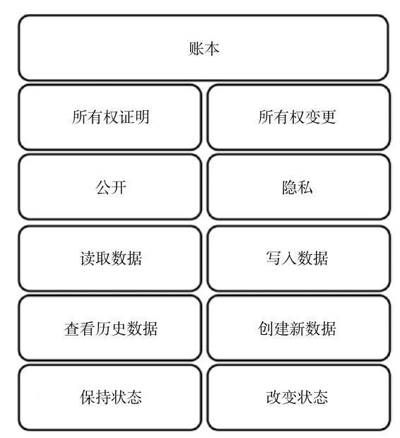

# 第2部分 为什么这个世界需要区块链

这一部分我们会解释区块链旨在解决什么问题，以及这个问题有多么重要。我们需要你对区块链所能解决问题的背景以及该问题与信任和诚信的联系具有一定的了解。在本部分的最后，你会对区块链存在的价值有一个更为深入的理解，并且会对区块链本身产生不同的理解。

## 第4讲 发现核心问题

### 面对像羊群一样各自独立的计算机集群，牧羊犬在哪里

前几讲我们指出了区块链的作用，并且强调了在一个完全分布式点对点系统中区块链的重要性：在一个分布式系统中确保系统的完备性。但是，为什么在一个分布式系统，或一个特殊的点对点系统中确保系统的完备性那么**重要而困难**呢？在本讲中，我们会探讨完全去中心化点对点系统的完备性与信任之间的关系这个问题。对以上问题的理解取决于你对完备性的重要程度的理解，以及是否能意识到区块链所解决的这个核心问题。最后，我们会介绍区块链能为其带来极大价值的一些行业。

### 隐喻

在很多语言中，都会用成语或短语描绘这样的一个场景：一个人试图协调组织纷乱的人群。比如在英语中会用“尝试去组织一群猫”来描述管理一群倔强而特立独行的动物是一个多么巨大的挑战。在一个完全去中心化的点对点系统中，我们也会遇到类似的问题，而管理的对象此时变为一台台独立工作的计算机，它们没有中心化的控制方来进行协调。接下来我们来看这个去中心化的点对点系统面临的主要问题，以及区块链和这些问题的关系。

### 点对点系统中的信任与完备性

信任与完备性是一枚硬币的两面。放在软件系统当中，完备性是对一个系统的非功能性特征的描述：安全、完整、持久、正确，并且不会失控和产生错误。而信任则引申至人类之间对可靠，真相以及对一些事或人无理由的相信。信任往往建立在早期，并且会受到合作行为的影响而发生变化。

在一个点对点系统中，这意味着人们如果相信这个点对点系统，并且这个系统运作的结果增强了他们的信任，他们就会进一步进入这个系统，并且持续给这个系统作出贡献。整个点对点系统通过系统的完备性来满足用户的预期，并且增强他们对系统的信任。如果因为系统缺乏完备性使得用户没有对这个点对点系统增加信任，那么用户就会抛弃这个系统，进而使得这个系统走向终结。意识到信任对点对点系统的重要性之后，核心的问题就变成了：我们如何在一个完全去中心的点对点系统中提供并确保完备性？

满足并确保一个完全去中心化系统的完备性，需要具备很多条件，其中最重要的为以下两个。

- 了解系统中的节点数目

- 了解节点的可信任程度

如果我们知道一个点对点系统的节点数目，并且知道它们的可信任程度，那么就更有可能去满足并确保系统的完备性。然而，现实的去中心化点对点系统中，我们只能面临一个最糟的情况：我们不知道系统的节点数目，更不知道节点的可信任程度，但是我们又需要把它开放给所有人。

### 点对点系统中的完备性威胁

为了简化起见，我们列举了两个主要的点对点系统的完备性威胁：

- 技术性故障

  点对点系统是由网络中互相连接的独立计算机组成的，任何一台计算机的任意一个硬件（或核心软件），或这个系统所依赖的网络都有发生故障的风险。因此，一个分布式系统必须面对节点故障或系统运行错误所带来的风险。

- 恶意节点

  恶意节点是点对点系统所面临的第二大完备性威胁，这类威胁不是技术问题，但是可能比技术问题更难以处理：有人出于私利而剥削整个系统，或占据这个系统中的主要资源。有人认为这类问题更像是一个社会问题，或者说是人类组织问题。**不可信节点与恶意节点构成了点对点系统面临的最大威胁，因为它们在破坏这个系统的基石：信任**。一旦用户无法信任他们的连接方，他们就会不信任这个系统，并转而离开。

### 区块链如何解决以上列出的这些核心问题

在一切正常的情况下，满足并确保完备性是容易做到的，真正的挑战在于能于最坏的情况下依然保证系统的高可靠性，也就是说真正的挑战发生在面对最差情况时，而这就是区块链要解决的问题。通过使用区块链技术，一个不知道内部节点数量，也不知道各节点可信度的点对点系统，也可以实现并确保整个系统的完备性。在计算机科学领域，这是一个由来已久的问题：**拜占庭将军问题**。有兴趣的读者可以进一步了解一下该问题。

> 拜占庭将军问题（Byzantine[ ˈbɪzəntiːn] Generals Problem）：是由莱斯利·兰波特在其同名论文中提出的分布式对等网络通信容错问题。
>
> 在分布式计算中，不同的计算机通过通讯交换信息达成共识而按照同一套协作策略行动。但有时候，系统中的成员计算机可能出错而发送错误的信息，用于传递信息的通讯网络也可能导致信息损坏，使得网络中不同的成员关于全体协作的策略得出不同结论，从而破坏系统一致性。拜占庭将军问题被认为是容错性问题中最难的问题类型之一。 

█ **备注：** 人们要解决的问题是，通过使用区块链技术，让一个不知道内部节点数量，也不知道节点可信度的点对点系统也可以实现并确保整个系统的完备性。

### 下一讲展望

本讲中我们强调了点对点系统中完备性与信任的重要性，并指出区块链所解决的核心问题，强调了在现实世界的去中心化点对点系统中，确保完备性与可靠性的重要性与困难程度。

下一讲我们会给出区块链更进一步的完整定义。

### 本讲小结

- 完备性与信任是点对点系统设计者应该主要考虑的事情。

- 如果人们信任一个点对点系统，就会加入进来并持续作出贡献；而如果从系统中得到的正确反馈持续得到保证，则会进一步加强这种信任感。

- 一旦人们对一个点对点系统失去信任，他们会放弃它，从而最后导致系统的终结。

- 点对点系统完备性的主要威胁是：

  - 技术性故障

  - 恶意节点

- 在点对点系统中实现完备性取决于：

  - 对节点数量的了解

  - 对节点可信度的了解

- 对于由未知信任度的陌生节点组成的完全去中心化点对点系统而言，区块链解决的核心问题就是实现并确保系统的完备性。

## 第5讲 消除术语的歧义

### 定义区块链的4种方法

在上一讲中，我们了解了区块链的主要功能，并尝试去理解信任和完备性与软件系统之间的关系，但是对于“区块链”这个术语，你可能还缺乏一个明确的定义。

接下来的内容中，我们会给出一个区块链的临时定义，并且会在接下来的介绍中不断完善这个定义来辅助你进行学习。并且在本讲内容的最后，我们会阐明，为什么对所有权的管理是一个意义非凡的区块链应用场景。

### 术语

在接下来对“区块链”的讨论中，“区块链”这个术语会有以下几种含义。

- 作为一种数据结构的名称。

- 作为一种算法的名称。

- 作为一个完整技术方案的名称。

- 作为普通应用场景下完全去中心化点对点系统的一个概括性术语。

### 一种数据结构

在计算机科学和软件工程学中，依据数据内部包含的信息对数据进行整理组织的方法称之为数据结构。我们可以将数据结构类比为建筑学中一栋建筑物的平面设计图。在一个平面设计图中，会把空间按照使用功能划分成墙壁、楼板以及楼梯等组件。当“区块链”作为一种数据结构被使用时，其指代将数据整合进入一个个“区块”当中。可以把“区块”这个概念称为一本书当中的一页，而一个个区块互相之间连接起来像一个链条一般，因此称为区块链。

在一本书中，每一页都包含了特定的信息，而一本书中所有的内容被存放在不同的页中，而不是存放在一个单独的大页之上。同时，书中的每一页都通过页码来确定自己的位置，并且与前后的页连接起来。

我们可以通过检查一本书当中页码的连续性来判断是否存在丢失的页，同时，这种连续性也意味着每一页上的信息之间也是具有一定顺序的。

而回到“区块链”的概念中，数据“区块”形成的链状数据结构是通过一个特殊的编码系统来实现的，这个编码系统与一本书籍当中页码的编写方法类似，但要复杂得多。

### 一种算法

在软件工程中，我们称算法为让计算机完成的一系列逻辑指令，这些指令经常包含数据结构的信息。当我们把“区块链”作为一种算法来考虑时，指的是在一个完全去中心化的点对点系统中，将大量特定数据结构的数据妥善协调组织在一起的算法，类似于一种完美的民主投票方法。

### 一个完整的技术方案

当我们把“区块链”作为一个完整的技术方案提出来的时候，“区块链”指的就是将区块链数据结构、区块链算法、密码学以及安全技术综合在一起，来确保完全去中心化点对点系统完备性的一个完整技术方案。

### 在普通应用场景下完全去中心化点对点系统的一个概括性术语

“区块链”这个术语同时可以被看作利用区块链技术方案实现完全去中心化点对点分布式账本系统的方法。记住在这种情况下，“区块链”指的是一个完全的去中心化系统，而不是一个完全去中心化系统的一部分。

### 我们该如何使用“区块链”这一术语

在接下来的学习中，我们使用上面提到的第4种定义，即将“区块链”看作一个利用区块链技术方案，实现完全去中心化点对点分布式账本系统的方法。对于之前提到的其他3个术语的使用场景，我们会直接使用“区块链数据结构”“区块链算法”或“区块链技术方案”等表述方式。

█ **备注：** 现在我们所接触到的区块链是中本聪于2008年在论文中第一次提出的，而直到现在中本聪的真实身份仍是个谜。

### 临时定义

接下来的这个定义对区块链来说是个完整的，仍然有一些很重要的细节还没有展现出来。这个不完整的定义仍旧是一个很好的协助你完整理解区块链的中间步骤。

“区块链是一个完全分布式的点对点账本系统，其利用一个特殊算法，实现对区块内信息生成顺序的协调，并使用加密技术对区块数据进行连接，从而确保了系统的完备性。”

### 所有权管理

上面的临时定义并未提及对比特币或“加密货币”所有权的管理，这看起来会有些奇怪，毕竟大量的文章和书籍都把区块链的用途描述为管理数字资产的所有权。

事实上，管理“加密货币”的所有权是一个意义非凡的区块链使用场景，但绝对不是唯一的使用场景。区块链具有非常丰富多样的应用场景。为什么如今我们会主要讨论区块链在“加密货币”所有权管理方面的应用呢？主要有两个原因：

- 理解起来最简单，解释起来最容易。

- 这个使用场景会对经济产生巨大影响。

所有权以及强制执行所有权的权利，是人类社会核心理念的重要组成部分。而**在现代社会中，银行、保险公司、律师事务所、法院等机构的工作人员日常的大量工作，就是在管理所有权，或确保所有权可得到强制执行**。因此，所有权管理是一个万亿级的市场，并且任何一个将会改变我们管理所有权方式的技术革新，都会对这个市场造成深远的影响。而区块链诞生之后人们发现，其能够彻底改变我们管理所有权的方式。

### 我们接下来会深入分析区块链的应用领域

把“区块链”作为一个完整技术方案用来管理完全去中心化的分布式账本，能够衍生出很多独特的应用，比如管理数字资产或“加密货币”。我们不会只局限于对一个特殊的使用场景进行深入讨论而使你偏离了最核心的概念，因此我们会介绍其他的应用场景，但为了让你能够更容易理解区块链，我们选择了涉及所有权管理的应用案例来进行介绍。希望能够帮助你打开思路，从而更全面地理解区块链。

### 下一讲展望

本讲中我们阐明了“区块链”的4种定义方式，并给出了一个临时性的定义来帮助你更好地理解区块链。接下来我们会把区块链带入所有权管理的应用案例中，同时也会仔细讨论这类应用场景下的一些细节。因为对所有权的更深入的理解，会帮助你认识到区块链在其中能发挥的作用，所以下一讲我们会对区块链在所有权管理领域的应用进行详细解释。

### 本讲小结

- 区块链这一术语是多义的，在不同的语境中对于不同的人，它可代表不同的含义。

- 区块链可以指代：

- 一种数据结构。

- 一种算法。

- 一个完整的技术方案。

- 一类完全去中心化的点对点系统。

- 管理和区分所有权是区块链一个极好的应用场景，但并不是唯一的一个。

- 区块链是一个完全分布式的点对点账本系统，其利用一个特殊算法实现对区块内信息生成顺序的协调，并使用加密技术对区块数据进行连接，从而确保了系统的完备性。

## 第6讲 理解所有权的本质

### 我们为何知道我们拥有什么

在上一讲中我们给出了“区块链”的一个初步定义，并指出了为什么对所有权的管理会被认为是区块链最重要的应用场景。本讲中，我们会对这个话题进行深入探讨，并且会解释所有权管理与一个完全去中心化点对点系统和完备性之间的关系。另外，还会提供一些对所有权本质的洞悉，并介绍基本的系统安全知识。

### 隐喻

想象如下一些场景。你在家把苹果装到包中作为午餐。在去办公室的路上，你决定去一家超市买三明治和可乐。结完账你打开包将买的东西放入其中。此时超市的工作人员发现你的包中有一个苹果，此种苹果刚好在超市有售。

你觉得此时超市的工作人员会怎么想？他很有可能会误认为这个苹果是你从店内偷窃的！如果更不幸的是这个超市在苹果售卖柜台刚好没有安装监控探头或指派工作人员，而且你又是此时店内唯一的一个顾客，那么怎么证明这个苹果不是你从店内偷窃的呢？

### 所有权和见证人

你是否想过究竟是什么使得你成为一些东西的所有者？如果你刚读过我们上面讲到的故事，那此时此刻，你很可能正在思考这个问题！所以是什么让你成为你包中苹果的所有者呢？如何证明这个苹果不是从店内偷窃的呢？或者想象一下你站在法庭里为自己的苹果偷窃案件辩护，该如何证明自己是这个苹果的所有者呢？

我们知道，如果没有人证明你偷了这个苹果，那么就足够证明你是无辜的。但是，摆脱一个窃贼的指控并不意味着对所有权的证明，那么接下来让我们再度将问题聚焦到证明所有权上。

如果有人能够证明你在去超市之前就买了这个苹果，一切问题就都迎刃而解了对吗？很幸运，你刚好记得你买这个苹果的水果店，并且卖你苹果的店员愿意为你证明。但是你低估了公诉人，他在交叉验证环节向你的证人提出了一串尖锐的问题：他是否能准确证明他曾卖给你一些苹果？他是否能准确识别在你包里发现的苹果就是他卖给你的苹果？他是否能够证明你就是买了这个苹果的那个人？如果以上都可以证明，那么为何他能记得如此清楚？是不是你贿赂了他，让他来证明你的清白？

现在我们可以很清楚地认识到一个基本原则：**能够有一个证人是一件好事，但是同时拥有多位互相独立的证人是向公诉人证明你清白的关键**。

上面这点非常重要：**有越多的独立见证人能够证明同一件事，这件事就越有可能是真实的。这一点也就是区块链的一个核心设计思想**。

### 所有权的基础

我们将上一讲的内容提炼到一个更抽象的程度，一般证明所有权需要以下3个要素：

- 对所有者的证明。

- 对事物被拥有的证明。

- 提供一个所有者和事物之间的连接。

法庭上证人的证词囊括了上面的3个要素。从历史上讲，目击者经常是证明这3点的唯一信息来源，然而依赖目击者的口头陈述是很费时费力的。因此，这些基础信息会被依靠值得信赖的实体整理出的文档所证明。现在我们通过身份证、出身证明以及驾驶证去识别一个人，通过序列号、生产日期、产品证书或细节描述去区分不同的产品。这一类文件从它们生成之后就不会变化，因为对应的人和产品是不会变化的。

**所有者和被所有事物之间的关联会象征性地通过一个账本进行记录**，这个账本并不是从生成之后就一成不变的。每一次所有权的变更都会在账本中进行登记，一个过期了的账本会失去证实所有权的公信力。正因为这样，**在我们的社会中围绕维护一个实时更新的账本，产生了很多相关的制度与机构，而所管理事物的价值越高，政府越有可能介入对应所属权账本的管理中来**。在大多数情况下，任何人都可以访问账本，去鉴定所有权并且轻松证明所有权，这一点在任何国家都可以找到大量的例子。比如在英国，我们可以找到记录了房产、专利、交通工具、公司所属权的文件或账本。

图6-1描述了在设计一个管理所有权的软件系统时，需要囊括的不同的基础模块，以及它们之间的关系。

图6-1 所有权的构成

在图6-1中，上层模块会比下层模块更加宽泛，下层的模块可以认为是对上层模块的具体实现。比如所有权的证明需要对所有者和财产的鉴定，以及明确二者之间的所属关系。要明确所有权就必须进行鉴定，并且需要通过检验去确定只有自由合法的人才可以使用对应的财产。最下面的5个方块代表着具体的实现层，比如密码和签名是用来实现授权与鉴定这两个基本功能的。账本可以看作关联所有者和他们财产的一个具体的实物实现。

### 浅谈安全

图6-1中主要提到了3个和安全相关的概念，我们需要稍稍展开来进行描述，因为它们在软件系统中的应用与在其他地方的应用有些不同。

- 身份认证。

- 鉴定。

- 授权。

三者的含义和相互关系，可以通过现实世界中的例子来加以说明。打个比方，你准备去超市买一瓶红酒，而超市不允许向未成年人出售含酒精饮料。那么超市如何确定他们只向正确的人群出售了酒呢？他们通过身份认证、鉴定以及授权这3个步骤来实现。接下来我们会做进一步的介绍。

### 身份认证

身份认证指的是通过提供可以作为标识符的相关信息来确认使用者的身份。在买酒的例子中，你可以提供一个身份证，但是身份认证并无法证明你就是你说的这个人，也无法证明你已经成年，身份认证只是意味着申明你是某一个人。

### 鉴定

鉴定的目的是为了阻止有人冒充他人。鉴定就意味着要核实你的确是你声称的这个人。这个鉴定过程可以通过提供一些能证明你身份信息的事物来进行，比如身份证或驾驶证。在这个过程中很重要的一点是，你所提供的对你身份的证明信息必须具备一些和你相关的独一无的东西，如照片、指纹等。在买酒的例子中，可以出示包含了你照片的驾驶证，通过比对你和驾驶证上的照片可以完成鉴定工作。对驾驶证上照片的检查是为了防止出现驾驶证被盗用的情况。

### 授权

授权意味着根据对应人的身份特征准许其访问特定资源或使用特定服务。授权产生于一次成功的鉴定，以及对其所拥有权利的准确评估。在买酒的例子中，授权意味着在检查过你驾驶证上的出生日期之后，允许你购买酒。如果你的年龄过小，店员有权拒绝向你提供酒。注意在这个例子中，发生拒绝出售酒的情况并不是因为鉴定失败，此时身份认证与鉴定都已成功完成，只是因为在授权过程中店员发现你年龄过小才未进行授权。因此，授权通常意味着要将鉴定后的结果与一些规则进行比对评估。

█ **备注：** 身份认证指的是确认使用者的身份。鉴定指的是证明你确实是你所声称的这个人。授权指的是让你根据之前的身份鉴定能访问特定的资源或得到特定的服务。

### 账本的性质与意义

图6-2描绘了所有权的证明和变更与账本功能之间的关系。

图6-2 账本的功能

图6-2表明一个账本必须同时履行两种相对的功能。一方面能够通过读取账本中的数据来证明所有权，另一方面账本需要记录每一次所有权的转移，也就意味着新的数据需要被写入账本。这两个功能最重要的不同可以归结为公开与隐私的不同。

当账本对每个人开放时，证明所属权就比较容易了。因此，**公开是证明所属权的基础**，好比在法庭上证人进行公开的指证。但是，所属权的转让应该专门限定开放给合法的转让对象（所有者），**因此隐私是所有权变更的基础**。向账本写入数据意味着更改所有权，因此我们只希望绝对可信的实体，才能够具有对账本进行写入数据的操作权限。

隐私和公开，证明所属权和转移所属权，以及读取账本和写入账本这3类矛盾同样可以在区块链中找到，于是我们在这里指出：区块链是一个能够被任何人访问，拥有类似账本功能的巨大去中心化点对点系统，也可将它理解为一个去中心化的账本。

### 所有权与区块链

以政府出具的证明文件作为见证的形式，是很多高价值事物确定所有权的关键。但当政府保存的信息被破坏或销毁时，会发生什么呢？或者说，有人故意在更新账本信息时犯了错误或干脆未对证明信息进行更新又会发生什么呢？一旦发生这种情况，政府出具的证明信息将无法反映真实情况。

只拥有一个账本用来证明所有权所带来的问题，可以采用让法庭审判的方式来解决。只依靠一个证人的证词来下定论，需要面对证人可能不诚实的风险，那么更多的证人显然是更好的。越多的独立证人参与进来，他们证词中的主要一致部分为真的可能性就越大。这也可以通过大数定理或统计学知识进行证明，而在这个过程中，接近并找到真相的关键在于拥有大量相互独立的证人，并确保这些证人各自独立且相互之间没有影响。

将这一点延伸到账本中用作对所有权的证明，是非常简单易懂的：抛弃只拥有并维护一个账本的想法，我们应该构建一个完全去中心化的账本系统，而在这个系统中所有权的证明需要通过绝大多数的节点同意才能完成。

说到这里，你可能会感到奇怪，这些和区块链有什么关系呢？通过账本和区块链来进行所有权管理之间的联系可以总结为以下5点。

- 单个账本可以用来记录与所有权相关的信息，可以看作一份区块链中存储与所有权相关数据的账本。

- 单个账本存储在一个点对点系统中的节点上。

- 区块链算法确保了单个节点在每一次投票之后，能够同步到同一个状态。

- 系统的完备性是系统具备提供真实且正确所有权描述的关键。

- 在身份认证、鉴定、授权以及确保数据安全性时，必须采用密码学技术。

### 下一讲展望

本讲我们重点讲解了所有权的重要特征，以及所有权和账本之间的关系。另外，我们初步描述了区块链和所有权以及区块链和账本之间的关系。下一讲我们会重点讨论如何基于完全去中心化点对点系统的账本来管理所有权。

### 本讲小结

- 所有权证明需要3个要素。

- 对所有者的证明。

- 对事物被拥有的证明。

- 提供一个所有者和事物之间的连接。

- 可以使用身份证、出生证明和驾驶证来识别所有者。可以使用序列号、生产日期、生产证书或详细的对象描述来识别特定的商品。

- 所有者和物品之间的关系可以保留在账本中，与法庭中的证人起着相同的作用。

- 只有一个账本是有风险的，因为它可能被损坏，或伪造。在这种情况下，账本不再是证明所有权值得信赖的信息来源。可以利用一组独立的账本而不是仅使用一个中央账本来记录所有权，并使用大多数账本都认可的结果来对所有权进行证明。

- 可以通过使用区块链数据结构来创建基于完全去中心化系统的账本。每个节点上的区块链数据表示一个账本，并由运行该节点的计算机来维护。区块链算法负责让各个节点账本内的所有权状态同步到一个一致的版本。

- 完全去中心化点对点账本系统的完备性，是其进行正确的所有权证明并确保只有合法所有人才能够进行资产转移的坚实基础。

## 第7讲 双花问题

### 去中心化点对点系统的潜在漏洞

在之前的内容中，我们了解到“管理所有权”这个区块链极佳的使用场景和完全去中心化点对点系统之间的关系。也明白了可以通过一个依托于去中心化点对点系统的分布式账本，在确保其完备性的情况下实现对所有权的管理，并且确保只有唯一合法的所有者才能够转移自己的资产。

那么在现实生活中这意味着什么呢？当系统的完备性被破坏时会发生什么呢？

本讲中我们会深入探讨这些问题，另外还会介绍去中心化点对点系统所面临的最重要的问题：双花问题。

### 隐喻

在任何国家，伪造银行票据都是严重的犯罪行为，因为这一行为动摇了国家经济的基础：它创造了不受宝贵资源背书的购买力。

因此绝大多数银行票据采用了各类防伪手段来确保无法伪造，或者至少让伪造成本高得令人望而生畏。这些防伪手段包括唯一编码、水印及荧光纤维，它们在具有物理实体的银行票据或金融产品中发挥了很好的作用。但是当钱或资产变成了数字，并且被管理在一个去中心化的点对点分布式账本中时该如何做呢？接下来我们会介绍去中心化的所有权管理系统中存在的一个类似伪造银行票据的潜在漏洞，并且你会发现，这个潜在漏洞将会是威胁系统完备性的最大敌人。

### 双花问题

假设已有了一个管理真实财产所有权的点对点系统。我们通过系统中的独立计算机节点，而不是中性化的数据库来对包含所有权信息的账本进行更新，每一个节点都有一份对这个账本的备份。一旦账本中一间房屋的所有权从一个人转移到另一个人，整个系统上的所有账本都需要进行同步，以保证更新到最新的状态。然而，在节点之间传递信息并更新各节点上的账本都需要时间，直到系统的最后一个节点收到最新的信息，并且完成对自己账本的更新之后，系统才可达到一个稳定的状态。也就是说，有的节点会比其他的节点更早得知最新一次所有权转移的信息，而这就给那些提前获取账本更新信息的节点留下了一个利用这一信息来作恶的机会。

让我们设想一个下面的情景：A将房屋卖给B，房屋从A到B的所有权变更会被记录在去中心化点对点系统的一个账本中，维护这个账本的节点需要将这条信息告知它所知道的其他所有的节点，并进一步通过这些节点让这条信息扩散出去，直到所有节点都知道从A到B的房屋所有权变更为止。但是，这时A迅速访问了存有另一个账本的节点，并且将他刚转让给B的房屋的所有权在这个账本中记录为转让给C。如果发生这件事的时候这个节点还没有得知A已经将房屋的所有权转让给了B，该节点就会记录下A将房屋的所有权转让给了C，并为此次转让提供证明。此时就意味着A利用去中心化系统中同步信息需要时间这个潜在漏洞，将自己的房屋出售了两次，而事实上B和C是不能够同时拥有房屋的，他们之中只有一人能够成为房屋新的合法拥有者。A的所作所为导致的问题，我们称之为双花问题。

### 术语

和“区块链”术语类似，“双花”也有以下3种含义。

- 复制数字商品引起的问题。

- 去中心化的点对点分布式账本中可能存在的问题。

- 完全分布式点对点系统中违反完备性的一个例子。

复制数字商品引起的问题

在复制数字商品时，双花问题指的是一台计算机上的数据可以不受限制地进行复制，这使得本该同一时间只有一个所有者的“加密货币”或其他数据出现多个所有者的问题。通过复制代表了“加密货币”的数据片段，同一笔“加密货币”被同时多次使用成为可能，此类行为类似用印刷机不断仿制银行票据。因为在技术上是可实现的，复制“加密货币”这一行为会伤害“货币”的核心原则：同一笔钱在同一个时间不能给予两个不同的人。复制“加密货币”，并且将其同时多次消费的能力使得“加密货币”变得无效且没有价值，这也就是我们所说的双花问题。

去中心化的点对点分布式账本中可能存在的问题

当我们用“双花”表述去中心化的点对点分布式账本中可能存在的问题时，它指出了一个事实：将信息同步到整个去中心化系统上需要花费时间，这导致了在同一个时间并不是所有的节点上都记录了完全一致的所有权信息。因为，不是所有节点都拥有最新的信息，同步信息慢的节点就可能会被其他拥有最新信息的节点所利用，导致在这个系统中出现同一个所有权在同一时间内的多次转移，即发生“双花”问题。

分布式点对点系统中违反完备性带来的双花问题

去中心化的点对点系统并不局限在管理所有权这一个应用场景中，但是无论在什么场景中，节点之间花费时间同步信息更新数据所带来的潜在问题始终存在，这和具体的应用场景无关。

因此，双花问题可以看作去中心化点对点系统中数据一致性的问题。因为数据的一致性是系统完备性的重要组成部分，故而我们可以说双花问题是影响系统完备性的具体例子。

如何解决双花问题

因为“双花”在不同情境下的含义不同，所以并没有单一的方法可以避免双花的发生。作为替代，我们可以提出很多不同的解决方案，接下来会列举一些。

解决复制数字商品引起的双花问题

因为“加密货币”或其他数字资产的可复制性，所带来的双花问题事实上和所有权的特性有关。如果不限定实现方法的话，任何可接受的将数字商品映射到其所有者的方法都可解决这个问题。即使是一本纸制的中央账本或电子账本，不管它的系统结构如何，都可以确保“加密货币”同一时间只能够被花费一次，从而确保账本始终正确工作。

解决去中心化的点对点分布式账本中潜在的双花问题

在这种使用场景下，系统架构和应用领域是确定了的。去中心化的点对点分布式账本经常被认为是源于区块链的经典案例，我们在上一讲中所作的阐述，强调了区块链和去中心化的点对点分布式账本之间的关系。而按照本书中对“区块链”这一术语的定义，“区块链”就可以看作去中心化的点对点分布式账本中潜在双花问题的解决方案。

解决分布式点对点系统中违反完备性的双花问题

在这种情景下，我们能够确定系统架构，但是应用领域不一定是确定的。因此，对于这个层面上的双花问题，我们应关注在实现并且确保去中心化点对点系统的完备性上，而不去关注系统具体的用途。然而一个去中心化点对点系统的用途会带来其对应的“完备性”的定义，比如我们比较一个简单的文件共享应用，和一个对数字资产所有权进行管理的应用，两者对完备性特征会有不同需求。因此，如果在不明确应用的特殊要求和目标的情况下，我们无法回答区块链相关技术是否是实现并确保系统完备性的正确工具，这也就意味着可能在其他一些去中心化的点对点系统应用场景下，其他的诸如通过设计数据结构和特殊算法等方法，更适合用来实现并确保系统的完备性。

█ **备注：** 对于去中心化点对点分布式账本中潜在的双花问题而言，区块链技术是解决该问题的一个合适的工具。

本书对双花问题的定义

在本书中，我们将“双花”定义为中心化的点对点分布式账本中可能出现的一种潜在问题。

下一讲展望

本章我们介绍了双花问题，并强调了区块链在实现并确保去中心化点对点系统完备性中的重要性。下一讲我们会关注区块链是如何实现并确保完备性的。

本讲小结

- 双花这个术语有多种含义，在不同语境下具有不同的含义。

- 双花可以指代：

- 复制数字资产引起的问题。

- 在去中心化点对点系统中可能存在的问题。

- 威胁去中心化点对点系统的一个例子。

- 在本书中，双花用来指代对完全去中心化点对点账本系统的一个实际威胁。

- 区块链技术是一种解决双花问题的手段。