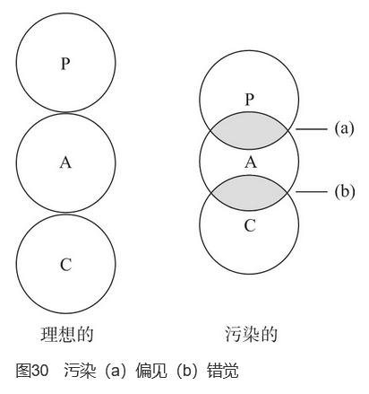
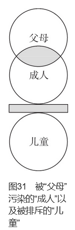
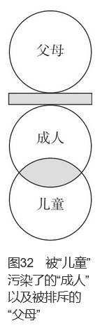
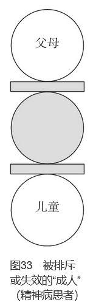

# 第6章　我们之间有何不同

当心灵工具所必需的环境不再存在时，心灵工具就变为了沉重的负担。
——亨利·伯格森（Henri Bergson）

所有的人在人格结构上都是类似的，他们都有“父母”“成人”和“儿童”。

**他们也有不同，表现在两个方面：其一，“父母”“成人”和“儿童”的内容不同，因为每个人记录在其中的经历都是独特的；其二，“父母”“成人”和“儿童”所发挥的功能和作用不同。**

本章将详述这些功能上的不同，这方面存在的问题包括“污染”和“排除”两类。

## 污染

福利部门转介给我一个16岁的女孩，她退缩、拘谨、缺乏教育并且中途退学。在第一次会面快结束时，我给她解释了P-A-C模式。然后，我问她：“现在，你能告诉我P-A-C模式对你意味着什么吗？”

在很久的沉默后，她说：“它意味着我们都是由三个部分组成，我们最好让它们彼此独立，否则我们就会有麻烦。”

**P-A-C不能彼此独立而引起的麻烦被称作“对‘成人’的污染”。**

理想上（见图30），P-A-C的三个圈是分开的。但是对很多人来说，这些圈是有重叠的。图30中的（a）的重叠是过时的，反映出**不对信息加以检验的“父母”对“成人”的污染。“父母”总是把未加检验的信息当作客观事实，即“偏见”**。比如“右利手比左利手好”和“警察都是坏人”等看法，都是在沟通中运用事实信息（“成人”）前，将偏见作为客观真相。偏见发展于童年早期，当儿童对某些事情的好奇之门被赖以生存的父母关闭时，偏见就形成了，儿童因为害怕父母的责骂而不敢再将好奇之门打开。

**我们都知道与一个有偏见的人“辩论”是多么困难**。当我们与他们争辩关于种族问题、左利手问题或其他他们带有偏见的问题时，尽管我们证据确凿并且逻辑分析清晰，但这些人的“父母”总是占据着他们“成人”的一部分。对于这些带有偏见的事情，他们总是会用各种不相关的事实来支持自己的观点。尽管这些观点看起来毫无逻辑，但这种刻板的看法对他们来说是“安全的”。就像在第2章中所说的那样，**对一个孩子来说，相信谎言比相信自己的眼睛和耳朵更为安全**。因此，我们无法通过对一个有偏见的“成人”讲道理来消除偏见。消除偏见的唯一方法就是发现一些事实，它们不同于“父母”的看法但不再对生存构成威胁，然后，运用当前的事实更新“父母”信息。因此，**治疗可被看作将“父母”和“成人”分离并使二者的界限复原的过程**。

图30中的（b）是“儿童”对“成人”的污染，**它是过去的情绪或经验不适当地外化到当前现实的过程。这种污染最常见的两种反应是错觉和幻觉。错觉来源于恐惧**，一个患者对我说“这个世界是可怕的”，他是在描述当他还是个小孩时他对这个世界的看法。一个经常害怕被愤怒、变化无常的父母粗暴对待的孩子长大后总会感到有压力，他会被这种恐惧感淹没，甚至会编造一些“合乎逻辑”的事实支持自己的恐惧。他可能会相信那些挨家挨户做推销的推销员会来杀他，如果最终证明那人只不过是一个推销员时，他会用这样的话支持自己的恐惧：“我一眼就认出他了。就是他！是联邦调查局要抓的那个人。我在邮局看到他的照片了，这就是他为什么要来杀我的原因。”就像偏见一样，错觉不能只是靠说“那只是个推销员”这样的简单事实来消除。只有揭示出最初威胁“儿童”的那些东西在今天的生活环境中不再存在时，错觉才能被消除。只有将“成人”去污染化，他才能加工事实信息。

幻觉是“儿童”对“成人”的另一种污染形式。幻觉是在极度压力之下产生的一种现象，指曾经历过的来自外界的损害、拒绝和批评再一次被感受到，即使外界“一个人也没有”仍然如此。这些记录下来的经历就好像“真的上演”了一样，那个人“听到”了过去真实存在的声音。如果你问他那些声音说了什么，他一般都会将之描述为批评、威胁或暴力。**他的幻想越奇异，说明他孩童时期的生活越怪异**。如果我们能考虑到他们曾真正遭受过语言和躯体上的虐待，这些奇异的幻觉就不难理解了。

## 排斥

除了污染外，还有另外一种功能障碍——“排斥”，可以解释我们之间如何存在差异：

**排斥表现为当面对威胁情境时，总是会保持刻板和先入为主的态度**。在每一种情境下，两个互补的方面出现防御性的排斥，是导致固执的“父母”、固执的“成人”和固执的“儿童”出现的主要原因。

排斥的“父母”可以封闭“儿童”，排斥的“儿童”也可以封闭“父母”。

## 不会玩的人

“成人”被“父母”所污染，并且将“儿童”排除在外的典型情况是（见图31）：这个人非常负责任，总是在办公室工作到很晚，每时每刻都在做事。若家人想去滑雪旅行或去树林野餐，他则表现得很不耐烦。如同他的童年被严肃、严厉、责任心很强的父母完全剥夺了，**他发现继续生活的唯一方法就是完全避开“儿童”或将其封闭**。在他的经历中，他发现每次想表现“儿童”就会遇到麻烦：“回你的屋里去”“不要听孩子说什么，要看孩子怎么做”“我告诉你多少次了……”“像个大孩子！”如果这个小孩由于完全遵从、勤奋努力、顺从、完全按照大人的旨意做事而受到表扬，那么聪明些的办法似乎就是完全服从“父母”，并且将“儿童”的冲动排除在外。

这种人在其“儿童”中储存了很少的快乐。也许他根本没有能力让他快乐的“儿童”表现出来，因为他几乎没有快乐的“儿童”。然而，我们可以帮助他认识到他的这种状况对其家人和孩子来说并不公平，**如果他坚持将妻子和孩子的“儿童”也排斥掉，他的婚姻将会破裂**。通过“成人”有目的的努力，他可以与家人一同出游、减少工作时间、满怀爱意地听孩子们的幻想故事（一种“成人”原则），并且参与他们的生活。他还可以建立一个关爱家人或保护家庭的价值标准，也许他不能改变“父母”的内容或创造“儿童”中快乐的记忆，但是他可以获得领悟，今天他仍然可以建立满意的生活。

> 我的“儿童”似乎是有被排斥的……

## 缺乏道德感的人

**对社会来说，更严重的问题表现为“儿童”污染了“成人”，并且将“父母”排斥在外**（见图32）。这种状况是由于亲生父母或承担父母角色的人极其野蛮残暴，或另一个极端——父母太纵容，因此唯一能够活下去的方法就是“关掉他们”或者将其隔离。对于精神病患者来说尤为典型，这些患者在童年早期就放弃了最初的“我不好—你好”的心理地位，取而代之的是“我好—你不好”的心理地位。这个小孩的结论是对的，他的父母确实“不好”。父母太不好了，以至于他完全将他们排斥在外。在某些极端的情况下，他们还可能杀了自己的父母以彻底地排除他们。如果不是这样，至少他也会从心理上排斥父母，从而使自己变成没有“父母”的人。在将令人痛苦的“父母”排斥出去的同时，他也排斥了“父母”中可能存在的一点点“好”的东西。这种人缺乏任何社会控制的信息，不知道什么是“应该”的，什么是“不应该”的，缺乏社会规范，也可以说缺乏基本的道德感。他的行为被“儿童”所支配，被污染了的“成人”所操纵，利用他人满足自己的需要。他的“成人”能够评估行为的结果，但是他所关心的只是自己这么做会不会被抓住，而很少关心他人。尽管有时也会有例外的时候，但一般的规则是：**如果我们没有被爱过就不能学会施予爱。如果生命的最初5年完全在肉体和心灵拼死地挣扎中度过，那么这种挣扎可能就会持续一生**。

**确定一个人是否拥有“父母”的方法之一是确定他是否存在羞愧、懊悔、窘迫或内疚的情绪**。这些情绪存在于“儿童”，它们产生于“父母”斥责“儿童”之时。如果以上这些情绪不存在，那么“父母”很可能被排斥了。一个保守的假设是，如果一个人由于骚扰儿童而被捕了，但是他除了被捕这件事外，没有表达出任何懊悔和内疚，那么他就没有能够起作用的“父母”。这一假设对康复治疗来说具有非常重要的作用，**通常对这种人进行治疗很困难，因为我们无法唤醒根本不存在的“父母”**。在猴子中开展的一个试验已证明了这一点，这些猴子不是由亲生妈妈带大，而是被代理妈妈所抚养。代理妈妈是用厚绒布裹着铁丝做成的，在猴子很小的时候它们与这些厚绒布代理妈妈建立了很强的依恋关系，但是当它们成熟后，繁殖及养育自己孩子的能力却极低。**我们经常会认为养育是本能行为，但是这些猴子们却表现出养育能力不足**。由于养育没有被记录在“父母”中，它们当然也不会重演出来。

对一个“父母”被完全排斥的人进行预后治疗，结果并非那么可怕。因为与猴子不同，人在早年即使什么也没有被记录下来，但人拥有120亿的细胞来评估现实和构造答案。一个患有精神病的罪犯可以理解他的P-A-C到这种程度，即认为他的“成人”可以为自己的未来做向导，这样他犯罪、被捕、被宣判有罪的模式就会发生改变。**也许他永远也没有能起作用的“父母”支持他的“成人”，但是他的“成人”仍可以变得强大，引领他成功地度过一生，他同样能够获得他人的认可和尊重**。我们说，**进行康复治疗必须建立在这种可能性之上**。

> 但是普通人没有能力，也没有义务去帮助这种人脱离他们的困境。故还是敬而远之为好。

## 失效的“成人”

一个“成人”被排斥的人是精神病患者（见图33）。他的“成人”不起作用，因此他也不能与现实相接触。他的“父母”和“儿童”**通常都是与陈旧的信息混合在一起**，常常直接、冲动地表现出来。这些早年经验的重演毫无意义，因为当年它们被记录下来时就毫无意义。这种情况可以在一个住院的女性患者身上看到，她在唱圣歌的过程中（“父母”），常夹杂着一些猥亵的身体动作（“儿童”）。她所唱的内容很古怪，好像在重演着“父母”与“儿童”之间好与坏、应该与不应该、拯救与诅咒的冲突。这些语言内容透露了大量“父母”和“儿童”的信息，她的“成人”已消失这一事实说明了严重冲突的存在。“挣扎太痛苦了，我不要再试了。”这并不是说放弃让她感到舒服，她同样也在被“儿童”中的恐惧所支配。

**治疗精神病患者的第一步就是要减少恐惧的感觉**。**让患者恢复正常的基本做法是，在患者第一次看到治疗师时就让他感受到治疗师表现出的“我好—你好”的态度**。我的同事高登·海伯格（Gordon Haiberg）于1963年报告了他在斯托克顿州立医院治疗精神病患者时，使用这种心理地位所产生的效果：

> 当治疗师带着“我好—你好”的基本态度进来时，治疗在治疗师和患者彼此看第一眼时就开始了。精神病患者很希望与人建立更有意义的关系……通常，与持有“我好—你好”心理地位的人相处，对患者而言是一个全新且迷人的经验。他们的“成人”随之被“勾”出来，他们开始问：“为什么你可以这样，而我不能呢？”**这个问题不能马上就回答，应该在治疗师确定患者所使用的最具破坏性的动机或心理游戏后，才能在某个适当的时间加以解答**。患者只是被简单而直接地告知：“你把人吓得要死。”……然后，治疗师坦诚地告诉他，他很好，他很重要，因为作为一个人，他是独一无二的。这样，患者开始有了希望。**当“成人”能够开始加工数据、倾听、学习并帮助做出决定时，他内心固有的力量开始重新运行，治愈的过程也就开始了**。
>

我们医院持续进行的治疗小组通常都有10～12个患者，其中包括精神病患者。**在建立小组之时，“我好—你好”的心理地位被大家写成契约，精神病患者感到他们得到了支持、安抚和肯定，设置这个阶段是为了唤回“成人”**。

在一个小组中，一个女患者在一个小时内不断站起来拉直她的裙子，并把裙摆拉到膝盖以下。尽管这种行为很显眼，但是没有人会介意，大家没有表示不满，小组继续讨论。在这一个小时中，治疗师先教授半小时的P-A-C模式，然后组织大家讨论。在小组快结束的时候，坐在女患者身边的一个男士对她说：“你知道吗，我算着呢，你总共站起来拉直裙子19次。”

她听后有些吃惊也有些高兴：“我这样做了吗？”

她可以做出“成人”的回应，没有感到存在任何威胁。尽管“成人”的出现很微弱，但却是与现实重新建立联系的开始。它也是学习P-A-C模式的基础，通过它，患者可以对自己的行为有进一步的发现。

## 总是很沉闷乏味的人

有一种人很乏味，**他们的“儿童”或“父母”很平淡，以至他们缺乏快乐的人格素质**。他们通常神情抑郁、沮丧（快乐属于其他人），或觉得生活很乏味。这种人的父母一般迟钝、不善表达、心事重重。**他们的父母很少惩罚他们，也很少奖励和表扬他们。同时，父母对任何事情的热情度都很低**。这种人在孩童之时，没有接触过环境中任何让他激动的事，他也很少和其他孩子交往。他是一个“好”孩子，因为他不引起任何特别的麻烦，也不引起任何人的注意。虽然他的“成人”能够正确地感知事实，但是感知到的是单调乏味的事实。他的“成人”也许能够很好地成长，不受约束，但他的“成人”却对与他人接触毫无兴趣（通常，这种态度是“父母”的价值观，因为该价值观最初可以从“父母”中观察到）。**他整个人就好像是一台计算机，当别人在聚会上玩得兴高采烈时，他可能在角落里翻杂志，做他唯一知道如何做的事情——查阅数据**。如果最终他来接受治疗，他可能会提这样的问题：“世界难道真的这么美丽吗？”尽管他的个性对社会不构成危害，但对他自己来说确实是问题。今天，他仍像生命早年的生活一样，将自己封闭在狭小的范围中。

就某种意义而言，阿尔弗雷德·诺思·怀特海的见地颇具代表性：“脱离了日常丰富多彩的生活，道德教育将变得不可能。”如果我们认为“道德”属于价值体系，“不沉闷”“对他人感兴趣”或“有创造力和生产力”被视为积极的价值观，那么很明显，如果一个人对早年生活的记忆是枯燥单调的，他自己也会成为一个枯燥单调的人，除非在他早年的生活中出现十分引人入胜的关系。

对生活厌倦或成为一个沉闷乏味的人确实还有别的原因。在人生的早年时期，人们对任何事物都充满好奇：烟为什么会向上飘？雨为什么会往下落？谁创造了上帝？谁创造了我？他们对这些问题充满了兴趣。**如果他们总是得到敷衍的答案，这些答案后来被证明是错的，那么他们就会感到迷惑，从而最终放弃提问、探索和兴趣，然后开始变得沉闷乏味**。他们的“计算机”开始对广阔的兴趣领域关闭，因为这些问题的答案徒增他的困惑，这种类型的沉闷乏味经常可以在那些神学院学生的身上看到。他们的乏味源于在他们探索真理时，总是被告知过于简单的答案，他们追求真相（有证据、可观察的数据）的品质被抑制了，必须遵从这样一种命令：要么选择真相，要么选择信仰，两者好像互不相容。并非所有的牧师都会给出过于简单的答案，但是未经检验的教条在一些宗教群体中仍然地位牢固。这些内容在第12章中会进一步详述。

## P-A-C内容的差异

在前文中，我们已经看到人们由于“父母”“儿童”“成人”本质的差异而各具特色，这些不同大多数表现为临床症状。但我们也会在“健康”的方式上表现出不同，健康的定义是：一个不受约束的“成人”，在所有的沟通过程中均占据着支配的地位。这意味着**在每一次沟通中，“成人”同时收集“父母”“儿童”以及现实的信息，然后据此对下一步行动做出决定**。**可使用的信息储备越丰富，做出正确决定的可能性越高**。若孩子在早年的经验中，可以无拘无束地探索坛坛罐罐、观察泥土中的菊花和宠物、与朋友去农场旅行、傍晚时听故事、欢度传统佳节、玩玩具、听录音、和耐心的父母开放而友好地交谈，这样的孩子与那些被孤立、被过度保护的孩子相比，其“父母”中会有更丰富的信息储备，其“儿童”中也会有更多积极的情感。孩子早年试图克服“我不好”的心理地位，使他的“成人”得以增强，并激励他进一步去探索和掌握更多的知识。这样的孩子通常会成为“聪明”的小孩，这给他们带来了奖赏和自信，这些强化进一步激励他们变得更聪明。除非在这个过程中他们的父母给予了不适当的压力，并强行要求他们做不感兴趣的事情，否则，他们为家庭带来荣誉的同时不会减少自信。

**通过了解自己的P-A-C，我们不仅开始了解“父母”和“儿童”中有什么，还可以了解其中“缺乏”什么**。一个女孩感叹这样的事实：“我是平庸和乏味的……我就是这样”，如果她能意识到早年生活的平淡和沉闷给她的“父母”和“儿童”带来了缺陷，那么她就能得到自由，可以用她的“成人”去接触现实，发现美丽而绚烂的生活。她可能需要花一些时间做到这一点，不可能在一夜间发生巨大的改变，但可以确信的是，她能够意识到自己有其他的选择。人们常说，责怪你本性中的不足无法改变你的缺点。因此，“我就是这样”毫无帮助，“我能改变”才真正有意义。
